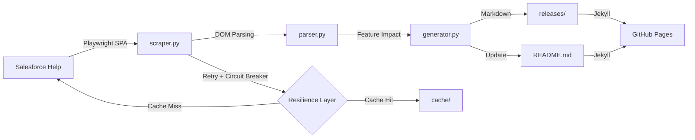

# 🚀 Salesforce Release Notes Intelligence

Automated pipeline for extraction, classificação e versionamento das **Salesforce Release Notes** como artefatos Markdown estruturados (*Knowledge-as-Code*).

### ⚙️ CI/CD Status & Conformidade

<!-- RELEASE_BADGE -->

[](https://github.com/Fatal1tyBarucco/Salesforce-WebDev/actions/workflows/python-quality.yml)
[](https://github.com/Fatal1tyBarucco/Salesforce-WebDev/actions/workflows/release_notes_pipeline.yml)


| Technology / Tool | Description | Pipeline Status |
| :--- | :--- | :---: |
| 🐍 **Python 3.14** | Ambiente de execução principal | `Conforme` |
| 🎭 **Playwright** | Scraper Headless para aplicações SPA do Salesforce Help | `Ativo` |
| 🧪 **Pytest** | Suíte de testes unitários automatizados | `450+ testes` |
| 🔍 **Mypy** | Verificação estática de tipos com modo estrito | `Strict` |
| ⚡ **Ruff & Black** | Linter e formatação estrita de código (line-length = 100) | `Conforme` |
| 📦 **uv** | Gerenciamento de dependências com lock file determinístico | `Ativo` |

---

## 📖 Overview

Este repositório contém um pipeline ETL assíncrono para scraping das *Salesforce Release Notes*, processamento local para classificação e sumarização, e geração de documentação estática via **MkDocs**.

## 🏗️ System Architecture


```mermaid
flowchart LR
    A[Salesforce Help] -->|Playwright SPA| B[scraper.py]
    B -->|DOM Parsing| C[parser.py]
    C -->|Feature Impact| D[generator.py]
    D -->|Markdown| E[releases/]
    D -->|Update| F[README.md]
    E -->|Jekyll| G[GitHub Pages]
    F -->|Jekyll| G

    B -->|Retry + Circuit Breaker| H{Resilience Layer}
    H -->|Cache Hit| I[cache/]
    H -->|Cache Miss| A
```

**Princípios de Design:**
* **Separação de Conceitos (SoC):** Camadas isoladas para rede (`scraper.py`), parsing (`parser.py`), geração (`generator.py`)
* **I/O Não Bloqueante:** `asyncio` + Playwright async para processamento paralelo
* **Resiliência:** Circuit Breaker + Token-bucket rate limiter + Exponential backoff com jitter

## ⚙️ Pré-requisitos e Instalação

Este projeto utiliza `uv` para gerenciamento determinístico de dependências.

```bash
# Instale o uv
curl -LsSf https://astral.sh/uv/install.sh | sh

# Clone e instale
git clone https://github.com/Fatal1tyBarucco/Salesforce-WebDev.git
cd Salesforce-WebDev
uv sync

# Instale browsers do Playwright
uv run playwright install chromium
```

## 🚀 Uso e Execução

```bash
# Executar pipeline completo
uv run python -m src.main

# Executar release específica
uv run python -m src.main --release summer_26

# Dry run (sem escrever arquivos)
uv run python -m src.main --dry-run
```

## 🛡️ Governança e Resiliência

| Componente | Configuração | Description |
| :--- | :--- | :--- |
| **Rate Limiter** | 2 req/s, token-bucket | Evita throttling do Salesforce |
| **Circuit Breaker** | 3 falhas → cooldown 60s | Para requisições após falhas consecutivas |
| **Cache TTL** | 24 horas | Previne refetch de conteúdo não alterado |
| **Exponential Backoff** | Base 2s + jitter | Retry inteligente com anti-thundering-herd |

## 🧪 Testes e Qualidade

```bash
# Executar testes
uv run pytest tests/

# Com cobertura
uv run pytest tests/ --cov=src --cov-report=term-missing

# Quality gate (ordem CI)
uv run ruff check src/
uv run black --check src/
uv run mypy src/
```

**Meta:** Cobertura >99%, zero erros de tipo, zero warnings de lint.

---


## 📋 Releases Disponíveis

<div style="padding:12px;margin-bottom:20px;border:1px solid #d0d7de;border-radius:6px;background:#f6f8fa;text-align:center;"><strong>🌐 Language / Idioma:</strong> <strong>🇺🇸 English</strong> | <a href="./README.md">🇧🇷 Português</a></div>

### ❄️ Winter '27


### ☀️ Summer '26


<details>

<summary><h3>🌸 Spring '26</h3></summary>

> 📊 **Executive Summary:** A release Salesforce Spring '26 apresenta um impressionante conjunto de 1.438 novos recursos e aprimoramentos distribuídos por 21 categorias, consolidando a plataforma como referência em inovação para CRM e automação de negócios. O destaque central desta release é a evolução do Agentforce, que agora conta com o Agentforce Builder disponível ao público em geral, permitindo a criação de agentes de IA mais complexos e sofisticados. A categoria Serviço lidera em volume com 167 recursos, transformando o Service Cloud no Serviço Agentforce, com novas capacidades de central de contato, voz, messaging e gerenciamento de serviço de TI. O Aplicativo Móvel acompanha com 187 recursos, garantindo que as equipes possam operar com plena funcionalidade em dispositivos móveis. A Automação oferece 151 recursos incluindo avanços significativos no Flow Builder, com geração de fluxos por IA agora disponível ao público em geral, orquestração de fluxos aprimorada e novas capacidades de processamento em lote de prompts. Os Setores trazem o maior volume de inovações setoriais com 194 recursos, abrangendo desde automotivo e finanças até saúde e serviços públicos. O Gerenciamento de Receita apresenta 131 recursos para otimização de CPQ e billing. Em Vendas, com 85 recursos, o Sales Cloud se transforma em Agentforce Sales, introduzindo geração de leads autônoma, qualificação por IA e nutrição de leads automatizada. A plataforma também avança em Segurança, Identidade e Privacidade com 61 recursos, incluindo novas políticas de aplicativos conectados, login sem senha com chaves de acesso e aprimoramentos no Salesforce Shield. A Análise de Dados com 54 recursos e o Data 360 com 53 recursos expandem as capacidades de insights e gestão de dados. O Desenvolvimento com 97 recursos oferece novas ferramentas para desenvolvedores, incluindo tipos personalizados do Lightning para Agentforce. Com 72 recursos, o Marketing aprimora campanhas e engajamento. Experience Cloud (21 recursos), Personalização (18 recursos), Field Service (41 recursos), MuleSoft (8 recursos), OmniStudio (10 recursos), Hyperforce (5 recursos), Partner Cloud (4 recursos) e Documentação Legal (6 recursos) completam o panorama desta release abrangente. A Spring '26 representa um marco na estratégia da Salesforce de integrar IA generativa e agentes autônomos em todas as camadas da plataforma, capacitando organizações de todos os tamanhos a automatizar processos, aumentar a produtividade e oferecer experiências personalizadas em escala.


<details>
<summary><b>📄 Legal Documentation (6 features)</b></summary>


> A categoria Documentação Legal da release Spring '26 contém 6 recursos dedicados a atualizações de termos, políticas e conformidade legal da plataforma Salesforce. Estes recursos garantem que as organizações estejam alinhadas com as mais recentes exigências regulatórias e mudanças contratuais, incluindo atualizações de termos de serviço, políticas de privacidade e documentação de conformidade. É essencial que administradores e equipes jurídicas revisem esses recursos para manter a conformidade organizacional.

> 📄 Full details: [./releases/spring_26/en_US/documentacao_legal.md](./releases/spring_26/en_US/documentacao_legal.md)

</details>


<details>

<summary><h3>❄️ Winter '26</h3></summary>

> 📊 **Executive Summary:** A release Salesforce Winter '26 representa um marco significativo na evolução da plataforma, com impressionantes 1.348 recursos distribuídos em 19 categorias. O volume massivo de novidades reflete a aceleração estratégica da Salesforce em três pilares fundamentais: inteligência artificial generativa e agentes autônomos, unificação de dados em tempo real e modernização da experiência do desenvolvedor.

O destaque absoluto é o ecossistema Agentforce, que consolida a visão de agentes de IA autônomos com 39 recursos dedicados. A plataforma expande o suporte a modelos de IA — incluindo Claude Sonnet 4.5, OpenAI o3/o4-mini e Amazon Nova na Plataforma Einstein — além de introduzir Agentforce Voice para conversas por voz, Rastreamento de sessão para visibilidade do comportamento do agente e Otimização do Agentforce (beta) para análise de eficácia. A migração do Agentforce (padrão) para agentes de funcionários com fluxo simplificado sinaliza a maturidade do produto para uso empresarial em larga escala.

A categoria Setores domina com 459 recursos, demonstrando o compromisso da Salesforce com soluções verticais. Destacam-se: Life Sciences Cloud para Engajamento do Cliente (GA), Agentforce para Healthcare com correspondência inteligente de provedores, Insurance Cloud com automação de declarações, Education Cloud com metas de carreira do aluno via Agentforce, e Manufacturing Cloud com reabastecimento inteligente de inventário. O Partner Cloud, com 156 recursos, inaugura o gerenciamento completo do ciclo de vida de parceiros com Revenue Cloud, Precificação do Salesforce e Gerenciamento de uso avançado.

Vendas (154 recursos) e Desenvolvimento (101 recursos) completam o topo da escala. Em Vendas, o Agentforce SDR evolui para Nutrição de leads com suporte a Microsoft Exchange, enquanto o Flow Builder recebe automação de decisões com IA generativa e fluxos de transmissão para públicos dinâmicos. Em Desenvolvimento, o SLDS 2 chega como GA com modo escuro (beta), o LWC recebe API v65.0 com Gerenciamento de estado (beta) e Lightning Out 2.0 para experiências externas, além de ferramentas de MCP do LWC para acelerar o desenvolvimento com IA.

Análise de dados (91 recursos) impulsiona a era do Tableau Next com semânticas aprimoradas, Otimização de modelo semântico (beta) e integração profunda com Slack via Agentforce para Analytics. Marketing (87 recursos) avança com Marketing Cloud Next, gerenciamento de fidelidade expandido e promoções globais. Segurança (55 recursos) introduz Detecção de dados expandida, rastreamento de atividade do agente em tempo real e Criptografia de banco de dados GA.

A infraestrutura Hyperforce expande para mais regiões com suporte a AWS Direct Connect e Continuidade avançada entre regiões. O Data Cloud é renomeado para Data 360, consolidando a visão de dados unificados. Field Service (24 recursos) adiciona escala dinâmica e VRA de múltiplos participantes. Personalização (65 recursos) moderniza a experiência administrativa com classificação por várias colunas em listas e segmentação expandida do Data 360. A estratégia de descontinuação é clara: Chat legado, Salesforce para Outlook (dez/2027), Lightning Sync para EWS e Salesforce Functions estão sendo aposentados.

Em suma, a Winter '26 posiciona o Salesforce como uma plataforma de agentes de IA empresariais, com dados unificados via Data 360, soluções verticais profundas e uma experiência de desenvolvimento modernizada. A direção estratégica é inequívoca: cada interação de negócio será mediada por agentes inteligentes, cada decisão será informada por dados unificados e cada setor terá soluções nativas específicas.


<details>
<summary><b>📄 Legal Documentation (11 features)</b></summary>


> Com 11 recursos, esta categoria foca em informações estruturais da release. Inclui atualizações sobre navegadores compatíveis para Lightning Experience, Salesforce Classic e CRM Analytics. Documenta como e quando os recursos ficam disponíveis, com impacto imediato para alguns e ação de administrador para outros. As mudanças na documentação visam facilitar a localização de informações sobre compatibilidade e disponibilidade de recursos.

> 📄 Full details: [./releases/winter_26/en_US/documentacao_legal.md](./releases/winter_26/en_US/documentacao_legal.md)

</details>


## 🛠️ Stack Tecnológico

| Ferramenta | Uso no Projeto |
| :--- | :--- |
| **GitHub Actions** | CI/CD: lint, typecheck, extração, deploy automático |
| **uv** | Gerenciamento de dependências com lock file determinístico |
| **Playwright** | Scraper headless para páginas SPA do Salesforce Help |
| **Python 3.14** | Linguagem principal com type hints completos |
| **BeautifulSoup** | Parser HTML para extração de dados estruturados |
| **Markdown** | Formato de saída para documentação técnica |
| **MkDocs** | Portal técnico publicado no GitHub Pages |
| **stdlib HTTP** | REST API e health check server (zero dependências externas) |
| **gh CLI** | PR workflow e GitHub integration |

### Módulos do Pipeline

| Módulo | Responsabilidade |
| :--- | :--- |
| `src/main.py` | Orquestrador: detectar releases, extrair, parse, gerar, atualizar README |
| `src/scraper.py` | Playwright headless, circuit breaker, rate limiter, cache, download PDF |
| `src/parser.py` | Extração de hierarquia ToC + tabela Feature Impact |
| `src/generator.py` | Gera arquivos `.md` por categoria |
| `src/ai_automation.py` | Comparação entre releases, detecção de regressões, quality metrics |
| `src/analytics.py` | Dashboard HTML com gráficos SVG |
| `src/api.py` | REST API para acesso programático |
| `src/notifications.py` | Email digest, Slack/Discord webhooks |
| `src/dashboard.py` | Dashboard interativo com JS |
| `src/workflow.py` | PR-based workflow com triage |
| `src/salesforce.py` | Trailhead linking, org limits, sandbox readiness |
| `src/health.py` | Health check (`/health`, `/ready`), Prometheus metrics (`/metrics`) |
| `src/logger.py` | Logging estruturado com correlation IDs |

---

## 🤝 Como Contribuir

1. Faça o **Fork** do projeto
2. Crie uma nova branch: `git checkout -b feature/minha-feature`
3. Instale dependências: `uv sync --extra dev`
4. Execute a quality gate:
   ```bash
   uv run ruff check src/
   uv run black --check src/
   uv run mypy src/
   uv run pytest tests/ --cov=src --cov-fail-under=99
   ```
5. Faça o commit: `git commit -m 'feat: descrição da alteração'`
6. Envie: `git push origin feature/minha-feature`
7. Abra um **Pull Request**

---

## 📄 Licença

Este projeto é mantido para fins educacionais e de referência técnica.
