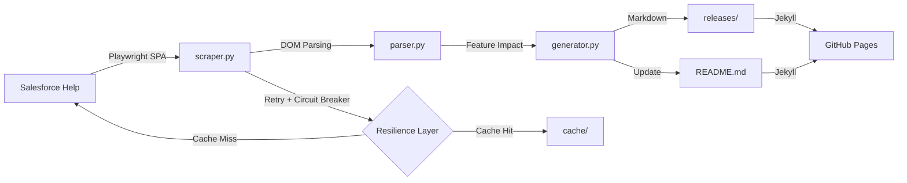

# 🚀 Salesforce Release Notes Intelligence

Automated pipeline for extraction, classificação e versionamento das **Salesforce Release Notes** como artefatos Markdown estruturados (*Knowledge-as-Code*).

### ⚙️ CI/CD Status & Conformidade

<!-- RELEASE_BADGE -->

[](https://github.com/Fatal1tyBarucco/Salesforce-WebDev/actions/workflows/python-quality.yml)
[](https://github.com/Fatal1tyBarucco/Salesforce-WebDev/actions/workflows/release_notes_pipeline.yml)


| Technology / Tool | Description | Pipeline Status |
| :--- | :--- | :---: |
| 🐍 **Python 3.12+** | Ambiente de execução principal | `Conforme` |
| 🎭 **Playwright** | Scraper Headless para aplicações SPA do Salesforce Help | `Ativo` |
| 🧪 **Pytest** | Suíte de testes unitários automatizados | `700+ testes` |
| 🔍 **Mypy** | Verificação estática de tipos com modo estrito | `Strict` |
| ⚡ **Ruff & Black** | Linter e formatação estrita de código (line-length = 100) | `Conforme` |
| 📦 **uv** | Gerenciamento de dependências com lock file determinístico | `Ativo` |

---

## 📖 Overview

Este repositório contém um pipeline ETL assíncrono para scraping das *Salesforce Release Notes*, processamento local para classificação e sumarização, e geração de documentação estática via **MkDocs**.

## 🏗️ System Architecture


```mermaid
flowchart LR
    A[Salesforce Help] -->|Playwright SPA| B[scraper.py]
    B -->|DOM Parsing| C[parser.py]
    C -->|Feature Impact| D[generator.py]
    D -->|Markdown| E[releases/]
    D -->|Update| F[README.md]
    E -->|Jekyll| G[GitHub Pages]
    F -->|Jekyll| G

    B -->|Retry + Circuit Breaker| H{Resilience Layer}
    H -->|Cache Hit| I[cache/]
    H -->|Cache Miss| A
```

**Princípios de Design:**
* **Separação de Conceitos (SoC):** Camadas isoladas para rede (`scraper.py`), parsing (`parser.py`), geração (`generator.py`)
* **I/O Não Bloqueante:** `asyncio` + Playwright async para processamento paralelo
* **Resiliência:** Circuit Breaker + Token-bucket rate limiter + Exponential backoff com jitter

## ⚙️ Pré-requisitos e Instalação

Este projeto utiliza `uv` para gerenciamento determinístico de dependências.

```bash
# Instale o uv
curl -LsSf https://astral.sh/uv/install.sh | sh

# Clone e instale
git clone https://github.com/Fatal1tyBarucco/Salesforce-WebDev.git
cd Salesforce-WebDev
uv sync

# Instale browsers do Playwright
uv run playwright install chromium

# Instale hooks de pré-commit (ruff, black, mypy, pytest)
uv run pre-commit install
uv run pre-commit install --hook-type pre-push
```

## 🚀 Uso e Execução

```bash
# Executar pipeline completo
uv run python -m src.main

# Executar release específica
uv run python -m src.main --release summer_26

# Dry run (sem escrever arquivos)
uv run python -m src.main --dry-run
```

## 🛡️ Governança e Resiliência

| Componente | Configuração | Description |
| :--- | :--- | :--- |
| **Rate Limiter** | 2 req/s, token-bucket | Evita throttling do Salesforce |
| **Circuit Breaker** | 3 falhas → cooldown 60s | Para requisições após falhas consecutivas |
| **Cache TTL** | 24 horas | Previne refetch de conteúdo não alterado |
| **Exponential Backoff** | Base 2s + jitter | Retry inteligente com anti-thundering-herd |

## 🧪 Testes e Qualidade

```bash
# Executar testes
uv run pytest tests/

# Com cobertura
uv run pytest tests/ --cov=src --cov-report=term-missing

# Quality gate (ordem CI)
uv run ruff check src/
uv run black --check src/
uv run mypy src/
```

**Meta:** Cobertura ≥95%, zero erros de tipo, zero warnings de lint.

---


## 📋 Releases Disponíveis

<div style="padding:12px;margin-bottom:20px;border:1px solid #d0d7de;border-radius:6px;background:#f6f8fa;text-align:center;"><strong>🌐 Language / Idioma:</strong> <strong>🇺🇸 English</strong> | <a href="./README.md">🇧🇷 Português</a></div>

### ☀️ Summer '26

> 📊 **Executive Summary:** A Salesforce Summer '26 Release representa um marco estratégico na evolução da plataforma, com 1.373 novos recursos distribuídos em 22 categorias — consolidando a Salesforce como líder em CRM inteligente e automação empresarial com IA nativa.

**Escala e Alcance:** Com a maior concentração de recursos em Serviço (224 recursos), Setores (335 recursos), Automação (125 recursos), Desenvolvimento (136 recursos) e Data 360 (105 recursos), esta release demonstra o compromisso da Salesforce em fortalecer os pilares fundamentais da plataforma enquanto expande para novas fronteiras de inteligência artificial e dados unificados.

**Agentforce — A Revolução dos Agentes de IA:** O Agentforce emerge como o grande protagonista da Summer '26, com presença transversal em praticamente todas as categorias. Destaques incluem: Agentforce Voice para chamadas de voz integradas ao aplicativo móvel, criação direta de agentes no Flow Builder, Agentforce para Field Service com agendamento autônomo via WhatsApp e email, Agentforce IT Service com gerenciamento de hardware de TI e conformidade, Agentforce para serviços de RH com biblioteca de agentes pré-criada, e o novo Agentforce Builder unificado. O Agentforce DX e o Agentforce Vibes IDE representam um salto no desenvolvimento assistido por IA, permitindo criar extensões de código usando linguagem natural.

**Data 360 e Tableau Next — Inteligência de Dados:** A categoria Data 360 consolida a visão de dados unificados com 105 recursos, incluindo ingestão do Databricks, Microsoft Fabric OneLake e AWS Glue, além de modelos preditivos com análise de sentimento, classificação de tópico e previsões de série temporal. O Tableau Next recebe a maior atualização da história da plataforma analítica, com dashboards interativos usando LWC, filtragem cross-model, previsões de métricas nativas, e o novo App Template Framework para distribuição de soluções analíticas.

**Automação e Flow Builder:** Com 125 recursos, a automação evolui significativamente com integração direta do Agentforce no Flow Builder, atualização de fluxos de tela com avisos de linguagem natural (beta), suporte a conectores ilimitados do MuleSoft, e o novo Mecanismo de processamento de dados para transformações em escala. A orquestração de fluxo torna-se recurso padrão, e o Marketing Cloud Flow permite coordenar jornadas complexas entre múltiplos fluxos.

**Desenvolvimento e Plataforma:** Os 136 recursos de desenvolvimento incluem LWC API v67.0, suporte a React com MultiFramework (GA), microfrontends (developer preview), MCP servers hospedados para conectar agentes de IA com segurança, e a descontinuação das versões de API 31.0 a 40.0. O Salesforce Version Manager (beta) e o Apex no console da Web (beta) modernizam a experiência de desenvolvimento.

**Serviço e Centrais de Contato:** A maior categoria com 224 recursos inclui transferência de conversas do Agentforce Voice para representantes humanos, roteamento baseado em SLA, chamada de saída automatizada, gerenciamento completo de hardware de TI com Agentforce IT Service, conformidade de TI, e a integração nativa com Microsoft Teams e Amazon Connect.

**Setores Verticais:** Com 335 recursos, os setores recebem investimento massivo em Agentforce para Automotive, Healthcare, Financial Services, Education, Manufacturing, Media e Insurance. Destaques incluem validação de documentos com IA para serviços financeiros, agente de consulta de ajuda financeira para educação, planejamento de mídia linear, e o Process Conformity Navigator com IA generativa.

**Segurança e Governança:** Os 81 recursos de segurança incluem o Security Center com Agentforce (beta), triagem de anomalia assistida por IA, planos de remediação para incidentes, Shield Platform Encryption com IU atualizada, e a descontinuação do fluxo OAuth 2.0 de nome de usuário/senha.

**Direcionamento Estratégico:** A Summer '26 consolida a transição da Salesforce de um CRM tradicional para uma plataforma de agentes de IA autônomos, dados unificados em tempo real e automação inteligente. A adoção do protocolo MCP (Model Context Protocol) em toda a plataforma sinaliza a visão de um ecossistema aberto onde agentes de IA podem interagir seguramente com qualquer sistema. A integração nativa com Slack, Microsoft Teams, Google Gemini e WhatsApp demonstra a estratégia de presença omnicanal. Empresas que adotarem estas inovações estarão posicionadas para operar com eficiência operacional significativamente superior e experiências de cliente verdadeamente personalizadas.


<details>
<summary><b>📄 Legal Documentation (6 features)</b></summary>


> Com 6 recursos, esta categoria cobre informações estruturais da release incluindo navegação, recursos de ajuda, documentação oficial e notas de versão. Recursos de impacto baixo, servindo como referência para compreensão de como e quando os recursos ficam disponíveis, e a distinção entre recursos que afetam todos os usuários imediatamente versus aqueles que requerem ação administrativa.

> 📄 Full details: [./releases/summer_26/en_US/documentacao_legal.md](./releases/summer_26/en_US/documentacao_legal.md)

</details>


<details>
<summary><b>📄 Salesforce General (36 features)</b></summary>


> Com 56 recursos, inclui preparação para IPv6, rotação mais frequente de certificados mTLS, e descontinuação do PDF. Salesforce Foundations recebe pontuação de pessoas, rastreamento da Web e gerenciamento de faturas. Arquivar aplicativo evolui com novos status de atividade e configurações aprimoradas. Pipelines de dados do Salesforce adicionam Inspetor de receita e exportação para Azure Data Lake (GA). Salesforce Scheduler recebe mensagens de validação personalizadas e sincronização de território. Melhorias de acessibilidade em cabeçalhos, modais, seletores de data e muito mais.

> 📄 Full details: [./releases/summer_26/en_US/salesforce_geral.md](./releases/summer_26/en_US/salesforce_geral.md)

</details>


<details>
<summary><b>📄 Agentforce (37 features)</b></summary>


> Categoria com 1 recurso focado em Voice feature. O Agentforce consolida-se como a camada de agentes de IA da Salesforce, com integração transversal em todas as categorias da release. Destaque para a criação direta de agentes no Flow Builder e o novo Agentforce Builder unificado, permitindo configurar e implantar agentes de IA com configuração de baixo código. A presença do Agentforce em Field Service, Serviço, Vendas, Marketing e Setores demonstra a estratégia de IA autônoma em toda a plataforma.

> 📄 Full details: [./releases/summer_26/en_US/agentforce.md](./releases/summer_26/en_US/agentforce.md)

</details>


<details>
<summary><b>📄 Data Analysis (58 features)</b></summary>


> Com 84 recursos (20 alto impacto), esta é uma das categorias mais densas da release. O Tableau Next recebe atualização revolucionária com IA generativa, novos conectores, painéis com modos de dados configuráveis (Live/Extract/Hybrid), e filtragem cross-model para análises interfuncionais. CRM Analytics evolui com semi-joins/anti-joins (GA), exportação para Azure Data Lake (GA), e suporte OAuth para conexões externas. Dashboards agora suportam LWC customizados (GA) e paletas de cores de marca. Destaque para o App Template Framework que permite empacotar workspaces como modelos reutilizáveis.

> 📄 Full details: [./releases/summer_26/en_US/analise_de_dados.md](./releases/summer_26/en_US/analise_de_dados.md)

</details>


<details>
<summary><b>📄 Automation (118 features)</b></summary>


> Com 125 recursos, destaca-se como a categoria mais versátil. O Flow Builder permite criar agentes Agentforce diretamente, com suporte a linguagem natural para atualização de fluxos de tela (beta). O Marketing Cloud Flow adiciona coordenação de jornadas complexas e remoção automática de contatos de engajamento. O Mecanismo de processamento de dados transforma dados em escala com agregação hierárquica e junções de pesquisa. As Operações do Agentforce permitem iniciar até 2.500 fluxos de trabalho via CSV e criar automações baseadas em Excel (beta). A orquestração de fluxo torna-se recurso padrão.

> 📄 Full details: [./releases/summer_26/en_US/automacao.md](./releases/summer_26/en_US/automacao.md)

</details>


<details>
<summary><b>📄 OmniStudio (9 features)</b></summary>


> Com 9 recursos, inclui controle de versão do Data Mapper, alternância entre designers padrão e gerenciado, e migração assistida para runtime padrão. O OmniStudio MCP (beta) acelera desenvolvimento de FlexCards, que agora podem chamar fluxos iniciados automaticamente (piloto). Acessibilidade aprimorada e suporte a ações do FlexCard em nova janela ou guia do navegador.

> 📄 Full details: [./releases/summer_26/en_US/omnistudio.md](./releases/summer_26/en_US/omnistudio.md)

</details>


<details>
<summary><b>📄 Customization (33 features)</b></summary>


> Com 38 recursos, destaca-se com o novo AgentExchange para soluções com servidores MCP, configuração com Agentforce (GA) para simplificar tarefas administrativas, e Salesforce Connect com suporte a credenciais nomeadas entre organizações. Globalização expande suporte a fusos horários e traduções para catalão e basco (beta). Compartilhamento evolui com controle de hierarquia de papéis para filas e atualização mais rápida de padrões organizacionais. Campos personalizados em entidades padrão ampliam flexibilidade.

> 📄 Full details: [./releases/summer_26/en_US/personalizacao.md](./releases/summer_26/en_US/personalizacao.md)

</details>


<details>
<summary><b>📄 Data 360 (72 features)</b></summary>


> Com 105 recursos, o Data 360 consolida a visão de dados unificados da Salesforce. Novos conectores incluem Databricks (GA), Microsoft Fabric OneLake (beta), AWS Glue Data Catalog (GA) e ingestão em lote com cópia zero. Modelos de IA expandidos com clustering, análise de sentimento (GA), classificação de tópico (GA), modelos multiclasse e monitoramento de desvio de modelo (beta). A extensão de código permite transformações personalizadas, enquanto o SDK da Web rastreia engajamento do usuário. Ativação expandida com Meta, Amazon, Snapchat e modelos de ativação reutilizáveis.

> 📄 Full details: [./releases/summer_26/en_US/data_360.md](./releases/summer_26/en_US/data_360.md)

</details>


<details>
<summary><b>📄 Development (127 features)</b></summary>


> Com 136 recursos (2 alto impacto), inclui LWC API v67.0, suporte React com MultiFramework (GA), microfrontends (developer preview), e MCP servers hospedados (GA). Mudanças críticas de segurança: WITH SECURITY_ENFORCED removido, operações de banco de dados em modo de usuário por padrão, e classes Apex aplicando regras de compartilhamento por padrão. O Agentforce Vibes IDE e o Salesforce Version Manager (beta) modernizam o desenvolvimento. Apex recebe strings multilíngues, console da Web (beta) e limites elásticos para trabalhos assíncronos.

> 📄 Full details: [./releases/summer_26/en_US/desenvolvimento.md](./releases/summer_26/en_US/desenvolvimento.md)

</details>


<details>
<summary><b>📄 Experience Cloud (14 features)</b></summary>


> Com 19 recursos, inclui experiências de autoatendimento assistido por IA em sites Aura e LWR, verificação de malware em arquivos (GA), e visualização de registros relacionados em tabelas de dados de fluxo de tela. Upload de arquivos maiores suportado, com personalização expandida de fluxos de tela com substituições de estilo. Melhorias de segurança incluem páginas privadas indisponíveis até configuração de senha e suporte a envio de email por todos os usuários do site.

> 📄 Full details: [./releases/summer_26/en_US/experience_cloud.md](./releases/summer_26/en_US/experience_cloud.md)

</details>


<details>
<summary><b>📄 Field Service (48 features)</b></summary>


> Com 52 recursos, destaca-se com Agentforce para Field Service no novo Agentforce Builder, agendamento autônomo expandido para clientes potenciais via WhatsApp e email, e o Employee Agent para gerenciamento de compromissos. O novo console de agendamento transforma a experiência de despacho. Insights de compromisso (GA) fornecem recomendações inteligentes, enquanto mapas GIS nativos melhoram precisão de localização. O Assistente remoto visual recebe roteamento via Omni-Channel e sessões seguras multiaplicativo.

> 📄 Full details: [./releases/summer_26/en_US/field_service.md](./releases/summer_26/en_US/field_service.md)

</details>


<details>
<summary><b>📄 Hyperforce (3 features)</b></summary>


> Com 3 recursos, expande a presença global com mais regiões disponíveis, novos produtos na Defesa do Government Cloud, e continuidade avançada entre regiões com objetivos de recuperação mais rápidos. Categoria focada em infraestrutura e conformidade governamental.

> 📄 Full details: [./releases/summer_26/en_US/hyperforce.md](./releases/summer_26/en_US/hyperforce.md)

</details>


<details>
<summary><b>📄 Industries (309 features)</b></summary>


> Com 335 recursos, é a maior categoria em volume. Automotive recebe gerenciamento de garantia com IA e finanças automotivas. Serviços Financeiros inclui validação de documentos com IA, origem digital e hierarquias flexíveis. Educação destaca agente de recrutamento, ferramentas de planejamento financeiro e metas do aluno. Health Cloud expande com extração de documentos, autorização prévia e engajamento de membro. Insurance recebe estruturas de cobertura multinível e processamento em massa de apólices. Manufacturing adiciona agentes e Tableau Analytics. Media recebe planejamento de mídia linear. Setor Público inclui Agentforce com agendamento de trabalho e autoatendimento de funcionários.

> 📄 Full details: [./releases/summer_26/en_US/setores.md](./releases/summer_26/en_US/setores.md)

</details>


<details>
<summary><b>📄 Marketing (64 features)</b></summary>


> Com 67 recursos, o Marketing Cloud Next consolida criação de público, conteúdo e campanhas com suporte a AMPscript e serviços de comunicação avançados. Account Engagement adiciona sincronização de membros de campanha com um clique e visualização de engajamento em oportunidades. Marketing Cloud Engagement recebe organização de jornadas, compartilhamento de SMS e otimização de WhatsApp com rastreamento de anúncio. Gerenciamento de fidelidade evolui com Google Wallet SDK, subtipos de moedas baseadas em atividade e painéis do Tableau Next. Personalização do Salesforce recebe campanhas de personalização e recomendações para contas.

> 📄 Full details: [./releases/summer_26/en_US/marketing.md](./releases/summer_26/en_US/marketing.md)

</details>


<details>
<summary><b>📄 MuleSoft (8 features)</b></summary>


> Com 12 recursos, o catálogo de API para Salesforce recebe mapeamento de agentes e modelos de prompts para ferramentas do servidor MCP, com anotações e descoberta de servidores MCP registrados manualmente (GA). Servidores MCP do MuleSoft integrados ao catálogo de API (GA) e APIs de consulta nomeadas visualizáveis com ações ativáveis. Inteligência de integração do MuleSoft otimiza conectividade entre sistemas.

> 📄 Full details: [./releases/summer_26/en_US/mulesoft.md](./releases/summer_26/en_US/mulesoft.md)

</details>


<details>
<summary><b>📄 Mobile App (17 features)</b></summary>


> Com 20 recursos, o aplicativo Salesforce móvel recebe a interface Liquid Glass para uma experiência visual atualizada, Transcrição de IA móvel para reuniões presenciais, personalização da página inicial (beta), e conclusão de tarefas diretamente de notificações telefônicas. Integração do Agentforce Voice e React Native no aplicativo móvel amplia as capacidades de IA e desenvolvimento cross-platform. O Mobile Publisher simplifica a publicação na App Store e Google Play com permissões aceleradas.

> 📄 Full details: [./releases/summer_26/en_US/aplicativo_movel.md](./releases/summer_26/en_US/aplicativo_movel.md)

</details>


<details>
<summary><b>📄 Partner Cloud (1 features)</b></summary>


> Com 2 recursos documentados (e 100 listados no cabeçalho), inclui configuração de emails com marca combinada para parceiros no Salesforce Go e Revenue Cloud completo com CPQ, faturamento, contratos e geração de documentos. A categoria representa a extensão da plataforma para ecossistemas de parceiros com capacidades enterprise de receita.

> 📄 Full details: [./releases/summer_26/en_US/partner_cloud.md](./releases/summer_26/en_US/partner_cloud.md)

</details>


<details>
<summary><b>📄 Revenue Management (97 features)</b></summary>


> Com 100 recursos, o Revenue Cloud evolui significativamente com variações de produto, suporte decimal estendido, e tabelas de decisão baseadas em CSV em precificação. O Orquestrador de receita dinâmica suporta negócios de vários anos com ativos de conhecimento temporal. Faturamento recebe pontuação de risco preditiva (piloto), reembolsos automatizados e links de Pagar agora. Salesforce Contracts adiciona extração em massa de repositórios externos e geração de documentos com pacotes hierárquicos. Agentforce para Gestão de Receitas assiste cobranças e consultas de faturamento.

> 📄 Full details: [./releases/summer_26/en_US/gerenciamento_de_receita.md](./releases/summer_26/en_US/gerenciamento_de_receita.md)

</details>


<details>
<summary><b>📄 Sales (58 features)</b></summary>


> Com 79 recursos, o Agentforce Engagement destaca-se com calendário de grupo para conversão de leads, transferência de agente e qualificação de contatos pessoais. Gerenciamento de vendas recebe resumos gerados por IA e controle de campos autônomos. Aplicativo Agentforce Sales em Gemini (beta) permite gerenciar estratégia de vendas diretamente no Google Gemini. Einstein Conversation Insights move dados para a Salesforce Platform com suporte a transcrições do Gong e reuniões presenciais. Pipeline Inspection identifica contatos ativos e mede integridade do relacionamento. Email recebe domínios autorizados e verificação de propriedade. Salesforce para Outlook será descontinuado em dezembro de 2027.

> 📄 Full details: [./releases/summer_26/en_US/vendas.md](./releases/summer_26/en_US/vendas.md)

</details>


<details>
<summary><b>📄 Salesforce Slack Integrations (2 features)</b></summary>


> Com 2 recursos, inclui colaboração habilitada pelo Slack em novas organizações do Salesforce e acesso a canais do Salesforce no painel do Slack. Integração estratégica para produtividade em tempo real e comunicação unificada entre plataformas.

> 📄 Full details: [./releases/summer_26/en_US/integracoes_do_salesforce_para_slack.md](./releases/summer_26/en_US/integracoes_do_salesforce_para_slack.md)

</details>


<details>
<summary><b>📄 Security, Identity & Privacy (58 features)</b></summary>


> Com 81 recursos (2 alto impacto), destaca-se com o Security Center com Agentforce (beta) para triagem de anomalia, planos de remediação e tempo médio de resolução. Shield Platform Encryption recebe IU atualizada e limite de registro maior para sincronização. Detecção de dados expandida com varredura precisa de palavras-chave, verificações recorrentes e leitura de campos criptografados. Backup e restauração expandidos com backups sob demanda, cancelamento e pausa. Autenticação inclui teste em etapas, novos sinais MFA e descontinuação do OAuth 2.0 username/password flow.

> 📄 Full details: [./releases/summer_26/en_US/seguranca_identidade_e_privacidade.md](./releases/summer_26/en_US/seguranca_identidade_e_privacidade.md)

</details>


<details>
<summary><b>📄 Service (198 features)</b></summary>


> Com 224 recursos (1 alto impacto), é a maior da release. Agentforce Connection Center transfere conversas de Voice para representantes com roteamento baseado em SLA e chamada de saída automatizada. Agentforce IT Service oferece gerenciamento completo de hardware de TI, conformidade de TI com políticas assistidas por IA, e integração com Microsoft Teams e Amazon Connect. Casos recebem comentários contextuais com Agentforce, descrições em rich text (beta) e mesclagem aprimorada. Autoatendimento inclui Agentforce Orchestrator, Concierge sidebar e blocos de conteúdo dinâmico. RH recebe agentes pré-criados e portal unificado.

> 📄 Full details: [./releases/summer_26/en_US/servico.md](./releases/summer_26/en_US/servico.md)

</details>


<details>

<summary><h3>🌸 Spring '26</h3></summary>

> 📊 **Executive Summary:** A versão Salesforce Spring '26 representa um marco na estratégia de inteligência artificial da plataforma, com a consolidação do Agentforce como o eixo central de praticamente todas as categorias de produto. Com mais de 1.300 recursos distribuídos em 21 categorias, esta release estabelece a IA conversacional e autônoma como padrão operacional, abandonando a terminologia legada — o Sales Cloud torna-se Agentforce Sales, o Service Cloud torna-se Serviço Agentforce, e o Field Service passa a ser Agentforce Field Service.

Destaque absoluto para o novo Agentforce Builder (35 recursos), que introduz criação acelerada de agentes complexos, validação aprimorada, conexão com Chat v2, suporte a agentes de funcionários, e o recurso de resolução de tarefa para medir resultados. O Builder agora suporta modelos da Anthropic (Claude 3.7 Sonnet), Google (Gemini 2.0 Flash) e NVIDIA Nemotron, além de métricas RAG e análise de desempenho de IA generativa.

Na Automação (151 recursos), o Flow Builder recebeu dezenas de melhorias: rascunhos de fluxo gerados por IA com precisão aprimorada, evolução iterativa com Agentforce, painéis Kanban em fluxos de tela (beta), e a integração com o Marketing Cloud para automação de emails de engajamento diretamente do Flow Builder. A Orquestração de Fluxos agora permite criação no aplicativo Automação Lightning, com depuração segmentada e controle granular de etapas.

O Data 360 (53 recursos) expande conectores com suporte a Snowflake em múltiplas regiões AWS, ingestão de conteúdo do Box, YouTube e SharePoint, além da IA de documento para extração de dados com pontuações de confiança. O Tableau Next (na Análise de dados, 54 recursos) introduz semânticas aprimoradas, geração automática de modelos semânticos (beta), e o Concierge para perguntas e respostas analytics.

O Serviço (167 recursos) apresenta a Central de Conexão do Agentforce, Salesforce Voice com chamadas do WhatsApp, e o Assistente de Serviço Agentforce que gera planos de serviço no idioma do representante. A Inteligência de Sinais do Cliente processa grandes volumes de dados para insights proativos. O Knowledge recebeu autoaprendizagem para identificar lacunas na base de conhecimento.

Os Setores (194 recursos) mostram a maior expansão, com Agentforce para Automotivo, Bens de Consumo, Serviços Financeiros, Health Cloud, Seguro, e Ciências da Vida. Destaque para o Health Cloud com IA de documento para extração de dados de saúde, Home Health com avaliações offline, e Gerenciamento de Cuidados Integrado com respostas de avaliação sugeridas.

Em Segurança (61 recursos), a criptografia de banco de dados completo chega ao GA, com suporte a BYOK para Data 360. A criação de aplicativos conectados é desabilitada por padrão, impulsionando a migração para aplicativos cliente externos. Login sem senha com chaves de acesso entra em beta.

O Gerenciamento de Receita (131 recursos) consolida o Revenue Cloud com promoções em beta, orquestrador dinâmico de receita expandido, e faturamento aprimorado com alinhamento a atualizações de prazo de assinatura. O Marketing (72 recursos) introduz a Experiência de Campanha do Agentforce, gerenciamento de fidelidade com Google Wallet, e promoções globais com processamento assíncrono de alto volume.

Em Desenvolvimento (97 recursos), o Agentforce DX chega ao GA com Agent Script, MCP servers para LWC, e tipos personalizados do Lightning baseados em objeto. O DevOps Center de próxima geração entra em beta, e o Salesforce Functions está sendo descontinuado.

Estrategicamente, a release Spring '26 sinaliza três vetores: (1) Agentforce como camada unificada de IA em todos os produtos, (2) Data 360 como fundação semântica para todas as experiências, e (3) consolidação de produtos legados em arquiteturas modernas com Hyperforce expandindo para mais regiões, incluindo preparação para IPv6.


<details>
<summary><b>📄 Legal Documentation (6 features)</b></summary>


> Categoria com apenas 6 recursos, dedicada à navegação e referência das notas de versão anteriores. Inclui informações sobre disponibilidade de recursos — imediatos versus requerendo ação do administrador — e links para documentação oficial do Salesforce, ajudando equipes a prepararem-se para transições de versão.

> 📄 Full details: [./releases/spring_26/en_US/documentacao_legal.md](./releases/spring_26/en_US/documentacao_legal.md)

</details>


<details>
<summary><b>📄 Salesforce General (38 features)</b></summary>


> Com 38 recursos, inclui preparação para períodos de vida de certificado mais curtos, IPv6 e mTLS. Salesforce Foundations ganha segmentos de público em listas, Email Builder automatizado, e Tableau no aplicativo de marketing. Digital Wallet rastreia créditos Flex do Data 360 com marcas personalizadas. Arquivar expande residência de dados para Japão e Índia, com anonimização de PII em beta. Salesforce Scheduler com LWR e lista de espera. Trust Center entra em beta.

> 📄 Full details: [./releases/spring_26/en_US/salesforce_geral.md](./releases/spring_26/en_US/salesforce_geral.md)

</details>


<details>
<summary><b>📄 Agentforce (35 features)</b></summary>


> Com 35 recursos, o Agentforce consolida-se como centro neurálgico da plataforma. O novo Agentforce Builder (GA) permite criação acelerada de agentes complexos com validação aprimorada e visualização de tela (beta). Destaque para a conexão com Chat v2, agentes de funcionários, resolução de tarefa para medir resultados, e métricas RAG. Suporte expandido a modelos com Claude 3.7 Sonnet, Gemini 2.0 Flash e NVIDIA Nemotron 3 Nano 30B (beta). A ação de converter áudio em texto e o roteamento SIP para chamadas de voz ampliam os canais de interação. O Prompt Builder recebe processamento em lote aprimorado com modelos suportados no Fluxo.

> 📄 Full details: [./releases/spring_26/en_US/agentforce.md](./releases/spring_26/en_US/agentforce.md)

</details>


<details>
<summary><b>📄 Data Analysis (54 features)</b></summary>


> Com 54 recursos, a análise de dados evolui significativamente com o Tableau Next introduzindo semânticas aprimoradas — geração automática de modelos semânticos (beta), modelos de métrica no mercado, e Concierge para perguntas analytics. A camada semântica permite refinar precisão do agente com preferências de negócios. Relatórios do Lightning ganham tabelas em painéis e fórmulas de linha expandidas no Data 360. CRM Analytics recebe exportações CSV/Excel de objetos Data 360, download de imagens de painel, e ações em massa. Integração de dados com OAuth para Redshift e Azure SQL, e Data 360 SQL (beta) para consultas aceleradas.

> 📄 Full details: [./releases/spring_26/en_US/analise_de_dados.md](./releases/spring_26/en_US/analise_de_dados.md)

</details>


<details>
<summary><b>📄 Automation (151 features)</b></summary>


> Com 151 recursos, o Flow Builder recebe IA para rascunhos mais precisos (GA), evolução iterativa com Agentforce, e colapso de elementos de ramificação. Fluxos de tela ganham Kanban (beta), edição inline em tabelas de dados, visualização de arquivos nativos, e URLs para abrir no Lightning Experience. O Marketing Cloud do Flow permite automatizar emails de engajamento e segmentos direcionados. A Orquestração de Fluxos agora no aplicativo Automação Lightning com depuração granular. Comércio inclui B2C com Cosmos UI, B2B com agente de compras multilíngue, e Order Management com resolução proativa via Agentforce.

> 📄 Full details: [./releases/spring_26/en_US/automacao.md](./releases/spring_26/en_US/automacao.md)

</details>


<details>
<summary><b>📄 Customization (18 features)</b></summary>


> Com 18 recursos, a Configuração com Agentforce (beta) permite simplificar tarefas administrativas com IA, incluindo abertura de páginas em guia dedicada. Globalização avança com exportação/importação de traduções, códigos de estado atualizados, formatos de localidade ICU e workbench de tradução aprimorado. Listas de exibição recebem melhorias de classificação. O componente Solicitar aprovação facilita envios diretamente em páginas de registro.

> 📄 Full details: [./releases/spring_26/en_US/personalizacao.md](./releases/spring_26/en_US/personalizacao.md)

</details>


<details>
<summary><b>📄 Data 360 (53 features)</b></summary>


> Com 53 recursos, o Data 360 expande conectores com Snowflake em múltiplas regiões AWS, ingestão de SharePoint (documentos não estruturados), Box, YouTube, Helpjuice e Adobe AEM. A IA de documento oferece extração com pontuações de confiança e seleção de páginas específicas. Objetos de data lake prontos para uso aceleram ingestão. Extensão de código (beta) permite transformações em lote com código personalizado. O Einstein Studio é aprimorado para modelos preditivos com linhagem. Ativações de DMO em lote, quartos de atualização (GA), e notebook do Data 360 para análise sem SQL.

> 📄 Full details: [./releases/spring_26/en_US/data_360.md](./releases/spring_26/en_US/data_360.md)

</details>


<details>
<summary><b>📄 Development (97 features)</b></summary>


> Com 97 recursos, destaque para LWC API v66.0 com expressões de modelo complexas (beta), tipos personalizados do Lightning baseados em objeto, e ferramentas MCP para desenvolvimento. O Agentforce DX chega ao GA com Agent Script e servidor MCP. Apex ganha cursores SOQL (GA), métodos REST/AuraEnabled como ações de agente, e DataWeave com SOQL aninhado. DevOps Center de próxima geração (beta) e Criação rápida de sandboxes aceleram CI/CD. O Salesforce Functions será descontinuado. APIs GraphQL, REST e de metadados recebem atualizações significativas.

> 📄 Full details: [./releases/spring_26/en_US/desenvolvimento.md](./releases/spring_26/en_US/desenvolvimento.md)

</details>


<details>
<summary><b>📄 Experience Cloud (21 features)</b></summary>


> Com 21 recursos, o Experience Cloud foca em otimização para mecanismos de busca com IA generativa (GEO), tornando páginas mais descobríveis. Sites do LWR ganham mais componentes padrão e listas de permissões HTML expandidas. Tipos de propriedade personalizados e editores para LWC chegam ao GA. Salesforce Files suporta até 10 GB. Migrada para CDN do Cloudflare para performance. Redirecionamento dinâmico em sites do Aura e retorno à página anterior após timeout de sessão melhoram UX.

> 📄 Full details: [./releases/spring_26/en_US/experience_cloud.md](./releases/spring_26/en_US/experience_cloud.md)

</details>


<details>
<summary><b>📄 Field Service (41 features)</b></summary>


> Com 41 recursos, o Field Service agora é Agentforce Field Service. Agendamento recebe escala dinâmica (GA) para grandes conjuntos de dados, fórmulas de pontuação atualizadas, e análise de violação de regra (beta). A captura de dados móvel avança com pesquisa de componente, múltiplas imagens, expansão para ativos personalizados, e captura de voz para formulário (GA). Mapeamento GIS nativo e feed configurável melhoram o app móvel. O Assistente Remoto Visual (VRA) ganha compartilhamento de app privado e gerenciamento de imagens.

> 📄 Full details: [./releases/spring_26/en_US/field_service.md](./releases/spring_26/en_US/field_service.md)

</details>


<details>
<summary><b>📄 Hyperforce (5 features)</b></summary>


> Com 5 recursos, o Hyperforce expande para mais regiões cobrindo Data 360, Marketing Cloud, Plataforma, MuleSoft e Tableau Cloud. O Hyperforce Assistant introduz localização de referências embutidas em código. Intervalos de IP público agora incluem endereços de entrada. Preparação para IPv6 em IPs públicos é recomendada. Leitura de arquivos para malware entra em beta, reforçando a postura de segurança da infraestrutura.

> 📄 Full details: [./releases/spring_26/en_US/hyperforce.md](./releases/spring_26/en_US/hyperforce.md)

</details>


<details>
<summary><b>📄 Industries (194 features)</b></summary>


> Com 194 recursos — a segunda maior categoria — expande Agentforce para Automotivo (vendas, financiamento, recall), Bens de Consumo (execução de varejo com IA, mãos livres), Serviços Financeiros (hierarquias flexíveis, disputas ACH, digital lending), Health Cloud (IA de documento, Home Health offline, cuidados integrados), Seguro (cotação multifator, cobrança de agência, mecanismo de restrição), e Ciências da Vida (planejamento de engajamento, conteúdo inteligente). Comunicações com Revenue Cloud integrado. CPQ com paginação otimizada e cache avançado.

> 📄 Full details: [./releases/spring_26/en_US/setores.md](./releases/spring_26/en_US/setores.md)

</details>


<details>
<summary><b>📄 Mobile App (187 features)</b></summary>


> Com 187 recursos — a maior categoria — o aplicativo móvel consolida nuvens de indústrias com foco em Manufatura (Agentforce para Manufatura, gerenciamento de amostras, acordos de vendas, otimização de inventário), Net Zero (coleta de dados ESG com Agentforce, relatórios CSRD), Setor Público (agente de TI, correspondência de habilidades), Educação (finanças de alunos, crédito de transferência), e Sem Fins Lucrativos (gerenciamento de voluntários). Destaque para o Mecanismo de Regras de Negócios com explicações de regra, CPQ de Indústrias com paginação baseada em nível, e Catálogo Unificado com fluxos de serviço personalizados.

> 📄 Full details: [./releases/spring_26/en_US/aplicativo_movel.md](./releases/spring_26/en_US/aplicativo_movel.md)

</details>


<details>
<summary><b>📄 Marketing (72 features)</b></summary>


> Com 72 recursos, o Marketing Cloud Next introduz a Experiência de Campanha do Agentforce para campanhas fundamentadas e interativas. Particionamento de dados por unidades de negócios e criação de conteúdo com IA aceleram a produção. WhatsApp ganha novos tipos de mensagem. Account Engagement integra Data 360 e Tableau Next. Gerenciamento de Fidelidade com Google Wallet e promoções globais com processamento assíncrono de alto volume. Marketing de Indicação conecta jornadas a unidades de negócios do Marketing Cloud.

> 📄 Full details: [./releases/spring_26/en_US/marketing.md](./releases/spring_26/en_US/marketing.md)

</details>


<details>
<summary><b>📄 MuleSoft (8 features)</b></summary>


> Com 8 recursos, o MuleSoft foca no Catálogo de API do Salesforce com suporte a servidores MCP — tanto do MuleSoft quanto hospedados pelo Salesforce (beta). APIs REST do Apex, APIs AuraEnabled e consultas nomeadas agora são visualizáveis no catálogo com ativação de ações. Serviços externos e sincronização do MuleSoft integram-se ao catálogo, consolidando a visão de integrações da organização.

> 📄 Full details: [./releases/spring_26/en_US/mulesoft.md](./releases/spring_26/en_US/mulesoft.md)

</details>


<details>
<summary><b>📄 OmniStudio (10 features)</b></summary>


> Com 10 recursos, destaque para a automação de teste de IU para OmniScripts e FlexCards usando UTAM, verificações de segurança impostas para pacotes gerenciados, e o Agente de IA de assistência do OmniStudio (piloto) para solução de problemas imediata. FlexCards e OmniScripts chegam ao GA em sites LWR do Experience Cloud. Novo operador É nulo em mapeadores de dados filtra registros vazios. Melhorias de acessibilidade tornam fluxos mais inclusivos.

> 📄 Full details: [./releases/spring_26/en_US/omnistudio.md](./releases/spring_26/en_US/omnistudio.md)

</details>


<details>
<summary><b>📄 Partner Cloud (4 features)</b></summary>


> Com 4 recursos, a Partner Cloud inicia a gestão completa do ciclo de vida de parceiros no Salesforce. Fluxos de indicação B2B automatizam rastreamento, planos de negócios conjuntos alinham parceiros e equipe interna, códigos de indicação em registros de negócio rastreiam origem, e o Agent Analytics monitora desempenho do agente de parceiro — estabelecendo a base para vendas indiretas escaláveis.

> 📄 Full details: [./releases/spring_26/en_US/partner_cloud.md](./releases/spring_26/en_US/partner_cloud.md)

</details>


<details>
<summary><b>📄 Revenue Management (131 features)</b></summary>


> Com 131 recursos, o Revenue Cloud expande com promoções em beta, cache de produto simplificado, e propagação de preço mais inteligente no Salesforce Pricing. O Configurador ganha suporte a tradução, interface flexível e LWC nativo. O Orquestrador Dinâmico de Receita estende orquestração para todos os tipos de transação. Faturamento alinha-se a prazos de assinatura, trocas de produto e múltiplos negócios de ramp. Pagamentos com tentativas personalizadas e tokenização prévia. Salesforce Contracts com reconciliação de dados expandida.

> 📄 Full details: [./releases/spring_26/en_US/gerenciamento_de_receita.md](./releases/spring_26/en_US/gerenciamento_de_receita.md)

</details>


<details>
<summary><b>📄 Sales (85 features)</b></summary>


> Com 85 recursos, o Sales Cloud torna-se Agentforce Sales. Geração de lead de entrada captura leads autonomamente com transferência de agente. Qualificação e Nutrição de Lead do Agentforce automatizam pipeline com configuração guiada e gerenciamento automático de limites. Gerenciamento de Pipeline e Conta com sugestões pós-reunião. Aplicativo no ChatGPT (beta) gerencia negócios fora do Salesforce. Einstein Insights de Conversas com transcrições de fornecedor e Gong. Salesforce Maps com experiência móvel aprimorada. Planejamento de Território com limites compartilhados.

> 📄 Full details: [./releases/spring_26/en_US/vendas.md](./releases/spring_26/en_US/vendas.md)

</details>


<details>
<summary><b>📄 Security, Identity & Privacy (61 features)</b></summary>


> Com 61 recursos, destaque para criptografia de banco de dados completo (GA) e BYOK para Data 360 no Shield Platform Encryption. Criação de aplicativos conectados desabilitada por padrão, com migração para aplicativos cliente externos. Login sem senha com chaves de acesso (beta). Monitoramento de evento ganha armazenamento automático e evento de anomalia universal. Detecção de dados expande escopo com APIs REST. Backup e Recuperação torna-se aplicativo nativo. Solicitações de privacidade cumprem Direito de ser esquecido.

> 📄 Full details: [./releases/spring_26/en_US/seguranca_identidade_e_privacidade.md](./releases/spring_26/en_US/seguranca_identidade_e_privacidade.md)

</details>


<details>
<summary><b>📄 Service (167 features)</b></summary>


> Com 167 recursos, o Service Cloud torna-se Serviço Agentforce. A Central de Conexão do Agentforce integra Salesforce Voice com chamadas WhatsApp e IVR. O Assistente de Serviço Agentforce gera planos de serviço multilíngue com dados expandidos. Knowledge recebe autoaprendizagem para identificar lacunas e Knowledge Maps (GA). Service Cloud Voice atualiza para Amazon Connect 20.1 com Voicemail Drop (beta). Inteligência de Sinais do Cliente processa grandes volumes para insights proativos. CMDB com Microsoft Intune e atributos-chave.

> 📄 Full details: [./releases/spring_26/en_US/servico.md](./releases/spring_26/en_US/servico.md)

</details>

</details>


<details>

<summary><h3>❄️ Winter '26</h3></summary>

> 📊 **Executive Summary:** A release Salesforce Winter '26 representa um marco significativo na evolução da plataforma, com impressionantes 1.328 recursos distribuídos em 19 categorias. O volume massivo de novidades reflete a aceleração estratégica da Salesforce em três pilares fundamentais: inteligência artificial generativa e agentes autônomos, unificação de dados em tempo real e modernização da experiência do desenvolvedor.

O destaque absoluto é o ecossistema Agentforce, que consolida a visão de agentes de IA autônomos com 39 recursos dedicados. A plataforma expande o suporte a modelos de IA — incluindo Claude Sonnet 4.5, OpenAI o3/o4-mini e Amazon Nova na Plataforma Einstein — além de introduzir Agentforce Voice para conversas por voz, Rastreamento de sessão para visibilidade do comportamento do agente e Otimização do Agentforce (beta) para análise de eficácia. A migração do Agentforce (padrão) para agentes de funcionários com fluxo simplificado sinaliza a maturidade do produto para uso empresarial em larga escala.

A categoria Setores domina com 459 recursos, demonstrando o compromisso da Salesforce com soluções verticais. Destacam-se: Life Sciences Cloud para Engajamento do Cliente (GA), Agentforce para Healthcare com correspondência inteligente de provedores, Insurance Cloud com automação de declarações, Education Cloud com metas de carreira do aluno via Agentforce, e Manufacturing Cloud com reabastecimento inteligente de inventário. O Partner Cloud, com 156 recursos, inaugura o gerenciamento completo do ciclo de vida de parceiros com Revenue Cloud, Precificação do Salesforce e Gerenciamento de uso avançado.

Vendas (154 recursos) e Desenvolvimento (101 recursos) completam o topo da escala. Em Vendas, o Agentforce SDR evolui para Nutrição de leads com suporte a Microsoft Exchange, enquanto o Flow Builder recebe automação de decisões com IA generativa e fluxos de transmissão para públicos dinâmicos. Em Desenvolvimento, o SLDS 2 chega como GA com modo escuro (beta), o LWC recebe API v65.0 com Gerenciamento de estado (beta) e Lightning Out 2.0 para experiências externas, além de ferramentas de MCP do LWC para acelerar o desenvolvimento com IA.

Análise de dados (91 recursos) impulsiona a era do Tableau Next com semânticas aprimoradas, Otimização de modelo semântico (beta) e integração profunda com Slack via Agentforce para Analytics. Marketing (87 recursos) avança com Marketing Cloud Next, gerenciamento de fidelidade expandido e promoções globais. Segurança (55 recursos) introduz Detecção de dados expandida, rastreamento de atividade do agente em tempo real e Criptografia de banco de dados GA.

A infraestrutura Hyperforce expande para mais regiões com suporte a AWS Direct Connect e Continuidade avançada entre regiões. O Data Cloud é renomeado para Data 360, consolidando a visão de dados unificados. Field Service (24 recursos) adiciona escala dinâmica e VRA de múltiplos participantes. A estratégia de descontinuação é clara: Chat legado, Salesforce para Outlook (dez/2027), Lightning Sync para EWS e Salesforce Functions estão sendoaposentados.

Em suma, a Winter '26 posiciona o Salesforce como uma plataforma de agentes de IA empresariais, com dados unificados via Data 360, soluções verticais profundas e uma experiência de desenvolvimento modernizada. A direção estratégica é inequívoca: cada interação de negócio será mediada por agentes inteligentes, cada decisão será informada por dados unificados e cada setor terá soluções nativas específicas.


<details>
<summary><b>📄 Legal Documentation (11 features)</b></summary>


> Com 11 recursos, esta categoria foca em informações estruturais da release. Inclui atualizações sobre navegadores compatíveis para Lightning Experience, Salesforce Classic e CRM Analytics. Documenta como e quando os recursos ficam disponíveis, com impacto imediato para alguns e ação de administrador para outros. As mudanças na documentação visam facilitar a localização de informações sobre compatibilidade e disponibilidade de recursos.

> 📄 Full details: [./releases/winter_26/en_US/documentacao_legal.md](./releases/winter_26/en_US/documentacao_legal.md)

</details>


<details>
<summary><b>📄 Salesforce General (32 features)</b></summary>


> Com 32 recursos, as melhorias gerais incluem assistentes de IA com acesso seguro a dados (beta), novo domínio de configuração e preparação para IPv6. A CDN do Lightning usa CloudFront para todas as organizações. Avisos sugeridos podem ser agendados para exibição em momentos relevantes. O Salesforce Foundations facilita a ativação de produtos na configuração. O Salesforce Scheduler ganha Agentforce com conversas turno a turno, referência a casos e agendamento de grupo. Pipelines de dados do Salesforce suportam exportação para Snowflake via VPC e OAuth para Databricks. O aplicativo Arquivar permite arquivamento de dados declarativo.

> 📄 Full details: [./releases/winter_26/en_US/salesforce_geral.md](./releases/winter_26/en_US/salesforce_geral.md)

</details>


<details>
<summary><b>📄 Data Analysis (91 features)</b></summary>


> Com 91 recursos, a análise de dados é revolucionada pelo Tableau Next. A Semântica do Tableau recebe Otimização de modelo semântico (beta) e Gerador de descrição semântica de IA (beta). Novas visualizações incluem codificação de tamanho, linhas de referência e formatação condicional. O Criador de modelos (beta) permite compartilhar percepções configuráveis. A integração com Slack evolui com Agentforce para Analytics no Slack para exploração conversacional de métricas. Relatórios do Lightning recebem linhas de referência em gráficos, enquanto CRM Analytics ganha semijunções/antijunções (beta) e suporte OAuth para Databricks. O Comércio inclui modelo unificado de lojas e pesquisa de SKU parcial.

> 📄 Full details: [./releases/winter_26/en_US/analise_de_dados.md](./releases/winter_26/en_US/analise_de_dados.md)

</details>


<details>
<summary><b>📄 Customization (65 features)</b></summary>


> Com 65 recursos, a personalização moderniza a experiência administrativa. Modos de exibição de listas ganham classificação por várias colunas (GA) e pesquisa antecipada. O Data Cloud (agora Data 360) expande com segmentação e ativação em todas as organizações, novos conjuntos de permissões padrão e ingestão de vídeos YouTube e conteúdo GitHub. A Semântica do Tableau recebe cardinalidade definida para melhor precisão. O Lightning App Builder suporta páginas de registro do Flow e componentes Avonni. Serviços externos obtêm limites maiores e suporte a arquivos binários. O Inspetor DX adiciona adesão e confirmações para gerenciamento de mudanças.

> 📄 Full details: [./releases/winter_26/en_US/personalizacao.md](./releases/winter_26/en_US/personalizacao.md)

</details>


<details>
<summary><b>📄 Development (101 features)</b></summary>


> Com 101 recursos, o desenvolvimento recebe modernização profunda. O SLDS 2 chega como GA com modo escuro (beta) e Linter para migração. O LWC recebe API v65.0, Gerenciamento de estado (beta), ferramentas de MCP (beta) e Lightning Out 2.0 para experiências externas. O Apex ganha suporte a modificadores de acesso em métodos abstratos, ApexDoc padronizado e exposição de métodos AuraEnabled como ações do agente (beta). DevOps Center recebe ferramentas MCP para resolução de conflitos. Agentforce DX e o Servidor Salesforce DX MCP permitem uso de linguagem natural para tarefas. A captura de alteração de dados expande para mais objetos com campos de fórmula personalizados.

> 📄 Full details: [./releases/winter_26/en_US/desenvolvimento.md](./releases/winter_26/en_US/desenvolvimento.md)

</details>


<details>
<summary><b>📄 Agentforce (39 features)</b></summary>


> Com 39 recursos, o Agentforce é o centro da estratégia Winter '26. Destacam-se: Agentforce Voice para conversas por voz com agentes de serviço, Rastreamento de sessão para visibilidade comportamental, Otimização do Agentforce (beta) para análise de eficácia e lista de permissões de URL confiável para segurança. A Plataforma Einstein expande suporte a modelos com Claude Sonnet 4.5, OpenAI o3/o4-mini e Amazon Nova (todos beta). O Agentforce Analytics habilitado pelo Tableau Next (beta) oferece percepções dinâmicas. A migração simplificada do Agentforce (padrão) para agentes de funcionários e a escala de conversas complexas para representantes consolidam a maturidade da plataforma para uso empresarial.

> 📄 Full details: [./releases/winter_26/en_US/agentforce.md](./releases/winter_26/en_US/agentforce.md)

</details>


<details>
<summary><b>📄 Experience Cloud (8 features)</b></summary>


> Com 8 recursos, o Experience Cloud foca na transição para LWR aprimorado com recursos mais recentes do Salesforce Flow. Destaca-se o Desenvolvedor local para criação rápida de componentes LWC em visualização em tempo real (beta). Componentes predefinidos do Avonni aceleram a criação de sites. A atualização de URLs Force.com legados é obrigatória, com aviso de sessão prestes a terminar para visitantes. Os aplicativos Mobile Publisher recebem melhorias de UX e segurança. A mudança para certificado de domínio único na CDN do Salesforce é uma atualização de versão importante.

> 📄 Full details: [./releases/winter_26/en_US/experience_cloud.md](./releases/winter_26/en_US/experience_cloud.md)

</details>


<details>
<summary><b>📄 Field Service (24 features)</b></summary>


> Com 24 recursos, o Field Service avança em agendamento e operações. A escala dinâmica (beta) otimiza conjuntos de grandes dados, enquanto o mecanismo de agendamento ganha maior resiliência para trabalho complexo. O Serviço de ativo proativo habilitado pelo Tableau oferece percepções mais profundas. O VRA (Assistente remoto visual) evolui com sessões de múltiplos participantes e marcação ativa como favorita. A captura de dados recebe variáveis globais, modelos de fluxo e Voice to Form (beta). O Voice para edição de registro permite atualização gratuita de registros. O roteamento preditivo de ponto a ponto utiliza dados de mapa atualizados.

> 📄 Full details: [./releases/winter_26/en_US/field_service.md](./releases/winter_26/en_US/field_service.md)

</details>


<details>
<summary><b>📄 Hyperforce (5 features)</b></summary>


> Com 5 recursos, o Hyperforce expande a presença global com Data Cloud, Marketing Cloud, Plataforma e Tableau Cloud disponíveis em mais regiões. Produtos chegam ao Government Cloud Plus. O AWS Direct Connect (DX) oferece conectividade direta para organizações Hyperforce. O Salesforce Shield habilita Criptografia de banco de dados (GA) para criptografia completa da organização. A Recuperação de desastres fora da região é renomeada para Continuidade avançada entre regiões, refletindo capacidades expandidas de resiliência empresarial.

> 📄 Full details: [./releases/winter_26/en_US/hyperforce.md](./releases/winter_26/en_US/hyperforce.md)

</details>


<details>
<summary><b>📄 Industries (459 features)</b></summary>


> Com 459 recursos, as nuvens de indústrias dominam a release. Automotive Cloud recebe Agentforce com otimização de revendedor e finanças automotivas. Consumer Goods Cloud unifica dados com Data Cloud One (GA). Education Cloud traz metas de carreira do aluno e recrutamento (beta). Financial Services Cloud inclui resumos de reunião com IA e empréstimo digital para Índia. Health Cloud oferece correspondência inteligente de provedores e processamento de documentos. Insurance Cloud automatiza declarações com regras de fluxo de trabalho. Life Sciences Cloud chega como GA com gerenciamento de conta e planejamento de engajamento. Manufacturing Cloud adiciona reabastecimento inteligente. Media Cloud otimiza inventário de publicidade com agendas de receita. Net Zero Cloud simplifica relatórios CSRD. Nonprofit Cloud gerencia voluntários com Agentforce (beta). Setor público personaliza recomendações de trabalho com Agentforce.

> 📄 Full details: [./releases/winter_26/en_US/setores.md](./releases/winter_26/en_US/setores.md)

</details>


<details>
<summary><b>📄 Marketing (87 features)</b></summary>


> Com 87 recursos, o Marketing Cloud avança significativamente. O Marketing Cloud Next traz mensagens de aplicativo móvel, Agentforce para criação e análise de campanha, e páginas de destino personalizáveis. O Account Engagement obtém percepções de formulários de terceiros e listas dinâmicas com Data Cloud One. A Inteligência de marketing recebe otimização de mídia paga via Agentforce, pausa de Google Ads de baixo desempenho e novos conectores de API. O Gerenciamento de fidelidade expande com Starter simplificado, promoções globais com avaliação/execução e gerenciamento de pontos com novos modelos de DPE. O Marketing de indicação alcança redes expandidas com promoções direcionadas B2C e B2B.

> 📄 Full details: [./releases/winter_26/en_US/marketing.md](./releases/winter_26/en_US/marketing.md)

</details>


<details>
<summary><b>📄 MuleSoft (4 features)</b></summary>


> Com 4 recursos, o MuleSoft foca no Catálogo da API para Salesforce com autenticação avançada (Básico, JWT, OAuth 2.0) e seleção de conexões de API por ação no Fluxo. O empacotamento de entidades do catálogo suporta pacotes gerenciados de primeira e segunda geração, facilitando a governança de APIs em ambientes empresariais complexos e integrando-se ao ecossistema Flow Builder.

> 📄 Full details: [./releases/winter_26/en_US/mulesoft.md](./releases/winter_26/en_US/mulesoft.md)

</details>


<details>
<summary><b>📄 Mobile App (7 features)</b></summary>


> Com 7 recursos, o aplicativo Salesforce móvel evolui com login simplificado sem nome de usuário e IA conversacional para usuários móveis. O Mobile Publisher ganha segurança aprimorada com aplicativos cliente externos para empacotamento e distribuição. O Mobile SDK 13.1 adiciona WebSockets no lado do cliente, iOS URLRequest e suporte a Android 16, além de login por domínio de boas-vindas do Salesforce para aplicativos internos. Os requisitos do aplicativo móvel foram atualizados para refletir as novas capacidades da plataforma.

> 📄 Full details: [./releases/winter_26/en_US/aplicativo_movel.md](./releases/winter_26/en_US/aplicativo_movel.md)

</details>


<details>
<summary><b>📄 OmniStudio (8 features)</b></summary>


> Com 8 recursos, o OmniStudio expande para sites LWR do Experience Cloud com FlexCards e OmniScripts (beta). O número automático global Omni cria sistemas de numeração exclusivos para necessidades específicas. Componentes Flexcard, Omniscript e PubSub Lightning ficam disponíveis diretamente na Biblioteca de componentes do Salesforce para LWC personalizados. O desempenho de tempo de execução é aprimorado com nova configuração. Acessibilidade e remoção do OmniOut no tempo de execução padrão completam as atualizações.

> 📄 Full details: [./releases/winter_26/en_US/omnistudio.md](./releases/winter_26/en_US/omnistudio.md)

</details>


<details>
<summary><b>📄 Partner Cloud (156 features)</b></summary>


> Com 156 recursos, o Partner Cloud inaugura o gerenciamento completo do ciclo de vida de parceiros. Agentforce para parceiros gerencia casos de suporte via conversas guiadas e recomenda programas de enablement. O Revenue Cloud inclui Precificação do Salesforce com políticas baseadas em CPI, Gerenciamento de taxa com descontos de compromisso em níveis e Product Configurator com Constraint Modeling Language (CML). O Gerenciamento de transações avança com Modelo avançado de cotações e negócios pontuais para grupos. A venda de uso recebe modelos de compromisso e negócios de rampa flexível. O Gerenciamento de uso monetariza consumo de recursos classificados por token. O faturamento ganha assistente de IA e numeração sequencial de faturas.

> 📄 Full details: [./releases/winter_26/en_US/partner_cloud.md](./releases/winter_26/en_US/partner_cloud.md)

</details>


<details>
<summary><b>📄 Sales (154 features)</b></summary>


> Com 154 recursos, o Sales Cloud é transformado por agentes de IA. O Agentforce SDR evolui para Nutrição de leads com suporte a Microsoft Exchange e configuração guiada. A Geração de lead de entrada captura automaticamente leads e agenda reuniões (GA). O Gerenciamento de vendas da Agentforce automatiza tarefas e mantém higiene do pipeline. O Coach de vendas do Agentforce orienta equipes globais em idioma preferencial. Insights de conversas do Einstein ganham pesquisa em chamadas e tópicos de pergunta em sinais de vendas. Previsões do Salesforce suportam divisões de item de linha e datas de serviço. O Flow Builder recebe IA generativa para decisões, fluxos de transmissão e acionadores de arquivo (GA). Processos de aprovação de fluxo e orquestração ganham depuração no Flow Builder.

> 📄 Full details: [./releases/winter_26/en_US/vendas.md](./releases/winter_26/en_US/vendas.md)

</details>


<details>
<summary><b>📄 Salesforce Slack Integrations (1 features)</b></summary>


> Com 1 recurso, a integração foca na simplificação da criação de canais do Salesforce no Slack. Este aprimoramento permite que usuários se conectem mais facilmente com clientes, rastreiem progresso e colaborem diretamente no Slack, reforçando a estratégia de workplace unificado da Salesforce após a aquisição do Slack.

> 📄 Full details: [./releases/winter_26/en_US/integracoes_do_salesforce_para_slack.md](./releases/winter_26/en_US/integracoes_do_salesforce_para_slack.md)

</details>


<details>
<summary><b>📄 Security, Identity & Privacy (55 features)</b></summary>


> Com 55 recursos, a segurança é reforçada significativamente. A Detecção de dados expande com 100 objetos e 200 campos adicionais, tipos de dados personalizáveis e integração com o aplicativo Shield. O Monitoramento de evento adiciona objetos de log para rastreamento de atividade do agente e eventos em tempo real. A Trilha de auditoria de campo permite políticas de retenção declarativas. A Criptografia de banco de dados chega ao GA. Credenciais de aplicativo cliente externo ganham preparação e rotação. O Agentforce para Segurança cria agentes de segurança com snapshot de atividade do usuário. A Central de segurança monitora métricas do Agentforce, ataques de injeção de prompt e versões do agente.

> 📄 Full details: [./releases/winter_26/en_US/seguranca_identidade_e_privacidade.md](./releases/winter_26/en_US/seguranca_identidade_e_privacidade.md)

</details>


<details>
<summary><b>📄 Service (41 features)</b></summary>


> Com 41 recursos, o Service Cloud expande para TI com Agentforce IT (GA). O Gerenciamento de serviços de TI inclui: incidentes com captura de detalhes e conversão de emails, problemas com análise de causa raiz, mudanças com cálculo automático de risco, e versões com visão holística do ciclo de vida. O CMDB recebe itens de configuração com tipos/atributos personalizados e importação CSV. A Descoberta acelera detecção de ativos com varredura sem agente e Gerenciador de credenciais. O autoatendimento reduz carga com Centro do agente para funcionários e catálogo centralizado de TI.

> 📄 Full details: [./releases/winter_26/en_US/servico.md](./releases/winter_26/en_US/servico.md)

</details>

</details>


## 🛠️ Stack Tecnológico

| Ferramenta | Uso no Projeto |
| :--- | :--- |
| **GitHub Actions** | CI/CD: lint, typecheck, extração, deploy automático |
| **uv** | Gerenciamento de dependências com lock file determinístico |
| **Playwright** | Scraper headless para páginas SPA do Salesforce Help |
| **Python 3.12+** | Linguagem principal com type hints completos |
| **BeautifulSoup** | Parser HTML para extração de dados estruturados |
| **Markdown** | Formato de saída para documentação técnica |
| **MkDocs** | Portal técnico publicado no GitHub Pages |
| **stdlib HTTP** | REST API e health check server (zero dependências externas) |
| **gh CLI** | PR workflow e GitHub integration |

### Módulos do Pipeline

| Módulo | Responsabilidade |
| :--- | :--- |
| `src/main.py` | Orquestrador: detectar releases, extrair, parse, gerar, atualizar README |
| `src/orchestrator.py` | Pipeline orchestrator com DI |
| `src/scraper.py` | Playwright headless, circuit breaker, rate limiter, cache, download PDF |
| `src/parser.py` | Extração de hierarquia ToC + tabela Feature Impact |
| `src/llm_service.py` | Multi-provider LLM (OpenAI/Gemini/OpenCode/MiMoCode), fallback chain, rate limiting |
| `src/feature_enricher.py` | Enriquecimento AI: descrições, impacto, audiência por feature |
| `src/release_summarizer.py` | Resumos executivos com impacto no negócio e temas estratégicos |
| `src/release_docs.py` | Geração de documentação enriquecida por release |
| `src/generator.py` | Gera arquivos `.md` por categoria |
| `src/ai_automation.py` | Comparação entre releases, detecção de regressões, quality metrics |
| `src/events.py` | EventBus pub/sub assíncrono para desacoplamento |
| `src/models.py` | Modelos Pydantic para validação de dados |
| `src/api.py` | REST API + GraphQL + Autenticação (API Key) + OpenAPI |
| `src/notifications.py` | Email digest, Slack/Discord webhooks |
| `src/dashboard.py` | Dashboard interativo com JS |
| `src/health.py` | Health check (`/health`, `/ready`), Prometheus metrics (`/metrics`) |
| `src/logger.py` | Logging estruturado com Sentry integration |

---

## 🤝 Como Contribuir

1. Faça o **Fork** do projeto
2. Crie uma nova branch: `git checkout -b feature/minha-feature`
3. Instale dependências: `uv sync --extra dev`
4. Execute a quality gate:
   ```bash
   uv run ruff check src/
   uv run black --check src/
   uv run mypy src/
   uv run pytest tests/ --cov=src --cov-fail-under=95
   ```
5. Faça o commit: `git commit -m 'feat: descrição da alteração'`
6. Envie: `git push origin feature/minha-feature`
7. Abra um **Pull Request**

---

## 📄 Licença

Este projeto é mantido para fins educacionais e de referência técnica.
