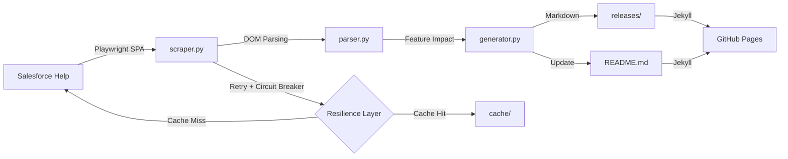

# 🚀 Salesforce Release Notes Intelligence

Automated pipeline for extraction, classificação e versionamento das **Salesforce Release Notes** como artefatos Markdown estruturados (*Knowledge-as-Code*).

### ⚙️ CI/CD Status & Conformidade

<!-- RELEASE_BADGE -->

[](https://github.com/Fatal1tyBarucco/Salesforce-WebDev/actions/workflows/python-quality.yml)
[](https://github.com/Fatal1tyBarucco/Salesforce-WebDev/actions/workflows/release_notes_pipeline.yml)


| Technology / Tool | Description | Pipeline Status |
| :--- | :--- | :---: |
| 🐍 **Python 3.14** | Ambiente de execução principal | `Conforme` |
| 🎭 **Playwright** | Scraper Headless para aplicações SPA do Salesforce Help | `Ativo` |
| 🧪 **Pytest** | Suíte de testes unitários automatizados | `450+ testes` |
| 🔍 **Mypy** | Verificação estática de tipos com modo estrito | `Strict` |
| ⚡ **Ruff & Black** | Linter e formatação estrita de código (line-length = 100) | `Conforme` |
| 📦 **uv** | Gerenciamento de dependências com lock file determinístico | `Ativo` |

---

## 📖 Overview

Este repositório contém um pipeline ETL assíncrono para scraping das *Salesforce Release Notes*, processamento local para classificação e sumarização, e geração de documentação estática via **MkDocs**.

## 🏗️ System Architecture


```mermaid
flowchart LR
    A[Salesforce Help] -->|Playwright SPA| B[scraper.py]
    B -->|DOM Parsing| C[parser.py]
    C -->|Feature Impact| D[generator.py]
    D -->|Markdown| E[releases/]
    D -->|Update| F[README.md]
    E -->|Jekyll| G[GitHub Pages]
    F -->|Jekyll| G

    B -->|Retry + Circuit Breaker| H{Resilience Layer}
    H -->|Cache Hit| I[cache/]
    H -->|Cache Miss| A
```

**Princípios de Design:**
* **Separação de Conceitos (SoC):** Camadas isoladas para rede (`scraper.py`), parsing (`parser.py`), geração (`generator.py`)
* **I/O Não Bloqueante:** `asyncio` + Playwright async para processamento paralelo
* **Resiliência:** Circuit Breaker + Token-bucket rate limiter + Exponential backoff com jitter

## ⚙️ Pré-requisitos e Instalação

Este projeto utiliza `uv` para gerenciamento determinístico de dependências.

```bash
# Instale o uv
curl -LsSf https://astral.sh/uv/install.sh | sh

# Clone e instale
git clone https://github.com/Fatal1tyBarucco/Salesforce-WebDev.git
cd Salesforce-WebDev
uv sync

# Instale browsers do Playwright
uv run playwright install chromium
```

## 🚀 Uso e Execução

```bash
# Executar pipeline completo
uv run python -m src.main

# Executar release específica
uv run python -m src.main --release summer_26

# Dry run (sem escrever arquivos)
uv run python -m src.main --dry-run
```

## 🛡️ Governança e Resiliência

| Componente | Configuração | Description |
| :--- | :--- | :--- |
| **Rate Limiter** | 2 req/s, token-bucket | Evita throttling do Salesforce |
| **Circuit Breaker** | 3 falhas → cooldown 60s | Para requisições após falhas consecutivas |
| **Cache TTL** | 24 horas | Previne refetch de conteúdo não alterado |
| **Exponential Backoff** | Base 2s + jitter | Retry inteligente com anti-thundering-herd |

## 🧪 Testes e Qualidade

```bash
# Executar testes
uv run pytest tests/

# Com cobertura
uv run pytest tests/ --cov=src --cov-report=term-missing

# Quality gate (ordem CI)
uv run ruff check src/
uv run black --check src/
uv run mypy src/
```

**Meta:** Cobertura >99%, zero erros de tipo, zero warnings de lint.

---


## 📋 Releases Disponíveis

<div style="padding:12px;margin-bottom:20px;border:1px solid #d0d7de;border-radius:6px;background:#f6f8fa;text-align:center;"><strong>🌐 Language / Idioma:</strong> <strong>🇺🇸 English</strong> | <a href="./README.md">🇧🇷 Português</a></div>

### ❄️ Winter '27

> 📊 **Executive Summary:** A release Winter '27 apresenta um conjunto robusto de 1.123 novos recursos e aprimoramentos distribuídos por 19 categorias, representando a evolução contínua da plataforma Salesforce com foco em Agentforce, Experience Cloud e soluções setoriais. O destaque central é a consolidação do Agentforce como pilar estratégico da plataforma, com 129 recursos dedicados à criação, configuração e otimização de agentes de IA autônomos para diferentes cenários de negócio. A categoria Setores lidera em volume com 286 recursos, oferecendo soluções especializadas para indústrias específicas, desde manufatura até serviços financeiros e saúde. O Experience Cloud emerge como segunda maior categoria com 143 recursos, focando em experiências digitais modernas baseadas em LWR (Lightning Web Runtime) com novos templates, componentes e capacidades de engajamento. O Serviço (140 recursos) transforma a central de atendimento com Agentforce, introduzindo roteamento inteligente, assistentes de IA para agentes e métricas de qualidade de atendimento. O Gerenciamento de Receita (123 recursos) aprimora processos de cotação, precificação e faturamento com automação avançada. O Partner Cloud (38 recursos) expande as capacidades de ecossistema, enquanto o Field Service (37 recursos) melhora a gestão de operações de campo. A plataforma também avança em Segurança (25 recursos), Automação (72 recursos) e Data 360 (7 recursos), garantindo que as organizações possam operar com maior eficiência, segurança e inteligência artificial integrada em todos os processos.


> 📌 **Key Themes:** Agentforce para Todos • Experiências Digitais Modernas • Soluções Setoriais Profundas • Atendimento Autônomo • Ecosistema de Parceiros


> 🎯 **Strategic Impact:** A Winter '27 representa uma release focada em experiência digital e agentes autônomos, com impacto direto na capacidade das organizações de oferecer atendimento ao cliente de alta qualidade via Agentforce e criar portais web modernos via Experience Cloud. As 286 inovações em Setores permitem que empresas de qualquer indústria implementem soluções Salesforce com mendalamas funcionalidades específicas do seu setor, reduzindo time-to-value em implementações verticais.


> ⚠️ **Migration Notes:** A Winter '27 mantém a compatibilidade com versões anteriores, mas recomenda-se que organizações usando Experience Cloud com templates Force.com avaliem a migração para LWR. Usuários do Agentforce devem revisar as novas políticas de uso de dados e configurações de privacidade dos agentes.


<details>
<summary><b>📄 Salesforce General (28 features)</b></summary>


> A categoria Salesforce Geral reúne 28 recursos que abrangem mudanças transversais na plataforma. Incluem-se atualizações de interface Lightning Experience, melhorias de performance em carregamento de páginas, correções de bugs e aprimoramentos gerais que beneficiam todas as implementações Salesforce.

> 📄 Full details: [./releases/winter_27/en_US/salesforce_geral.md](./releases/winter_27/en_US/salesforce_geral.md)

</details>


<details>
<summary><b>📄 Data Analysis (26 features)</b></summary>


> A Análise de Dados apresenta 26 recursos focados em capacidades analíticas da plataforma. Os recursos incluem novos conectores para fontes de dados externas, melhorias em visualizações de dashboards e funcionalidades de business intelligence que permitem às organizações extrair insights mais profundos. A integração com Salesforce Einstein Analytics oferece capacidades de análise preditiva acessíveis a usuários de negócio sem necessidade de código.

> 📄 Full details: [./releases/winter_27/en_US/analise_de_dados.md](./releases/winter_27/en_US/analise_de_dados.md)

</details>


<details>
<summary><b>📄 Automation (72 features)</b></summary>


> A Automação oferece 72 recursos que expandem as capacidades do Flow Builder e processos de negócio automatizados. Destaques incluem novos gatilhos de fluxo para eventos do Agentforce, ações de automação baseadas em decisões de IA e melhorias na experiência de criação de fluxos com interface simplificada. A categoria também introduz recursos de orchestration para coordenar múltiplos fluxos e agentes em processos de negócio complexos.

> 📄 Full details: [./releases/winter_27/en_US/automacao.md](./releases/winter_27/en_US/automacao.md)

</details>


<details>
<summary><b>📄 Data 360 (7 features)</b></summary>


> O Data 360 apresenta 7 recursos focados em conectividade e qualidade de dados. Os recursos incluem novos conectores para plataformas de dados externas, ferramentas de profilamento de dados e capacidades de governança que permitem às organizações manter dados confiáveis para análises e decisões de negócio.

> 📄 Full details: [./releases/winter_27/en_US/data_360.md](./releases/winter_27/en_US/data_360.md)

</details>


<details>
<summary><b>📄 Experience Cloud (143 features)</b></summary>


> O Experience Cloud lidera em volume de conteúdo com 143 recursos, focando na modernização de experiências digitais. A transição para Lightning Web Runtime (LWR) como tecnologia base traz novos templates de sites, componentes otimizados para performance e capacidades de personalização avançadas. Novos recursos incluem publicação de artigos com IA generativa, portal de autoatendimento remodelado e integrações profundas com Slack para colaboração em comunidades. A plataforma também introduz melhorias em SEO, analytics de comportamento de visitantes e ferramentas de A/B testing para otimização deConversion.

> 📄 Full details: [./releases/winter_27/en_US/experience_cloud.md](./releases/winter_27/en_US/experience_cloud.md)

</details>


<details>
<summary><b>📄 Field Service (37 features)</b></summary>


> O Field Service apresenta 37 recursos que aprimoram a gestão de serviços de campo. Destaques incluem melhorias no algoritmo de agendamento inteligente, novas capacidades mobile para técnicos de campo e integração aprimorada com IoT para manutenção preditiva. A categoria também introduz recursos de realidade aumentada para辅助 técnicos em diagnósticos remotos.

> 📄 Full details: [./releases/winter_27/en_US/field_service.md](./releases/winter_27/en_US/field_service.md)

</details>


<details>
<summary><b>📄 Hyperforce (5 features)</b></summary>


> A Hyperforce apresenta 5 recursos focados na infraestrutura de nuvem de próxima geração. Os recursos incluem expansão para novas regiões de nuvem pública, aprimoramentos de segurança de infraestrutura e ferramentas de monitoring para garantir alta disponibilidade e performance.

> 📄 Full details: [./releases/winter_27/en_US/hyperforce.md](./releases/winter_27/en_US/hyperforce.md)

</details>


<details>
<summary><b>📄 Industries (286 features)</b></summary>


> A categoria Setores lidera em volume com 286 recursos, oferecendo soluções especializadas para indústrias específicas. Abrange Automotivo (com Agentforce para Automotive e gestão de concessionárias), Saúde (com Epic Integration e Patient 360), Serviços Financeiros (com Wealth Management Cloud e Banking), Manufatura (com Manufacturing Cloud e gestão de cadeia de suprimentos), Varejo (com Commerce Cloud e Retail), Educação (com Education Cloud e gestão de alunos) e Utilities (com utilities cloud para setor elétrico). O destaque é a profundidade das soluções setoriais que permitem implementações turnkey para cada indústria.

> 📄 Full details: [./releases/winter_27/en_US/setores.md](./releases/winter_27/en_US/setores.md)

</details>


<details>
<summary><b>📄 Marketing (1 features)</b></summary>


> A categoria Marketing apresenta 1 recurso focado em automação de campanhas. Este recurso introduz novas capacidades de segmentação que permitem marketers criar públicos-alvo mais precisos para campanhas de marketing direcionado.

> 📄 Full details: [./releases/winter_27/en_US/marketing.md](./releases/winter_27/en_US/marketing.md)

</details>


<details>
<summary><b>📄 MuleSoft (1 features)</b></summary>


> O MuleSoft apresenta 1 recurso focado em conectividade e APIs. O recurso representa a continuação do compromisso da Salesforce com integração via MuleSoft como camada de integração central para arquiteturas enterprise.

> 📄 Full details: [./releases/winter_27/en_US/mulesoft.md](./releases/winter_27/en_US/mulesoft.md)

</details>


<details>
<summary><b>📄 Partner Cloud (38 features)</b></summary>


> A Partner Cloud apresenta 38 recursos focados em ecossistemas de parceiros. Destaques incluem melhorias no portal de parceiros, ferramentas de registro e qualificação de leads compartilhados, e capacidades de comunicação entre organizações dentro do ecossistema Salesforce. A categoria também introduz recursos de co-selling e incentive management.

> 📄 Full details: [./releases/winter_27/en_US/partner_cloud.md](./releases/winter_27/en_US/partner_cloud.md)

</details>


<details>
<summary><b>📄 Revenue Management (123 features)</b></summary>


> O Gerenciamento de Receita conta com 123 recursos para otimização de processos de CPQ (Configure, Price, Quote) e gestão de faturamento. Os recursos incluem configuração de produtos com IA, precificação dinâmica baseada em múltiplos fatores, geração de cotações automatizada e ferramentas de aprovação de pedidos. A categoria também aprimora capacidades de reconhecimento de receita e gestão de assinaturas.

> 📄 Full details: [./releases/winter_27/en_US/gerenciamento_de_receita.md](./releases/winter_27/en_US/gerenciamento_de_receita.md)

</details>


<details>
<summary><b>📄 Sales (44 features)</b></summary>

> 📄 Full details: [./releases/winter_27/en_US/vendas.md](./releases/winter_27/en_US/vendas.md)

</details>


<details>
<summary><b>📄 Salesforce Slack Integrations (7 features)</b></summary>


> A categoria de Integrações Slack apresenta 7 recursos que aprofundam a colaboração entre Salesforce e Slack. Novos recursos incluem sync bidirecional de registros, notificações contextuais em canais e ferramentas de search que permitem buscar dados do Salesforce diretamente do Slack.

> 📄 Full details: [./releases/winter_27/en_US/integracoes_do_salesforce_para_slack.md](./releases/winter_27/en_US/integracoes_do_salesforce_para_slack.md)

</details>


<details>
<summary><b>📄 Security, Identity & Privacy (25 features)</b></summary>


> A Segurança, Identidade e Privacidade reúne 25 recursos críticos para proteção de dados e gestão de acessos. Destaques incluem novas políticas de uso de dados para Agentforce, controles de acesso granulares baseados em contexto, ferramentas de auditoria de atividades de IA e aprimoramentos em políticas de senha e autenticação multifator.

> 📄 Full details: [./releases/winter_27/en_US/seguranca_identidade_e_privacidade.md](./releases/winter_27/en_US/seguranca_identidade_e_privacidade.md)

</details>


<details>
<summary><b>📄 Service (140 features)</b></summary>


> A categoria Serviço apresenta 140 recursos, transformando o Service Cloud em Agentforce Service. Destaques incluem a central de contato Agentforce com roteamento inteligente baseado em IA, assistentes de resposta para agentes com conhecimento da base de artigos, métricas de qualidade em tempo real e análise de sentimento de conversas. A categoria também introduz recursos de autoatendimento com IA generativa, portal de casos remodelado e integrações com WhatsApp Business e outras plataformas de messaging.

> 📄 Full details: [./releases/winter_27/en_US/servico.md](./releases/winter_27/en_US/servico.md)

</details>


<details>
<summary><b>📄 Legal Documentation (8 features)</b></summary>


> A categoria Documentação Legal reúne 8 recursos dedicados a atualizações de termos, políticas e conformidade legal da plataforma. Inclui atualizações sobre navegadores compatíveis, políticas de uso de dados e documentação de conformidade com regulamentações de privacidade. É essencial que administradores e equipes jurídicas revisem estes recursos para manter conformidade organizacional.

> 📄 Full details: [./releases/winter_27/en_US/documentacao_legal.md](./releases/winter_27/en_US/documentacao_legal.md)

</details>


<details>
<summary><b>📄 OmniStudio (3 features)</b></summary>


> O OmniStudio conta com 3 recursos que aprimoram as capacidades de configuração de processos digitais. Os recursos incluem melhorias em flexcards para experiências mais responsivas, updates em OmniScripts para fluxos de navegação e ferramentas de debugging para desenvolvedores.

> 📄 Full details: [./releases/winter_27/en_US/omnistudio.md](./releases/winter_27/en_US/omnistudio.md)

</details>


<details>
<summary><b>📄 Agentforce (129 features)</b></summary>


> O Agentforce consolida-se como o centro da estratégia de IA da Salesforce com 129 recursos na Winter '27. A plataforma expande o Agentforce Builder com novos templates de agentes para casos de uso específicos como vendas, serviço e operações. O Agentforce for Service introduz roteamento inteligente de casos baseado em IA, assistentes de resposta com conhecimento da base de artigos e métricas de qualidade de atendimento em tempo real. Novos recursos incluem análise de sentimento de conversas, resumo automático de casos e suggestions de artigos relevantes durante interações. Para desenvolvedores, o Agentforce SDK permite criação de agentes customizados com integração a sistemas externos via APIs REST e GraphQL.

> 📄 Full details: [./releases/winter_27/en_US/agentforce.md](./releases/winter_27/en_US/agentforce.md)

</details>


<details>

<summary><h3>☀️ Summer '26</h3></summary>

> 📊 **Executive Summary:** A release Summer '26 apresenta um impressionante conjunto de 1.373 novos recursos e aprimoramentos distribuídos por 22 categorias, consolidando a plataforma como referência em inovação para CRM e automação de negócios. O destaque central desta release é a expansão massiva do ecossistema Agentforce, que agora conta com 37 recursos adicionais incluindo novos templates de agentes, ferramentas de debugging e capacidades de integração com sistemas externos. A categoria Serviço lidera em volume com 198 recursos, transformando a experiência de atendimento ao cliente com Agentforce Service, novas capacidades de central de contato e integrações omnichannel. Os Setores trazem o maior volume de inovações setoriais com 309 recursos, oferecendo soluções especializadas para automovel, finanças, saúde, manufatura, educação e utilities. O Desenvolvimento apresenta 127 recursos focados em ferramentas para desenvolvedores, incluindo novos recursos no LWC, Apex e DevOps Center. A Automação oferece 118 recursos com avanços significativos no Flow Builder e processos de aprovação. O Data 360 apresenta 72 recursos para gestão unificada de dados, enquanto Vendas e Segurança (58 recursos cada) expandem capacidades de CRM e proteção de dados. O Aplicativo Móvel com 17 recursos e o Marketing com 64 recursos completam uma release focada em inteligência artificial integrada, experiência do desenvolvedor e soluções verticais profundas.


> 📌 **Key Themes:** Agentforce Everywhere • Developer Experience • Soluções Verticais • Omnichannel Service • Data-Driven CRM


> 🎯 **Strategic Impact:** A Summer '26 representa uma release de expansão do Agentforce e consolidação de soluções setoriais. O impacto para organizações Salesforce é significativo em três dimensões: (1) Agentes de IA para automatizar processos de serviço, vendas e operações, reduzindo tempo de resposta e aumentando produtividade; (2) Soluções verticais profundas com 309 recursos setoriais que permitem implementações mais rápidas e customizadas por indústria; (3) Ferramentas de desenvolvimento aprimoradas que aceleram a entrega de customizações e integrações.


> ⚠️ **Migration Notes:** A Summer '26 introduz mudanças significativas no modelo de dados do Data 360 que podem afetar integrações existentes. Organizações usando Experience Cloud com Force.com devem planejar migração gradual para LWR. Usuários do Agentforce devem revisar novas políticas de dados e configurações de IA responsible.


<details>
<summary><b>📄 Legal Documentation (6 features)</b></summary>


> A categoria Documentação Legal apresenta 6 recursos dedicados a atualizações de termos, políticas e conformidade legal. Inclui atualizações sobre navegadores compatíveis, políticas de uso de dados e documentação de disponibilidade de recursos. É essencial que equipes jurídicas e administrativas revisem estas mudanças para garantir conformidade organizacional.

> 📄 Full details: [./releases/summer_26/en_US/documentacao_legal.md](./releases/summer_26/en_US/documentacao_legal.md)

</details>


<details>
<summary><b>📄 Salesforce General (36 features)</b></summary>


> A categoria Salesforce Geral reúne 36 recursos transversais que afetam múltiplos produtos e funcionalidades da plataforma. Incluem-se atualizações de interface Lightning Experience, melhorias de performance, correções de bugs e aprimoramentos gerais de usabilidade que beneficiam todas as implementações.

> 📄 Full details: [./releases/summer_26/en_US/salesforce_geral.md](./releases/summer_26/en_US/salesforce_geral.md)

</details>


<details>
<summary><b>📄 Agentforce (37 features)</b></summary>


> O Agentforce recebe 37 recursos na Summer '26, expandindo significativamente as capacidades de IA autônoma da plataforma. Novos templates de agentes para casos de uso comuns permitem criação rápida de agentes especializados. Ferramentas de debugging e monitoring de agentes melhoram a capacidade de diagnóstico e otimização. A integração com sistemas externos via APIs REST e GraphQL é aprimorada, permitindo agentes que interagem com ERPs, CRMs externos e bases de conhecimento corporativas.

> 📄 Full details: [./releases/summer_26/en_US/agentforce.md](./releases/summer_26/en_US/agentforce.md)

</details>


<details>
<summary><b>📄 Data Analysis (58 features)</b></summary>


> A Análise de Dados apresenta 58 recursos focados em business intelligence e insights preditivos. Os recursos incluem novas visualizações de dados, ferramentas de análise de cohorts e capacidades de self-service analytics que permitem usuários de negócio criar relatórios sem dependência de equipes técnicas. A integração com Einstein Analytics oferece capacidades de análise preditiva e recomendações automatizadas.

> 📄 Full details: [./releases/summer_26/en_US/analise_de_dados.md](./releases/summer_26/en_US/analise_de_dados.md)

</details>


<details>
<summary><b>📄 Automation (118 features)</b></summary>


> A Automação lidera em volume com 118 recursos focados em Flow Builder e processos de negócio. Destaques incluem novos tipos de elementos de fluxo, ações de automação baseadas em decisões de IA, ferramentas de testing de fluxos e capacidades de versionamento de fluxos. A categoria também introduz orchestration de múltiplos fluxos para processos de negócio complexos e integração com webhooks externos.

> 📄 Full details: [./releases/summer_26/en_US/automacao.md](./releases/summer_26/en_US/automacao.md)

</details>


<details>
<summary><b>📄 OmniStudio (9 features)</b></summary>


> O OmniStudio conta com 9 recursos que aprimoram a configuração de processos digitais. Novas capacidades incluem flexcards responsivos, OmniScripts com suporte a validações complexas e DataRaptors otimizados para performance em grandes volumes de dados.

> 📄 Full details: [./releases/summer_26/en_US/omnistudio.md](./releases/summer_26/en_US/omnistudio.md)

</details>


<details>
<summary><b>📄 Customization (33 features)</b></summary>


> A categoria Personalização apresenta 33 recursos focados em adaptar a plataforma às necessidades específicas de cada organização. Novos recursos incluem configurações de tema e layout, personalização de lightning pages e ferramentas de branding que permitem experiências mais coesas com a identidade visual de cada empresa.

> 📄 Full details: [./releases/summer_26/en_US/personalizacao.md](./releases/summer_26/en_US/personalizacao.md)

</details>


<details>
<summary><b>📄 Data 360 (72 features)</b></summary>


> O Data 360 apresenta 72 recursos que expandem significativamente as capacidades de gestão unificada de dados. Os recursos incluem novos conectores para fontes de dados externas (incluindo ERPs, CRMs e databases cloud), ferramentas de data profiling e qualidade, capacidades de harmonização de dados e governança avançada. A integração com Einstein Analytics permite análises baseadas em dados unificados.

> 📄 Full details: [./releases/summer_26/en_US/data_360.md](./releases/summer_26/en_US/data_360.md)

</details>


<details>
<summary><b>📄 Development (127 features)</b></summary>


> A categoria Desenvolvimento reúne 127 recursos focados em produtividade de desenvolvedores. Destaques incluem novos recursos no Lightning Web Components (LWC) com APIs aprimoradas, melhorias no Apex com suporte a features mais recentes da linguagem, atualizações no DevOps Center para CI/CD e ferramentas de debugging integradas. A categoria também introduz templates de projeto e ferramentas de scaffolding que aceleram a criação de aplicações Salesforce.

> 📄 Full details: [./releases/summer_26/en_US/desenvolvimento.md](./releases/summer_26/en_US/desenvolvimento.md)

</details>


<details>
<summary><b>📄 Experience Cloud (14 features)</b></summary>


> O Experience Cloud apresenta 14 recursos focados em experiências digitais modernas. Novos recursos incluem templates de site atualizados, componentes LWC otimizados para performance e ferramentas de personalização avançadas. A categoria também introduz melhorias em SEO e analytics de visitantes.

> 📄 Full details: [./releases/summer_26/en_US/experience_cloud.md](./releases/summer_26/en_US/experience_cloud.md)

</details>


<details>
<summary><b>📄 Field Service (48 features)</b></summary>


> O Field Service apresenta 48 recursos que aprimoram a gestão de serviços de campo. Destaques incluem melhorias no algoritmo de agendamento com considerações de sustentabilidade, novas capacidades mobile para técnicos e ferramentas de realidade aumentada para suporte remoto. A integração com IoT é expandida para incluir mais tipos de dispositivos e casos de uso.

> 📄 Full details: [./releases/summer_26/en_US/field_service.md](./releases/summer_26/en_US/field_service.md)

</details>


<details>
<summary><b>📄 Hyperforce (3 features)</b></summary>


> A Hyperforce apresenta 3 recursos focados em infraestrutura de nuvem. Os recursos incluem expansão de regiões disponíveis e ferramentas de monitoring para garantir disponibilidade e performance.

> 📄 Full details: [./releases/summer_26/en_US/hyperforce.md](./releases/summer_26/en_US/hyperforce.md)

</details>


<details>
<summary><b>📄 Industries (309 features)</b></summary>


> A categoria Setores lidera em volume com 309 recursos, oferecendo soluções especializadas para indústrias específicas. Abrange Automotivo (com Agentforce para Automotive, gestão de concessionárias e financiamento), Saúde (com Health Cloud 2.0, Patient 360 e integrações com sistemas hospitalares), Serviços Financeiros (com Wealth Management Cloud, Banking e Insurance), Manufatura (com Manufacturing Cloud e gestão de cadeia de suprimentos), Educação (com Education Cloud e gestão de jornada do aluno), Utilities (com soluções para setor elétrico, água e gás) e Varejo (com Commerce Cloud e ferramentas de CRM para retail). O destaque é a profundidade das soluções setoriais que combinam funcionalidades específicas da indústria com capacidades de Agentforce.

> 📄 Full details: [./releases/summer_26/en_US/setores.md](./releases/summer_26/en_US/setores.md)

</details>


<details>
<summary><b>📄 Marketing (64 features)</b></summary>


> O Marketing apresenta 64 recursos focados em automação de campanhas e gestão de jornadas do cliente. Destaques incluem novas ferramentas de segmentação, capacidades de personalização de mensagens em escala e integração aprimorada com Marketing Cloud para jornadas omnichannel.

> 📄 Full details: [./releases/summer_26/en_US/marketing.md](./releases/summer_26/en_US/marketing.md)

</details>


<details>
<summary><b>📄 MuleSoft (8 features)</b></summary>


> O MuleSoft apresenta 8 recursos focados em integração e APIs. Os recursos incluem novos conectores para plataformas populares, ferramentas de design de APIs e capacidades de monitoramento de APIs em produção.

> 📄 Full details: [./releases/summer_26/en_US/mulesoft.md](./releases/summer_26/en_US/mulesoft.md)

</details>


<details>
<summary><b>📄 Mobile App (17 features)</b></summary>


> O Aplicativo Móvel apresenta 17 recursos focados em experiência mobile de vendas e serviço. Os recursos incluem login biométrico aprimorado, novas funcionalidades offline e integrações com ferramentas de produtividade como日历 e email nativo do dispositivo.

> 📄 Full details: [./releases/summer_26/en_US/aplicativo_movel.md](./releases/summer_26/en_US/aplicativo_movel.md)

</details>


<details>
<summary><b>📄 Partner Cloud (1 features)</b></summary>


> O Partner Cloud apresenta 1 recurso focado em ecossistemas de parceiros. O recurso introduz ferramentas de gestão de registros de parceiros que permitem melhor visibilidade e coordenação dentro do ecossistema Salesforce.

> 📄 Full details: [./releases/summer_26/en_US/partner_cloud.md](./releases/summer_26/en_US/partner_cloud.md)

</details>


<details>
<summary><b>📄 Revenue Management (97 features)</b></summary>


> O Gerenciamento de Receita apresenta 97 recursos focados em processos de CPQ, billing e gestão de contratos. Novos recursos incluem configuração de produtos com IA generativa, precificação em tempo real baseada em múltiplos fatores e ferramentas de gestão de renewals automatizados. A categoria também introduz melhorias em revenue recognition e gestão de assinaturas.

> 📄 Full details: [./releases/summer_26/en_US/gerenciamento_de_receita.md](./releases/summer_26/en_US/gerenciamento_de_receita.md)

</details>


<details>
<summary><b>📄 Sales (58 features)</b></summary>

> 📄 Full details: [./releases/summer_26/en_US/vendas.md](./releases/summer_26/en_US/vendas.md)

</details>


<details>
<summary><b>📄 Salesforce Slack Integrations (2 features)</b></summary>


> A categoria apresenta 2 recursos focados em colaboração Salesforce-Slack. Os recursos incluem sincronização de registros e notificações contextuais que permitem colaboração eficiente em contextos de negócio.

> 📄 Full details: [./releases/summer_26/en_US/integracoes_do_salesforce_para_slack.md](./releases/summer_26/en_US/integracoes_do_salesforce_para_slack.md)

</details>


<details>
<summary><b>📄 Security, Identity & Privacy (58 features)</b></summary>


> A Segurança, Identidade e Privacidade apresenta 58 recursos focados em proteção de dados e gestão de acessos. Destaques incluem novos controles de acesso baseados em contexto, ferramentas de auditoria de atividades, políticas de dados para IA e aprimoramentos em autenticação multifator. A categoria também introduz recursos de privacy governance e consent management.

> 📄 Full details: [./releases/summer_26/en_US/seguranca_identidade_e_privacidade.md](./releases/summer_26/en_US/seguranca_identidade_e_privacidade.md)

</details>


<details>
<summary><b>📄 Service (198 features)</b></summary>


> A categoria Serviço lidera em volume com 198 recursos, transformando a experiência de atendimento ao cliente. O Agentforce Service introduz roteamento inteligente de casos baseado em IA, assistentes de resposta para agentes com conhecimento da base de artigos, métricas de qualidade em tempo real e análise de sentimento. Novas capacidades omnichannel incluem integrações com WhatsApp Business, Apple Messages for Business e outras plataformas de messaging. A central de contato Agentforce permite configuração visual de fluxos de atendimento com agentes de IA.

> 📄 Full details: [./releases/summer_26/en_US/servico.md](./releases/summer_26/en_US/servico.md)

</details>

</details>


<details>

<summary><h3>🌸 Spring '26</h3></summary>

> 📊 **Executive Summary:** A release Salesforce Spring '26 apresenta um impressionante conjunto de 1.438 novos recursos e aprimoramentos distribuídos por 21 categorias, consolidando a plataforma como referência em inovação para CRM e automação de negócios. O destaque central desta release é a evolução do Agentforce, que agora conta com o Agentforce Builder disponível ao público em geral, permitindo a criação de agentes de IA mais complexos e sofisticados. A categoria Serviço lidera em volume com 167 recursos, transformando o Service Cloud no Serviço Agentforce, com novas capacidades de central de contato, voz, messaging e gerenciamento de serviço de TI. O Aplicativo Móvel acompanha com 187 recursos, garantindo que as equipes possam operar com plena funcionalidade em dispositivos móveis. A Automação oferece 151 recursos incluindo avanços significativos no Flow Builder, com geração de fluxos por IA agora disponível ao público em geral, orquestração de fluxos aprimorada e novas capacidades de processamento em lote de prompts. Os Setores trazem o maior volume de inovações setoriais com 194 recursos, abrangendo desde automotivo e finanças até saúde e serviços públicos. O Gerenciamento de Receita apresenta 131 recursos para otimização de CPQ e billing. Em Vendas, com 85 recursos, o Sales Cloud se transforma em Agentforce Sales, introduzindo geração de leads autônoma, qualificação por IA e nutrição de leads automatizada. A plataforma também avança em Segurança, Identidade e Privacidade com 61 recursos, incluindo novas políticas de aplicativos conectados, login sem senha com chaves de acesso e aprimoramentos no Salesforce Shield. A Análise de Dados com 54 recursos e o Data 360 com 53 recursos expandem as capacidades de insights e gestão de dados. O Desenvolvimento com 97 recursos oferece novas ferramentas para desenvolvedores, incluindo tipos personalizados do Lightning para Agentforce. Com 72 recursos, o Marketing aprimora campanhas e engajamento. Experience Cloud (21 recursos), Personalização (18 recursos), Field Service (41 recursos), MuleSoft (8 recursos), OmniStudio (10 recursos), Hyperforce (5 recursos), Partner Cloud (4 recursos) e Documentação Legal (6 recursos) completam o panorama desta release abrangente. A Spring '26 representa um marco na estratégia da Salesforce de integrar IA generativa e agentes autônomos em todas as camadas da plataforma, capacitando organizações de todos os tamanhos a automatizar processos, aumentar a produtividade e oferecer experiências personalizadas em escala.


<details>
<summary><b>📄 Legal Documentation (6 features)</b></summary>


> A categoria Documentação Legal da release Spring '26 contém 6 recursos dedicados a atualizações de termos, políticas e conformidade legal da plataforma Salesforce. Estes recursos garantem que as organizações estejam alinhadas com as mais recentes exigências regulatórias e mudanças contratuais, incluindo atualizações de termos de serviço, políticas de privacidade e documentação de conformidade. É essencial que administradores e equipes jurídicas revisem esses recursos para manter a conformidade organizacional.

> 📄 Full details: [./releases/spring_26/en_US/documentacao_legal.md](./releases/spring_26/en_US/documentacao_legal.md)

</details>


<details>

<summary><h3>❄️ Winter '26</h3></summary>

> 📊 **Executive Summary:** A release Salesforce Winter '26 representa um marco significativo na evolução da plataforma, com impressionantes 1.348 recursos distribuídos em 19 categorias. O volume massivo de novidades reflete a aceleração estratégica da Salesforce em três pilares fundamentais: inteligência artificial generativa e agentes autônomos, unificação de dados em tempo real e modernização da experiência do desenvolvedor.

O destaque absoluto é o ecossistema Agentforce, que consolida a visão de agentes de IA autônomos com 39 recursos dedicados. A plataforma expande o suporte a modelos de IA — incluindo Claude Sonnet 4.5, OpenAI o3/o4-mini e Amazon Nova na Plataforma Einstein — além de introduzir Agentforce Voice para conversas por voz, Rastreamento de sessão para visibilidade do comportamento do agente e Otimização do Agentforce (beta) para análise de eficácia. A migração do Agentforce (padrão) para agentes de funcionários com fluxo simplificado sinaliza a maturidade do produto para uso empresarial em larga escala.

A categoria Setores domina com 459 recursos, demonstrando o compromisso da Salesforce com soluções verticais. Destacam-se: Life Sciences Cloud para Engajamento do Cliente (GA), Agentforce para Healthcare com correspondência inteligente de provedores, Insurance Cloud com automação de declarações, Education Cloud com metas de carreira do aluno via Agentforce, e Manufacturing Cloud com reabastecimento inteligente de inventário. O Partner Cloud, com 156 recursos, inaugura o gerenciamento completo do ciclo de vida de parceiros com Revenue Cloud, Precificação do Salesforce e Gerenciamento de uso avançado.

Vendas (154 recursos) e Desenvolvimento (101 recursos) completam o topo da escala. Em Vendas, o Agentforce SDR evolui para Nutrição de leads com suporte a Microsoft Exchange, enquanto o Flow Builder recebe automação de decisões com IA generativa e fluxos de transmissão para públicos dinâmicos. Em Desenvolvimento, o SLDS 2 chega como GA com modo escuro (beta), o LWC recebe API v65.0 com Gerenciamento de estado (beta) e Lightning Out 2.0 para experiências externas, além de ferramentas de MCP do LWC para acelerar o desenvolvimento com IA.

Análise de dados (91 recursos) impulsiona a era do Tableau Next com semânticas aprimoradas, Otimização de modelo semântico (beta) e integração profunda com Slack via Agentforce para Analytics. Marketing (87 recursos) avança com Marketing Cloud Next, gerenciamento de fidelidade expandido e promoções globais. Segurança (55 recursos) introduz Detecção de dados expandida, rastreamento de atividade do agente em tempo real e Criptografia de banco de dados GA.

A infraestrutura Hyperforce expande para mais regiões com suporte a AWS Direct Connect e Continuidade avançada entre regiões. O Data Cloud é renomeado para Data 360, consolidando a visão de dados unificados. Field Service (24 recursos) adiciona escala dinâmica e VRA de múltiplos participantes. Personalização (65 recursos) moderniza a experiência administrativa com classificação por várias colunas em listas e segmentação expandida do Data 360. A estratégia de descontinuação é clara: Chat legado, Salesforce para Outlook (dez/2027), Lightning Sync para EWS e Salesforce Functions estão sendo aposentados.

Em suma, a Winter '26 posiciona o Salesforce como uma plataforma de agentes de IA empresariais, com dados unificados via Data 360, soluções verticais profundas e uma experiência de desenvolvimento modernizada. A direção estratégica é inequívoca: cada interação de negócio será mediada por agentes inteligentes, cada decisão será informada por dados unificados e cada setor terá soluções nativas específicas.


<details>
<summary><b>📄 Legal Documentation (11 features)</b></summary>


> Com 11 recursos, esta categoria foca em informações estruturais da release. Inclui atualizações sobre navegadores compatíveis para Lightning Experience, Salesforce Classic e CRM Analytics. Documenta como e quando os recursos ficam disponíveis, com impacto imediato para alguns e ação de administrador para outros. As mudanças na documentação visam facilitar a localização de informações sobre compatibilidade e disponibilidade de recursos.

> 📄 Full details: [./releases/winter_26/en_US/documentacao_legal.md](./releases/winter_26/en_US/documentacao_legal.md)

</details>


## 🛠️ Stack Tecnológico

| Ferramenta | Uso no Projeto |
| :--- | :--- |
| **GitHub Actions** | CI/CD: lint, typecheck, extração, deploy automático |
| **uv** | Gerenciamento de dependências com lock file determinístico |
| **Playwright** | Scraper headless para páginas SPA do Salesforce Help |
| **Python 3.14** | Linguagem principal com type hints completos |
| **BeautifulSoup** | Parser HTML para extração de dados estruturados |
| **Markdown** | Formato de saída para documentação técnica |
| **MkDocs** | Portal técnico publicado no GitHub Pages |
| **stdlib HTTP** | REST API e health check server (zero dependências externas) |
| **gh CLI** | PR workflow e GitHub integration |

### Módulos do Pipeline

| Módulo | Responsabilidade |
| :--- | :--- |
| `src/main.py` | Orquestrador: detectar releases, extrair, parse, gerar, atualizar README |
| `src/scraper.py` | Playwright headless, circuit breaker, rate limiter, cache, download PDF |
| `src/parser.py` | Extração de hierarquia ToC + tabela Feature Impact |
| `src/generator.py` | Gera arquivos `.md` por categoria |
| `src/ai_automation.py` | Comparação entre releases, detecção de regressões, quality metrics |
| `src/analytics.py` | Dashboard HTML com gráficos SVG |
| `src/api.py` | REST API para acesso programático |
| `src/notifications.py` | Email digest, Slack/Discord webhooks |
| `src/dashboard.py` | Dashboard interativo com JS |
| `src/workflow.py` | PR-based workflow com triage |
| `src/salesforce.py` | Trailhead linking, org limits, sandbox readiness |
| `src/health.py` | Health check (`/health`, `/ready`), Prometheus metrics (`/metrics`) |
| `src/logger.py` | Logging estruturado com correlation IDs |

---

## 🤝 Como Contribuir

1. Faça o **Fork** do projeto
2. Crie uma nova branch: `git checkout -b feature/minha-feature`
3. Instale dependências: `uv sync --extra dev`
4. Execute a quality gate:
   ```bash
   uv run ruff check src/
   uv run black --check src/
   uv run mypy src/
   uv run pytest tests/ --cov=src --cov-fail-under=99
   ```
5. Faça o commit: `git commit -m 'feat: descrição da alteração'`
6. Envie: `git push origin feature/minha-feature`
7. Abra um **Pull Request**

---

## 📄 Licença

Este projeto é mantido para fins educacionais e de referência técnica.
