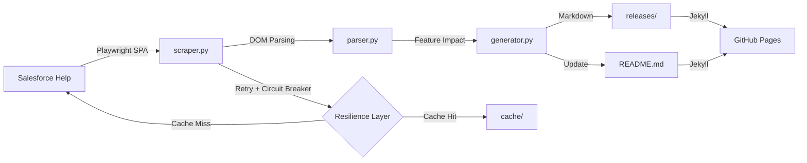

<div align="center">


</div>

# 🚀 Salesforce Release Notes Intelligence

Automated pipeline for extraction, classificação e versionamento das **Salesforce Release Notes** como artefatos Markdown estruturados (*Knowledge-as-Code*).

### ⚙️ CI/CD Status & Conformidade

<!-- RELEASE_BADGE -->

[](https://github.com/Fatal1tyBarucco/Salesforce-WebDev/actions/workflows/python-quality.yml)
[](https://github.com/Fatal1tyBarucco/Salesforce-WebDev/actions/workflows/release_notes_pipeline.yml)


| Technology / Tool | Description | Pipeline Status |
| :--- | :--- | :---: |
| 🐍 **Python 3.14** | Ambiente de execução principal | `Conforme` |
| 🎭 **Playwright** | Scraper Headless para aplicações SPA do Salesforce Help | `Ativo` |
| 🧪 **Pytest** | Suíte de testes unitários automatizados | `450+ testes` |
| 🔍 **Mypy** | Verificação estática de tipos com modo estrito | `Strict` |
| ⚡ **Ruff & Black** | Linter e formatação estrita de código (line-length = 100) | `Conforme` |
| 📦 **uv** | Gerenciamento de dependências com lock file determinístico | `Ativo` |

---

## 📖 Overview

Este repositório contém um pipeline ETL assíncrono para scraping das *Salesforce Release Notes*, processamento local para classificação e sumarização, e geração de documentação estática via **MkDocs**.

## 🏗️ System Architecture


```mermaid
flowchart LR
    A[Salesforce Help] -->|Playwright SPA| B[scraper.py]
    B -->|DOM Parsing| C[parser.py]
    C -->|Feature Impact| D[generator.py]
    D -->|Markdown| E[releases/]
    D -->|Update| F[README.md]
    E -->|Jekyll| G[GitHub Pages]
    F -->|Jekyll| G

    B -->|Retry + Circuit Breaker| H{Resilience Layer}
    H -->|Cache Hit| I[cache/]
    H -->|Cache Miss| A
```

**Princípios de Design:**
* **Separação de Conceitos (SoC):** Camadas isoladas para rede (`scraper.py`), parsing (`parser.py`), geração (`generator.py`)
* **I/O Não Bloqueante:** `asyncio` + Playwright async para processamento paralelo
* **Resiliência:** Circuit Breaker + Token-bucket rate limiter + Exponential backoff com jitter

## ⚙️ Pré-requisitos e Instalação

Este projeto utiliza `uv` para gerenciamento determinístico de dependências.

```bash
# Instale o uv
curl -LsSf https://astral.sh/uv/install.sh | sh

# Clone e instale
git clone https://github.com/Fatal1tyBarucco/Salesforce-WebDev.git
cd Salesforce-WebDev
uv sync

# Instale browsers do Playwright
uv run playwright install chromium
```

## 🚀 Uso e Execução

```bash
# Executar pipeline completo
uv run python -m src.main

# Executar release específica
uv run python -m src.main --release summer_26

# Dry run (sem escrever arquivos)
uv run python -m src.main --dry-run
```

## 🛡️ Governança e Resiliência

| Componente | Configuração | Description |
| :--- | :--- | :--- |
| **Rate Limiter** | 2 req/s, token-bucket | Evita throttling do Salesforce |
| **Circuit Breaker** | 3 falhas → cooldown 60s | Para requisições após falhas consecutivas |
| **Cache TTL** | 24 horas | Previne refetch de conteúdo não alterado |
| **Exponential Backoff** | Base 2s + jitter | Retry inteligente com anti-thundering-herd |

## 🧪 Testes e Qualidade

```bash
# Executar testes
uv run pytest tests/

# Com cobertura
uv run pytest tests/ --cov=src --cov-report=term-missing

# Quality gate (ordem CI)
uv run ruff check src/
uv run black --check src/
uv run mypy src/
```

**Meta:** Cobertura >99%, zero erros de tipo, zero warnings de lint.

---


## 📋 Available Releases

<div style="padding:12px;margin-bottom:20px;border:1px solid #d0d7de;border-radius:6px;background:#f6f8fa;text-align:center;"><strong>🌐 Language / Idioma:</strong> <strong>🇺🇸 English</strong> | <a href="./README.md">🇧🇷 Português</a></div>
### ❄️ Winter '27

> 📊 **Executive Summary:** A versão Winter '27 do Salesforce representa um marco decisivo na transformação da plataforma em um ecossistema inteiramente orientado por Inteligência Artificial Agêntica e dados unificados. Com um volume expressivo de 1.123 recursos distribuídos em 19 categorias especializadas, a atualização reflete a consolidação da estratégia 'Agentforce-First', onde agentes autônomos trabalham lado a lado com equipes humanas para automatizar processos complexos, prever demandas e personalizar interações em escala global.

Dentre os pilares de destaque deste lançamento, o Agentforce assume o centro das atenções, integrando-se nativamente a múltiplos produtos como Vendas, Serviço, Gerenciamento de Receita, Marketing e Partner Cloud. Com capacidades avançadas que vão desde a prospecção autônoma de vendas até o suporte proativo ao cliente e automação de campanhas com o Agentforce Content Agent, o ecossistema redefine o conceito de produtividade operacional. Na categoria de Setores — a maior desta versão, acumulando 286 recursos —, a Salesforce demonstra seu compromisso com a verticalização de soluções, introduzindo fluxos de trabalho altamente específicos, como a gestão completa de reposição e inadimplência automotiva e ferramentas integradas para parceiros e setor público.

No ecossistema de dados e analytics, o avanço da arquitetura Data 360 e do Tableau Next capacita as empresas a consolidar fontes heterogêneas em uma visão verdadeiramente tridimensional do cliente, permitindo análises de sentimento e acompanhamento da linha do tempo de engajamento em tempo real. Simultaneamente, o Flow Builder no módulo de Automação recebe uma das atualizações visuais e funcionais mais marcantes de sua história, adotando o tema moderno Salesforce Cosmos, tela mais densa para visualização de diagramas complexos, atalhos de teclado aperfeiçoados e histórico de alterações detalhado.

Para administradores e arquitetos de soluções, a versão Winter '27 exige atenção estratégica quanto à modernização da arquitetura e segurança. A transição obrigatória de aplicativos conectados para aplicativos cliente externos, a descontinuação de fluxos legados de autenticação OAuth 2.0 e a descontinuação da Entrega da experiência (Beta) no Experience Cloud reforçam a postura rígida da Salesforce em relação à governança e conformidade. Em suma, esta versão estabelece o paradigma da 'Empresa Agêntica', onde a infraestrutura global no Hyperforce (agora no Google Cloud) e a inteligência contextual se unem para acelerar receitas, otimizar operações e entregar valor imediato aos negócios.


> 📌 **Key Themes:** Agentforce e IA Agêntica Autônoma • Verticalização e Especialização por Setores • Escala de Dados com Data 360 e Tableau Next • Produtividade do Desenvolvedor e Flow Builder Cosmos • Segurança, Modernização de Identity e Conformidade


> 🎯 **Strategic Impact:** As inovações da versão Winter '27 trazem impacto financeiro e operacional direto para as organizações. A expansão do Agentforce Revenue Management permite que equipes lidem com cotações e pedidos massivos de até 15 mil itens de linha sem interrupção de cálculo, acelerando o ciclo de vendas B2B complexas e reduzindo gargalos de faturamento. No atendimento ao cliente, recursos do Field Service como a gravação de áudio do Visual Remote Assistant (VRA) e a captura dinâmica de dados por voz aumentam a taxa de resolução no primeiro contato e garantem conformidade com normas de privacidade. Além disso, a automação de prospecção autônoma no Sales Cloud e o Agentforce Partner Success Agent otimizam o uso de fundos de marketing (MDF) e a gestão de canais, permitindo que as empresas vendam mais rápido, reduzam custos operacionais e elevem a satisfação do cliente.


> ⚠️ **Migration Notes:** Atenção a importantes mudanças e descontinuações: 1) A funcionalidade 'Entrega da experiência (Beta)' no Experience Cloud foi descontinuada. 2) Atualização de versão obrigatória para migrar todos os Aplicativos Conectados empacotados/distribuídos para Aplicativos Cliente Externos. 3) Descontinuação programada do fluxo de nome de usuário e senha do OAuth 2.0 para aplicativos conectados e restrição do fluxo de dispositivos. 4) Recomendada a migração dos componentes de linha do tempo antigos para a nova Linha do Tempo de Engajamento do Data 360. 5) Conclusão de migrações pendentes do Cloudflare para Redes de Entrega de Conteúdo (CDN).

<details>
<summary><b>📄 Salesforce General (28 features)</b></summary>

> Lançamento do Salesforce Go para configuração simplificada, aprimoramentos globais de acessibilidade em modais e seletores de data, e rastreamento de sandboxes no My Trust Center.


> 📄 Full details: [./releases/winter_27/en_US/salesforce_geral.md](./releases/winter_27/en_US/salesforce_geral.md)

</details>

<details>
<summary><b>📄 Data Analysis (26 features)</b></summary>

> Traz o Tableau Next, pré-visualização de registros em relatórios do Lightning sem perda de contexto, relatórios combinados no Data 360 e análise de sentimento do cliente.


> 📄 Full details: [./releases/winter_27/en_US/analise_de_dados.md](./releases/winter_27/en_US/analise_de_dados.md)

</details>

<details>
<summary><b>📄 Automation (72 features)</b></summary>

> O Flow Builder adota o tema moderno Salesforce Cosmos, oferece tela mais densa, histórico de alterações de fluxo, rótulos gerados automaticamente e agrupamento de elementos para simplificar diagramas.


> 📄 Full details: [./releases/winter_27/en_US/automacao.md](./releases/winter_27/en_US/automacao.md)

</details>

<details>
<summary><b>📄 Data 360 (7 features)</b></summary>

> Destaque para a Linha do Tempo de Engajamento do Data 360, expansão de tipos de campo compatíveis para aprimoramentos de cópia e integração com campos dependentes de lista de opções.


> 📄 Full details: [./releases/winter_27/en_US/data_360.md](./releases/winter_27/en_US/data_360.md)

</details>

<details>
<summary><b>📄 Experience Cloud (143 features)</b></summary>

> Foco na segurança com ocultação de dados confidenciais de usuários convidados, descontinuação do módulo de Entrega da Experiência (Beta) e inclusão do componente de solicitação de aprovação de fluxos.


> 📄 Full details: [./releases/winter_27/en_US/experience_cloud.md](./releases/winter_27/en_US/experience_cloud.md)

</details>

<details>
<summary><b>📄 Field Service (37 features)</b></summary>

> Introduz gravação de sessões somente áudio no Visual Remote Assistant (VRA) para conformidade, suporte a preenchimento de formulários dinâmicos por voz e notificações push direcionadas a LWCs.


> 📄 Full details: [./releases/winter_27/en_US/field_service.md](./releases/winter_27/en_US/field_service.md)

</details>

<details>
<summary><b>📄 Hyperforce (5 features)</b></summary>

> Expansão da presença global para o Google Cloud Platform (GCP), gerenciamento de rede no Salesforce Edge e suporte a criação e clonagem rápida de sandboxes no Government Cloud.


> 📄 Full details: [./releases/winter_27/en_US/hyperforce.md](./releases/winter_27/en_US/hyperforce.md)

</details>

<details>
<summary><b>📄 Industries (286 features)</b></summary>

> Com 286 recursos, traz soluções profundas como o ecossistema de gestão de inadimplência e reposição de veículos no Automotive Cloud, além de agentes especializados para o setor público e financeiro.


> 📄 Full details: [./releases/winter_27/en_US/setores.md](./releases/winter_27/en_US/setores.md)

</details>

<details>
<summary><b>📄 Marketing (1 features)</b></summary>

> Aprimoramentos contínuos no Marketing Cloud para personalização contextual ao longo de toda a jornada do cliente e otimização do engajamento cross-channel.


> 📄 Full details: [./releases/winter_27/en_US/marketing.md](./releases/winter_27/en_US/marketing.md)

</details>

<details>
<summary><b>📄 MuleSoft (1 features)</b></summary>

> Recurso de Inteligência de Integração do MuleSoft para otimizar fluxos de trabalho, conexões de dados enterprise e automação sem código no Anypoint Platform.


> 📄 Full details: [./releases/winter_27/en_US/mulesoft.md](./releases/winter_27/en_US/mulesoft.md)

</details>

<details>
<summary><b>📄 Partner Cloud (38 features)</b></summary>

> Inclusão do Agentforce Partner Success Agent para gestão de fundos MDF, criação conjunta de planos de negócios e agendamento de compromissos via Einstein Activity Capture.


> 📄 Full details: [./releases/winter_27/en_US/partner_cloud.md](./releases/winter_27/en_US/partner_cloud.md)

</details>

<details>
<summary><b>📄 Revenue Management (123 features)</b></summary>

> Capacidade de processar cotações e pedidos de grandes volumes (até 15 mil itens de linha), promoção de vendas integradas ao Revenue Cloud e orquestração ágil com modelos Salesforce Go.


> 📄 Full details: [./releases/winter_27/en_US/gerenciamento_de_receita.md](./releases/winter_27/en_US/gerenciamento_de_receita.md)

</details>

<details>
<summary><b>📄 Sales (44 features)</b></summary>

> Transição da marca para Agentforce Sales, prospecção autônoma agendada, recomendações com sinais personalizados no espaço de trabalho de vendas e coaching de chamadas em vídeo.


> 📄 Full details: [./releases/winter_27/en_US/vendas.md](./releases/winter_27/en_US/vendas.md)

</details>

<details>
<summary><b>📄 Salesforce Slack Integrations (7 features)</b></summary>

> Integração do Agentforce Sales diretamente no Slack, envio simplificado de emails para listas no Salesforce Suites e inclusão do Agentforce nos pacotes gratuitos.


> 📄 Full details: [./releases/winter_27/en_US/integracoes_do_salesforce_para_slack.md](./releases/winter_27/en_US/integracoes_do_salesforce_para_slack.md)

</details>

<details>
<summary><b>📄 Security, Identity & Privacy (25 features)</b></summary>

> Recursos de busca avançada e download de metadados no backup, além de atualizações rígidas para migração de aplicativos conectados e descontinuação de fluxos legados OAuth 2.0.


> 📄 Full details: [./releases/winter_27/en_US/seguranca_identidade_e_privacidade.md](./releases/winter_27/en_US/seguranca_identidade_e_privacidade.md)

</details>

<details>
<summary><b>📄 Service (140 features)</b></summary>

> Configuração da Central de Contato impulsionada pelo Agentforce, melhorias na integração com o Amazon Connect, gravação de saudações personalizadas e descarte de correio de voz para chamadas ativas.


> 📄 Full details: [./releases/winter_27/en_US/servico.md](./releases/winter_27/en_US/servico.md)

</details>

<details>
<summary><b>📄 Legal Documentation (8 features)</b></summary>

> Detalhamento das regras de disponibilidade geral, preview da versão, atualizações de versão e diretrizes de ativação de recursos para administradores.


> 📄 Full details: [./releases/winter_27/en_US/documentacao_legal.md](./releases/winter_27/en_US/documentacao_legal.md)

</details>

<details>
<summary><b>📄 OmniStudio (3 features)</b></summary>

> Permite a execução de FlexCards e OmniScripts offline em dispositivos móveis e viabiliza a reutilização da lógica de fluxos iniciados automaticamente dentro de FlexCards.


> 📄 Full details: [./releases/winter_27/en_US/omnistudio.md](./releases/winter_27/en_US/omnistudio.md)

</details>

<details>
<summary><b>📄 Agentforce (129 features)</b></summary>

> Apresenta o Agentforce Content Agent para criação ágil de campanhas, Brand Center para manter a identidade visual da IA, e ações de conclusão de marketing automatizadas, fortalecendo a execução agêntica autônoma.


> 📄 Full details: [./releases/winter_27/en_US/agentforce.md](./releases/winter_27/en_US/agentforce.md)

</details>


<details>
<summary><h3>☀️ Summer '26</h3></summary>

> 📊 **Executive Summary:** A versão Summer '26 do Salesforce representa um marco transformacional na evolução da plataforma para um ecossistema totalmente impulsionado por agentes de inteligência artificial autônomos e arquitetura de dados unificada em tempo real. Com um volume impressionante de 1.337 novos recursos distribuídos em 22 categorias operacionais e verticais, esta release consolida a transição da automação tradicional baseada em regras para uma orquestração cognitiva inteligente e proativa em todas as frentes de negócios. O epicentro estratégico desta atualização é a expansão massiva do Agentforce e da infraestrutura de Data 360, estabelecendo uma nova era onde humanos e agentes de IA colaboram de forma fluida para otimizar processos de vendas, atendimento ao cliente, serviços de campo e desenvolvimento de software.

No coração das inovações técnicas, o Agentforce evolui de assistentes conversacionais simples para agentes operacionais autônomos integrados a processos críticos. Na área de Serviços, os novos Centros de Conexão do Agentforce permitem a transição transparente de chamadas de voz entre agentes autônomos e representantes humanos, suportados por IVR dinâmico baseado em seleção de mídia por variáveis. Em Vendas, os agentes do Agentforce passam a qualificar leads, contatos e contas pessoais de forma autônoma, inclusive estendendo a gestão de estratégias de vendas para ambientes externos como o aplicativo Agentforce Sales no Gemini (beta). No âmbito de Automação, o Flow Builder agora integra nativamente a criação e execução de agentes Agentforce, permitindo que administradores combinem a lógica tradicional de fluxos com instruções de linguagem natural.

A base para essa inteligência autônoma é impulsionada pela evolução do Data 360 (Data Cloud), que elimina silos de dados ao introduzir conectividade federada zero-copy com plataformas como Databricks, AWS Glue Data Catalog e Microsoft Fabric OneLake. Isso garante acesso a dados do CRM em tempo real sem latência de pipelines de ingestão ou custos adicionais de armazenamento. Paralelamente, o Tableau Next reformula a análise de dados com auditoria detalhada de interações do usuário, carregamento otimizado de painéis e análise direta de objetos em Data Lakes.

Para desenvolvedores e arquitetos, a Summer '26 traz a API versão 67.0 do LWC, suporte ao Lightning Out 2.0 no Experience Cloud, além do suporte estendido ao Model Context Protocol (MCP) via MuleSoft e AgentExchange, padronizando a integração de ferramentas externas aos agentes. Do ponto de vista de negócios, esta release entrega valor imediato ao reduzir custos operacionais, acelerar ciclos de vendas e reforçar a segurança corporativa com novos padrões de conformidade e governança de identidade.


> 📌 **Key Themes:** Agentes Autônomos e IA Ubíqua (Agentforce) • Conectividade de Dados Zero-Copy e Data 360 • Produtividade Móvel e Experiência Omnicanal • Extensibilidade da Plataforma e Ferramentas para Desenvolvedores (MCP & LWC) • Conformidade, Cibersegurança e Governança Criptográfica


> 🎯 **Strategic Impact:** As inovações da release Summer '26 impactam diretamente a rentabilidade e a eficiência operacional das empresas ao acelerar o ciclo de receita e reduzir custos de atendimento. Com a federação de dados zero-copy no Data 360 (conectando Databricks e AWS Glue em tempo real), as empresas reduzem dramaticamente o gasto com engenharia de dados e obtêm insights unificados instantaneamente. A qualificação autônoma de leads e o agendamento autônomo via WhatsApp e e-mail no Field Service elevam as taxas de conversão de vendas e otimizam a produtividade da equipe de campo. No atendimento, a transferência fluida de chamadas de voz no Agentforce Contact Center e a transcrição móvel offline de reuniões reduzem o tempo médio de atendimento (TMA) e melhoram o FCR (First Contact Resolution). Além disso, soluções automáticas de orquestração Dunning em Gerenciamento de Receita protegem a receita recorrente ao reduzir a inadimplência, enquanto ferramentas de varredura de malware e criptografia garantem total conformidade regulatória.


> ⚠️ **Migration Notes:** Atenção administradores para breaking changes importantes nesta release: 1) Descontinuação do fluxo de autenticação OAuth 2.0 Username-Password para Aplicativos Conectados (exigindo migração para fluxos de credenciais de cliente ou servidor web); 2) Fim do suporte ao algoritmo Triple DES para autenticação SAML SSO e obrigatoriedade da estrutura SAML de ajustes múltiplos; 3) O Chatter agora vem desativado por padrão em novas organizações; 4) Habilitação obrigatória dos formatos de localidade ICU e filtragem de perfis; 5) Alterações no Lightning Web Security (LWS) bloqueiam URIs de esquema 'data:' em elementos HTMLAnchorElement; 6) Descontinuação do provedor de autenticação gerenciado pelo Salesforce X (antigo Twitter); 7) Migração necessária do armazenamento de transcrições de chat e redirecionamento de geradores de PDF legados.

<details>
<summary><b>📄 Legal Documentation (6 features)</b></summary>

> Atualização das diretrizes e termos de uso do Salesforce Help, incluindo esclarecimentos detalhados sobre o cronograma de ativação automática de novos recursos e impactos imediatos para usuários e administradores.


> 📄 Full details: [./releases/summer_26/en_US/documentacao_legal.md](./releases/summer_26/en_US/documentacao_legal.md)

</details>

<details>
<summary><b>📄 Salesforce General (36 features)</b></summary>

> Desativação do Chatter por padrão em novas organizações, implementação das diretrizes de acessibilidade para elementos visuais com zoom acima de 200%, rotação mTLS frequente e monitoramento na Digital Wallet.


> 📄 Full details: [./releases/summer_26/en_US/salesforce_geral.md](./releases/summer_26/en_US/salesforce_geral.md)

</details>

<details>
<summary><b>📄 Agentforce (37 features)</b></summary>

> Introdução de capacidades nativas de voz (Voice feature) para agentes autônomos, permitindo interações conversacionais por áudio diretamente integradas aos papéis de administradores e usuários finais na plataforma.


> 📄 Full details: [./releases/summer_26/en_US/agentforce.md](./releases/summer_26/en_US/agentforce.md)

</details>

<details>
<summary><b>📄 Data Analysis (58 features)</b></summary>

> Destaque para o Tableau Next, que traz auditoria detalhada de interações de usuários (beta), ingestão via Google Drive, suporte a análise de objetos em Data Lakes e visualizações personalizadas com otimização dinâmica de dados.


> 📄 Full details: [./releases/summer_26/en_US/analise_de_dados.md](./releases/summer_26/en_US/analise_de_dados.md)

</details>

<details>
<summary><b>📄 Automation (118 features)</b></summary>

> Integração direta de agentes Agentforce no Flow Builder (beta), execução de fluxos agendados em lote para alto desempenho, operadores de data aprimorados e atualização de fluxos de tela utilizando avisos em linguagem natural.


> 📄 Full details: [./releases/summer_26/en_US/automacao.md](./releases/summer_26/en_US/automacao.md)

</details>

<details>
<summary><b>📄 OmniStudio (9 features)</b></summary>

> Controle de versão no Data Mapper para implantações consistentes, suporte ao OmniStudio MCP (beta) para acelerar o desenvolvimento de FlexCards e migração simplificada para o tempo de execução padrão.


> 📄 Full details: [./releases/summer_26/en_US/omnistudio.md](./releases/summer_26/en_US/omnistudio.md)

</details>

<details>
<summary><b>📄 Customization (33 features)</b></summary>

> Aprimoramentos no AgentExchange com soluções MCP, expansão do suporte a arquivos binários e enumerações em Serviços Externos, suporte a fusos horários adicionais e novas traduções para catalão e basco.


> 📄 Full details: [./releases/summer_26/en_US/personalizacao.md](./releases/summer_26/en_US/personalizacao.md)

</details>

<details>
<summary><b>📄 Data 360 (72 features)</b></summary>

> Avanço significativo na federação de dados zero-copy com Databricks, AWS Glue e Microsoft Fabric OneLake, permitindo acesso a dados do CRM em tempo real sem latência de pipeline e rastreamento de engajamento via SDK Web.


> 📄 Full details: [./releases/summer_26/en_US/data_360.md](./releases/summer_26/en_US/data_360.md)

</details>

<details>
<summary><b>📄 Development (127 features)</b></summary>

> Lançamento da API LWC 67.0, ativação da visualização do desenvolvedor local no navegador e VS Code, suporte ao Lightning Out 2.0 no Experience Cloud e atualizações cruciais de segurança no Lightning Web Security (LWS).


> 📄 Full details: [./releases/summer_26/en_US/desenvolvimento.md](./releases/summer_26/en_US/desenvolvimento.md)

</details>

<details>
<summary><b>📄 Experience Cloud (14 features)</b></summary>

> Expansão das experiências de autoatendimento assistidas por IA em sites Aura e LWR, melhorias no upload de arquivos grandes, varredura de malware no Salesforce Files e personalização avançada de estilos em fluxos de tela.


> 📄 Full details: [./releases/summer_26/en_US/experience_cloud.md](./releases/summer_26/en_US/experience_cloud.md)

</details>

<details>
<summary><b>📄 Field Service (48 features)</b></summary>

> Agentes autônomos de agendamento do Agentforce estendidos para e-mail e WhatsApp, resumos interativos pré-trabalho para técnicos de campo e suporte a sessões seguras e multiaplicativos no Assistente Remoto Visual (VRA).


> 📄 Full details: [./releases/summer_26/en_US/field_service.md](./releases/summer_26/en_US/field_service.md)

</details>

<details>
<summary><b>📄 Hyperforce (3 features)</b></summary>

> Expansão da presença global em novas regiões, melhorias na continuidade de negócios entre regiões para recuperação de desastres mais rápida e novos recursos de conformidade na Defesa do Government Cloud.


> 📄 Full details: [./releases/summer_26/en_US/hyperforce.md](./releases/summer_26/en_US/hyperforce.md)

</details>

<details>
<summary><b>📄 Industries (309 features)</b></summary>

> Mais de 300 recursos focados em verticais: automação de declarações de garantia no setor automotivo via Agentforce, resolução de disputas financeiras, gestão otimizada de planilhas de horas e ciclo de vida de ativos.


> 📄 Full details: [./releases/summer_26/en_US/setores.md](./releases/summer_26/en_US/setores.md)

</details>

<details>
<summary><b>📄 Marketing (64 features)</b></summary>

> Lançamento do Marketing Cloud Next, unificação do gerenciamento de consentimento e SMS, sincronização de membros de campanha em um clique e acompanhamento da atividade de engajamento em registros de oportunidade.


> 📄 Full details: [./releases/summer_26/en_US/marketing.md](./releases/summer_26/en_US/marketing.md)

</details>

<details>
<summary><b>📄 MuleSoft (8 features)</b></summary>

> Introdução do Catálogo de API do Salesforce com suporte a mapeamento de ferramentas do Model Context Protocol (MCP), inteligência de integração e visualização de consultas nomeadas para acionar ações automatizadas.


> 📄 Full details: [./releases/summer_26/en_US/mulesoft.md](./releases/summer_26/en_US/mulesoft.md)

</details>

<details>
<summary><b>📄 Mobile App (17 features)</b></summary>

> Inovações focadas em produtividade de campo: execução de tarefas diretamente em notificações push, transcrição de reuniões via IA no dispositivo, nova interface fluida 'Liquid Glass' e suporte ao Agentforce móvel via SDK React Native.


> 📄 Full details: [./releases/summer_26/en_US/aplicativo_movel.md](./releases/summer_26/en_US/aplicativo_movel.md)

</details>

<details>
<summary><b>📄 Partner Cloud (1 features)</b></summary>

> Inclusão da configuração de e-mails com marca combinada (co-branded) para parceiros através da interface unificada do Salesforce Go, fortalecendo a colaboração com canais de venda indireta.


> 📄 Full details: [./releases/summer_26/en_US/partner_cloud.md](./releases/summer_26/en_US/partner_cloud.md)

</details>

<details>
<summary><b>📄 Revenue Management (97 features)</b></summary>

> Lançamento do Salesforce Go, introdução da Solução de Orquestração Dunning para otimização de cobrança e expansão do Gerenciamento de Catálogo de Produtos (PCM) com suporte decimal estendido e variações de produtos.


> 📄 Full details: [./releases/summer_26/en_US/gerenciamento_de_receita.md](./releases/summer_26/en_US/gerenciamento_de_receita.md)

</details>

<details>
<summary><b>📄 Sales (58 features)</b></summary>

> Agentes de IA do Agentforce para qualificação autônoma de leads, contatos e contas, agendamento de reuniões com calendários de grupo e integração do aplicativo Agentforce Sales diretamente no Google Gemini (beta).


> 📄 Full details: [./releases/summer_26/en_US/vendas.md](./releases/summer_26/en_US/vendas.md)

</details>

<details>
<summary><b>📄 Salesforce Slack Integrations (2 features)</b></summary>

> Habilitação padrão da colaboração no Slack em novas organizações do Salesforce e visualização direta de canais do Salesforce no painel lateral do Slack para otimizar o fluxo de trabalho em equipe.


> 📄 Full details: [./releases/summer_26/en_US/integracoes_do_salesforce_para_slack.md](./releases/summer_26/en_US/integracoes_do_salesforce_para_slack.md)

</details>

<details>
<summary><b>📄 Security, Identity & Privacy (58 features)</b></summary>

> Descontinuação do fluxo OAuth 2.0 Username-Password para aplicativos conectados, fim do suporte ao Triple DES no SAML SSO, backups sob demanda com opção de cancelamento e novos contatos de segurança para alertas.


> 📄 Full details: [./releases/summer_26/en_US/seguranca_identidade_e_privacidade.md](./releases/summer_26/en_US/seguranca_identidade_e_privacidade.md)

</details>

<details>
<summary><b>📄 Service (198 features)</b></summary>

> Centros de Conexão do Agentforce com suporte completo a chamadas de voz, retornos de chamada agendados flexíveis, restauração automática de sessões de telefonia e vinculação direta de voz a Ordens de Trabalho.


> 📄 Full details: [./releases/summer_26/en_US/servico.md](./releases/summer_26/en_US/servico.md)

</details>

</details>


<details>
<summary><h3>🌸 Spring '26</h3></summary>

> 📊 **Executive Summary:** The Salesforce Spring '26 release delivers an impressive set of 1,438 new features and enhancements across 21 categories, consolidating the platform as a benchmark for innovation in CRM and business automation. The central highlight is the evolution of Agentforce, now generally available with Agentforce Builder, enabling the creation of more complex and sophisticated AI agents. The Service category leads in volume with 167 features, transforming Service Cloud into Agentforce Service with new contact center capabilities, voice, messaging, and IT service management. The Mobile App follows with 187 features, ensuring teams can operate with full functionality on mobile devices. Automation offers 151 features including significant advances in Flow Builder, with AI-powered flow generation now generally available, improved flow orchestration, and new prompt batch processing capabilities. Industries bring the largest volume of sector-specific innovations with 194 features, spanning automotive, finance, healthcare, and utilities. Revenue Management presents 131 features for CPQ and billing optimization. In Sales, with 85 features, Sales Cloud transforms into Agentforce Sales, introducing autonomous lead generation, AI qualification, and automated lead nurturing. The platform also advances in Security, Identity & Privacy with 61 features, including new connected app policies, passwordless login with passkeys, and Salesforce Shield enhancements. Data Analysis with 54 features and Data 360 with 53 features expand insights and data management capabilities. Development with 97 features offers new developer tools, including custom Lightning Types for Agentforce. With 72 features, Marketing enhances campaigns and engagement. Experience Cloud (21 features), MuleSoft (8 features), OmniStudio (10 features), and Partner Cloud (4 features) round out the release with ecosystem improvements. Customization (18 features) and Hyperforce (5 features) complete the comprehensive platform updates, while Legal Documentation (6 features) and Salesforce General (38 features) provide essential updates.


> 📌 **Key Themes:** Agentforce GA • AI-First Service • Industry-Specific Solutions • Developer Productivity • Data Unification


> 🎯 **Strategic Impact:** The Spring '26 release represents a significant milestone in Agentforce maturation, with the platform becoming generally available for production use. The 167 features in Service and 85 in Sales enable organizations to deploy AI agents across customer-facing operations, reducing response time and increasing productivity. Industries solutions with 194 features accelerate time-to-value for vertical implementations.


> ⚠️ **Migration Notes:** Organizations using legacy chat and Outlook sync should plan migration to Agentforce Voice and modern connectors. Salesforce Functions users should transition to Hyperforce. Data Cloud instances should be renamed to Data 360 via the migration tool.

<details>
<summary><b>📄 Legal Documentation (6 features)</b></summary>

> The Legal Documentation category in Spring '26 contains 6 features dedicated to updates of terms, policies, and legal compliance of the Salesforce platform. These features ensure that organizations stay aligned with the latest regulatory requirements and contractual changes, including updates to terms of service, privacy policies, and compliance documentation. It is essential that administrators and legal teams review these features to maintain organizational compliance.


> 📄 Full details: [./releases/spring_26/en_US/documentacao_legal.md](./releases/spring_26/en_US/documentacao_legal.md)

</details>

<details>
<summary><b>📄 Salesforce General (38 features)</b></summary>

> The Salesforce General category brings together 38 features that encompass cross-cutting changes to the Salesforce platform. These include general improvements to user experience, infrastructure updates, and enhancements affecting multiple products and clouds. Resources such as changes to the Lightning Experience interface, API updates, and performance improvements are included, providing a more solid foundation for all Salesforce implementations.


> 📄 Full details: [./releases/spring_26/en_US/salesforce_geral.md](./releases/spring_26/en_US/salesforce_geral.md)

</details>

<details>
<summary><b>📄 Agentforce (35 features)</b></summary>

> Agentforce receives 35 features in Spring '26, with a highlight on the general availability of Agentforce Builder. Main novelties include: audio-to-text conversion action, improved web search with allowed domains, enhanced screen visualization (beta) for faster creation of complex agents, improved Chat v2 connection, creation of employee agents, RAG metrics for AI performance evaluation, SIP-based voice call forwarding, agent optimization with Voice session playback, and support for models like NVIDIA Nemotron 3 Nano 30B (beta). The category also includes the evolution of Prompt Builder with improved batch processing and support for anthropic models.


> 📄 Full details: [./releases/spring_26/en_US/agentforce.md](./releases/spring_26/en_US/agentforce.md)

</details>

<details>
<summary><b>📄 Data Analysis (54 features)</b></summary>

> Data Analysis counts 54 features in Spring '26, significantly expanding business intelligence and insights capabilities. The features span improvements in reports, dashboards, and analytical tools that allow organizations to extract deeper insights from their data. Improvements in data visualization, integration with external sources, and predictive analysis capabilities are included, empowering teams to make data-driven decisions with greater agility and precision.


> 📄 Full details: [./releases/spring_26/en_US/analise_de_dados.md](./releases/spring_26/en_US/analise_de_dados.md)

</details>

<details>
<summary><b>📄 Automation (151 features)</b></summary>

> Automation is one of the most robust categories with 151 features. Flow Builder received significant enhancements, including AI-powered flow generation now generally available, iterative flow evolution with Agentforce, and simplified interface with collapsible branching elements. Highlights include: data tables with sorting and inline editing, Kanban panels in screen flows (beta), native file visualization, integration with Marketing Cloud for email automation, segment-triggered flows with enhanced scheduling, path experiences with comparative analysis, flow approval processes with new debugging capabilities, and flow orchestration in the Lightning Automation app.


> 📄 Full details: [./releases/spring_26/en_US/automacao.md](./releases/spring_26/en_US/automacao.md)

</details>

<details>
<summary><b>📄 Customization (18 features)</b></summary>

> The Customization category offers 18 features focused on adapting the Salesforce platform to each organization's specific needs. The features enable greater flexibility in configuring layouts, fields, processes, and user experiences, ensuring each implementation can be tailored to meet unique business requirements. Improvements in flex pages, record pages, and customizable Lightning components are included.


> 📄 Full details: [./releases/spring_26/en_US/personalizacao.md](./releases/spring_26/en_US/personalizacao.md)

</details>

<details>
<summary><b>📄 Data 360 (53 features)</b></summary>

> Data 360 presents 53 features that expand data management and integration capabilities. Features include enhancements in connectivity between data sources, data quality, governance, and real-time processing capabilities. Highlights include Data 360 flows with specific license support and higher rate limits, asynchronous streaming flows for mass notifications, and enhanced real-time data tracking with custom charts.


> 📄 Full details: [./releases/spring_26/en_US/data_360.md](./releases/spring_26/en_US/data_360.md)

</details>

<details>
<summary><b>📄 Development (97 features)</b></summary>

> The Development category brings together 97 features for Salesforce developers. The highlight is the new Lightning Types MCP tool (Developer Preview) to accelerate custom Lightning types creation for Agentforce. Features span enhancements in Apex, APIs, debugging tools, testing and deployment, and new extension and integration capabilities. Developers can expect significant productivity improvements and programmatic customization capabilities.


> 📄 Full details: [./releases/spring_26/en_US/desenvolvimento.md](./releases/spring_26/en_US/desenvolvimento.md)

</details>

<details>
<summary><b>📄 Experience Cloud (21 features)</b></summary>

> Experience Cloud counts 21 features in Spring '26, focused on enhancing the creation and management of portals, sites, and digital communities. Features include user experience improvements, theme and template customization, performance enhancements, and new engagement capabilities, enabling organizations to create richer and more interactive digital experiences for customers, partners, and employees.


> 📄 Full details: [./releases/spring_26/en_US/experience_cloud.md](./releases/spring_26/en_US/experience_cloud.md)

</details>

<details>
<summary><b>📄 Field Service (41 features)</b></summary>

> Field Service receives 41 features that enhance field service management. Features include improvements in scheduling and dispatch optimization, enhanced mobile capabilities for field technicians, IoT integration for predictive maintenance, and parts inventory management enhancements. The category also includes new AI assistance capabilities for diagnostics and problem resolution in the field.


> 📄 Full details: [./releases/spring_26/en_US/field_service.md](./releases/spring_26/en_US/field_service.md)

</details>

<details>
<summary><b>📄 Hyperforce (5 features)</b></summary>

> Hyperforce presents 5 features focused on next-generation cloud infrastructure. Features include enhancements in scalability, performance, and platform availability, enabling organizations to run Salesforce workloads on public cloud infrastructure with greater flexibility and operational efficiency.


> 📄 Full details: [./releases/spring_26/en_US/hyperforce.md](./releases/spring_26/en_US/hyperforce.md)

</details>

<details>
<summary><b>📄 Industries (194 features)</b></summary>

> The Industries category leads in volume with 194 features, offering specialized solutions for specific industries. It spans Automotive (with Agentforce for Automotive, automotive finance, and fleet management), Healthcare, Financial Services, Manufacturing, Retail, and Utilities. Highlights include Agentforce for specific industries, enhanced inventory management, timesheets with cost optimization, and AI-powered upsell and cross-sell solutions. The category ensures organizations in any industry can leverage customized and relevant capabilities.


> 📄 Full details: [./releases/spring_26/en_US/setores.md](./releases/spring_26/en_US/setores.md)

</details>

<details>
<summary><b>📄 Mobile App (187 features)</b></summary>

> The Mobile App is one of the largest categories with 187 features, ensuring teams can operate with full functionality on mobile devices. Features include mobile user experience improvements, new offline capabilities, enhanced integration with AI functionalities, and performance improvements. The category ensures that salespeople, service agents, and managers can access all critical functionalities directly from their mobile devices.


> 📄 Full details: [./releases/spring_26/en_US/aplicativo_movel.md](./releases/spring_26/en_US/aplicativo_movel.md)

</details>

<details>
<summary><b>📄 Marketing (72 features)</b></summary>

> Marketing counts 72 features that enhance campaigns, engagement, and marketing automation. Features include improved integration with Flow Builder for email automation, more sophisticated segmentation capabilities, customer journey enhancements, and new campaign analytics tools. The category also includes integration improvements between Marketing Cloud and other Salesforce clouds for a unified customer view.


> 📄 Full details: [./releases/spring_26/en_US/marketing.md](./releases/spring_26/en_US/marketing.md)

</details>

<details>
<summary><b>📄 MuleSoft (8 features)</b></summary>

> MuleSoft presents 8 features focused on integration and connectivity. Features enhance API integration capabilities, workflow automation between systems, and connectivity with external applications, enabling organizations to integrate the Salesforce ecosystem with other platforms more efficiently and at scale.


> 📄 Full details: [./releases/spring_26/en_US/mulesoft.md](./releases/spring_26/en_US/mulesoft.md)

</details>

<details>
<summary><b>📄 OmniStudio (10 features)</b></summary>

> OmniStudio counts 10 features that enhance configuration and digital process automation capabilities. Features include improvements in flex cards, OmniScripts, and DataRaptors, enabling the creation of richer digital experiences and more efficient business processes without custom code.


> 📄 Full details: [./releases/spring_26/en_US/omnistudio.md](./releases/spring_26/en_US/omnistudio.md)

</details>

<details>
<summary><b>📄 Partner Cloud (4 features)</b></summary>

> Partner Cloud presents 4 features focused on partner ecosystems. Features enhance partner management capabilities, data sharing, and ecosystem collaboration, facilitating the creation and maintenance of more efficient and integrated partner networks.


> 📄 Full details: [./releases/spring_26/en_US/partner_cloud.md](./releases/spring_26/en_US/partner_cloud.md)

</details>

<details>
<summary><b>📄 Revenue Management (131 features)</b></summary>

> Revenue Management offers 131 features for optimizing CPQ (Configure, Price, Quote) and billing processes. Features include product configuration enhancements, dynamic pricing, automated quote generation, and invoicing management. The category also includes improvements in revenue recognition, subscription management, and financial process automation, enabling sales and finance teams to operate with greater efficiency and accuracy.


> 📄 Full details: [./releases/spring_26/en_US/gerenciamento_de_receita.md](./releases/spring_26/en_US/gerenciamento_de_receita.md)

</details>

<details>
<summary><b>📄 Sales (85 features)</b></summary>

> The Sales category counts 85 features, with Sales Cloud transforming into Agentforce Sales. Highlights include: Agentforce inbound lead generation with autonomous meeting capture and scheduling, automated AI qualification, lead nurturing with guided configuration and automatic limit management. Agentforce Sales Management promotes deals with post-meeting suggestions and enhanced pipeline management. The category also includes Einstein Conversation Insights with generative call summaries, vendor transcriptions, and Gong support, plus the Agentforce Sales app in ChatGPT (beta).


> 📄 Full details: [./releases/spring_26/en_US/vendas.md](./releases/spring_26/en_US/vendas.md)

</details>

<details>
<summary><b>📄 Security, Identity & Privacy (61 features)</b></summary>

> Security, Identity & Privacy brings together 61 critical features for data protection and access. Highlights include: discontinuation of redirects to legacy hostnames, connected app creation disabled by default, Backup and Recovery as native app, passwordless login configuration with passkeys (beta), security alerts for OAuth flows, mandatory device activation for SSO, and Privacy Requests with Right to be Forgotten. The category also enhances Salesforce Shield with setup assistants and event monitoring.


> 📄 Full details: [./releases/spring_26/en_US/seguranca_identidade_e_privacidade.md](./releases/spring_26/en_US/seguranca_identidade_e_privacidade.md)

</details>

<details>
<summary><b>📄 Service (167 features)</b></summary>

> The Service category contains 167 features, with Service Cloud transforming into Agentforce Service. Highlights include: Salesforce Voice with number and channel management, WhatsApp voice calls, interactive voice response and transcription recording. Agentforce Contact Center can be configured in Salesforce Go. Messaging received significant enhancements with message credits, license verification, and enhanced unified WhatsApp support with read receipts and typing indicators. Service Management includes ready-to-use templates, problem prioritization, and field validations. For IT, the remodeled self-service portal, proactive priority-based assistance, root cause diagnostics, and Microsoft Teams integration stand out.


> 📄 Full details: [./releases/spring_26/en_US/servico.md](./releases/spring_26/en_US/servico.md)

</details>

</details>


<div style="padding:12px;margin-top:16px;border:1px solid #d0d7de;border-radius:6px;background:#f6f8fa;text-align:center;"><strong>📦 Release Archive:</strong> Showing 3 of 4 releases. <a href="./releases/ARCHIVE.md">View all releases →</a></div>


## 🛠️ Stack Tecnológico

| Ferramenta | Uso no Projeto |
| :--- | :--- |
| **GitHub Actions** | CI/CD: lint, typecheck, extração, deploy automático |
| **uv** | Gerenciamento de dependências com lock file determinístico |
| **Playwright** | Scraper headless para páginas SPA do Salesforce Help |
| **Python 3.14** | Linguagem principal com type hints completos |
| **BeautifulSoup** | Parser HTML para extração de dados estruturados |
| **Markdown** | Formato de saída para documentação técnica |
| **MkDocs** | Portal técnico publicado no GitHub Pages |
| **stdlib HTTP** | REST API e health check server (zero dependências externas) |
| **gh CLI** | PR workflow e GitHub integration |

### Módulos do Pipeline

| Módulo | Responsabilidade |
| :--- | :--- |
| `src/main.py` | Orquestrador: detectar releases, extrair, parse, gerar, atualizar README |
| `src/scraper.py` | Playwright headless, circuit breaker, rate limiter, cache, download PDF |
| `src/parser.py` | Extração de hierarquia ToC + tabela Feature Impact |
| `src/generator.py` | Gera arquivos `.md` por categoria |
| `src/ai_automation.py` | Comparação entre releases, detecção de regressões, quality metrics |
| `src/analytics.py` | Dashboard HTML com gráficos SVG |
| `src/api.py` | REST API para acesso programático |
| `src/notifications.py` | Email digest, Slack/Discord webhooks |
| `src/dashboard.py` | Dashboard interativo com JS |
| `src/workflow.py` | PR-based workflow com triage |
| `src/salesforce.py` | Trailhead linking, org limits, sandbox readiness |
| `src/health.py` | Health check (`/health`, `/ready`), Prometheus metrics (`/metrics`) |
| `src/logger.py` | Logging estruturado com correlation IDs |

---

## 🤝 Como Contribuir

1. Faça o **Fork** do projeto
2. Crie uma nova branch: `git checkout -b feature/minha-feature`
3. Instale dependências: `uv sync --extra dev`
4. Execute a quality gate:
   ```bash
   uv run ruff check src/
   uv run black --check src/
   uv run mypy src/
   uv run pytest tests/ --cov=src --cov-fail-under=99
   ```
5. Faça o commit: `git commit -m 'feat: descrição da alteração'`
6. Envie: `git push origin feature/minha-feature`
7. Abra um **Pull Request**

---

## 📄 Licença

Este projeto é mantido para fins educacionais e de referência técnica.

---


---

<div align="center">

Made with ☕ and Python code

[⬆ Back to top](#-salesforce-release-notes-intelligence)

</div>
