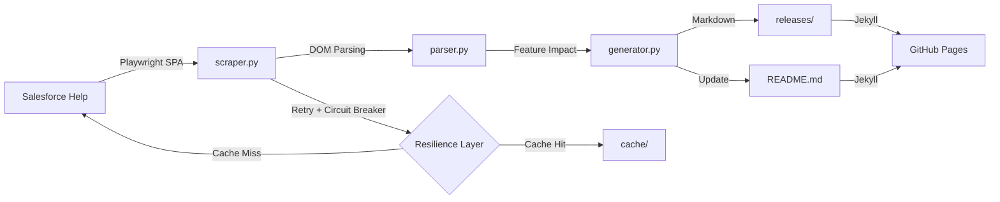

<div align="center">


</div>

# 🚀 Salesforce Release Notes Intelligence

Automated pipeline for extraction, classificação e versionamento das **Salesforce Release Notes** como artefatos Markdown estruturados (*Knowledge-as-Code*).

### ⚙️ CI/CD Status & Conformidade

<!-- RELEASE_BADGE -->

[](https://github.com/Fatal1tyBarucco/Salesforce-WebDev/actions/workflows/python-quality.yml)
[](https://github.com/Fatal1tyBarucco/Salesforce-WebDev/actions/workflows/release_notes_pipeline.yml)


| Technology / Tool | Description | Pipeline Status |
| :--- | :--- | :---: |
| 🐍 **Python 3.14** | Ambiente de execução principal | `Conforme` |
| 🎭 **Playwright** | Scraper Headless para aplicações SPA do Salesforce Help | `Ativo` |
| 🧪 **Pytest** | Suíte de testes unitários automatizados | `450+ testes` |
| 🔍 **Mypy** | Verificação estática de tipos com modo estrito | `Strict` |
| ⚡ **Ruff & Black** | Linter e formatação estrita de código (line-length = 100) | `Conforme` |
| 📦 **uv** | Gerenciamento de dependências com lock file determinístico | `Ativo` |

---

## 📖 Overview

Este repositório contém um pipeline ETL assíncrono para scraping das *Salesforce Release Notes*, processamento local para classificação e sumarização, e geração de documentação estática via **MkDocs**.

## 🏗️ System Architecture


```mermaid
flowchart LR
    A[Salesforce Help] -->|Playwright SPA| B[scraper.py]
    B -->|DOM Parsing| C[parser.py]
    C -->|Feature Impact| D[generator.py]
    D -->|Markdown| E[releases/]
    D -->|Update| F[README.md]
    E -->|Jekyll| G[GitHub Pages]
    F -->|Jekyll| G

    B -->|Retry + Circuit Breaker| H{Resilience Layer}
    H -->|Cache Hit| I[cache/]
    H -->|Cache Miss| A
```

**Princípios de Design:**
* **Separação de Conceitos (SoC):** Camadas isoladas para rede (`scraper.py`), parsing (`parser.py`), geração (`generator.py`)
* **I/O Não Bloqueante:** `asyncio` + Playwright async para processamento paralelo
* **Resiliência:** Circuit Breaker + Token-bucket rate limiter + Exponential backoff com jitter

## ⚙️ Pré-requisitos e Instalação

Este projeto utiliza `uv` para gerenciamento determinístico de dependências.

```bash
# Instale o uv
curl -LsSf https://astral.sh/uv/install.sh | sh

# Clone e instale
git clone https://github.com/Fatal1tyBarucco/Salesforce-WebDev.git
cd Salesforce-WebDev
uv sync

# Instale browsers do Playwright
uv run playwright install chromium
```

## 🚀 Uso e Execução

```bash
# Executar pipeline completo
uv run python -m src.main

# Executar release específica
uv run python -m src.main --release summer_26

# Dry run (sem escrever arquivos)
uv run python -m src.main --dry-run
```

## 🛡️ Governança e Resiliência

| Componente | Configuração | Description |
| :--- | :--- | :--- |
| **Rate Limiter** | 2 req/s, token-bucket | Evita throttling do Salesforce |
| **Circuit Breaker** | 3 falhas → cooldown 60s | Para requisições após falhas consecutivas |
| **Cache TTL** | 24 horas | Previne refetch de conteúdo não alterado |
| **Exponential Backoff** | Base 2s + jitter | Retry inteligente com anti-thundering-herd |

## 🧪 Testes e Qualidade

```bash
# Executar testes
uv run pytest tests/

# Com cobertura
uv run pytest tests/ --cov=src --cov-report=term-missing

# Quality gate (ordem CI)
uv run ruff check src/
uv run black --check src/
uv run mypy src/
```

**Meta:** Cobertura >99%, zero erros de tipo, zero warnings de lint.

---


## 📋 Available Releases

<div style="padding:12px;margin-bottom:20px;border:1px solid #d0d7de;border-radius:6px;background:#f6f8fa;text-align:center;"><strong>🌐 Language / Idioma:</strong> <strong>🇺🇸 English</strong> | <a href="./README.md">🇧🇷 Português</a></div>
### ❄️ Winter '27

> 📊 **Executive Summary:** A release Winter '27 representa uma expansão significativa do ecossistema Salesforce com **1123 novos recursos** distribuídos em **19 categorias**. As áreas com maior volume de inovação são Setores, Experience Cloud e Serviço. Esta release consolida investimentos em inteligência artificial, experiência do desenvolvedor e conformidade regulatória.


> 📌 **Key Themes:** AI & Agentforce • Data & Analytics • Experiência do Usuário


> 🎯 **Strategic Impact:** Para as empresas, Winter '27 entrega valor em múltiplas frentes. A automação avançada reduz tarefas manuais, enquanto as melhorias em experiência do usuário aumentam a adoção. As 1123 novas capacidades habilitam cenários que antes exigiam customização significativa, reduzindo o custo total de propriedade.

<details>
<summary><b>📄 Salesforce General (28 features)</b></summary>

> Salesforce geral conta com 28 novos recursos nesta release. Destaques: IA Agentforce e agente, Aprenda sobre novos recursos e aprimoramentos que afetam sua experiência geral do Salesforce., Melhorias gerais, Conclua migrações pendentes do Cloudflare para redes de entrega de conteúdo (CDN), Ative a CDN para todos os recursos estáticos do aplicativo Lightning.


> 📄 Full details: [./releases/winter_27/en_US/salesforce_geral.md](./releases/winter_27/en_US/salesforce_geral.md)

</details>

<details>
<summary><b>📄 Data Analysis (26 features)</b></summary>

> Análise de dados conta com 26 novos recursos nesta release. Destaques: Tableau Next, Próximos destaques do Tableau, Relatórios e painéis, Visualizar registros de relatórios do Lightning sem perder contexto (beta), Integre painéis do Lightning em seus sites do Lightning Web Runtime Experience Cloud (beta).


> 📄 Full details: [./releases/winter_27/en_US/analise_de_dados.md](./releases/winter_27/en_US/analise_de_dados.md)

</details>

<details>
<summary><b>📄 Automation (72 features)</b></summary>

> Automação conta com 72 novos recursos nesta release. Destaques: Flow Builder, Atualizações do Flow Builder, Criador de fluxo de experiências no tema moderno do Salesforce Cosmos, Ver mais do seu fluxo com uma tela mais densa, Acompanhe alterações de fluxo ao longo do tempo com o histórico de edição.


> 📄 Full details: [./releases/winter_27/en_US/automacao.md](./releases/winter_27/en_US/automacao.md)

</details>

<details>
<summary><b>📄 Data 360 (7 features)</b></summary>

> Data 360 conta com 7 novos recursos nesta release. Destaques: Implementação, Processar e enriquecer, Migrar para a linha do tempo de engajamento do Data 360, Linha do tempo do engajamento do Data 360, Expanda a compatibilidade de tipo de campo para aprimoramentos de campo de cópia.


> 📄 Full details: [./releases/winter_27/en_US/data_360.md](./releases/winter_27/en_US/data_360.md)

</details>

<details>
<summary><b>📄 Experience Cloud (143 features)</b></summary>

> Experience Cloud conta com 143 novos recursos nesta release. Destaques: Sites do Aura e do LWR, A Entrega da experiência (Beta) foi descontinuada, Adicione vários processos de aprovação de fluxo a um registro com o componente Solicitar aprovações no Criador de experiências, Abra o próximo item de trabalho na mesma execução de orquestração no Criador de experiências, Iniciar um painel nativo do Agentforce em aplicativos Mobile Publisher.


> 📄 Full details: [./releases/winter_27/en_US/experience_cloud.md](./releases/winter_27/en_US/experience_cloud.md)

</details>

<details>
<summary><b>📄 Field Service (37 features)</b></summary>

> Field Service conta com 37 novos recursos nesta release. Destaques: 360 autônomo, Notas do patch do Field Service, Notas de patch mensais do Field Service Desktop, Notas de patch mensais do Field Service Mobile, Engajamento do cliente do Field Service.


> 📄 Full details: [./releases/winter_27/en_US/field_service.md](./releases/winter_27/en_US/field_service.md)

</details>

<details>
<summary><b>📄 Hyperforce (5 features)</b></summary>

> Hyperforce conta com 5 novos recursos nesta release. Destaques: Acessar o Salesforce em mais regiões com o Hyperforce, Hyperforce está chegando ao Google Cloud Platform (GCP), Gerenciar opções de rede do Salesforce Edge em Configuração, Adicionar automação e integração com o MuleSoft no Government Cloud, Criação rápida de sandbox e clonagem rápida disponíveis para Government Cloud.


> 📄 Full details: [./releases/winter_27/en_US/hyperforce.md](./releases/winter_27/en_US/hyperforce.md)

</details>

<details>
<summary><b>📄 Industries (286 features)</b></summary>

> Setores conta com 286 novos recursos nesta release. Destaques: Agentforce para Automotivo, Criar agentes para Automotive no novo Agentforce Builder, Ajude os clientes a comprar veículos com o agente do Concierge de vendas em seu site, Gerenciando a reposição automotiva, Monitorar a inadimplência com visualizações de registro consolidado e alertas de recomendação.


> 📄 Full details: [./releases/winter_27/en_US/setores.md](./releases/winter_27/en_US/setores.md)

</details>

<details>
<summary><b>📄 Marketing (1 features)</b></summary>

> Marketing conta com 1 novos recursos nesta release. Destaques: Marketing Cloud.


> 📄 Full details: [./releases/winter_27/en_US/marketing.md](./releases/winter_27/en_US/marketing.md)

</details>

<details>
<summary><b>📄 MuleSoft (1 features)</b></summary>

> MuleSoft conta com 1 novos recursos nesta release. Destaques: Inteligência de integração do MuleSoft.


> 📄 Full details: [./releases/winter_27/en_US/mulesoft.md](./releases/winter_27/en_US/mulesoft.md)

</details>

<details>
<summary><b>📄 Partner Cloud (38 features)</b></summary>

> Partner Cloud conta com 38 novos recursos nesta release. Destaques: Setor público, Gerenciar fundos de desenvolvimento de marketing com Agentforce Partner Success Agent, Automatizar o gerenciamento de objetivos e vincular registros para planos de negócios conjuntos, Descubra e inscreva-se em campanhas do fornecedor no Mercado de campanhas, Rastrear a atividade do parceiro em interações com o cliente.


> 📄 Full details: [./releases/winter_27/en_US/partner_cloud.md](./releases/winter_27/en_US/partner_cloud.md)

</details>

<details>
<summary><b>📄 Revenue Management (123 features)</b></summary>

> Gerenciamento de receita conta com 123 novos recursos nesta release. Destaques: Simplifique a descoberta e a configuração de recursos do Revenue Cloud, Orquestrar cenários de pedido de alta tecnologia usando um modelo predefinido, Configurar recursos de faturamento mais rapidamente, Promoções no gerenciamento de receita, Aumente as vendas com promoções no gerenciamento de receita.


> 📄 Full details: [./releases/winter_27/en_US/gerenciamento_de_receita.md](./releases/winter_27/en_US/gerenciamento_de_receita.md)

</details>

<details>
<summary><b>📄 Sales (44 features)</b></summary>

> Vendas conta com 44 novos recursos nesta release. Destaques: Salesforce CMS, Agentes de IA para vendas, Em prospecção do Agentforce, Automatizar quando seu agente de prospecção é executado, Priorizar clientes potenciais com engajamentos recentes.


> 📄 Full details: [./releases/winter_27/en_US/vendas.md](./releases/winter_27/en_US/vendas.md)

</details>

<details>
<summary><b>📄 Salesforce Slack Integrations (7 features)</b></summary>

> Integrações do Salesforce para Slack conta com 7 novos recursos nesta release. Destaques: Use o Slack e o Salesforce juntos para se conectar com os clientes, rastrear o progresso, colaborar perfeitamente e proporcionar sucesso de equipe em qualquer lugar., Venda de modo mais inteligente no Slack: Vendas da Agentforce e a nova página Go, Pacotes do Salesforce, Envie emails para suas listas de Contato e Lead imediatamente com a experiência remodelada de Envios de lista., Ignorar a espera ao enviar emails para listas de contatos e leads no Salesforce Suites.


> 📄 Full details: [./releases/winter_27/en_US/integracoes_do_salesforce_para_slack.md](./releases/winter_27/en_US/integracoes_do_salesforce_para_slack.md)

</details>

<details>
<summary><b>📄 Security, Identity & Privacy (25 features)</b></summary>

> Segurança, identidade e privacidade conta com 25 novos recursos nesta release. Destaques: Aprimoramentos de segurança, Revisar e cumprir os próximos requisitos de segurança, Explorar recursos compatíveis com MFA e segurança de email, Fazer backup e recuperar em seguida, Baixar metadados do instantâneo de backup.


> 📄 Full details: [./releases/winter_27/en_US/seguranca_identidade_e_privacidade.md](./releases/winter_27/en_US/seguranca_identidade_e_privacidade.md)

</details>

<details>
<summary><b>📄 Service (140 features)</b></summary>

> Serviço conta com 140 novos recursos nesta release. Destaques: Central de contato, Centro de conexão do Agentforce, Workforce Engagement Management, Central de contato do parceiro, Usar a configuração com Agentforce para gerenciar usuários da Central de contato.


> 📄 Full details: [./releases/winter_27/en_US/servico.md](./releases/winter_27/en_US/servico.md)

</details>

<details>
<summary><b>📄 Legal Documentation (8 features)</b></summary>

> Documentação legal conta com 8 novos recursos nesta release. Destaques: Você está aqui:, AJUDA DO SALESFORCE, DOCUMENTAÇÃO, NOTAS DA VERSÃO DO SALESFORCE, Como e quando os recursos ficam disponíveis?.


> 📄 Full details: [./releases/winter_27/en_US/documentacao_legal.md](./releases/winter_27/en_US/documentacao_legal.md)

</details>

<details>
<summary><b>📄 OmniStudio (3 features)</b></summary>

> OmniStudio conta com 3 novos recursos nesta release. Destaques: Reutilizar a lógica de fluxo iniciada automaticamente em seus FlexCards (disponível ao público em geral), Executar FlexCards e OmniScripts offline em dispositivos móveis, Versões secundárias do OmniStudio.


> 📄 Full details: [./releases/winter_27/en_US/omnistudio.md](./releases/winter_27/en_US/omnistudio.md)

</details>

<details>
<summary><b>📄 Agentforce (129 features)</b></summary>

> Agentforce conta com 129 novos recursos nesta release. Destaques: Crie conteúdo pronto para campanha mais rapidamente com o Agentforce Content Agent, Campanhas e fluxos, Automatizar tarefas de acompanhamento com ações de conclusão de marketing, Manter guias nas métricas de desempenho e conteúdo da campanha, Usar modelos de fluxo personalizados de uma campanha.


> 📄 Full details: [./releases/winter_27/en_US/agentforce.md](./releases/winter_27/en_US/agentforce.md)

</details>


<details>
<summary><h3>☀️ Summer '26</h3></summary>

> 📊 **Executive Summary:** A release Summer '26 representa uma expansão significativa do ecossistema Salesforce com **1337 novos recursos** distribuídos em **22 categorias**. As áreas com maior volume de inovação são Setores, Serviço e Desenvolvimento. Esta release consolida investimentos em inteligência artificial, experiência do desenvolvedor e conformidade regulatória.


> 📌 **Key Themes:** AI & Agentforce • Data & Analytics • Experiência do Usuário


> 🎯 **Strategic Impact:** Para as empresas, Summer '26 entrega valor em múltiplas frentes. A automação avançada reduz tarefas manuais, enquanto as melhorias em experiência do usuário aumentam a adoção. As 1337 novas capacidades habilitam cenários que antes exigiam customização significativa, reduzindo o custo total de propriedade.

<details>
<summary><b>📄 Legal Documentation (6 features)</b></summary>

> Documentação legal conta com 6 novos recursos nesta release. Destaques: Você está aqui:, AJUDA DO SALESFORCE, DOCUMENTAÇÃO, NOTAS DA VERSÃO DO SALESFORCE, Como e quando os recursos ficam disponíveis?.


> 📄 Full details: [./releases/summer_26/en_US/documentacao_legal.md](./releases/summer_26/en_US/documentacao_legal.md)

</details>

<details>
<summary><b>📄 Salesforce General (36 features)</b></summary>

> Salesforce geral conta com 36 novos recursos nesta release. Destaques: Melhorias gerais, Gire seus certificados com mais frequência — _admins_, Validar informações de domínio com mais frequência — _admins_, Atualizar seus certificados mTLS — _admins_, Preparar-se para IPv6 — _admins_.


> 📄 Full details: [./releases/summer_26/en_US/salesforce_geral.md](./releases/summer_26/en_US/salesforce_geral.md)

</details>

<details>
<summary><b>📄 Agentforce (37 features)</b></summary>

> 📄 Full details: [./releases/summer_26/en_US/agentforce.md](./releases/summer_26/en_US/agentforce.md)

</details>

<details>
<summary><b>📄 Data Analysis (58 features)</b></summary>

> Análise de dados conta com 58 novos recursos nesta release. Destaques: Tableau Next, Próximos recursos do Tableau lançados por mês (usuários) — _usuários_, Acelere a criação de Next Ativo do Tableau com modelos de mercado (usuários) — _usuários_, Configuração e administração, Obtenha visibilidade das interações com o usuário com a Próxima auditoria do Tableau (beta) (config) — _config_.


> 📄 Full details: [./releases/summer_26/en_US/analise_de_dados.md](./releases/summer_26/en_US/analise_de_dados.md)

</details>

<details>
<summary><b>📄 Automation (118 features)</b></summary>

> Automação conta com 118 novos recursos nesta release. Destaques: Recursos de automação lançados por mês, Flow Builder, Atualizações do Flow Builder, Criar e usar agentes Agentforce diretamente no Flow Builder — _usuários_, Melhorar o desempenho com lote para fluxos agendados — _usuários_.


> 📄 Full details: [./releases/summer_26/en_US/automacao.md](./releases/summer_26/en_US/automacao.md)

</details>

<details>
<summary><b>📄 OmniStudio (9 features)</b></summary>

> OmniStudio conta com 9 novos recursos nesta release. Destaques: Otimizar a consistência da implementação com controle de versão do Data Mapper — _usuários_, Alternar entre designers e tempos de execução de pacote padrão e gerenciado na mesma organização — _usuários_, Migrar para o tempo de execução padrão do OmniStudio usando o Assistente de migração do OmniStudio — _usuários_, Acelere o desenvolvimento do FlexCard com o OmniStudio MCP (beta) — _contato_, Chamar fluxos iniciados automaticamente em FlexCards do OmniStudio (piloto) — _contato_.


> 📄 Full details: [./releases/summer_26/en_US/omnistudio.md](./releases/summer_26/en_US/omnistudio.md)

</details>

<details>
<summary><b>📄 Customization (33 features)</b></summary>

> Personalização conta com 33 novos recursos nesta release. Destaques: Recursos de personalização lançados por mês, AgentExchange, Explorar soluções com servidores MCP no AgentExchange — _admins_, Adicione servidores MCP do registro Agentforce por meio de uma experiência integrada do AgentExchange — _admins_, Avaliar ativos do agente rapidamente com a página de detalhes aprimorada — _admins_.


> 📄 Full details: [./releases/summer_26/en_US/personalizacao.md](./releases/summer_26/en_US/personalizacao.md)

</details>

<details>
<summary><b>📄 Data 360 (72 features)</b></summary>

> Data 360 conta com 72 novos recursos nesta release. Destaques: Introdução ao Data Cloud, Expanda seu Knowledge do Data 360 com orientação no aplicativo (beta) — _admins_, Planejar estratégia de dados, Migrar metadados de governança do Data 360 do sandbox para produção — _admins_, Dados do Connect.


> 📄 Full details: [./releases/summer_26/en_US/data_360.md](./releases/summer_26/en_US/data_360.md)

</details>

<details>
<summary><b>📄 Development (127 features)</b></summary>

> Desenvolvimento conta com 127 novos recursos nesta release. Destaques: Componentes do Lightning, Obtenha as alterações mais recentes do LWC com a API versão 67.0 do LWC, Elementos de detalhes do grupo com o nome Atributo — _admins_, Melhorar o desempenho de recarregamento de módulo hot — _admins_, O desenvolvedor local agora é a visualização ativa — _usuários_.


> 📄 Full details: [./releases/summer_26/en_US/desenvolvimento.md](./releases/summer_26/en_US/desenvolvimento.md)

</details>

<details>
<summary><b>📄 Experience Cloud (14 features)</b></summary>

> Experience Cloud conta com 14 novos recursos nesta release. Destaques: Sites do Aura e do LWR, Configurar experiências de autoatendimento assistido por IA em sites do Aura e do LWR — _admins_, Habilite o Chatter para recursos dependentes do Chatter em sites do Aura e do LWR em novas organizações — _admins_, Mantenha páginas privadas do LWR indisponíveis até que a configuração ou redefinição de senha seja concluída — _admins_, Verificar arquivos para malware no Salesforce Files (disponível ao público em geral) — _admins_.


> 📄 Full details: [./releases/summer_26/en_US/experience_cloud.md](./releases/summer_26/en_US/experience_cloud.md)

</details>

<details>
<summary><b>📄 Field Service (48 features)</b></summary>

> Field Service conta com 48 novos recursos nesta release. Destaques: Notas de versão mensal do Field Service, Notas do patch do Field Service, Notas de patch mensais do desktop, Notas de patch mensais móveis, Agentforce para Field Service.


> 📄 Full details: [./releases/summer_26/en_US/field_service.md](./releases/summer_26/en_US/field_service.md)

</details>

<details>
<summary><b>📄 Hyperforce (3 features)</b></summary>

> Hyperforce conta com 3 novos recursos nesta release. Destaques: Acessar o Salesforce em mais regiões com o Hyperforce — _config_, Novos produtos e recursos disponíveis na Defesa do Government Cloud — _config_, A continuidade avançada entre regiões alcança objetivos de recuperação mais rápidos — _contato_.


> 📄 Full details: [./releases/summer_26/en_US/hyperforce.md](./releases/summer_26/en_US/hyperforce.md)

</details>

<details>
<summary><b>📄 Industries (309 features)</b></summary>

> Setores conta com 309 novos recursos nesta release. Destaques: Gerenciamento de ativos, Simplificar a descoberta e a configuração de recursos do Gerenciamento de ciclo de vida do ativo — _config_, Otimização de planilhas de horas e custos trabalhistas, Editar e excluir planilhas usando o Agentforce — _config_, Gerenciar planilhas de horários da equipe no campo — _config_.


> 📄 Full details: [./releases/summer_26/en_US/setores.md](./releases/summer_26/en_US/setores.md)

</details>

<details>
<summary><b>📄 Marketing (64 features)</b></summary>

> Marketing conta com 64 novos recursos nesta release. Destaques: Marketing Cloud Next, Criar e expandir seu público — _usuários_, Criar e projetar conteúdo com facilidade — _usuários_, Criar e gerenciar campanhas efetivas, Carregar modelos de DLT para enviar mensagens SMS na Índia.


> 📄 Full details: [./releases/summer_26/en_US/marketing.md](./releases/summer_26/en_US/marketing.md)

</details>

<details>
<summary><b>📄 MuleSoft (8 features)</b></summary>

> MuleSoft conta com 8 novos recursos nesta release. Destaques: Catálogo de API para Salesforce, Mapear seus agentes para ferramentas do servidor MCP — _admins_, Mapear modelos de prompts para ferramentas do servidor MCP — _admins_, Adicionar anotações a ferramentas do servidor MCP — _admins_, Trazer servidores MCP do MuleSoft para o catálogo de API (disponível ao público em geral) — _admins_.


> 📄 Full details: [./releases/summer_26/en_US/mulesoft.md](./releases/summer_26/en_US/mulesoft.md)

</details>

<details>
<summary><b>📄 Mobile App (17 features)</b></summary>

> Aplicativo móvel conta com 17 novos recursos nesta release. Destaques: Recursos móveis lançados por mês, Aplicativo Salesforce móvel, Tudo o que há de novo no aplicativo Salesforce móvel, Conclua tarefas diretamente de notificações telefônicas personalizadas (disponível ao público em geral), Personalizar sua página inicial do aplicativo móvel (beta).


> 📄 Full details: [./releases/summer_26/en_US/aplicativo_movel.md](./releases/summer_26/en_US/aplicativo_movel.md)

</details>

<details>
<summary><b>📄 Partner Cloud (1 features)</b></summary>

> Partner Cloud conta com 1 novos recursos nesta release. Destaques: Configurar emails com marca combinada para parceiros no Salesforce Go — _config_.


> 📄 Full details: [./releases/summer_26/en_US/partner_cloud.md](./releases/summer_26/en_US/partner_cloud.md)

</details>

<details>
<summary><b>📄 Revenue Management (97 features)</b></summary>

> Gerenciamento de receita conta com 97 novos recursos nesta release. Destaques: Experiência de configuração aprimorada com o Salesforce Go, Simplifique a coleta de receita com a Solução de orquestração Dunning — _admins_, Descubra mais recursos de gerenciamento de receita — _admins_, Gerenciamento de catálogo de produtos, Crie transações mais rapidamente com a Descoberta baseada em regra — _usuários_.


> 📄 Full details: [./releases/summer_26/en_US/gerenciamento_de_receita.md](./releases/summer_26/en_US/gerenciamento_de_receita.md)

</details>

<details>
<summary><b>📄 Sales (58 features)</b></summary>

> Vendas conta com 58 novos recursos nesta release. Destaques: Agentes de vendas de IA, Engajamento do Agentforce, Aumentar a conversão de clientes potenciais com a disponibilidade de calendário de grupo — _config_, Alterar o comportamento do agente de fomento de lead e geração de lead de entrada mais rapidamente — _admins_, Continuar engajamento de lead com transferência de agente — _config_.


> 📄 Full details: [./releases/summer_26/en_US/vendas.md](./releases/summer_26/en_US/vendas.md)

</details>

<details>
<summary><b>📄 Salesforce Slack Integrations (2 features)</b></summary>

> Integrações do Salesforce para Slack conta com 2 novos recursos nesta release. Destaques: Desfrute da colaboração habilitada pelo Slack em novas organizações do Salesforce — _usuários_, Acessar canais do Salesforce no painel do Slack — _admins_.


> 📄 Full details: [./releases/summer_26/en_US/integracoes_do_salesforce_para_slack.md](./releases/summer_26/en_US/integracoes_do_salesforce_para_slack.md)

</details>

<details>
<summary><b>📄 Security, Identity & Privacy (58 features)</b></summary>

> Segurança, identidade e privacidade conta com 58 novos recursos nesta release. Destaques: Aprimoramentos de segurança, Revisar e cumprir os requisitos de segurança novos e futuros — _admins_, Evite interrupção de email com atualizações automáticas de junho — _admins_, Encontre conteúdo de segurança do administrador para a plataforma em um só lugar — _usuários_, Adicionar um contato de segurança para alertas de incidente — _admins_.


> 📄 Full details: [./releases/summer_26/en_US/seguranca_identidade_e_privacidade.md](./releases/summer_26/en_US/seguranca_identidade_e_privacidade.md)

</details>

<details>
<summary><b>📄 Service (198 features)</b></summary>

> Serviço conta com 198 novos recursos nesta release. Destaques: Notas de versão mensal do serviço, Centro de conexão do Agentforce, Transfira suas conversas do agente do Agentforce do Salesforce Voice para um representante de serviço nas centrais de contato do Agentforce — _usuários_, Melhore a experiência do representante evitando chamadas antes que os representantes estejam prontos — _config_, Fornecer um serviço melhor com retornos de chamada agendados flexíveis — _config_.


> 📄 Full details: [./releases/summer_26/en_US/servico.md](./releases/summer_26/en_US/servico.md)

</details>

</details>


<details>
<summary><h3>🌸 Spring '26</h3></summary>

> 📊 **Executive Summary:** The Salesforce Spring '26 release delivers an impressive set of 1,438 new features and enhancements across 21 categories, consolidating the platform as a benchmark for innovation in CRM and business automation. The central highlight is the evolution of Agentforce, now generally available with Agentforce Builder, enabling the creation of more complex and sophisticated AI agents. The Service category leads in volume with 167 features, transforming Service Cloud into Agentforce Service with new contact center capabilities, voice, messaging, and IT service management. The Mobile App follows with 187 features, ensuring teams can operate with full functionality on mobile devices. Automation offers 151 features including significant advances in Flow Builder, with AI-powered flow generation now generally available, improved flow orchestration, and new prompt batch processing capabilities. Industries bring the largest volume of sector-specific innovations with 194 features, spanning automotive, finance, healthcare, and utilities. Revenue Management presents 131 features for CPQ and billing optimization. In Sales, with 85 features, Sales Cloud transforms into Agentforce Sales, introducing autonomous lead generation, AI qualification, and automated lead nurturing. The platform also advances in Security, Identity & Privacy with 61 features, including new connected app policies, passwordless login with passkeys, and Salesforce Shield enhancements. Data Analysis with 54 features and Data 360 with 53 features expand insights and data management capabilities. Development with 97 features offers new developer tools, including custom Lightning Types for Agentforce. With 72 features, Marketing enhances campaigns and engagement. Experience Cloud (21 features), MuleSoft (8 features), OmniStudio (10 features), and Partner Cloud (4 features) round out the release with ecosystem improvements. Customization (18 features) and Hyperforce (5 features) complete the comprehensive platform updates, while Legal Documentation (6 features) and Salesforce General (38 features) provide essential updates.


> 📌 **Key Themes:** Agentforce GA • AI-First Service • Industry-Specific Solutions • Developer Productivity • Data Unification


> 🎯 **Strategic Impact:** The Spring '26 release represents a significant milestone in Agentforce maturation, with the platform becoming generally available for production use. The 167 features in Service and 85 in Sales enable organizations to deploy AI agents across customer-facing operations, reducing response time and increasing productivity. Industries solutions with 194 features accelerate time-to-value for vertical implementations.


> ⚠️ **Migration Notes:** Organizations using legacy chat and Outlook sync should plan migration to Agentforce Voice and modern connectors. Salesforce Functions users should transition to Hyperforce. Data Cloud instances should be renamed to Data 360 via the migration tool.

<details>
<summary><b>📄 Legal Documentation (6 features)</b></summary>

> The Legal Documentation category in Spring '26 contains 6 features dedicated to updates of terms, policies, and legal compliance of the Salesforce platform. These features ensure that organizations stay aligned with the latest regulatory requirements and contractual changes, including updates to terms of service, privacy policies, and compliance documentation. It is essential that administrators and legal teams review these features to maintain organizational compliance.


> 📄 Full details: [./releases/spring_26/en_US/documentacao_legal.md](./releases/spring_26/en_US/documentacao_legal.md)

</details>

<details>
<summary><b>📄 Salesforce General (38 features)</b></summary>

> The Salesforce General category brings together 38 features that encompass cross-cutting changes to the Salesforce platform. These include general improvements to user experience, infrastructure updates, and enhancements affecting multiple products and clouds. Resources such as changes to the Lightning Experience interface, API updates, and performance improvements are included, providing a more solid foundation for all Salesforce implementations.


> 📄 Full details: [./releases/spring_26/en_US/salesforce_geral.md](./releases/spring_26/en_US/salesforce_geral.md)

</details>

<details>
<summary><b>📄 Agentforce (35 features)</b></summary>

> Agentforce receives 35 features in Spring '26, with a highlight on the general availability of Agentforce Builder. Main novelties include: audio-to-text conversion action, improved web search with allowed domains, enhanced screen visualization (beta) for faster creation of complex agents, improved Chat v2 connection, creation of employee agents, RAG metrics for AI performance evaluation, SIP-based voice call forwarding, agent optimization with Voice session playback, and support for models like NVIDIA Nemotron 3 Nano 30B (beta). The category also includes the evolution of Prompt Builder with improved batch processing and support for anthropic models.


> 📄 Full details: [./releases/spring_26/en_US/agentforce.md](./releases/spring_26/en_US/agentforce.md)

</details>

<details>
<summary><b>📄 Data Analysis (54 features)</b></summary>

> Data Analysis counts 54 features in Spring '26, significantly expanding business intelligence and insights capabilities. The features span improvements in reports, dashboards, and analytical tools that allow organizations to extract deeper insights from their data. Improvements in data visualization, integration with external sources, and predictive analysis capabilities are included, empowering teams to make data-driven decisions with greater agility and precision.


> 📄 Full details: [./releases/spring_26/en_US/analise_de_dados.md](./releases/spring_26/en_US/analise_de_dados.md)

</details>

<details>
<summary><b>📄 Automation (151 features)</b></summary>

> Automation is one of the most robust categories with 151 features. Flow Builder received significant enhancements, including AI-powered flow generation now generally available, iterative flow evolution with Agentforce, and simplified interface with collapsible branching elements. Highlights include: data tables with sorting and inline editing, Kanban panels in screen flows (beta), native file visualization, integration with Marketing Cloud for email automation, segment-triggered flows with enhanced scheduling, path experiences with comparative analysis, flow approval processes with new debugging capabilities, and flow orchestration in the Lightning Automation app.


> 📄 Full details: [./releases/spring_26/en_US/automacao.md](./releases/spring_26/en_US/automacao.md)

</details>

<details>
<summary><b>📄 Customization (18 features)</b></summary>

> The Customization category offers 18 features focused on adapting the Salesforce platform to each organization's specific needs. The features enable greater flexibility in configuring layouts, fields, processes, and user experiences, ensuring each implementation can be tailored to meet unique business requirements. Improvements in flex pages, record pages, and customizable Lightning components are included.


> 📄 Full details: [./releases/spring_26/en_US/personalizacao.md](./releases/spring_26/en_US/personalizacao.md)

</details>

<details>
<summary><b>📄 Data 360 (53 features)</b></summary>

> Data 360 presents 53 features that expand data management and integration capabilities. Features include enhancements in connectivity between data sources, data quality, governance, and real-time processing capabilities. Highlights include Data 360 flows with specific license support and higher rate limits, asynchronous streaming flows for mass notifications, and enhanced real-time data tracking with custom charts.


> 📄 Full details: [./releases/spring_26/en_US/data_360.md](./releases/spring_26/en_US/data_360.md)

</details>

<details>
<summary><b>📄 Development (97 features)</b></summary>

> The Development category brings together 97 features for Salesforce developers. The highlight is the new Lightning Types MCP tool (Developer Preview) to accelerate custom Lightning types creation for Agentforce. Features span enhancements in Apex, APIs, debugging tools, testing and deployment, and new extension and integration capabilities. Developers can expect significant productivity improvements and programmatic customization capabilities.


> 📄 Full details: [./releases/spring_26/en_US/desenvolvimento.md](./releases/spring_26/en_US/desenvolvimento.md)

</details>

<details>
<summary><b>📄 Experience Cloud (21 features)</b></summary>

> Experience Cloud counts 21 features in Spring '26, focused on enhancing the creation and management of portals, sites, and digital communities. Features include user experience improvements, theme and template customization, performance enhancements, and new engagement capabilities, enabling organizations to create richer and more interactive digital experiences for customers, partners, and employees.


> 📄 Full details: [./releases/spring_26/en_US/experience_cloud.md](./releases/spring_26/en_US/experience_cloud.md)

</details>

<details>
<summary><b>📄 Field Service (41 features)</b></summary>

> Field Service receives 41 features that enhance field service management. Features include improvements in scheduling and dispatch optimization, enhanced mobile capabilities for field technicians, IoT integration for predictive maintenance, and parts inventory management enhancements. The category also includes new AI assistance capabilities for diagnostics and problem resolution in the field.


> 📄 Full details: [./releases/spring_26/en_US/field_service.md](./releases/spring_26/en_US/field_service.md)

</details>

<details>
<summary><b>📄 Hyperforce (5 features)</b></summary>

> Hyperforce presents 5 features focused on next-generation cloud infrastructure. Features include enhancements in scalability, performance, and platform availability, enabling organizations to run Salesforce workloads on public cloud infrastructure with greater flexibility and operational efficiency.


> 📄 Full details: [./releases/spring_26/en_US/hyperforce.md](./releases/spring_26/en_US/hyperforce.md)

</details>

<details>
<summary><b>📄 Industries (194 features)</b></summary>

> The Industries category leads in volume with 194 features, offering specialized solutions for specific industries. It spans Automotive (with Agentforce for Automotive, automotive finance, and fleet management), Healthcare, Financial Services, Manufacturing, Retail, and Utilities. Highlights include Agentforce for specific industries, enhanced inventory management, timesheets with cost optimization, and AI-powered upsell and cross-sell solutions. The category ensures organizations in any industry can leverage customized and relevant capabilities.


> 📄 Full details: [./releases/spring_26/en_US/setores.md](./releases/spring_26/en_US/setores.md)

</details>

<details>
<summary><b>📄 Mobile App (187 features)</b></summary>

> The Mobile App is one of the largest categories with 187 features, ensuring teams can operate with full functionality on mobile devices. Features include mobile user experience improvements, new offline capabilities, enhanced integration with AI functionalities, and performance improvements. The category ensures that salespeople, service agents, and managers can access all critical functionalities directly from their mobile devices.


> 📄 Full details: [./releases/spring_26/en_US/aplicativo_movel.md](./releases/spring_26/en_US/aplicativo_movel.md)

</details>

<details>
<summary><b>📄 Marketing (72 features)</b></summary>

> Marketing counts 72 features that enhance campaigns, engagement, and marketing automation. Features include improved integration with Flow Builder for email automation, more sophisticated segmentation capabilities, customer journey enhancements, and new campaign analytics tools. The category also includes integration improvements between Marketing Cloud and other Salesforce clouds for a unified customer view.


> 📄 Full details: [./releases/spring_26/en_US/marketing.md](./releases/spring_26/en_US/marketing.md)

</details>

<details>
<summary><b>📄 MuleSoft (8 features)</b></summary>

> MuleSoft presents 8 features focused on integration and connectivity. Features enhance API integration capabilities, workflow automation between systems, and connectivity with external applications, enabling organizations to integrate the Salesforce ecosystem with other platforms more efficiently and at scale.


> 📄 Full details: [./releases/spring_26/en_US/mulesoft.md](./releases/spring_26/en_US/mulesoft.md)

</details>

<details>
<summary><b>📄 OmniStudio (10 features)</b></summary>

> OmniStudio counts 10 features that enhance configuration and digital process automation capabilities. Features include improvements in flex cards, OmniScripts, and DataRaptors, enabling the creation of richer digital experiences and more efficient business processes without custom code.


> 📄 Full details: [./releases/spring_26/en_US/omnistudio.md](./releases/spring_26/en_US/omnistudio.md)

</details>

<details>
<summary><b>📄 Partner Cloud (4 features)</b></summary>

> Partner Cloud presents 4 features focused on partner ecosystems. Features enhance partner management capabilities, data sharing, and ecosystem collaboration, facilitating the creation and maintenance of more efficient and integrated partner networks.


> 📄 Full details: [./releases/spring_26/en_US/partner_cloud.md](./releases/spring_26/en_US/partner_cloud.md)

</details>

<details>
<summary><b>📄 Revenue Management (131 features)</b></summary>

> Revenue Management offers 131 features for optimizing CPQ (Configure, Price, Quote) and billing processes. Features include product configuration enhancements, dynamic pricing, automated quote generation, and invoicing management. The category also includes improvements in revenue recognition, subscription management, and financial process automation, enabling sales and finance teams to operate with greater efficiency and accuracy.


> 📄 Full details: [./releases/spring_26/en_US/gerenciamento_de_receita.md](./releases/spring_26/en_US/gerenciamento_de_receita.md)

</details>

<details>
<summary><b>📄 Sales (85 features)</b></summary>

> The Sales category counts 85 features, with Sales Cloud transforming into Agentforce Sales. Highlights include: Agentforce inbound lead generation with autonomous meeting capture and scheduling, automated AI qualification, lead nurturing with guided configuration and automatic limit management. Agentforce Sales Management promotes deals with post-meeting suggestions and enhanced pipeline management. The category also includes Einstein Conversation Insights with generative call summaries, vendor transcriptions, and Gong support, plus the Agentforce Sales app in ChatGPT (beta).


> 📄 Full details: [./releases/spring_26/en_US/vendas.md](./releases/spring_26/en_US/vendas.md)

</details>

<details>
<summary><b>📄 Security, Identity & Privacy (61 features)</b></summary>

> Security, Identity & Privacy brings together 61 critical features for data protection and access. Highlights include: discontinuation of redirects to legacy hostnames, connected app creation disabled by default, Backup and Recovery as native app, passwordless login configuration with passkeys (beta), security alerts for OAuth flows, mandatory device activation for SSO, and Privacy Requests with Right to be Forgotten. The category also enhances Salesforce Shield with setup assistants and event monitoring.


> 📄 Full details: [./releases/spring_26/en_US/seguranca_identidade_e_privacidade.md](./releases/spring_26/en_US/seguranca_identidade_e_privacidade.md)

</details>

<details>
<summary><b>📄 Service (167 features)</b></summary>

> The Service category contains 167 features, with Service Cloud transforming into Agentforce Service. Highlights include: Salesforce Voice with number and channel management, WhatsApp voice calls, interactive voice response and transcription recording. Agentforce Contact Center can be configured in Salesforce Go. Messaging received significant enhancements with message credits, license verification, and enhanced unified WhatsApp support with read receipts and typing indicators. Service Management includes ready-to-use templates, problem prioritization, and field validations. For IT, the remodeled self-service portal, proactive priority-based assistance, root cause diagnostics, and Microsoft Teams integration stand out.


> 📄 Full details: [./releases/spring_26/en_US/servico.md](./releases/spring_26/en_US/servico.md)

</details>

</details>


<div style="padding:12px;margin-top:16px;border:1px solid #d0d7de;border-radius:6px;background:#f6f8fa;text-align:center;"><strong>📦 Release Archive:</strong> Showing 3 of 4 releases. <a href="./releases/ARCHIVE.md">View all releases →</a></div>


## 🛠️ Stack Tecnológico

| Ferramenta | Uso no Projeto |
| :--- | :--- |
| **GitHub Actions** | CI/CD: lint, typecheck, extração, deploy automático |
| **uv** | Gerenciamento de dependências com lock file determinístico |
| **Playwright** | Scraper headless para páginas SPA do Salesforce Help |
| **Python 3.14** | Linguagem principal com type hints completos |
| **BeautifulSoup** | Parser HTML para extração de dados estruturados |
| **Markdown** | Formato de saída para documentação técnica |
| **MkDocs** | Portal técnico publicado no GitHub Pages |
| **stdlib HTTP** | REST API e health check server (zero dependências externas) |
| **gh CLI** | PR workflow e GitHub integration |

### Módulos do Pipeline

| Módulo | Responsabilidade |
| :--- | :--- |
| `src/main.py` | Orquestrador: detectar releases, extrair, parse, gerar, atualizar README |
| `src/scraper.py` | Playwright headless, circuit breaker, rate limiter, cache, download PDF |
| `src/parser.py` | Extração de hierarquia ToC + tabela Feature Impact |
| `src/generator.py` | Gera arquivos `.md` por categoria |
| `src/ai_automation.py` | Comparação entre releases, detecção de regressões, quality metrics |
| `src/analytics.py` | Dashboard HTML com gráficos SVG |
| `src/api.py` | REST API para acesso programático |
| `src/notifications.py` | Email digest, Slack/Discord webhooks |
| `src/dashboard.py` | Dashboard interativo com JS |
| `src/workflow.py` | PR-based workflow com triage |
| `src/salesforce.py` | Trailhead linking, org limits, sandbox readiness |
| `src/health.py` | Health check (`/health`, `/ready`), Prometheus metrics (`/metrics`) |
| `src/logger.py` | Logging estruturado com correlation IDs |

---

## 🤝 Como Contribuir

1. Faça o **Fork** do projeto
2. Crie uma nova branch: `git checkout -b feature/minha-feature`
3. Instale dependências: `uv sync --extra dev`
4. Execute a quality gate:
   ```bash
   uv run ruff check src/
   uv run black --check src/
   uv run mypy src/
   uv run pytest tests/ --cov=src --cov-fail-under=99
   ```
5. Faça o commit: `git commit -m 'feat: descrição da alteração'`
6. Envie: `git push origin feature/minha-feature`
7. Abra um **Pull Request**

---

## 📄 Licença

Este projeto é mantido para fins educacionais e de referência técnica.

---


---

<div align="center">

Made with ☕ and Python code

[⬆ Back to top](#-salesforce-release-notes-intelligence)

</div>
