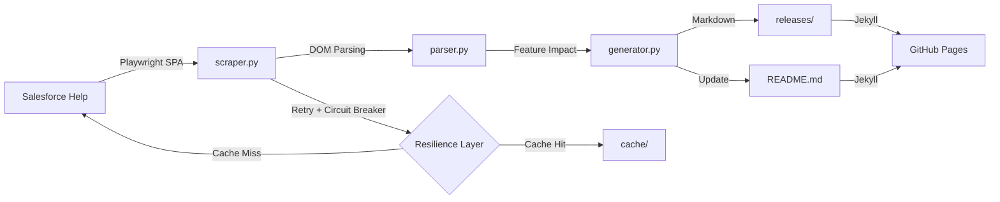

# 🚀 Salesforce Release Notes Intelligence

Automated pipeline for extraction, classificação e versionamento das **Salesforce Release Notes** como artefatos Markdown estruturados (*Knowledge-as-Code*).

### ⚙️ CI/CD Status & Conformidade

<!-- RELEASE_BADGE -->

[](https://github.com/Fatal1tyBarucco/Salesforce-WebDev/actions/workflows/python-quality.yml)
[](https://github.com/Fatal1tyBarucco/Salesforce-WebDev/actions/workflows/release_notes_pipeline.yml)


| Technology / Tool | Description | Pipeline Status |
| :--- | :--- | :---: |
| 🐍 **Python 3.14** | Ambiente de execução principal | `Conforme` |
| 🎭 **Playwright** | Scraper Headless para aplicações SPA do Salesforce Help | `Ativo` |
| 🧪 **Pytest** | Suíte de testes unitários automatizados | `450+ testes` |
| 🔍 **Mypy** | Verificação estática de tipos com modo estrito | `Strict` |
| ⚡ **Ruff & Black** | Linter e formatação estrita de código (line-length = 100) | `Conforme` |
| 📦 **uv** | Gerenciamento de dependências com lock file determinístico | `Ativo` |

---

## 📖 Overview

Este repositório contém um pipeline ETL assíncrono para scraping das *Salesforce Release Notes*, processamento local para classificação e sumarização, e geração de documentação estática via **MkDocs**.

## 🏗️ System Architecture


```mermaid
flowchart LR
    A[Salesforce Help] -->|Playwright SPA| B[scraper.py]
    B -->|DOM Parsing| C[parser.py]
    C -->|Feature Impact| D[generator.py]
    D -->|Markdown| E[releases/]
    D -->|Update| F[README.md]
    E -->|Jekyll| G[GitHub Pages]
    F -->|Jekyll| G

    B -->|Retry + Circuit Breaker| H{Resilience Layer}
    H -->|Cache Hit| I[cache/]
    H -->|Cache Miss| A
```

**Princípios de Design:**
* **Separação de Conceitos (SoC):** Camadas isoladas para rede (`scraper.py`), parsing (`parser.py`), geração (`generator.py`)
* **I/O Não Bloqueante:** `asyncio` + Playwright async para processamento paralelo
* **Resiliência:** Circuit Breaker + Token-bucket rate limiter + Exponential backoff com jitter

## ⚙️ Pré-requisitos e Instalação

Este projeto utiliza `uv` para gerenciamento determinístico de dependências.

```bash
# Instale o uv
curl -LsSf https://astral.sh/uv/install.sh | sh

# Clone e instale
git clone https://github.com/Fatal1tyBarucco/Salesforce-WebDev.git
cd Salesforce-WebDev
uv sync

# Instale browsers do Playwright
uv run playwright install chromium
```

## 🚀 Uso e Execução

```bash
# Executar pipeline completo
uv run python -m src.main

# Executar release específica
uv run python -m src.main --release summer_26

# Dry run (sem escrever arquivos)
uv run python -m src.main --dry-run
```

## 🛡️ Governança e Resiliência

| Componente | Configuração | Description |
| :--- | :--- | :--- |
| **Rate Limiter** | 2 req/s, token-bucket | Evita throttling do Salesforce |
| **Circuit Breaker** | 3 falhas → cooldown 60s | Para requisições após falhas consecutivas |
| **Cache TTL** | 24 horas | Previne refetch de conteúdo não alterado |
| **Exponential Backoff** | Base 2s + jitter | Retry inteligente com anti-thundering-herd |

## 🧪 Testes e Qualidade

```bash
# Executar testes
uv run pytest tests/

# Com cobertura
uv run pytest tests/ --cov=src --cov-report=term-missing

# Quality gate (ordem CI)
uv run ruff check src/
uv run black --check src/
uv run mypy src/
```

**Meta:** Cobertura >99%, zero erros de tipo, zero warnings de lint.

---


## 📋 Releases Disponíveis

<div style="padding:12px;margin-bottom:20px;border:1px solid #d0d7de;border-radius:6px;background:#f6f8fa;text-align:center;"><strong>🌐 Language / Idioma:</strong> <strong>🇺🇸 English</strong> | <a href="./README.md">🇧🇷 Português</a></div>

### ☀️ Summer '26

> 📊 **Executive Summary:** A release Summer '26 representa uma atualização significativa do ecossistema Salesforce, com 0 novos recursos distribuídos em 1 categorias.


<details>
<summary><b>📄 Legal Documentation (6 features)</b></summary>

> 📄 Full details: [./releases/summer_26/en_US/documentacao_legal.md](./releases/summer_26/en_US/documentacao_legal.md)

</details>


<details>
<summary><b>📄 Salesforce General (36 features)</b></summary>

> 📄 Full details: [./releases/summer_26/en_US/salesforce_geral.md](./releases/summer_26/en_US/salesforce_geral.md)

</details>


<details>
<summary><b>📄 Agentforce (37 features)</b></summary>

> 📄 Full details: [./releases/summer_26/en_US/agentforce.md](./releases/summer_26/en_US/agentforce.md)

</details>


<details>
<summary><b>📄 Data Analysis (58 features)</b></summary>

> 📄 Full details: [./releases/summer_26/en_US/analise_de_dados.md](./releases/summer_26/en_US/analise_de_dados.md)

</details>


<details>
<summary><b>📄 Automation (118 features)</b></summary>

> 📄 Full details: [./releases/summer_26/en_US/automacao.md](./releases/summer_26/en_US/automacao.md)

</details>


<details>
<summary><b>📄 OmniStudio (9 features)</b></summary>

> 📄 Full details: [./releases/summer_26/en_US/omnistudio.md](./releases/summer_26/en_US/omnistudio.md)

</details>


<details>
<summary><b>📄 Customization (33 features)</b></summary>

> 📄 Full details: [./releases/summer_26/en_US/personalizacao.md](./releases/summer_26/en_US/personalizacao.md)

</details>


<details>
<summary><b>📄 Data 360 (72 features)</b></summary>

> 📄 Full details: [./releases/summer_26/en_US/data_360.md](./releases/summer_26/en_US/data_360.md)

</details>


<details>
<summary><b>📄 Development (127 features)</b></summary>

> 📄 Full details: [./releases/summer_26/en_US/desenvolvimento.md](./releases/summer_26/en_US/desenvolvimento.md)

</details>


<details>
<summary><b>📄 Experience Cloud (14 features)</b></summary>

> 📄 Full details: [./releases/summer_26/en_US/experience_cloud.md](./releases/summer_26/en_US/experience_cloud.md)

</details>


<details>
<summary><b>📄 Field Service (48 features)</b></summary>

> 📄 Full details: [./releases/summer_26/en_US/field_service.md](./releases/summer_26/en_US/field_service.md)

</details>


<details>
<summary><b>📄 Hyperforce (3 features)</b></summary>

> 📄 Full details: [./releases/summer_26/en_US/hyperforce.md](./releases/summer_26/en_US/hyperforce.md)

</details>


<details>
<summary><b>📄 Industries (309 features)</b></summary>

> 📄 Full details: [./releases/summer_26/en_US/setores.md](./releases/summer_26/en_US/setores.md)

</details>


<details>
<summary><b>📄 Marketing (64 features)</b></summary>

> 📄 Full details: [./releases/summer_26/en_US/marketing.md](./releases/summer_26/en_US/marketing.md)

</details>


<details>
<summary><b>📄 MuleSoft (8 features)</b></summary>

> 📄 Full details: [./releases/summer_26/en_US/mulesoft.md](./releases/summer_26/en_US/mulesoft.md)

</details>


<details>
<summary><b>📄 Mobile App (17 features)</b></summary>

> 📄 Full details: [./releases/summer_26/en_US/aplicativo_movel.md](./releases/summer_26/en_US/aplicativo_movel.md)

</details>


<details>
<summary><b>📄 Partner Cloud (1 features)</b></summary>

> 📄 Full details: [./releases/summer_26/en_US/partner_cloud.md](./releases/summer_26/en_US/partner_cloud.md)

</details>


<details>
<summary><b>📄 Revenue Management (97 features)</b></summary>

> 📄 Full details: [./releases/summer_26/en_US/gerenciamento_de_receita.md](./releases/summer_26/en_US/gerenciamento_de_receita.md)

</details>


<details>
<summary><b>📄 Sales (58 features)</b></summary>

> 📄 Full details: [./releases/summer_26/en_US/vendas.md](./releases/summer_26/en_US/vendas.md)

</details>


<details>
<summary><b>📄 Salesforce Slack Integrations (2 features)</b></summary>

> 📄 Full details: [./releases/summer_26/en_US/integracoes_do_salesforce_para_slack.md](./releases/summer_26/en_US/integracoes_do_salesforce_para_slack.md)

</details>


<details>
<summary><b>📄 Security, Identity & Privacy (58 features)</b></summary>

> 📄 Full details: [./releases/summer_26/en_US/seguranca_identidade_e_privacidade.md](./releases/summer_26/en_US/seguranca_identidade_e_privacidade.md)

</details>


<details>
<summary><b>📄 Service (198 features)</b></summary>

> 📄 Full details: [./releases/summer_26/en_US/servico.md](./releases/summer_26/en_US/servico.md)

</details>


<details>

<summary><h3>🌸 Spring '26</h3></summary>

> 📊 **Executive Summary:** A release Salesforce Spring '26 apresenta um impressionante conjunto de 1.438 novos recursos e aprimoramentos distribuídos por 21 categorias, consolidando a plataforma como referência em inovação para CRM e automação de negócios. O destaque central desta release é a evolução do Agentforce, que agora conta com o Agentforce Builder disponível ao público em geral, permitindo a criação de agentes de IA mais complexos e sofisticados. A categoria Serviço lidera em volume com 167 recursos, transformando o Service Cloud no Serviço Agentforce, com novas capacidades de central de contato, voz, messaging e gerenciamento de serviço de TI. O Aplicativo Móvel acompanha com 187 recursos, garantindo que as equipes possam operar com plena funcionalidade em dispositivos móveis. A Automação oferece 151 recursos incluindo avanços significativos no Flow Builder, com geração de fluxos por IA agora disponível ao público em geral, orquestração de fluxos aprimorada e novas capacidades de processamento em lote de prompts. Os Setores trazem o maior volume de inovações setoriais com 194 recursos, abrangendo desde automotivo e finanças até saúde e serviços públicos. O Gerenciamento de Receita apresenta 131 recursos para otimização de CPQ e billing. Em Vendas, com 85 recursos, o Sales Cloud se transforma em Agentforce Sales, introduzindo geração de leads autônoma, qualificação por IA e nutrição de leads automatizada. A plataforma também avança em Segurança, Identidade e Privacidade com 61 recursos, incluindo novas políticas de aplicativos conectados, login sem senha com chaves de acesso e aprimoramentos no Salesforce Shield. A Análise de Dados com 54 recursos e o Data 360 com 53 recursos expandem as capacidades de insights e gestão de dados. O Desenvolvimento com 97 recursos oferece novas ferramentas para desenvolvedores, incluindo tipos personalizados do Lightning para Agentforce. Com 72 recursos, o Marketing aprimora campanhas e engajamento. Experience Cloud (21 recursos), Personalização (18 recursos), Field Service (41 recursos), MuleSoft (8 recursos), OmniStudio (10 recursos), Hyperforce (5 recursos), Partner Cloud (4 recursos) e Documentação Legal (6 recursos) completam o panorama desta release abrangente. A Spring '26 representa um marco na estratégia da Salesforce de integrar IA generativa e agentes autônomos em todas as camadas da plataforma, capacitando organizações de todos os tamanhos a automatizar processos, aumentar a produtividade e oferecer experiências personalizadas em escala.


<details>
<summary><b>📄 Legal Documentation (6 features)</b></summary>


> A categoria Documentação Legal da release Spring '26 contém 6 recursos dedicados a atualizações de termos, políticas e conformidade legal da plataforma Salesforce. Estes recursos garantem que as organizações estejam alinhadas com as mais recentes exigências regulatórias e mudanças contratuais, incluindo atualizações de termos de serviço, políticas de privacidade e documentação de conformidade. É essencial que administradores e equipes jurídicas revisem esses recursos para manter a conformidade organizacional.

> 📄 Full details: [./releases/spring_26/en_US/documentacao_legal.md](./releases/spring_26/en_US/documentacao_legal.md)

</details>


<details>
<summary><b>📄 Salesforce General (38 features)</b></summary>


> A categoria Salesforce Geral reúne 38 recursos que abrangem mudanças transversais na plataforma Salesforce. Incluem-se aprimoramentos gerais na experiência do usuário, atualizações de infraestrutura e melhorias que afetam múltiplos produtos e nuvens. Recursos como mudanças na interface do Lightning Experience, atualizações de API e aprimoramentos de desempenho estão incluídos, proporcionando uma base mais sólida para todas as implementações Salesforce.

> 📄 Full details: [./releases/spring_26/en_US/salesforce_geral.md](./releases/spring_26/en_US/salesforce_geral.md)

</details>


<details>
<summary><b>📄 Agentforce (35 features)</b></summary>


> O Agentforce recebe 35 recursos na Spring '26, com destaque para a disponibilidade geral do Agentforce Builder. Principais novidades incluem: ação de conversão de áudio em texto, melhoria de pesquisa web com domínios permitidos, visualização de tela aprimorada (beta) para criação mais rápida de agentes complexos, conexão com Chat v2 aprimorado, criação de agentes de funcionários, métricas RAG para avaliação de desempenho de IA, encaminhamento de chamadas de voz via SIP, otimização de agentes com reprodução de sessão de Voice, e suporte a modelos como NVIDIA Nemotron 3 Nano 30B (beta). A categoria também inclui a evolução do Prompt Builder com processamento em lote aprimorado e suporte a modelos antropicados.

> 📄 Full details: [./releases/spring_26/en_US/agentforce.md](./releases/spring_26/en_US/agentforce.md)

</details>


<details>
<summary><b>📄 Data Analysis (54 features)</b></summary>


> A Análise de Dados conta com 54 recursos na Spring '26, expandindo significativamente as capacidades de business intelligence e insights da plataforma. Os recursos abrangem aprimoramentos em relatórios, dashboards e ferramentas analíticas que permitem às organizações extrair insights mais profundos de seus dados. Incluem-se melhorias em visualização de dados, integração com fontes externas e capacidades de análise preditiva, capacitando equipes a tomar decisões baseadas em dados com maior agilidade e precisão.

> 📄 Full details: [./releases/spring_26/en_US/analise_de_dados.md](./releases/spring_26/en_US/analise_de_dados.md)

</details>


<details>
<summary><b>📄 Automation (151 features)</b></summary>


> A Automação é uma das categorias mais robustas com 151 recursos. O Flow Builder recebeu aprimoramentos significativos, incluindo geração de fluxos por IA agora disponível ao público em geral, evolução iterativa de fluxos com Agentforce e interface simplificada com elementos de ramificação recolhíveis. Destaques incluem: tabelas de dados com classificação e edição inline, painéis Kanban em fluxos de tela (beta), visualização nativa de arquivos, integração com Marketing Cloud para automação de emails, fluxos acionados por segmento com agendamento aprimorado, experiências de caminho com análise comparativa, processos de aprovação de fluxo com novas capacidades de depuração e orquestração de fluxos no aplicativo Automação Lightning.

> 📄 Full details: [./releases/spring_26/en_US/automacao.md](./releases/spring_26/en_US/automacao.md)

</details>


<details>
<summary><b>📄 Customization (18 features)</b></summary>


> A categoria Personalização oferece 18 recursos focados em adaptar a plataforma Salesforce às necessidades específicas de cada organização. Os recursos permitem maior flexibilidade na configuração de layouts, campos, processos e experiências do usuário, garantindo que cada implementação possa ser moldada para atender aos requisitos de negócio únicos. Incluem-se aprimoramentos em flexipages, páginas de registro e componentes personalizáveis do Lightning.

> 📄 Full details: [./releases/spring_26/en_US/personalizacao.md](./releases/spring_26/en_US/personalizacao.md)

</details>


<details>
<summary><b>📄 Data 360 (53 features)</b></summary>


> O Data 360 apresenta 53 recursos que expandem as capacidades de gestão e integração de dados da plataforma. Os recursos incluem aprimoramentos na conectividade entre fontes de dados, qualidade de dados, governança e capacidades de processamento em tempo real. Destaques incluem fluxos do Data 360 com suporte a licenças específicas e limites de taxa maiores, fluxos de transmissão assíncronos para notificações em massa e rastreamento aprimorado de dados em tempo real com gráficos personalizados.

> 📄 Full details: [./releases/spring_26/en_US/data_360.md](./releases/spring_26/en_US/data_360.md)

</details>


<details>
<summary><b>📄 Development (97 features)</b></summary>


> A categoria Desenvolvimento reúne 97 recursos para desenvolvedores Salesforce. Destaca-se a nova ferramenta Lightning Types MCP (Visualização do desenvolvedor) para acelerar a criação de tipos personalizados do Lightning para Agentforce. Os recursos abrangem aprimoramentos no Apex, APIs, ferramentas de depuração, testes e implantação, além de novas capacidades de extensão e integração. Desenvolvedores podem esperar melhorias significativas na produtividade e nas capacidades de personalização programática da plataforma.

> 📄 Full details: [./releases/spring_26/en_US/desenvolvimento.md](./releases/spring_26/en_US/desenvolvimento.md)

</details>


<details>
<summary><b>📄 Experience Cloud (21 features)</b></summary>


> O Experience Cloud conta com 21 recursos na Spring '26, focados em aprimorar a criação e gestão de portais, sites e comunidades digitais. Os recursos incluem melhorias na experiência do usuário, personalização de temas e templates, aprimoramentos de desempenho e novas capacidades de engajamento, permitindo às organizações criar experiências digitais mais ricas e interativas para clientes, parceiros e funcionários.

> 📄 Full details: [./releases/spring_26/en_US/experience_cloud.md](./releases/spring_26/en_US/experience_cloud.md)

</details>


<details>
<summary><b>📄 Field Service (41 features)</b></summary>


> O Field Service recebe 41 recursos que aprimoram a gestão de serviços de campo. Os recursos incluem melhorias no agendamento e otimização de despacho, capacidades mobile aprimoradas para técnicos de campo, integração com IoT para manutenção preditiva e aprimoramentos na gestão de inventário de peças. A categoria também inclui novas capacidades de assistência por IA para diagnóstico e resolução de problemas em campo.

> 📄 Full details: [./releases/spring_26/en_US/field_service.md](./releases/spring_26/en_US/field_service.md)

</details>


<details>
<summary><b>📄 Hyperforce (5 features)</b></summary>


> A Hyperforce apresenta 5 recursos focados na infraestrutura de nuvem de próxima geração da Salesforce. Os recursos incluem aprimoramentos na escalabilidade, desempenho e disponibilidade da plataforma, permitindo que as organizações executem workloads Salesforce em infraestrutura de nuvem pública com maior flexibilidade e eficiência operacional.

> 📄 Full details: [./releases/spring_26/en_US/hyperforce.md](./releases/spring_26/en_US/hyperforce.md)

</details>


<details>
<summary><b>📄 Industries (194 features)</b></summary>


> A categoria Setores lidera em volume com 194 recursos, oferecendo soluções especializadas para indústrias específicas. Abrange setores como Automotivo (com Agentforce para Automotive, finanças automotivas e gerenciamento de frotas), Saúde, Serviços Financeiros, Manufatura, Varejo e Serviços Públicos. Destaques incluem Agentforce para setores específicos, gerenciamento de inventário aprimorado, planilhas de horas com otimização de custos, e soluções de venda adicional e cruzada com IA. A categoria garante que organizações de qualquer indústria possam aproveitar capacidades personalizadas e relevantes.

> 📄 Full details: [./releases/spring_26/en_US/setores.md](./releases/spring_26/en_US/setores.md)

</details>


<details>
<summary><b>📄 Mobile App (187 features)</b></summary>


> O Aplicativo Móvel é uma das maiores categorias com 187 recursos, garantindo que as equipes possam operar com plena funcionalidade em dispositivos móveis. Os recursos incluem aprimoramentos na experiência do usuário mobile, novas capacidades offline, integração aprimorada com funcionalidades de IA e melhorias de desempenho. A categoria assegura que vendedores, agentes de serviço e gestores possam acessar todas as funcionalidades críticas diretamente de seus dispositivos móveis.

> 📄 Full details: [./releases/spring_26/en_US/aplicativo_movel.md](./releases/spring_26/en_US/aplicativo_movel.md)

</details>


<details>
<summary><b>📄 Marketing (72 features)</b></summary>


> O Marketing conta com 72 recursos que aprimoram campanhas, engajamento e automação de marketing. Os recursos incluem integração aprimorada com o Flow Builder para automação de emails, capacidades de segmentação mais sofisticadas, aprimoramentos em jornadas do cliente e novas ferramentas de análise de campanha. A categoria também inclui melhorias na integração entre Marketing Cloud e outras nuvens Salesforce para uma visão unificada do cliente.

> 📄 Full details: [./releases/spring_26/en_US/marketing.md](./releases/spring_26/en_US/marketing.md)

</details>


<details>
<summary><b>📄 MuleSoft (8 features)</b></summary>


> O MuleSoft apresenta 8 recursos focados em integração e conectividade. Os recursos aprimoram as capacidades de integração de APIs, automação de fluxos de trabalho entre sistemas e conectividade com aplicações externas, permitindo que as organizações integrem o ecossistema Salesforce com outras plataformas de forma mais eficiente e escalável.

> 📄 Full details: [./releases/spring_26/en_US/mulesoft.md](./releases/spring_26/en_US/mulesoft.md)

</details>


<details>
<summary><b>📄 OmniStudio (10 features)</b></summary>


> O OmniStudio conta com 10 recursos que aprimoram as capacidades de configuração e automação de processos digitais. Os recursos incluem melhorias em flexcards, OmniScripts e DataRaptors, permitindo a criação de experiências digitais mais ricas e processos de negócio mais eficientes sem necessidade de código customizado.

> 📄 Full details: [./releases/spring_26/en_US/omnistudio.md](./releases/spring_26/en_US/omnistudio.md)

</details>


<details>
<summary><b>📄 Partner Cloud (4 features)</b></summary>


> A Partner Cloud apresenta 4 recursos focados em ecossistemas de parceiros. Os recursos aprimoram as capacidades de gestão de parceiros, compartilhamento de dados e colaboração no ecossistema, facilitando a criação e manutenção de redes de parceiros mais eficientes e integradas.

> 📄 Full details: [./releases/spring_26/en_US/partner_cloud.md](./releases/spring_26/en_US/partner_cloud.md)

</details>


<details>
<summary><b>📄 Revenue Management (131 features)</b></summary>


> O Gerenciamento de Receita oferece 131 recursos para otimização de processos de CPQ (Configure, Price, Quote) e billing. Os recursos incluem aprimoramentos na configuração de produtos, precificação dinâmica, geração de cotações e gestão de faturamento. A categoria também inclui melhorias em reconhecimento de receita, gestão de assinaturas e automação de processos financeiros, capacitando equipes de vendas e financeiras a operar com maior eficiência e precisão.

> 📄 Full details: [./releases/spring_26/en_US/gerenciamento_de_receita.md](./releases/spring_26/en_US/gerenciamento_de_receita.md)

</details>


<details>
<summary><b>📄 Sales (85 features)</b></summary>


> A categoria Vendas conta com 85 recursos, com o Sales Cloud se transformando em Agentforce Sales. Destaques incluem: geração de leads de entrada do Agentforce com captura e agendamento autônomo de reuniões, qualificação automatizada por IA, nutrição de leads com configuração guiada e gerenciamento automático de limites. O Agentforce Sales Management promove negócios com sugestões pós-reunião e gestão de pipeline aprimorada. A categoria também inclui Insights de Conversas do Einstein com resumos de chamada generativos, transcrições de fornecedor e suporte a Gong, além do aplicativo Agentforce Sales no ChatGPT (beta).

> 📄 Full details: [./releases/spring_26/en_US/vendas.md](./releases/spring_26/en_US/vendas.md)

</details>


<details>
<summary><b>📄 Security, Identity & Privacy (61 features)</b></summary>


> A Segurança, Identidade e Privacidade reúne 61 recursos críticos para proteção de dados e acesso. Destaques incluem: descontinuação de redirecionamentos para nomes de host legados, criação de aplicativos conectados desabilitada por padrão, Backup e Recuperação como aplicativo nativo, configuração de login sem senha com chaves de acesso (beta), alertas de segurança para fluxos OAuth, ativação de dispositivo obrigatória para SSO, e Solicitações de Privacidade com Direito de ser esquecido. A categoria também aprimora o Salesforce Shield com assistentes de configuração e o monitoramento de eventos.

> 📄 Full details: [./releases/spring_26/en_US/seguranca_identidade_e_privacidade.md](./releases/spring_26/en_US/seguranca_identidade_e_privacidade.md)

</details>


<details>
<summary><b>📄 Service (167 features)</b></summary>


> A categoria Serviço contém 167 recursos, com o Service Cloud se transformando em Serviço Agentforce. Destaques incluem: Salesforce Voice com gerenciamento de números e canais, chamadas de voz do WhatsApp, resposta de voz interativa e gravação de transcrições. A Central de Contato do Agentforce pode ser configurada no Salesforce Go. O messaging recebeu aprimoramentos significativos com créditos de mensagens, verificação de licenças e suporte aprimorado ao WhatsApp unificado com recibos de leitura e indicadores de digitação. O Gerenciamento de Serviço inclui modelos prontos para uso, priorização de problemas e validações de campo. Para TI, destacam-se o portal de autoatendimento remodelado, assistência proativa baseada em prioridade, diagnóstico de causa raiz e integração com Microsoft Teams.

> 📄 Full details: [./releases/spring_26/en_US/servico.md](./releases/spring_26/en_US/servico.md)

</details>

</details>


<details>

<summary><h3>❄️ Winter '26</h3></summary>

> 📊 **Executive Summary:** A release Salesforce Winter '26 representa um marco significativo na evolução da plataforma, com impressionantes 1.348 recursos distribuídos em 19 categorias. O volume massivo de novidades reflete a aceleração estratégica da Salesforce em três pilares fundamentais: inteligência artificial generativa e agentes autônomos, unificação de dados em tempo real e modernização da experiência do desenvolvedor.

O destaque absoluto é o ecossistema Agentforce, que consolida a visão de agentes de IA autônomos com 39 recursos dedicados. A plataforma expande o suporte a modelos de IA — incluindo Claude Sonnet 4.5, OpenAI o3/o4-mini e Amazon Nova na Plataforma Einstein — além de introduzir Agentforce Voice para conversas por voz, Rastreamento de sessão para visibilidade do comportamento do agente e Otimização do Agentforce (beta) para análise de eficácia. A migração do Agentforce (padrão) para agentes de funcionários com fluxo simplificado sinaliza a maturidade do produto para uso empresarial em larga escala.

A categoria Setores domina com 459 recursos, demonstrando o compromisso da Salesforce com soluções verticais. Destacam-se: Life Sciences Cloud para Engajamento do Cliente (GA), Agentforce para Healthcare com correspondência inteligente de provedores, Insurance Cloud com automação de declarações, Education Cloud com metas de carreira do aluno via Agentforce, e Manufacturing Cloud com reabastecimento inteligente de inventário. O Partner Cloud, com 156 recursos, inaugura o gerenciamento completo do ciclo de vida de parceiros com Revenue Cloud, Precificação do Salesforce e Gerenciamento de uso avançado.

Vendas (154 recursos) e Desenvolvimento (101 recursos) completam o topo da escala. Em Vendas, o Agentforce SDR evolui para Nutrição de leads com suporte a Microsoft Exchange, enquanto o Flow Builder recebe automação de decisões com IA generativa e fluxos de transmissão para públicos dinâmicos. Em Desenvolvimento, o SLDS 2 chega como GA com modo escuro (beta), o LWC recebe API v65.0 com Gerenciamento de estado (beta) e Lightning Out 2.0 para experiências externas, além de ferramentas de MCP do LWC para acelerar o desenvolvimento com IA.

Análise de dados (91 recursos) impulsiona a era do Tableau Next com semânticas aprimoradas, Otimização de modelo semântico (beta) e integração profunda com Slack via Agentforce para Analytics. Marketing (87 recursos) avança com Marketing Cloud Next, gerenciamento de fidelidade expandido e promoções globais. Segurança (55 recursos) introduz Detecção de dados expandida, rastreamento de atividade do agente em tempo real e Criptografia de banco de dados GA.

A infraestrutura Hyperforce expande para mais regiões com suporte a AWS Direct Connect e Continuidade avançada entre regiões. O Data Cloud é renomeado para Data 360, consolidando a visão de dados unificados. Field Service (24 recursos) adiciona escala dinâmica e VRA de múltiplos participantes. Personalização (65 recursos) moderniza a experiência administrativa com classificação por várias colunas em listas e segmentação expandida do Data 360. A estratégia de descontinuação é clara: Chat legado, Salesforce para Outlook (dez/2027), Lightning Sync para EWS e Salesforce Functions estão sendo aposentados.

Em suma, a Winter '26 posiciona o Salesforce como uma plataforma de agentes de IA empresariais, com dados unificados via Data 360, soluções verticais profundas e uma experiência de desenvolvimento modernizada. A direção estratégica é inequívoca: cada interação de negócio será mediada por agentes inteligentes, cada decisão será informada por dados unificados e cada setor terá soluções nativas específicas.


<details>
<summary><b>📄 Legal Documentation (11 features)</b></summary>


> Com 11 recursos, esta categoria foca em informações estruturais da release. Inclui atualizações sobre navegadores compatíveis para Lightning Experience, Salesforce Classic e CRM Analytics. Documenta como e quando os recursos ficam disponíveis, com impacto imediato para alguns e ação de administrador para outros. As mudanças na documentação visam facilitar a localização de informações sobre compatibilidade e disponibilidade de recursos.

> 📄 Full details: [./releases/winter_26/en_US/documentacao_legal.md](./releases/winter_26/en_US/documentacao_legal.md)

</details>


<details>
<summary><b>📄 Salesforce General (32 features)</b></summary>


> Com 32 recursos, as melhorias gerais incluem assistentes de IA com acesso seguro a dados (beta), novo domínio de configuração e preparação para IPv6. A CDN do Lightning usa CloudFront para todas as organizações. Avisos sugeridos podem ser agendados para exibição em momentos relevantes. O Salesforce Foundations facilita a ativação de produtos na configuração. O Salesforce Scheduler ganha Agentforce com conversas turno a turno, referência a casos e agendamento de grupo. Pipelines de dados do Salesforce suportam exportação para Snowflake via VPC e OAuth para Databricks. O aplicativo Arquivar permite arquivamento de dados declarativo.

> 📄 Full details: [./releases/winter_26/en_US/salesforce_geral.md](./releases/winter_26/en_US/salesforce_geral.md)

</details>


<details>
<summary><b>📄 Data Analysis (91 features)</b></summary>


> Com 91 recursos, a análise de dados é revolucionada pelo Tableau Next. A Semântica do Tableau recebe Otimização de modelo semântico (beta) e Gerador de descrição semântica de IA (beta). Novas visualizações incluem codificação de tamanho, linhas de referência e formatação condicional. O Criador de modelos (beta) permite compartilhar percepções configuráveis. A integração com Slack evolui com Agentforce para Analytics no Slack para exploração conversacional de métricas. Relatórios do Lightning recebem linhas de referência em gráficos, enquanto CRM Analytics ganha semijunções/antijunções (beta) e suporte OAuth para Databricks. O Comércio inclui modelo unificado de lojas e pesquisa de SKU parcial.

> 📄 Full details: [./releases/winter_26/en_US/analise_de_dados.md](./releases/winter_26/en_US/analise_de_dados.md)

</details>


<details>
<summary><b>📄 Customization (65 features)</b></summary>


> Com 65 recursos, a personalização moderniza a experiência administrativa. Modos de exibição de listas ganham classificação por várias colunas (GA) e pesquisa antecipada. O Data Cloud (agora Data 360) expande com segmentação e ativação em todas as organizações, novos conjuntos de permissões padrão e ingestão de vídeos YouTube e conteúdo GitHub. A Semântica do Tableau recebe cardinalidade definida para melhor precisão. O Lightning App Builder suporta páginas de registro do Flow e componentes Avonni. Serviços externos obtêm limites maiores e suporte a arquivos binários. O Inspetor DX adiciona adesão e confirmações para gerenciamento de mudanças.

> 📄 Full details: [./releases/winter_26/en_US/personalizacao.md](./releases/winter_26/en_US/personalizacao.md)

</details>


<details>
<summary><b>📄 Development (101 features)</b></summary>


> Com 101 recursos, o desenvolvimento recebe modernização profunda. O SLDS 2 chega como GA com modo escuro (beta) e Linter para migração. O LWC recebe API v65.0, Gerenciamento de estado (beta), ferramentas de MCP (beta) e Lightning Out 2.0 para experiências externas. O Apex ganha suporte a modificadores de acesso em métodos abstratos, ApexDoc padronizado e exposição de métodos AuraEnabled como ações do agente (beta). DevOps Center recebe ferramentas MCP para resolução de conflitos. Agentforce DX e o Servidor Salesforce DX MCP permitem uso de linguagem natural para tarefas. A captura de alteração de dados expande para mais objetos com campos de fórmula personalizados.

> 📄 Full details: [./releases/winter_26/en_US/desenvolvimento.md](./releases/winter_26/en_US/desenvolvimento.md)

</details>


<details>
<summary><b>📄 Agentforce (39 features)</b></summary>


> Com 39 recursos, o Agentforce é o centro da estratégia Winter '26. Destacam-se: Agentforce Voice para conversas por voz com agentes de serviço, Rastreamento de sessão para visibilidade comportamental, Otimização do Agentforce (beta) para análise de eficácia e lista de permissões de URL confiável para segurança. A Plataforma Einstein expande suporte a modelos com Claude Sonnet 4.5, OpenAI o3/o4-mini e Amazon Nova (todos beta). O Agentforce Analytics habilitado pelo Tableau Next (beta) oferece percepções dinâmicas. A migração simplificada do Agentforce (padrão) para agentes de funcionários e a escala de conversas complexas para representantes consolidam a maturidade da plataforma para uso empresarial.

> 📄 Full details: [./releases/winter_26/en_US/agentforce.md](./releases/winter_26/en_US/agentforce.md)

</details>


<details>
<summary><b>📄 Experience Cloud (8 features)</b></summary>


> Com 8 recursos, o Experience Cloud foca na transição para LWR aprimorado com recursos mais recentes do Salesforce Flow. Destaca-se o Desenvolvedor local para criação rápida de componentes LWC em visualização em tempo real (beta). Componentes predefinidos do Avonni aceleram a criação de sites. A atualização de URLs Force.com legados é obrigatória, com aviso de sessão prestes a terminar para visitantes. Os aplicativos Mobile Publisher recebem melhorias de UX e segurança. A mudança para certificado de domínio único na CDN do Salesforce é uma atualização de versão importante.

> 📄 Full details: [./releases/winter_26/en_US/experience_cloud.md](./releases/winter_26/en_US/experience_cloud.md)

</details>


<details>
<summary><b>📄 Field Service (24 features)</b></summary>


> Com 24 recursos, o Field Service avança em agendamento e operações. A escala dinâmica (beta) otimiza conjuntos de grandes dados, enquanto o mecanismo de agendamento ganha maior resiliência para trabalho complexo. O Serviço de ativo proativo habilitado pelo Tableau oferece percepções mais profundas. O VRA (Assistente remoto visual) evolui com sessões de múltiplos participantes e marcação ativa como favorita. A captura de dados recebe variáveis globais, modelos de fluxo e Voice to Form (beta). O Voice para edição de registro permite atualização gratuita de registros. O roteamento preditivo de ponto a ponto utiliza dados de mapa atualizados.

> 📄 Full details: [./releases/winter_26/en_US/field_service.md](./releases/winter_26/en_US/field_service.md)

</details>


<details>
<summary><b>📄 Hyperforce (5 features)</b></summary>


> Com 5 recursos, o Hyperforce expande a presença global com Data Cloud, Marketing Cloud, Plataforma e Tableau Cloud disponíveis em mais regiões. Produtos chegam ao Government Cloud Plus. O AWS Direct Connect (DX) oferece conectividade direta para organizações Hyperforce. O Salesforce Shield habilita Criptografia de banco de dados (GA) para criptografia completa da organização. A Recuperação de desastres fora da região é renomeada para Continuidade avançada entre regiões, refletindo capacidades expandidas de resiliência empresarial.

> 📄 Full details: [./releases/winter_26/en_US/hyperforce.md](./releases/winter_26/en_US/hyperforce.md)

</details>


<details>
<summary><b>📄 Industries (459 features)</b></summary>


> Com 459 recursos, as nuvens de indústrias dominam a release. Automotive Cloud recebe Agentforce com otimização de revendedor e finanças automotivas. Consumer Goods Cloud unifica dados com Data Cloud One (GA). Education Cloud traz metas de carreira do aluno e recrutamento (beta). Financial Services Cloud inclui resumos de reunião com IA e empréstimo digital para Índia. Health Cloud oferece correspondência inteligente de provedores e processamento de documentos. Insurance Cloud automatiza declarações com regras de fluxo de trabalho. Life Sciences Cloud chega como GA com gerenciamento de conta e planejamento de engajamento. Manufacturing Cloud adiciona reabastecimento inteligente. Media Cloud otimiza inventário de publicidade com agendas de receita. Net Zero Cloud simplifica relatórios CSRD. Nonprofit Cloud gerencia voluntários com Agentforce (beta). Setor público personaliza recomendações de trabalho com Agentforce.

> 📄 Full details: [./releases/winter_26/en_US/setores.md](./releases/winter_26/en_US/setores.md)

</details>


<details>
<summary><b>📄 Marketing (87 features)</b></summary>


> Com 87 recursos, o Marketing Cloud avança significativamente. O Marketing Cloud Next traz mensagens de aplicativo móvel, Agentforce para criação e análise de campanha, e páginas de destino personalizáveis. O Account Engagement obtém percepções de formulários de terceiros e listas dinâmicas com Data Cloud One. A Inteligência de marketing recebe otimização de mídia paga via Agentforce, pausa de Google Ads de baixo desempenho e novos conectores de API. O Gerenciamento de fidelidade expande com Starter simplificado, promoções globais com avaliação/execução e gerenciamento de pontos com novos modelos de DPE. O Marketing de indicação alcança redes expandidas com promoções direcionadas B2C e B2B.

> 📄 Full details: [./releases/winter_26/en_US/marketing.md](./releases/winter_26/en_US/marketing.md)

</details>


<details>
<summary><b>📄 MuleSoft (4 features)</b></summary>


> Com 4 recursos, o MuleSoft foca no Catálogo da API para Salesforce com autenticação avançada (Básico, JWT, OAuth 2.0) e seleção de conexões de API por ação no Fluxo. O empacotamento de entidades do catálogo suporta pacotes gerenciados de primeira e segunda geração, facilitando a governança de APIs em ambientes empresariais complexos e integrando-se ao ecossistema Flow Builder.

> 📄 Full details: [./releases/winter_26/en_US/mulesoft.md](./releases/winter_26/en_US/mulesoft.md)

</details>


<details>
<summary><b>📄 Mobile App (7 features)</b></summary>


> Com 7 recursos, o aplicativo Salesforce móvel evolui com login simplificado sem nome de usuário e IA conversacional para usuários móveis. O Mobile Publisher ganha segurança aprimorada com aplicativos cliente externos para empacotamento e distribuição. O Mobile SDK 13.1 adiciona WebSockets no lado do cliente, iOS URLRequest e suporte a Android 16, além de login por domínio de boas-vindas do Salesforce para aplicativos internos. Os requisitos do aplicativo móvel foram atualizados para refletir as novas capacidades da plataforma.

> 📄 Full details: [./releases/winter_26/en_US/aplicativo_movel.md](./releases/winter_26/en_US/aplicativo_movel.md)

</details>


<details>
<summary><b>📄 OmniStudio (8 features)</b></summary>


> Com 8 recursos, o OmniStudio expande para sites LWR do Experience Cloud com FlexCards e OmniScripts (beta). O número automático global Omni cria sistemas de numeração exclusivos para necessidades específicas. Componentes Flexcard, Omniscript e PubSub Lightning ficam disponíveis diretamente na Biblioteca de componentes do Salesforce para LWC personalizados. O desempenho de tempo de execução é aprimorado com nova configuração. Acessibilidade e remoção do OmniOut no tempo de execução padrão completam as atualizações.

> 📄 Full details: [./releases/winter_26/en_US/omnistudio.md](./releases/winter_26/en_US/omnistudio.md)

</details>


<details>
<summary><b>📄 Partner Cloud (156 features)</b></summary>


> Com 156 recursos, o Partner Cloud inaugura o gerenciamento completo do ciclo de vida de parceiros. Agentforce para parceiros gerencia casos de suporte via conversas guiadas e recomenda programas de enablement. O Revenue Cloud inclui Precificação do Salesforce com políticas baseadas em CPI, Gerenciamento de taxa com descontos de compromisso em níveis e Product Configurator com Constraint Modeling Language (CML). O Gerenciamento de transações avança com Modelo avançado de cotações e negócios pontuais para grupos. A venda de uso recebe modelos de compromisso e negócios de rampa flexível. O Gerenciamento de uso monetariza consumo de recursos classificados por token. O faturamento ganha assistente de IA e numeração sequencial de faturas.

> 📄 Full details: [./releases/winter_26/en_US/partner_cloud.md](./releases/winter_26/en_US/partner_cloud.md)

</details>


<details>
<summary><b>📄 Sales (154 features)</b></summary>


> Com 154 recursos, o Sales Cloud é transformado por agentes de IA. O Agentforce SDR evolui para Nutrição de leads com suporte a Microsoft Exchange e configuração guiada. A Geração de lead de entrada captura automaticamente leads e agenda reuniões (GA). O Gerenciamento de vendas da Agentforce automatiza tarefas e mantém higiene do pipeline. O Coach de vendas do Agentforce orienta equipes globais em idioma preferencial. Insights de conversas do Einstein ganham pesquisa em chamadas e tópicos de pergunta em sinais de vendas. Previsões do Salesforce suportam divisões de item de linha e datas de serviço. O Flow Builder recebe IA generativa para decisões, fluxos de transmissão e acionadores de arquivo (GA). Processos de aprovação de fluxo e orquestração ganham depuração no Flow Builder.

> 📄 Full details: [./releases/winter_26/en_US/vendas.md](./releases/winter_26/en_US/vendas.md)

</details>


<details>
<summary><b>📄 Salesforce Slack Integrations (1 features)</b></summary>


> Com 1 recurso, a integração foca na simplificação da criação de canais do Salesforce no Slack. Este aprimoramento permite que usuários se conectem mais facilmente com clientes, rastreiem progresso e colaborem diretamente no Slack, reforçando a estratégia de workplace unificado da Salesforce após a aquisição do Slack.

> 📄 Full details: [./releases/winter_26/en_US/integracoes_do_salesforce_para_slack.md](./releases/winter_26/en_US/integracoes_do_salesforce_para_slack.md)

</details>


<details>
<summary><b>📄 Security, Identity & Privacy (55 features)</b></summary>


> Com 55 recursos, a segurança é reforçada significativamente. A Detecção de dados expande com 100 objetos e 200 campos adicionais, tipos de dados personalizáveis e integração com o aplicativo Shield. O Monitoramento de evento adiciona objetos de log para rastreamento de atividade do agente e eventos em tempo real. A Trilha de auditoria de campo permite políticas de retenção declarativas. A Criptografia de banco de dados chega ao GA. Credenciais de aplicativo cliente externo ganham preparação e rotação. O Agentforce para Segurança cria agentes de segurança com snapshot de atividade do usuário. A Central de segurança monitora métricas do Agentforce, ataques de injeção de prompt e versões do agente.

> 📄 Full details: [./releases/winter_26/en_US/seguranca_identidade_e_privacidade.md](./releases/winter_26/en_US/seguranca_identidade_e_privacidade.md)

</details>


<details>
<summary><b>📄 Service (41 features)</b></summary>


> Com 41 recursos, o Service Cloud expande para TI com Agentforce IT (GA). O Gerenciamento de serviços de TI inclui: incidentes com captura de detalhes e conversão de emails, problemas com análise de causa raiz, mudanças com cálculo automático de risco, e versões com visão holística do ciclo de vida. O CMDB recebe itens de configuração com tipos/atributos personalizados e importação CSV. A Descoberta acelera detecção de ativos com varredura sem agente e Gerenciador de credenciais. O autoatendimento reduz carga com Centro do agente para funcionários e catálogo centralizado de TI.

> 📄 Full details: [./releases/winter_26/en_US/servico.md](./releases/winter_26/en_US/servico.md)

</details>

</details>


## 🛠️ Stack Tecnológico

| Ferramenta | Uso no Projeto |
| :--- | :--- |
| **GitHub Actions** | CI/CD: lint, typecheck, extração, deploy automático |
| **uv** | Gerenciamento de dependências com lock file determinístico |
| **Playwright** | Scraper headless para páginas SPA do Salesforce Help |
| **Python 3.14** | Linguagem principal com type hints completos |
| **BeautifulSoup** | Parser HTML para extração de dados estruturados |
| **Markdown** | Formato de saída para documentação técnica |
| **MkDocs** | Portal técnico publicado no GitHub Pages |
| **stdlib HTTP** | REST API e health check server (zero dependências externas) |
| **gh CLI** | PR workflow e GitHub integration |

### Módulos do Pipeline

| Módulo | Responsabilidade |
| :--- | :--- |
| `src/main.py` | Orquestrador: detectar releases, extrair, parse, gerar, atualizar README |
| `src/scraper.py` | Playwright headless, circuit breaker, rate limiter, cache, download PDF |
| `src/parser.py` | Extração de hierarquia ToC + tabela Feature Impact |
| `src/generator.py` | Gera arquivos `.md` por categoria |
| `src/ai_automation.py` | Comparação entre releases, detecção de regressões, quality metrics |
| `src/analytics.py` | Dashboard HTML com gráficos SVG |
| `src/api.py` | REST API para acesso programático |
| `src/notifications.py` | Email digest, Slack/Discord webhooks |
| `src/dashboard.py` | Dashboard interativo com JS |
| `src/workflow.py` | PR-based workflow com triage |
| `src/salesforce.py` | Trailhead linking, org limits, sandbox readiness |
| `src/health.py` | Health check (`/health`, `/ready`), Prometheus metrics (`/metrics`) |
| `src/logger.py` | Logging estruturado com correlation IDs |

---

## 🤝 Como Contribuir

1. Faça o **Fork** do projeto
2. Crie uma nova branch: `git checkout -b feature/minha-feature`
3. Instale dependências: `uv sync --extra dev`
4. Execute a quality gate:
   ```bash
   uv run ruff check src/
   uv run black --check src/
   uv run mypy src/
   uv run pytest tests/ --cov=src --cov-fail-under=99
   ```
5. Faça o commit: `git commit -m 'feat: descrição da alteração'`
6. Envie: `git push origin feature/minha-feature`
7. Abra um **Pull Request**

---

## 📄 Licença

Este projeto é mantido para fins educacionais e de referência técnica.
