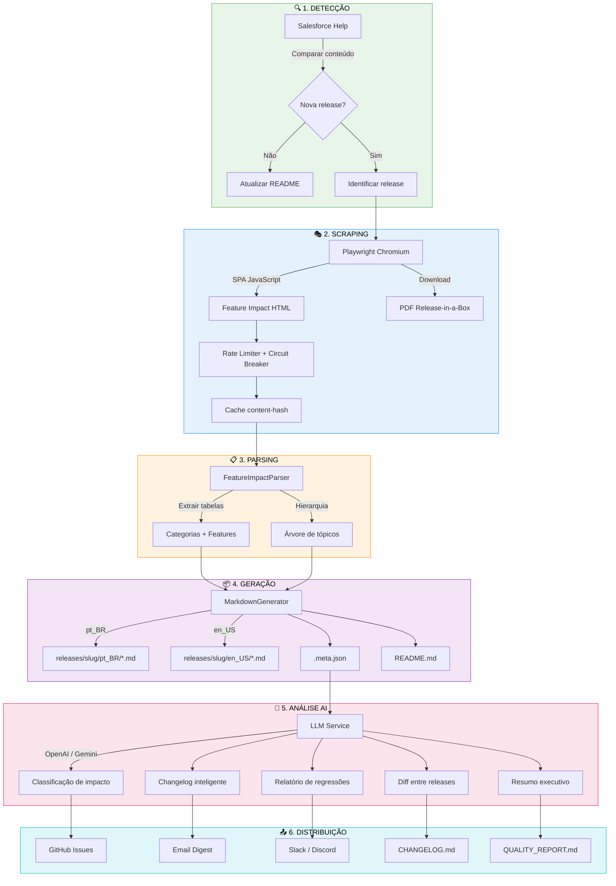
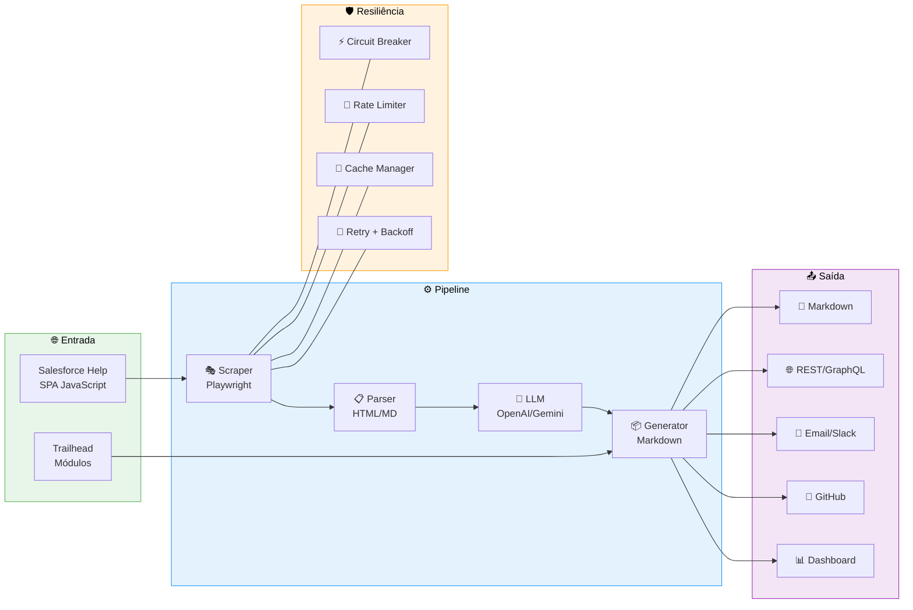
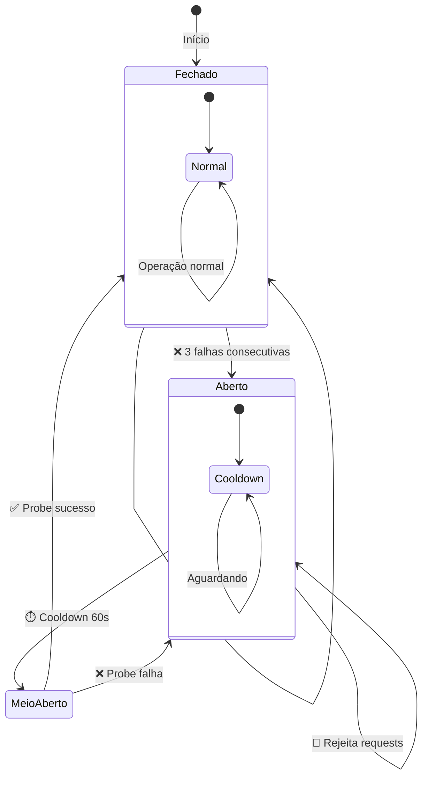
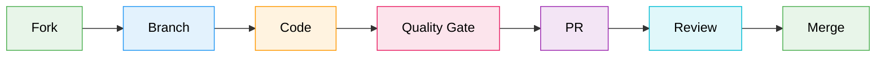

<div align="center">

# 🚀 Salesforce Release Notes Intelligence

### *Knowledge-as-Code para o ecossistema Salesforce*

[](https://github.com/Fatal1tyBarucco/Salesforce-WebDev/actions/workflows/python-quality.yml)
[](https://github.com/Fatal1tyBarucco/Salesforce-WebDev/actions/workflows/release_notes_pipeline.yml)
[](https://fatal1tybarucco.github.io/Salesforce-WebDev/)


**Pipeline automatizado** que transforma as Release Notes da Salesforce em artefatos Markdown estruturados, com análise AI, classificação de impacto e distribuição multi-canal.

[📚 Documentação](https://fatal1tybarucco.github.io/Salesforce-WebDev/) · [🐛 Reportar Bug](https://github.com/Fatal1tyBarucco/Salesforce-WebDev/issues) · [💡 Solicitar Feature](https://github.com/Fatal1tyBarucco/Salesforce-WebDev/issues)

</div>

---

## 🌟 O Que Este Projeto Faz

A cada trimestre, a Salesforce lança centenas de novas funcionalidades espalhadas por dezenas de categorias. **Acompanhar manualmente é inviável.**

Este repositório automatiza todo o ciclo:

```
┌─────────────────────────────────────────────────────────────────────┐
│                                                                     │
│   🌐 Salesforce Help ──▶ 🤖 Scraper ──▶ 🧠 AI ──▶ 📦 Markdown     │
│        (SPA)              (Playwright)   (LLM)    (Estruturado)     │
│                                                                     │
│                           ──▶ 📧 Email ──▶ 💬 Slack ──▶ 🐙 GitHub  │
│                              (Digest)     (Webhook)    (Issues)     │
│                                                                     │
└─────────────────────────────────────────────────────────────────────┘
```

### ✨ Capacidades

| Capacidade | Descrição |
|:-----------|:----------|
| 🔍 **Detecção Automática** | Detecta novas releases comparando conteúdo com a versão anterior |
| 🎭 **Scraping SPA** | Playwright renderiza JavaScript completo do portal Salesforce Help |
| 🧠 **Classificação AI** | Classifica features por impacto (Alto/Médio/Baixo) e tipo via LLM |
| 📊 **Relatórios Inteligentes** | Changelog, regressões, diff, qualidade — tudo gerado por AI |
| 🔄 **Deduplicação** | Content-hash evita reprocessar conteúdo inalterado |
| 📧 **Notificações** | Email, Slack e Discord com filtros por perfil de interesse |
| 🐙 **GitHub Integration** | Issues automáticas, PRs com triage, badges dinâmicos |
| 🌐 **REST + GraphQL API** | Acesso programático a todos os dados via HTTP |
| 📈 **Dashboard Interativo** | HTML com busca, comparação, heatmap e exportação CSV/JSON |
| 🏥 **Health Monitoring** | Endpoints `/health`, `/ready`, `/metrics` (Prometheus) |

---


## 📋 Releases Disponíveis

<div style="padding:12px;margin-bottom:20px;border:1px solid #d0d7de;border-radius:6px;background:#f6f8fa;text-align:center;"><strong>🌐 Idioma / Language:</strong> <strong>🇧🇷 Português</strong> | <a href="./README.en.md">🇺🇸 English</a></div>

### ☀️ Summer '26

> 📊 **Resumo Executivo:** 🚀 **Summer '26** — expansão significativa com **1600 recursos** em **22 categorias**.

**Principais destaques:**
• **Setores** (319 recursos, 20%)
• **Serviço** (210 recursos, 13%)
• **Desenvolvimento...


<details>
<summary><b>📄 Documentação legal (6 recursos)</b></summary>

> 📄 Detalhes completos: [./releases/summer_26/pt_BR/documentacao_legal.md](./releases/summer_26/pt_BR/documentacao_legal.md)

</details>


<details>
<summary><b>📄 Salesforce geral (36 recursos)</b></summary>

> 📄 Detalhes completos: [./releases/summer_26/pt_BR/salesforce_geral.md](./releases/summer_26/pt_BR/salesforce_geral.md)

</details>


<details>
<summary><b>📄 Agentforce (37 recursos)</b></summary>

> 📄 Detalhes completos: [./releases/summer_26/pt_BR/agentforce.md](./releases/summer_26/pt_BR/agentforce.md)

</details>


<details>
<summary><b>📄 Análise de dados (58 recursos)</b></summary>

> 📄 Detalhes completos: [./releases/summer_26/pt_BR/analise_de_dados.md](./releases/summer_26/pt_BR/analise_de_dados.md)

</details>


<details>
<summary><b>📄 Automação (118 recursos)</b></summary>

> 📄 Detalhes completos: [./releases/summer_26/pt_BR/automacao.md](./releases/summer_26/pt_BR/automacao.md)

</details>


<details>
<summary><b>📄 OmniStudio (9 recursos)</b></summary>

> 📄 Detalhes completos: [./releases/summer_26/pt_BR/omnistudio.md](./releases/summer_26/pt_BR/omnistudio.md)

</details>


<details>
<summary><b>📄 Personalização (33 recursos)</b></summary>

> 📄 Detalhes completos: [./releases/summer_26/pt_BR/personalizacao.md](./releases/summer_26/pt_BR/personalizacao.md)

</details>


<details>
<summary><b>📄 Data 360 (72 recursos)</b></summary>

> 📄 Detalhes completos: [./releases/summer_26/pt_BR/data_360.md](./releases/summer_26/pt_BR/data_360.md)

</details>


<details>
<summary><b>📄 Desenvolvimento (127 recursos)</b></summary>

> 📄 Detalhes completos: [./releases/summer_26/pt_BR/desenvolvimento.md](./releases/summer_26/pt_BR/desenvolvimento.md)

</details>


<details>
<summary><b>📄 Experience Cloud (14 recursos)</b></summary>

> 📄 Detalhes completos: [./releases/summer_26/pt_BR/experience_cloud.md](./releases/summer_26/pt_BR/experience_cloud.md)

</details>


<details>
<summary><b>📄 Field Service (48 recursos)</b></summary>

> 📄 Detalhes completos: [./releases/summer_26/pt_BR/field_service.md](./releases/summer_26/pt_BR/field_service.md)

</details>


<details>
<summary><b>📄 Hyperforce (3 recursos)</b></summary>

> 📄 Detalhes completos: [./releases/summer_26/pt_BR/hyperforce.md](./releases/summer_26/pt_BR/hyperforce.md)

</details>


<details>
<summary><b>📄 Setores (309 recursos)</b></summary>

> 📄 Detalhes completos: [./releases/summer_26/pt_BR/setores.md](./releases/summer_26/pt_BR/setores.md)

</details>


<details>
<summary><b>📄 Marketing (64 recursos)</b></summary>

> 📄 Detalhes completos: [./releases/summer_26/pt_BR/marketing.md](./releases/summer_26/pt_BR/marketing.md)

</details>


<details>
<summary><b>📄 MuleSoft (8 recursos)</b></summary>

> 📄 Detalhes completos: [./releases/summer_26/pt_BR/mulesoft.md](./releases/summer_26/pt_BR/mulesoft.md)

</details>


<details>
<summary><b>📄 Aplicativo móvel (17 recursos)</b></summary>

> 📄 Detalhes completos: [./releases/summer_26/pt_BR/aplicativo_movel.md](./releases/summer_26/pt_BR/aplicativo_movel.md)

</details>


<details>
<summary><b>📄 Partner Cloud (1 recursos)</b></summary>

> 📄 Detalhes completos: [./releases/summer_26/pt_BR/partner_cloud.md](./releases/summer_26/pt_BR/partner_cloud.md)

</details>


<details>
<summary><b>📄 Gerenciamento de receita (97 recursos)</b></summary>

> 📄 Detalhes completos: [./releases/summer_26/pt_BR/gerenciamento_de_receita.md](./releases/summer_26/pt_BR/gerenciamento_de_receita.md)

</details>


<details>
<summary><b>📄 Vendas (58 recursos)</b></summary>

> 📄 Detalhes completos: [./releases/summer_26/pt_BR/vendas.md](./releases/summer_26/pt_BR/vendas.md)

</details>


<details>
<summary><b>📄 Integrações do Salesforce para Slack (2 recursos)</b></summary>

> 📄 Detalhes completos: [./releases/summer_26/pt_BR/integracoes_do_salesforce_para_slack.md](./releases/summer_26/pt_BR/integracoes_do_salesforce_para_slack.md)

</details>


<details>
<summary><b>📄 Segurança, identidade e privacidade (58 recursos)</b></summary>

> 📄 Detalhes completos: [./releases/summer_26/pt_BR/seguranca_identidade_e_privacidade.md](./releases/summer_26/pt_BR/seguranca_identidade_e_privacidade.md)

</details>


<details>
<summary><b>📄 Serviço (198 recursos)</b></summary>

> 📄 Detalhes completos: [./releases/summer_26/pt_BR/servico.md](./releases/summer_26/pt_BR/servico.md)

</details>


<details>

<summary><h3>🌸 Spring '26</h3></summary>

> 📊 **Resumo Executivo:** 🚀 **Spring '26** — expansão significativa com **1598 recursos** em **21 categorias**.

**Principais destaques:**
• **Setores** (202 recursos, 13%)
• **Aplicativo móvel** (195 recursos, 12%)
• **Serviç...


<details>
<summary><b>📄 Documentação legal (6 recursos)</b></summary>

> 📄 Detalhes completos: [./releases/spring_26/pt_BR/documentacao_legal.md](./releases/spring_26/pt_BR/documentacao_legal.md)

</details>


<details>
<summary><b>📄 Salesforce geral (38 recursos)</b></summary>

> 📄 Detalhes completos: [./releases/spring_26/pt_BR/salesforce_geral.md](./releases/spring_26/pt_BR/salesforce_geral.md)

</details>


<details>
<summary><b>📄 Agentforce (35 recursos)</b></summary>

> 📄 Detalhes completos: [./releases/spring_26/pt_BR/agentforce.md](./releases/spring_26/pt_BR/agentforce.md)

</details>


<details>
<summary><b>📄 Análise de dados (54 recursos)</b></summary>

> 📄 Detalhes completos: [./releases/spring_26/pt_BR/analise_de_dados.md](./releases/spring_26/pt_BR/analise_de_dados.md)

</details>


<details>
<summary><b>📄 Automação (151 recursos)</b></summary>

> 📄 Detalhes completos: [./releases/spring_26/pt_BR/automacao.md](./releases/spring_26/pt_BR/automacao.md)

</details>


<details>
<summary><b>📄 Personalização (18 recursos)</b></summary>

> 📄 Detalhes completos: [./releases/spring_26/pt_BR/personalizacao.md](./releases/spring_26/pt_BR/personalizacao.md)

</details>


<details>
<summary><b>📄 Data 360 (53 recursos)</b></summary>

> 📄 Detalhes completos: [./releases/spring_26/pt_BR/data_360.md](./releases/spring_26/pt_BR/data_360.md)

</details>


<details>
<summary><b>📄 Desenvolvimento (97 recursos)</b></summary>

> 📄 Detalhes completos: [./releases/spring_26/pt_BR/desenvolvimento.md](./releases/spring_26/pt_BR/desenvolvimento.md)

</details>


<details>
<summary><b>📄 Experience Cloud (21 recursos)</b></summary>

> 📄 Detalhes completos: [./releases/spring_26/pt_BR/experience_cloud.md](./releases/spring_26/pt_BR/experience_cloud.md)

</details>


<details>
<summary><b>📄 Field Service (41 recursos)</b></summary>

> 📄 Detalhes completos: [./releases/spring_26/pt_BR/field_service.md](./releases/spring_26/pt_BR/field_service.md)

</details>


<details>
<summary><b>📄 Hyperforce (5 recursos)</b></summary>

> 📄 Detalhes completos: [./releases/spring_26/pt_BR/hyperforce.md](./releases/spring_26/pt_BR/hyperforce.md)

</details>


<details>
<summary><b>📄 Setores (194 recursos)</b></summary>

> 📄 Detalhes completos: [./releases/spring_26/pt_BR/setores.md](./releases/spring_26/pt_BR/setores.md)

</details>


<details>
<summary><b>📄 Aplicativo móvel (187 recursos)</b></summary>

> 📄 Detalhes completos: [./releases/spring_26/pt_BR/aplicativo_movel.md](./releases/spring_26/pt_BR/aplicativo_movel.md)

</details>


<details>
<summary><b>📄 Marketing (72 recursos)</b></summary>

> 📄 Detalhes completos: [./releases/spring_26/pt_BR/marketing.md](./releases/spring_26/pt_BR/marketing.md)

</details>


<details>
<summary><b>📄 MuleSoft (8 recursos)</b></summary>

> 📄 Detalhes completos: [./releases/spring_26/pt_BR/mulesoft.md](./releases/spring_26/pt_BR/mulesoft.md)

</details>


<details>
<summary><b>📄 OmniStudio (10 recursos)</b></summary>

> 📄 Detalhes completos: [./releases/spring_26/pt_BR/omnistudio.md](./releases/spring_26/pt_BR/omnistudio.md)

</details>


<details>
<summary><b>📄 Partner Cloud (4 recursos)</b></summary>

> 📄 Detalhes completos: [./releases/spring_26/pt_BR/partner_cloud.md](./releases/spring_26/pt_BR/partner_cloud.md)

</details>


<details>
<summary><b>📄 Gerenciamento de receita (131 recursos)</b></summary>

> 📄 Detalhes completos: [./releases/spring_26/pt_BR/gerenciamento_de_receita.md](./releases/spring_26/pt_BR/gerenciamento_de_receita.md)

</details>


<details>
<summary><b>📄 Vendas (85 recursos)</b></summary>

> 📄 Detalhes completos: [./releases/spring_26/pt_BR/vendas.md](./releases/spring_26/pt_BR/vendas.md)

</details>


<details>
<summary><b>📄 Segurança, identidade e privacidade (61 recursos)</b></summary>

> 📄 Detalhes completos: [./releases/spring_26/pt_BR/seguranca_identidade_e_privacidade.md](./releases/spring_26/pt_BR/seguranca_identidade_e_privacidade.md)

</details>


<details>
<summary><b>📄 Serviço (167 recursos)</b></summary>

> 📄 Detalhes completos: [./releases/spring_26/pt_BR/servico.md](./releases/spring_26/pt_BR/servico.md)

</details>

</details>


<details>

<summary><h3>❄️ Winter '26</h3></summary>

> 📊 **Resumo Executivo:** 🚀 **Winter '26** — expansão significativa com **1487 recursos** em **19 categorias**.

**Principais destaques:**
• **Setores** (467 recursos, 31%)
• **Partner Cloud** (164 recursos, 11%)
• **Vendas** ...


<details>
<summary><b>📄 Documentação legal (11 recursos)</b></summary>

> 📄 Detalhes completos: [./releases/winter_26/pt_BR/documentacao_legal.md](./releases/winter_26/pt_BR/documentacao_legal.md)

</details>


<details>
<summary><b>📄 Salesforce geral (32 recursos)</b></summary>

> 📄 Detalhes completos: [./releases/winter_26/pt_BR/salesforce_geral.md](./releases/winter_26/pt_BR/salesforce_geral.md)

</details>


<details>
<summary><b>📄 Análise de dados (91 recursos)</b></summary>

> 📄 Detalhes completos: [./releases/winter_26/pt_BR/analise_de_dados.md](./releases/winter_26/pt_BR/analise_de_dados.md)

</details>


<details>
<summary><b>📄 Personalização (65 recursos)</b></summary>

> 📄 Detalhes completos: [./releases/winter_26/pt_BR/personalizacao.md](./releases/winter_26/pt_BR/personalizacao.md)

</details>


<details>
<summary><b>📄 Desenvolvimento (101 recursos)</b></summary>

> 📄 Detalhes completos: [./releases/winter_26/pt_BR/desenvolvimento.md](./releases/winter_26/pt_BR/desenvolvimento.md)

</details>


<details>
<summary><b>📄 Agentforce (39 recursos)</b></summary>

> 📄 Detalhes completos: [./releases/winter_26/pt_BR/agentforce.md](./releases/winter_26/pt_BR/agentforce.md)

</details>


<details>
<summary><b>📄 Experience Cloud (8 recursos)</b></summary>

> 📄 Detalhes completos: [./releases/winter_26/pt_BR/experience_cloud.md](./releases/winter_26/pt_BR/experience_cloud.md)

</details>


<details>
<summary><b>📄 Field Service (24 recursos)</b></summary>

> 📄 Detalhes completos: [./releases/winter_26/pt_BR/field_service.md](./releases/winter_26/pt_BR/field_service.md)

</details>


<details>
<summary><b>📄 Hyperforce (5 recursos)</b></summary>

> 📄 Detalhes completos: [./releases/winter_26/pt_BR/hyperforce.md](./releases/winter_26/pt_BR/hyperforce.md)

</details>


<details>
<summary><b>📄 Setores (459 recursos)</b></summary>

> 📄 Detalhes completos: [./releases/winter_26/pt_BR/setores.md](./releases/winter_26/pt_BR/setores.md)

</details>


<details>
<summary><b>📄 Marketing (87 recursos)</b></summary>

> 📄 Detalhes completos: [./releases/winter_26/pt_BR/marketing.md](./releases/winter_26/pt_BR/marketing.md)

</details>


<details>
<summary><b>📄 MuleSoft (4 recursos)</b></summary>

> 📄 Detalhes completos: [./releases/winter_26/pt_BR/mulesoft.md](./releases/winter_26/pt_BR/mulesoft.md)

</details>


<details>
<summary><b>📄 Aplicativo móvel (7 recursos)</b></summary>

> 📄 Detalhes completos: [./releases/winter_26/pt_BR/aplicativo_movel.md](./releases/winter_26/pt_BR/aplicativo_movel.md)

</details>


<details>
<summary><b>📄 OmniStudio (8 recursos)</b></summary>

> 📄 Detalhes completos: [./releases/winter_26/pt_BR/omnistudio.md](./releases/winter_26/pt_BR/omnistudio.md)

</details>


<details>
<summary><b>📄 Partner Cloud (156 recursos)</b></summary>

> 📄 Detalhes completos: [./releases/winter_26/pt_BR/partner_cloud.md](./releases/winter_26/pt_BR/partner_cloud.md)

</details>


<details>
<summary><b>📄 Vendas (154 recursos)</b></summary>

> 📄 Detalhes completos: [./releases/winter_26/pt_BR/vendas.md](./releases/winter_26/pt_BR/vendas.md)

</details>


<details>
<summary><b>📄 Integrações do Salesforce para Slack (1 recursos)</b></summary>

> 📄 Detalhes completos: [./releases/winter_26/pt_BR/integracoes_do_salesforce_para_slack.md](./releases/winter_26/pt_BR/integracoes_do_salesforce_para_slack.md)

</details>


<details>
<summary><b>📄 Segurança, identidade e privacidade (55 recursos)</b></summary>

> 📄 Detalhes completos: [./releases/winter_26/pt_BR/seguranca_identidade_e_privacidade.md](./releases/winter_26/pt_BR/seguranca_identidade_e_privacidade.md)

</details>


<details>
<summary><b>📄 Serviço (41 recursos)</b></summary>

> 📄 Detalhes completos: [./releases/winter_26/pt_BR/servico.md](./releases/winter_26/pt_BR/servico.md)

</details>

</details>


## 🏗️ Como Funciona

### Fluxo do Pipeline



### Arquitetura em Camadas



---

## ⚡ Quick Start

### Pré-requisitos

| Requisito | Versão | Instalação |
|:----------|:-------|:-----------|
| Python | 3.12+ | [python.org](https://www.python.org/) |
| uv | Latest | `curl -LsSf https://astral.sh/uv/install.sh \| sh` |
| Playwright | Chromium | `uv run playwright install chromium` |

### Instalação

```bash
# 1. Clone o repositório
git clone https://github.com/Fatal1tyBarucco/Salesforce-WebDev.git
cd Salesforce-WebDev

# 2. Instale dependências
uv sync --extra dev

# 3. Instale o navegador Playwright
uv run playwright install chromium

# 4. Instale os hooks de pré-commit (ruff, black, mypy, pytest)
uv run pre-commit install
uv run pre-commit install --hook-type pre-push

# 5. Configure as chaves LLM (pelo menos uma)
export OPENAI_API_KEY="sk-..."    # ou
export GOOGLE_API_KEY="AIza..."   # ou
export OPENCODE_API_KEY="..."     # ou
export MIMOCODE_API_KEY="..."
```

### Execução

```bash
# Pipeline completo
uv run python src/main.py

# Release específica
uv run python src/main.py --release summer_26

# Dry run (sem escrever arquivos)
uv run python src/main.py --dry-run

# Iniciar API server
uv run python -c "from src.api import start_api_server; start_api_server()"

# Iniciar health server
uv run python -c "from src.health import start_health_server; start_health_server()"
```

---

## 🛡️ Resiliência

O pipeline foi projetado para operar de forma autônoma e resiliente:



| Componente | Configuração | Comportamento |
|:-----------|:-------------|:--------------|
| ⚡ **Circuit Breaker** | 3 falhas → 60s cooldown | Para após falhas consecutivas, retoma automaticamente |
| 🚦 **Rate Limiter** | Token-bucket, 2 req/s | Respeita limites do Salesforce |
| 🔄 **Retry** | 5 tentativas, backoff exponencial | `2^n` segundos + jitter aleatório |
| 💾 **Cache TTL** | 24h (metadata), 30d (content-hash) | Evita refetch de conteúdo inalterado |
| ⏱️ **Timeout** | 30s (HTTP), 60s (LLM) | Nunca fica preso indefinidamente |

---

## 🧪 Qualidade de Código

```bash
# Quality gate completa (mesma do CI)
uv run ruff check src/          # Linter
uv run black --check src/       # Formatter
uv run mypy src/                # Type checker (strict)
uv run pytest tests/ --cov=src --cov-fail-under=95  # Tests + coverage
```

| Ferramenta | Configuração | Status |
|:-----------|:-------------|:------:|
| 🐍 **Python** | 3.12-3.13, type hints completos | ✅ |
| 🔍 **Mypy** | `strict = true` | ✅ |
| ⚡ **Ruff** | `line-length = 100` | ✅ |
| 🖤 **Black** | `target-version = py313` | ✅ |
| 🧪 **Pytest** | 95.71% cobertura | ✅ |
| 📦 **uv** | Lock file determinístico | ✅ |

---

## 🌐 API

O projeto expõe uma API REST + GraphQL standalone (zero dependências externas):

### REST

```bash
# Listar todas as releases
curl http://localhost:8081/releases

# Detalhes de uma release
curl http://localhost:8081/releases/summer_26

# Features de uma categoria
curl http://localhost:8081/releases/summer_26/categories/agentforce

# Comparar duas releases
curl http://localhost:8081/diff/summer_26/spring_26
```

### GraphQL

```bash
# Query flexível
curl -X POST http://localhost:8081/graphql \
  -H "Content-Type: application/json" \
  -d '{"query": "{ releases { name totalFeatures categories { name count } } }"}'
```

### Health & Metrics

```bash
# Health check
curl http://localhost:8080/health

# Readiness probe
curl http://localhost:8080/ready

# Prometheus metrics
curl http://localhost:8080/metrics
```

---

## 📁 Estrutura do Projeto

```
Salesforce-WebDev/
│
├── 📂 src/                          # Código fonte
│   ├── main.py                      # 🎯 Orquestrador principal + DI
│   ├── scraper.py                   # 🎭 Playwright + Circuit Breaker
│   ├── parser.py                    # 📋 Parser HTML/Markdown
│   ├── llm_service.py               # 🧠 Multi-provider LLM
│   ├── generator.py                 # 📦 Geração Markdown
│   ├── config.py                    # ⚙️ Configuração central
│   ├── exceptions.py                # ⚠️ Hierarquia de exceções
│   ├── circuit_breaker.py           # ⚡ Circuit Breaker unificado
│   ├── cache_manager.py             # 💾 Cache TTL + content-hash
│   ├── health.py                    # 🏥 Health checks + métricas
│   ├── api.py                       # 🌐 REST + GraphQL + OpenAPI
│   ├── notifications.py             # 📧 Email/Slack/Discord
│   ├── salesforce.py                # 🔗 Trailhead integration
│   ├── feature_classifier.py        # 🏷️ Classificação via LLM
│   ├── impact_analyzer.py           # 📊 Análise de impacto
│   ├── issue_triage.py              # 🐙 Triage automático
│   ├── logger.py                    # 📝 Logging JSON estruturado
│   ├── translator.py                # 🌍 Tradução via LLM
│   ├── dashboard.py                 # 📈 Dashboard HTML interativo
│   └── automation/                  # 🤖 Pacote de automação AI
│       ├── service.py               #    Facade principal
│       ├── reporting.py             #    Relatórios AI
│       ├── comparison.py            #    Comparação entre releases
│       ├── impact.py                #    Scores de impacto
│       ├── content.py               #    Deduplicação
│       ├── export.py                #    Exportação JSON/CSV
│       ├── github_ops.py            #    GitHub Issues
│       ├── notifications.py         #    Notificações filtradas
│       ├── models.py                #    Dataclasses
│       └── badge.py                 #    Badges dinâmicos
│
├── 📂 releases/                     # 📄 Artefatos Markdown
│   ├── summer_26/
│   ├── spring_26/
│   └── winter_26/
│
├── 📂 tests/                        # 🧪 Testes pytest
├── 📂 docs/                         # 📚 Documentação MkDocs
├── 📂 .github/workflows/            # 🔄 CI/CD GitHub Actions
│
├── mkdocs.yml                       # 📖 Config MkDocs
├── pyproject.toml                   # 📦 Config do projeto
└── uv.lock                          # 🔒 Lock file
```

---

## 🤝 Contribuição



1. **Fork** o repositório
2. Crie uma branch: `git checkout -b feature/minha-feature`
3. Instale dependências: `uv sync --extra dev`
4. Execute a quality gate completa:
   ```bash
   uv run ruff check src/ && uv run black --check src/ && uv run mypy src/ && uv run pytest --cov=src --cov-fail-under=95
   ```
5. Commit: `git commit -m 'feat: descrição da alteração'`
6. Push: `git push origin feature/minha-feature`
7. Abra um **Pull Request**

---

## 📄 Licença

Este projeto é mantido para fins educacionais e de referência técnica.

---

<div align="center">

**Feito com ☕ e código Python**

[⬆ Voltar ao topo](#-salesforce-release-notes-intelligence)

</div>
