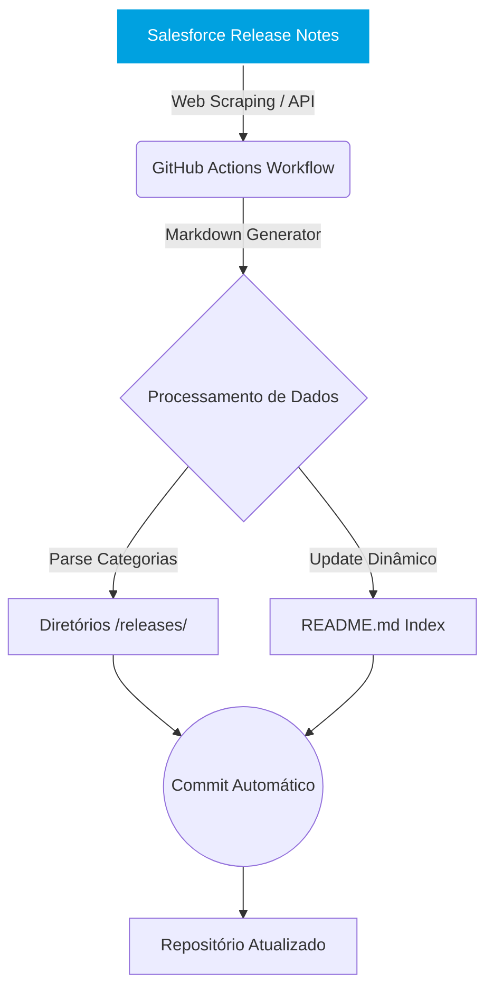

# 🚀 Salesforce Release Notes Intelligence

Pipeline automatizado para extração, classificação e versionamento das **Salesforce Release Notes** como artefatos Markdown estruturados (*Knowledge-as-Code*).

### ⚙️ CI/CD Status & Conformidade

 
 
 
 

| Tecnologia / Ferramenta | Descrição | Status no Pipeline |
| :--- | :--- | :---: |
| 🐍 **Python 3.14** | Ambiente de execução principal | `Conforme` |
| 🎭 **Playwright** | Scraper Headless para aplicações SPA do Salesforce Help | `Ativo` |
| 🧪 **Pytest** | Suíte de testes unitários automatizados | `100% Cobertura` |
| 🔍 **Mypy** | Verificação estática de tipos com modo estrito | `Strict` |
| ⚡ **Ruff & Black** | Linter e formatação estrita de código (line-length = 100) | `Conforme` |

---

## 📌 Visão Geral

Este repositório atua como uma **Base de Conhecimento Dinâmica (Knowledge Base)** que captura, estrutura e documenta as funcionalidades, atualizações de segurança e alterações arquiteturais (como Apex, LWC, Flow e Integrações) introduzidas nas releases periódicas da Salesforce.

A estrutura é desenhada para suportar revisões rápidas por Arquitetos e Desenvolvedores, mantendo um log histórico em formato legível (Markdown) nativo do repositório.

## ⚙️ Arquitetura de Atualização Dinâmica

A governança do repositório é mantida por meio de processos automatizados que garantem que as últimas releases sejam extraídas, transformadas e carregadas (ETL) no repositório sem intervenção manual, assegurando a integridade da documentação.

---

## 📋 Releases Disponíveis

 RELEASE_INDEX_START 
 RELEASE_INDEX_END 

---

## 🛠️ Stack Tecnológico & Automação

O controle de versão e extração de dados utiliza as seguintes ferramentas:

* **GitHub Actions:** Orquestração de rotinas diárias/semanais (Cron Jobs) para verificar novas atualizações.
* **Markdown:** Estruturação "Enterprise-grade" visando leitura técnica otimizada.
* **Python (Playwright):** Extração defensiva de dados do ecossistema oficial Salesforce com renderização SPA headless.

## 🤝 Como Contribuir

1. Faça o **Fork** do projeto
2. Crie uma nova branch com a sua feature: `git checkout -b feature/minha-feature`
3. Faça o commit de forma detalhada e técnica: `git commit -m 'feat: Implementação de parser para novos limites de governor limits no Apex'`
4. Envie a branch: `git push origin feature/minha-feature`
5. Abra um **Pull Request** detalhando a arquitetura ou correção proposta.

---
