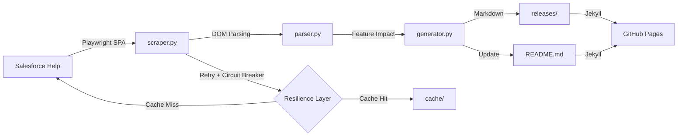

# 🚀 Salesforce Release Notes Intelligence

Pipeline automatizado para extração, classificação e versionamento das **Salesforce Release Notes** como artefatos Markdown estruturados (*Knowledge-as-Code*).

### ⚙️ CI/CD Status & Conformidade

<!-- RELEASE_BADGE -->

[](https://github.com/Fatal1tyBarucco/Salesforce-WebDev/actions/workflows/python-quality.yml)
[](https://github.com/Fatal1tyBarucco/Salesforce-WebDev/actions/workflows/release_notes_pipeline.yml)


| Tecnologia / Ferramenta | Descrição | Status no Pipeline |
| :--- | :--- | :---: |
| 🐍 **Python 3.14** | Ambiente de execução principal | `Conforme` |
| 🎭 **Playwright** | Scraper Headless para aplicações SPA do Salesforce Help | `Ativo` |
| 🧪 **Pytest** | Suíte de testes unitários automatizados | `450+ testes` |
| 🔍 **Mypy** | Verificação estática de tipos com modo estrito | `Strict` |
| ⚡ **Ruff & Black** | Linter e formatação estrita de código (line-length = 100) | `Conforme` |
| 📦 **uv** | Gerenciamento de dependências com lock file determinístico | `Ativo` |

---

## 📖 Visão Geral

Este repositório contém um pipeline ETL assíncrono para scraping das *Salesforce Release Notes*, processamento local para classificação e sumarização, e geração de documentação estática via **MkDocs**.

## 🏗️ Arquitetura do Sistema



**Princípios de Design:**
* **Separação de Conceitos (SoC):** Camadas isoladas para rede (`scraper.py`), parsing (`parser.py`), geração (`generator.py`)
* **I/O Não Bloqueante:** `asyncio` + Playwright async para processamento paralelo
* **Resiliência:** Circuit Breaker + Token-bucket rate limiter + Exponential backoff com jitter

## ⚙️ Pré-requisitos e Instalação

Este projeto utiliza `uv` para gerenciamento determinístico de dependências.

```bash
# Instale o uv
curl -LsSf https://astral.sh/uv/install.sh | sh

# Clone e instale
git clone https://github.com/Fatal1tyBarucco/Salesforce-WebDev.git
cd Salesforce-WebDev
uv sync

# Instale browsers do Playwright
uv run playwright install chromium
```

## 🚀 Uso e Execução

```bash
# Executar pipeline completo
uv run python -m src.main

# Executar release específica
uv run python -m src.main --release summer_26

# Dry run (sem escrever arquivos)
uv run python -m src.main --dry-run
```

## 🛡️ Governança e Resiliência

| Componente | Configuração | Descrição |
| :--- | :--- | :--- |
| **Rate Limiter** | 2 req/s, token-bucket | Evita throttling do Salesforce |
| **Circuit Breaker** | 3 falhas → cooldown 60s | Para requisições após falhas consecutivas |
| **Cache TTL** | 24 horas | Previne refetch de conteúdo não alterado |
| **Exponential Backoff** | Base 2s + jitter | Retry inteligente com anti-thundering-herd |

## 🧪 Testes e Qualidade

```bash
# Executar testes
uv run pytest tests/

# Com cobertura
uv run pytest tests/ --cov=src --cov-report=term-missing

# Quality gate (ordem CI)
uv run ruff check src/
uv run black --check src/
uv run mypy src/
```

**Meta:** Cobertura >99%, zero erros de tipo, zero warnings de lint.

---


## 📋 Releases Disponíveis

<div id="lang-toggle" style="padding:12px;margin-bottom:20px;border:1px solid #d0d7de;border-radius:6px;background:#f6f8fa;text-align:center;"><strong>🌐 Idioma:</strong> <a href="#" onclick="switchLang('pt_BR');return false;" id="btn-pt_BR" style="margin:0 8px;text-decoration:none;font-weight:bold;">🇧🇷 Português</a> <a href="#" onclick="switchLang('en_US');return false;" id="btn-en_US" style="margin:0 8px;text-decoration:none;">🇺🇸 English</a></div><script>(function(){var lang = navigator.language || navigator.userLanguage || 'pt-BR';lang = lang.startsWith('en') ? 'en_US' : 'pt_BR';switchLang(lang);function switchLang(l) {document.querySelectorAll('[data-lang]').forEach(function(el) {el.style.display = el.getAttribute('data-lang') === l ? 'block' : 'none';});document.getElementById('btn-pt_BR').style.fontWeight = l === 'pt_BR' ? 'bold' : 'normal';document.getElementById('btn-en_US').style.fontWeight = l === 'en_US' ? 'bold' : 'normal';}window.switchLang = switchLang;})();</script>

<div data-lang="pt_BR">

### ❄️ Winter '26


<details>
<summary><b>📄 Documentação legal (11 recursos)</b></summary>

> 📄 Detalhes completos: [./releases/winter_26/pt_BR/documentacao_legal.md](./releases/winter_26/pt_BR/documentacao_legal.md)

</details>


<details>
<summary><b>📄 Salesforce geral (32 recursos)</b></summary>

> 📄 Detalhes completos: [./releases/winter_26/pt_BR/salesforce_geral.md](./releases/winter_26/pt_BR/salesforce_geral.md)

</details>


<details>
<summary><b>📄 Análise de dados (91 recursos)</b></summary>

> 📄 Detalhes completos: [./releases/winter_26/pt_BR/analise_de_dados.md](./releases/winter_26/pt_BR/analise_de_dados.md)

</details>


<details>
<summary><b>📄 Personalização (65 recursos)</b></summary>

> 📄 Detalhes completos: [./releases/winter_26/pt_BR/personalizacao.md](./releases/winter_26/pt_BR/personalizacao.md)

</details>


<details>
<summary><b>📄 Desenvolvimento (101 recursos)</b></summary>

> 📄 Detalhes completos: [./releases/winter_26/pt_BR/desenvolvimento.md](./releases/winter_26/pt_BR/desenvolvimento.md)

</details>


<details>
<summary><b>📄 Agentforce (39 recursos)</b></summary>

> 📄 Detalhes completos: [./releases/winter_26/pt_BR/agentforce.md](./releases/winter_26/pt_BR/agentforce.md)

</details>


<details>
<summary><b>📄 Experience Cloud (8 recursos)</b></summary>

> 📄 Detalhes completos: [./releases/winter_26/pt_BR/experience_cloud.md](./releases/winter_26/pt_BR/experience_cloud.md)

</details>


<details>
<summary><b>📄 Field Service (24 recursos)</b></summary>

> 📄 Detalhes completos: [./releases/winter_26/pt_BR/field_service.md](./releases/winter_26/pt_BR/field_service.md)

</details>


<details>
<summary><b>📄 Hyperforce (5 recursos)</b></summary>

> 📄 Detalhes completos: [./releases/winter_26/pt_BR/hyperforce.md](./releases/winter_26/pt_BR/hyperforce.md)

</details>


<details>
<summary><b>📄 Setores (459 recursos)</b></summary>

> 📄 Detalhes completos: [./releases/winter_26/pt_BR/setores.md](./releases/winter_26/pt_BR/setores.md)

</details>


<details>
<summary><b>📄 Marketing (87 recursos)</b></summary>

> 📄 Detalhes completos: [./releases/winter_26/pt_BR/marketing.md](./releases/winter_26/pt_BR/marketing.md)

</details>


<details>
<summary><b>📄 MuleSoft (4 recursos)</b></summary>

> 📄 Detalhes completos: [./releases/winter_26/pt_BR/mulesoft.md](./releases/winter_26/pt_BR/mulesoft.md)

</details>


<details>
<summary><b>📄 Aplicativo móvel (7 recursos)</b></summary>

> 📄 Detalhes completos: [./releases/winter_26/pt_BR/aplicativo_movel.md](./releases/winter_26/pt_BR/aplicativo_movel.md)

</details>


<details>
<summary><b>📄 OmniStudio (8 recursos)</b></summary>

> 📄 Detalhes completos: [./releases/winter_26/pt_BR/omnistudio.md](./releases/winter_26/pt_BR/omnistudio.md)

</details>


<details>
<summary><b>📄 Partner Cloud (156 recursos)</b></summary>

> 📄 Detalhes completos: [./releases/winter_26/pt_BR/partner_cloud.md](./releases/winter_26/pt_BR/partner_cloud.md)

</details>


<details>
<summary><b>📄 Vendas (154 recursos)</b></summary>

> 📄 Detalhes completos: [./releases/winter_26/pt_BR/vendas.md](./releases/winter_26/pt_BR/vendas.md)

</details>


<details>
<summary><b>📄 Integrações do Salesforce para Slack (1 recursos)</b></summary>

> 📄 Detalhes completos: [./releases/winter_26/pt_BR/integracoes_do_salesforce_para_slack.md](./releases/winter_26/pt_BR/integracoes_do_salesforce_para_slack.md)

</details>


<details>
<summary><b>📄 Segurança, identidade e privacidade (55 recursos)</b></summary>

> 📄 Detalhes completos: [./releases/winter_26/pt_BR/seguranca_identidade_e_privacidade.md](./releases/winter_26/pt_BR/seguranca_identidade_e_privacidade.md)

</details>


<details>
<summary><b>📄 Serviço (41 recursos)</b></summary>

> 📄 Detalhes completos: [./releases/winter_26/pt_BR/servico.md](./releases/winter_26/pt_BR/servico.md)

</details>

</div>


<div data-lang="en_US">

### ❄️ Winter '26


<details>
<summary><b>📄 Legal Documentation (11 features)</b></summary>

> 📄 Detalhes completos: [./releases/winter_26/en_US/documentacao_legal.md](./releases/winter_26/en_US/documentacao_legal.md)

</details>


<details>
<summary><b>📄 Salesforce General (32 features)</b></summary>

> 📄 Detalhes completos: [./releases/winter_26/en_US/salesforce_geral.md](./releases/winter_26/en_US/salesforce_geral.md)

</details>


<details>
<summary><b>📄 Data Analysis (91 features)</b></summary>

> 📄 Detalhes completos: [./releases/winter_26/en_US/analise_de_dados.md](./releases/winter_26/en_US/analise_de_dados.md)

</details>


<details>
<summary><b>📄 Customization (65 features)</b></summary>

> 📄 Detalhes completos: [./releases/winter_26/en_US/personalizacao.md](./releases/winter_26/en_US/personalizacao.md)

</details>


<details>
<summary><b>📄 Development (101 features)</b></summary>

> 📄 Detalhes completos: [./releases/winter_26/en_US/desenvolvimento.md](./releases/winter_26/en_US/desenvolvimento.md)

</details>


<details>
<summary><b>📄 Agentforce (39 features)</b></summary>

> 📄 Detalhes completos: [./releases/winter_26/en_US/agentforce.md](./releases/winter_26/en_US/agentforce.md)

</details>


<details>
<summary><b>📄 Experience Cloud (8 features)</b></summary>

> 📄 Detalhes completos: [./releases/winter_26/en_US/experience_cloud.md](./releases/winter_26/en_US/experience_cloud.md)

</details>


<details>
<summary><b>📄 Field Service (24 features)</b></summary>

> 📄 Detalhes completos: [./releases/winter_26/en_US/field_service.md](./releases/winter_26/en_US/field_service.md)

</details>


<details>
<summary><b>📄 Hyperforce (5 features)</b></summary>

> 📄 Detalhes completos: [./releases/winter_26/en_US/hyperforce.md](./releases/winter_26/en_US/hyperforce.md)

</details>


<details>
<summary><b>📄 Industries (459 features)</b></summary>

> 📄 Detalhes completos: [./releases/winter_26/en_US/setores.md](./releases/winter_26/en_US/setores.md)

</details>


<details>
<summary><b>📄 Marketing (87 features)</b></summary>

> 📄 Detalhes completos: [./releases/winter_26/en_US/marketing.md](./releases/winter_26/en_US/marketing.md)

</details>


<details>
<summary><b>📄 MuleSoft (4 features)</b></summary>

> 📄 Detalhes completos: [./releases/winter_26/en_US/mulesoft.md](./releases/winter_26/en_US/mulesoft.md)

</details>


<details>
<summary><b>📄 Mobile App (7 features)</b></summary>

> 📄 Detalhes completos: [./releases/winter_26/en_US/aplicativo_movel.md](./releases/winter_26/en_US/aplicativo_movel.md)

</details>


<details>
<summary><b>📄 OmniStudio (8 features)</b></summary>

> 📄 Detalhes completos: [./releases/winter_26/en_US/omnistudio.md](./releases/winter_26/en_US/omnistudio.md)

</details>


<details>
<summary><b>📄 Partner Cloud (156 features)</b></summary>

> 📄 Detalhes completos: [./releases/winter_26/en_US/partner_cloud.md](./releases/winter_26/en_US/partner_cloud.md)

</details>


<details>
<summary><b>📄 Sales (154 features)</b></summary>

> 📄 Detalhes completos: [./releases/winter_26/en_US/vendas.md](./releases/winter_26/en_US/vendas.md)

</details>


<details>
<summary><b>📄 Salesforce Slack Integrations (1 features)</b></summary>

> 📄 Detalhes completos: [./releases/winter_26/en_US/integracoes_do_salesforce_para_slack.md](./releases/winter_26/en_US/integracoes_do_salesforce_para_slack.md)

</details>


<details>
<summary><b>📄 Security, Identity & Privacy (55 features)</b></summary>

> 📄 Detalhes completos: [./releases/winter_26/en_US/seguranca_identidade_e_privacidade.md](./releases/winter_26/en_US/seguranca_identidade_e_privacidade.md)

</details>


<details>
<summary><b>📄 Service (41 features)</b></summary>

> 📄 Detalhes completos: [./releases/winter_26/en_US/servico.md](./releases/winter_26/en_US/servico.md)

</details>

</div>

## 🛠️ Stack Tecnológico

| Ferramenta | Uso no Projeto |
| :--- | :--- |
| **GitHub Actions** | CI/CD: lint, typecheck, extração, deploy automático |
| **uv** | Gerenciamento de dependências com lock file determinístico |
| **Playwright** | Scraper headless para páginas SPA do Salesforce Help |
| **Python 3.14** | Linguagem principal com type hints completos |
| **BeautifulSoup** | Parser HTML para extração de dados estruturados |
| **Markdown** | Formato de saída para documentação técnica |
| **MkDocs** | Portal técnico publicado no GitHub Pages |
| **stdlib HTTP** | REST API e health check server (zero dependências externas) |
| **gh CLI** | PR workflow e GitHub integration |

### Módulos do Pipeline

| Módulo | Responsabilidade |
| :--- | :--- |
| `src/main.py` | Orquestrador: detectar releases, extrair, parse, gerar, atualizar README |
| `src/scraper.py` | Playwright headless, circuit breaker, rate limiter, cache, download PDF |
| `src/parser.py` | Extração de hierarquia ToC + tabela Feature Impact |
| `src/generator.py` | Gera arquivos `.md` por categoria |
| `src/ai_automation.py` | Comparação entre releases, detecção de regressões, quality metrics |
| `src/analytics.py` | Dashboard HTML com gráficos SVG |
| `src/api.py` | REST API para acesso programático |
| `src/notifications.py` | Email digest, Slack/Discord webhooks |
| `src/dashboard.py` | Dashboard interativo com JS |
| `src/workflow.py` | PR-based workflow com triage |
| `src/salesforce.py` | Trailhead linking, org limits, sandbox readiness |
| `src/health.py` | Health check (`/health`, `/ready`), Prometheus metrics (`/metrics`) |
| `src/logger.py` | Logging estruturado com correlation IDs |

---

## 🤝 Como Contribuir

1. Faça o **Fork** do projeto
2. Crie uma nova branch: `git checkout -b feature/minha-feature`
3. Instale dependências: `uv sync --extra dev`
4. Execute a quality gate:
   ```bash
   uv run ruff check src/
   uv run black --check src/
   uv run mypy src/
   uv run pytest tests/ --cov=src --cov-fail-under=99
   ```
5. Faça o commit: `git commit -m 'feat: descrição da alteração'`
6. Envie: `git push origin feature/minha-feature`
7. Abra um **Pull Request**

---

## 📄 Licença

Este projeto é mantido para fins educacionais e de referência técnica.
