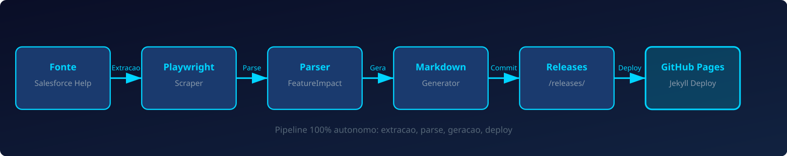

# 🚀 Salesforce Release Notes Intelligence

Pipeline automatizado para extração, classificação e versionamento das **Salesforce Release Notes** como artefatos Markdown estruturados (*Knowledge-as-Code*).

### ⚙️ CI/CD Status & Conformidade

<!-- RELEASE_BADGE -->

| Tecnologia / Ferramenta | Descrição | Status no Pipeline |
| :--- | :--- | :---: |
| 🐍 **Python 3.14** | Ambiente de execução principal | `Conforme` |
| 🎭 **Playwright** | Scraper Headless para aplicações SPA do Salesforce Help | `Ativo` |
| 🧪 **Pytest** | Suíte de testes unitários automatizados | `450+ testes` |
| 🔍 **Mypy** | Verificação estática de tipos com modo estrito | `Strict` |
| ⚡ **Ruff & Black** | Linter e formatação estrita de código (line-length = 100) | `Conforme` |

---

## 📌 Visão Geral

Este repositório atua como uma **Base de Conhecimento Dinâmica (Knowledge Base)** que captura, estrutura e documenta as funcionalidades, atualizações de segurança e alterações arquiteturais introduzidas nas releases periódicas da **Salesforce** (Spring, Summer, Winter).

A estrutura é desenhada para suportar revisões rápidas por **Arquitetos** e **Desenvolvedores**, mantendo um log histórico em formato legível (Markdown) nativo do repositório.

---

## ⚙️ Arquitetura de Atualização Dinâmica

A governança do repositório é mantida por meio de processos automatizados que garantem que as últimas releases sejam extraídas, transformadas e carregadas (ETL) no repositório **sem intervenção manual**.

### Fluxo de Execução

1. **Detecção**: Compara conteúdo da página atual vs. próxima release
2. **Extração**: Playwright extrai tabela Feature Impact (todas as categorias)
3. **Geração**: Arquivos `.md` por categoria com flags de disponibilidade
4. **PDF**: Download automático do "Release in a Box" via botão da página
5. **Index**: README.md atualizado com `
/
` por categoria
6. **Deploy**: Jekyll publica no GitHub Pages automaticamente

---

## 🚀 V3 — Production Hardening & Analytics

O pipeline V3 adiciona camadas de confiabilidade, analytics, notificações e integração:

### Production Hardening ✅

| Feature | Módulo | Descrição |
| :--- | :--- | :--- |
| **Rate Limiter** | `src/scraper.py` | Token-bucket a 2 req/s para evitar throttling do Salesforce |
| **Circuit Breaker** | `src/scraper.py` | Falha após 3 erros consecutivos, cooldown de 60s |
| **Graceful Degradation** | `src/scraper.py` | Continua com dados em cache quando fetch falha |
| **Structured Logging** | `src/logger.py` | JSON + text formatters com correlation IDs |
| **Health Check** | `src/health.py` | `/health`, `/ready`, `/metrics` (Prometheus) |

### Analytics & Dashboard ✅

| Feature | Módulo | Descrição |
| :--- | :--- | :--- |
| **Analytics Dashboard** | `src/analytics.py` | Dashboard HTML estático com SVG (categorias, tendências, confiança) |
| **Interactive Dashboard** | `src/dashboard.py` | Busca, filtros, comparação lado a lado, heatmap, export CSV/JSON |
| **REST API** | `src/api.py` | `/releases`, `/releases/{slug}`, `/diff/{a}/{b}` — stdlib HTTP |

### Notifications ✅

| Feature | Módulo | Descrição |
| :--- | :--- | :--- |
| **Email Digest** | `src/notifications.py` | Digest HTML via SMTP após cada release |
| **Slack Webhook** | `src/notifications.py` | Block Kit formatado |
| **Discord Webhook** | `src/notifications.py` | Embeds formatados |
| **Profiles** | `src/notifications.py` | Configurável por categoria, unsubscribe management |

### Workflow & Integration ✅

| Feature | Módulo | Descrição |
| :--- | :--- | :--- |
| **PR Workflow** | `src/workflow.py` | Cria branch, PR com diff preview, label triage automática |
| **Trailhead Linking** | `src/salesforce.py` | Busca módulos Trailhead por categoria |
| **Sandbox Readiness** | `src/salesforce.py` | Verificação de limites org e prontidão de deploy |

---

## 📋 Releases Disponíveis

### ☀️ Summer '26

<b>📄 Documentação legal (6 recursos)</b>

> 📄 Detalhes completos: [./releases/summer_26/documentacao_legal.md](./releases/summer_26/documentacao_legal.md)

<b>📄 Salesforce geral (31 recursos)</b>

> 📄 Detalhes completos: [./releases/summer_26/salesforce_geral.md](./releases/summer_26/salesforce_geral.md)

<b>📄 Agentforce (19 recursos)</b>

> 📄 Detalhes completos: [./releases/summer_26/agentforce.md](./releases/summer_26/agentforce.md)

<b>📄 Análise de dados (33 recursos)</b>

> 📄 Detalhes completos: [./releases/summer_26/analise_de_dados.md](./releases/summer_26/analise_de_dados.md)

<b>📄 Automação (81 recursos)</b>

> 📄 Detalhes completos: [./releases/summer_26/automacao.md](./releases/summer_26/automacao.md)

<b>📄 Commerce (91 recursos)</b>

> 📄 Detalhes completos: [./releases/summer_26/commerce.md](./releases/summer_26/commerce.md)

<b>📄 Personalização (27 recursos)</b>

> 📄 Detalhes completos: [./releases/summer_26/personalizacao.md](./releases/summer_26/personalizacao.md)

<b>📄 Data 360 (37 recursos)</b>

> 📄 Detalhes completos: [./releases/summer_26/data_360.md](./releases/summer_26/data_360.md)

<b>📄 Desenvolvimento (102 recursos)</b>

> 📄 Detalhes completos: [./releases/summer_26/desenvolvimento.md](./releases/summer_26/desenvolvimento.md)

<b>📄 Experience Cloud (14 recursos)</b>

> 📄 Detalhes completos: [./releases/summer_26/experience_cloud.md](./releases/summer_26/experience_cloud.md)

<b>📄 Field Service (37 recursos)</b>

> 📄 Detalhes completos: [./releases/summer_26/field_service.md](./releases/summer_26/field_service.md)

<b>📄 Hyperforce (3 recursos)</b>

> 📄 Detalhes completos: [./releases/summer_26/hyperforce.md](./releases/summer_26/hyperforce.md)

<b>📄 Setores (327 recursos)</b>

> 📄 Detalhes completos: [./releases/summer_26/setores.md](./releases/summer_26/setores.md)

<b>📄 Marketing (53 recursos)</b>

> 📄 Detalhes completos: [./releases/summer_26/marketing.md](./releases/summer_26/marketing.md)

<b>📄 MuleSoft (6 recursos)</b>

> 📄 Detalhes completos: [./releases/summer_26/mulesoft.md](./releases/summer_26/mulesoft.md)

<b>📄 Aplicativo móvel (14 recursos)</b>

> 📄 Detalhes completos: [./releases/summer_26/aplicativo_movel.md](./releases/summer_26/aplicativo_movel.md)

<b>📄 OmniStudio (10 recursos)</b>

> 📄 Detalhes completos: [./releases/summer_26/omnistudio.md](./releases/summer_26/omnistudio.md)

<b>📄 Gerenciamento de receita (96 recursos)</b>

> 📄 Detalhes completos: [./releases/summer_26/gerenciamento_de_receita.md](./releases/summer_26/gerenciamento_de_receita.md)

<b>📄 Vendas (56 recursos)</b>

> 📄 Detalhes completos: [./releases/summer_26/vendas.md](./releases/summer_26/vendas.md)

<b>📄 Integrações do Salesforce para Slack (2 recursos)</b>

> 📄 Detalhes completos: [./releases/summer_26/integracoes_do_salesforce_para_slack.md](./releases/summer_26/integracoes_do_salesforce_para_slack.md)

<b>📄 Segurança, identidade e privacidade (44 recursos)</b>

> 📄 Detalhes completos: [./releases/summer_26/seguranca_identidade_e_privacidade.md](./releases/summer_26/seguranca_identidade_e_privacidade.md)

<b>📄 Serviço (188 recursos)</b>

> 📄 Detalhes completos: [./releases/summer_26/servico.md](./releases/summer_26/servico.md)

## 🛠️ Stack Tecnológico & Automação

| Ferramenta | Uso no Projeto |
| :--- | :--- |
| **GitHub Actions** | CI/CD: lint, typecheck, extração, deploy automático |
| **Playwright** | Scraper headless para páginas SPA do Salesforce Help |
| **Python 3.14** | Linguagem principal com type hints completos |
| **BeautifulSoup** | Parser HTML para extração de dados estruturados |
| **Markdown** | Formato de saída para documentação técnica |
| **MkDocs** | Portal técnico publicado no GitHub Pages |
| **stdlib HTTP** | REST API e health check server (zero dependências externas) |
| **smtplib** | Email digest para stakeholders |
| **gh CLI** | PR workflow e GitHub integration |

### Módulos do Pipeline

| Módulo | Responsabilidade |
| :--- | :--- |
| `src/main.py` | Orquestrador: detectar releases, extrair, parse, gerar, atualizar README |
| `src/scraper.py` | Playwright headless, retries, download PDF, cache de conteúdo |
| `src/parser.py` | Extração de hierarquia ToC + tabela Feature Impact |
| `src/generator.py` | Gera arquivos `.md` por categoria |
| `src/readme_updater.py` | Atualiza seção de releases no README |
| `src/analytics.py` | Dashboard HTML com gráficos SVG |
| `src/api.py` | REST API para acesso programático |
| `src/notifications.py` | Email, Slack, Discord webhooks |
| `src/dashboard.py` | Dashboard interativo com JS |
| `src/workflow.py` | PR-based workflow com triage |
| `src/salesforce.py` | Trailhead linking, org limits, sandbox readiness |
| `src/ai_automation.py` | Comparação, regressões, quality metrics, triage |
| `src/health.py` | Health check, readiness, Prometheus metrics |
| `src/logger.py` | Logging estruturado com correlation IDs |

---

## 🤝 Como Contribuir

1. Faça o **Fork** do projeto
2. Crie uma nova branch: `git checkout -b feature/minha-feature`
3. Faça o commit: `git commit -m 'feat: descrição da alteração'`
4. Envie: `git push origin feature/minha-feature`
5. Abra um **Pull Request**

---

## 📄 Licença

Este projeto é mantido para fins educacionais e de referência técnica.
