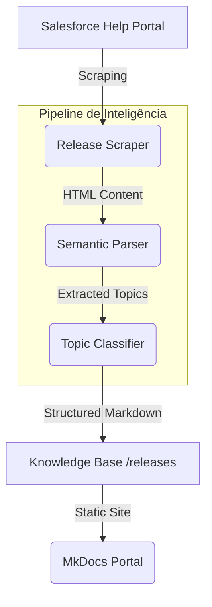

<p align="center">
  
</p>

# ☁️ Salesforce Release Intelligence
> Automação de nível corporativo para extração, classificação semântica e gestão de conhecimento (Knowledge-as-Code) das Salesforce Release Notes.

[](https://github.com/Fatal1tyBarucco/Salesforce-WebDev/actions/workflows/python-quality.yml)
[](https://www.python.org/downloads/release/python-3110/)
[](https://github.com/psf/black)
[](https://github.com/astral-sh/ruff)

## 🎯 Visão Geral
Este repositório é o núcleo de uma plataforma de inteligência que transforma as **Salesforce Release Notes** em ativos de conhecimento estruturados. Utilizando princípios de **Knowledge-as-Code**, o sistema automatiza o ciclo de vida completo: desde a descoberta de novas releases até a geração de documentação técnica categorizada por domínios arquiteturais (Apex, LWC, Flow, etc.).

---

## 🏗️ Arquitetura do Sistema
O projeto segue uma arquitetura modular e resiliente, orquestrada via GitHub Actions.



### Stack Tecnológica
- **Linguagem:** Python 3.11+
- **Parsing:** BeautifulSoup4 & Regex (Extração Semântica)
- **CI/CD:** GitHub Actions (Orquestração e Qualidade)
- **Qualidade:** Ruff (Linting), Black (Formatting), Mypy (Type Checking)
- **Documentação:** MkDocs & Mermaid.js

---

## 📋 Repositório de Conhecimento (Releases)
Navegue pelas atualizações extraídas, organizadas por release e tópico técnico.

<!-- RELEASE_INDEX_START -->
> ⚙️ Índice gerado automaticamente em **2026-06-06 23:46 UTC**.

| Release | Apex | LWC | Flow | Security | Integrations |
| :--- | :---: | :---: | :---: | :---: | :---: |
| ☀️ **Summer '26** | [✅ Ver](./releases/summer_26/apex.md) | [✅ Ver](./releases/summer_26/lwc.md) | [✅ Ver](./releases/summer_26/flow.md) | [✅ Ver](./releases/summer_26/security.md) | [✅ Ver](./releases/summer_26/integrations.md) |
| 🌸 **Spring '26** | [✅ Ver](./releases/spring_26/apex.md) | [✅ Ver](./releases/spring_26/lwc.md) | [✅ Ver](./releases/spring_26/flow.md) | [✅ Ver](./releases/spring_26/security.md) | [✅ Ver](./releases/spring_26/integrations.md) |
| ❄️ **Winter '26** | [✅ Ver](./releases/winter_26/apex.md) | [✅ Ver](./releases/winter_26/lwc.md) | [✅ Ver](./releases/winter_26/flow.md) | [✅ Ver](./releases/winter_26/security.md) | [✅ Ver](./releases/winter_26/integrations.md) |
| ☀️ **Summer '25** | [✅ Ver](./releases/summer_25/apex.md) | [✅ Ver](./releases/summer_25/lwc.md) | [✅ Ver](./releases/summer_25/flow.md) | [✅ Ver](./releases/summer_25/security.md) | [✅ Ver](./releases/summer_25/integrations.md) |
| 🌸 **Spring '25** | [✅ Ver](./releases/spring_25/apex.md) | [✅ Ver](./releases/spring_25/lwc.md) | [✅ Ver](./releases/spring_25/flow.md) | [✅ Ver](./releases/spring_25/security.md) | [✅ Ver](./releases/spring_25/integrations.md) |
<!-- RELEASE_INDEX_END -->

---

## 🛠️ Configuração de Desenvolvimento

1. **Instalação de Dependências:**
   ```bash
   pip install -r requirements.txt
   pip install -r requirements-dev.txt
   ```

2. **Execução Local:**
   ```bash
   python src/main.py
   ```

3. **Verificação de Qualidade:**
   ```bash
   ruff check .
   black --check .
   mypy automation/
   ```

## ⚖️ Governança e Contribuição
Para diretrizes de arquitetura e como contribuir, veja [CONTRIBUTING.md](./docs/contribution/index.md).

---
<p align="center">
  Desenvolvido com ❤️ para a Comunidade Salesforce.
</p>
