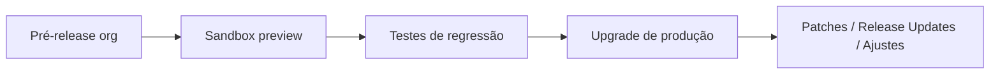
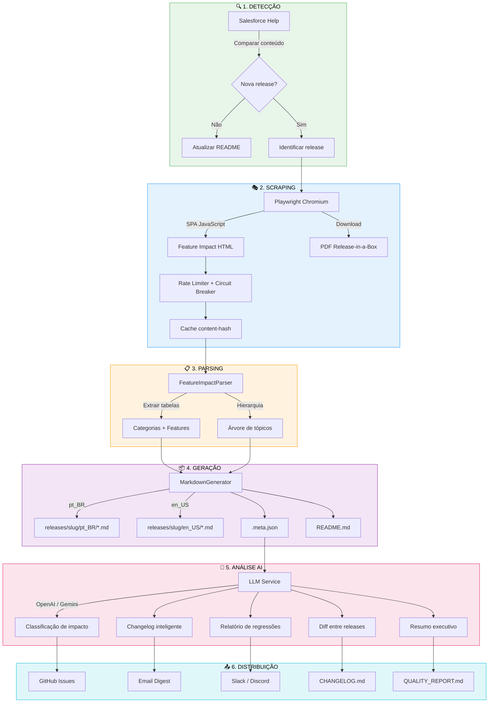
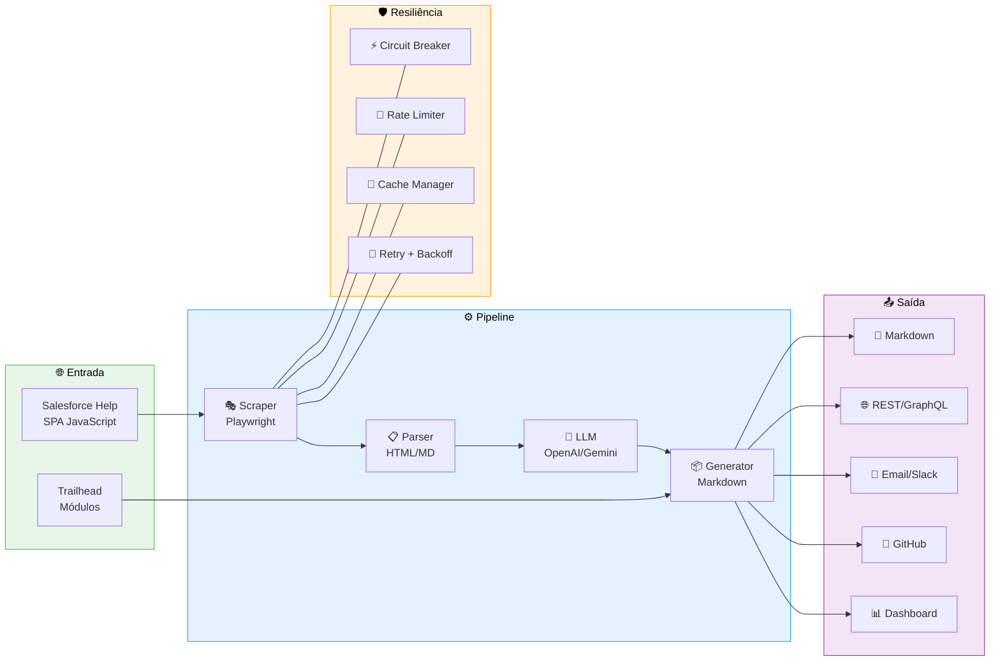
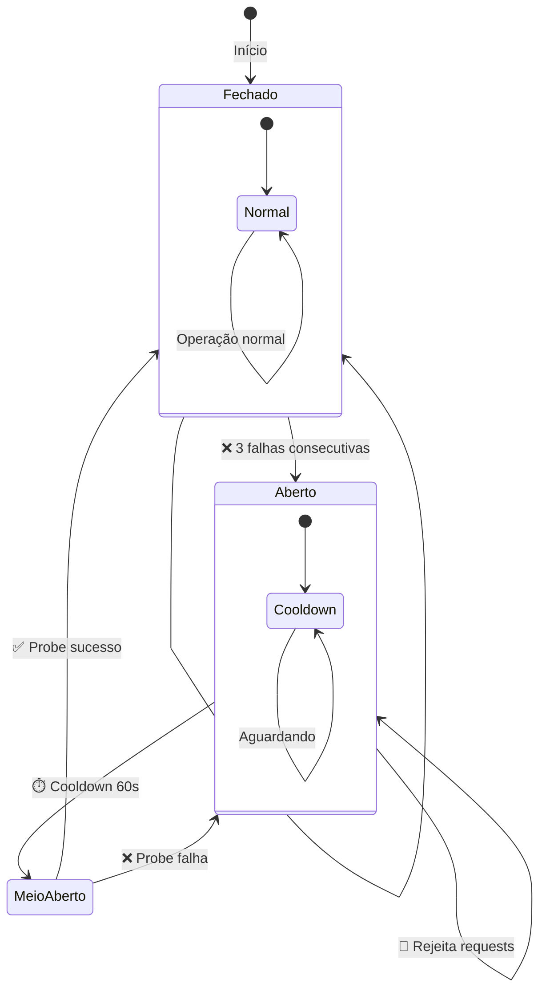
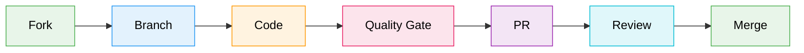

<div align="center">

# 🚀 Salesforce Release Notes Intelligence

### *Knowledge-as-Code para o ecossistema Salesforce*

[](https://github.com/Fatal1tyBarucco/Salesforce-WebDev/actions/workflows/python-quality.yml)
[](https://github.com/Fatal1tyBarucco/Salesforce-WebDev/actions/workflows/release_notes_pipeline.yml)
[](https://fatal1tybarucco.github.io/Salesforce-WebDev/)


**Pipeline automatizado** que transforma as Release Notes da Salesforce em artefatos Markdown estruturados, com análise AI, classificação de impacto e distribuição multi-canal.

[📚 Documentação](https://fatal1tybarucco.github.io/Salesforce-WebDev/) · [🐛 Reportar Bug](https://github.com/Fatal1tyBarucco/Salesforce-WebDev/issues) · [💡 Solicitar Feature](https://github.com/Fatal1tyBarucco/Salesforce-WebDev/issues)

</div>

---

## 🌟 O Que Este Projeto Faz

A cada trimestre, a Salesforce lança centenas de novas funcionalidades espalhadas por dezenas de categorias. **Acompanhar manualmente é inviável.**

Este repositório automatiza todo o ciclo:

```
┌─────────────────────────────────────────────────────────────────────┐
│                                                                     │
│   🌐 Salesforce Help ──▶ 🤖 Scraper ──▶ 🧠 AI ──▶ 📦 Markdown     │
│        (SPA)              (Playwright)   (LLM)    (Estruturado)     │
│                                                                     │
│                           ──▶ 📧 Email ──▶ 💬 Slack ──▶ 🐙 GitHub  │
│                              (Digest)     (Webhook)    (Issues)     │
│                                                                     │
└─────────────────────────────────────────────────────────────────────┘
```

### ✨ Capacidades

| Capacidade | Descrição |
|:-----------|:----------|
| 🔍 **Detecção Automática** | Detecta novas releases comparando conteúdo com a versão anterior |
| 🎭 **Scraping SPA** | Playwright renderiza JavaScript completo do portal Salesforce Help |
| 🧠 **Classificação AI** | Classifica features por impacto (Alto/Médio/Baixo) e tipo via LLM |
| 📝 **Enriquecimento AI** | Descrições profissionais e análise de impacto por feature via LLM |
| 📋 **Resumos Executivos** | Sumários completos com impacto no negócio, temas estratégicos e migração |
| 📊 **Relatórios Inteligentes** | Changelog, regressões, diff, qualidade — tudo gerado por AI |
| 🔄 **Deduplicação** | Content-hash evita reprocessar conteúdo inalterado |
| 📧 **Notificações** | Email, Slack e Discord com filtros por perfil de interesse |
| 🐙 **GitHub Integration** | Issues automáticas, PRs com triage, badges dinâmicos |
| 🌐 **REST + GraphQL API** | Acesso programático com autenticação via API Key |
| 📈 **Dashboard Interativo** | HTML com busca, comparação, heatmap e exportação CSV/JSON |
| 🏥 **Health Monitoring** | Endpoints `/health`, `/ready`, `/metrics` (Prometheus) |
| 🔒 **Autenticação API** | API Key middleware (`X-API-Key` / `Bearer`) para endpoints protegidos |

---


---

## 📖 Guia Completo: Atualizações de Versão do Salesforce

> **Nota:** documento consolidado em julho/2026. Release ativo em produção: **Summer '26** (API v67.0). Próximo release: **Winter '27** (previsto para outubro/2026). Sempre confirme o cronograma da sua instância no [Salesforce Trust](https://status.salesforce.com).

### 1. O que é

"Atualização de versão" no ecossistema Salesforce cobre **dois conceitos distintos e complementares**:

| | **Release Sazonal** | **Release Update** |
|---|---|---|
| Nome oficial (Setup, PT-BR) | Versão sazonal (Spring/Summer/Winter) | Atualizações de Versão |
| O que é | Upgrade completo da plataforma, aplicado a todos os orgs | Mudança pontual de comportamento associada a um release |
| Frequência | 3x por ano | Dezenas por release |
| É opcional? | Não — todo org é migrado, sem exceção | Parcialmente — pode ser testada e adiada até uma data-limite, mas eventualmente é forçada |
| Onde consultar | help.salesforce.com/releasenotes | Setup → **Atualizações de Versão** |
| Analogia | Upgrade de major version de SO (Windows 10 → 11) | Patch de segurança/comportamento dentro dessa versão do SO |

#### 1.1 Release Sazonal
Upgrade da plataforma como um todo: nova versão do Lightning Experience, novas features declarativas, nova versão de API, eventuais mudanças de governor limits. Acontece automaticamente, sem opt-in, para 100% dos orgs — inclusive Developer Edition, sandboxes e produção.

#### 1.2 Release Update ("Atualizações de Versão")
Mecanismo de governança criado para introduzir **mudanças de comportamento potencialmente disruptivas** (segurança, compilador Apex, deprecação de API) de forma controlada. O fluxo é sempre:

1. Salesforce anuncia o update com antecedência (normalmente 1–3 releases antes do enforcement);
2. Disponibiliza um **Test Run** para o admin habilitar/desabilitar e observar o impacto;
3. Define uma data-limite (**Complete Steps By**);
4. Após essa data, a mudança é aplicada automaticamente — independe de qualquer ação do admin.

#### 1.3 Outros tipos de atualização
- **Atualizações mensais**: alguns produtos (Data Cloud, B2B Commerce) publicam novidades com frequência mensal, sem esperar a release sazonal.
- **Patches e maintenance releases**: correções menores e pontuais entre releases principais, aplicadas pela Salesforce.
- **Mudanças de versão de API**: cada release incrementa a versão de API em +1, com novos recursos, campos e comportamentos.

---

### 2. Como funciona

#### 2.1 Rollout faseado
O Salesforce é **multi-tenant**: milhares de orgs compartilham a mesma base de código. Cada release é distribuído em ondas:

1. **Pre-release org** (~6–8 semanas antes) — org Developer Edition novo, sem dados/metadados, só para explorar features.
2. **Sandbox Preview** (~4–6 semanas antes) — subconjunto de sandboxes recebe o release antecipadamente. Primeira vez que você testa **com suas customizações reais**.
3. **Produção** — rollout em múltiplos fins de semana consecutivos, janela específica por instância, publicada no Salesforce Trust.


```mermaid
flowchart LR
    A[Pré-release org] --> B[Sandbox preview]
    B --> C[Testes de regressão]
    C --> D[Upgrade de produção]
    D --> E[Patches / Release Updates / Ajustes]
```

#### 2.2 Mecânica interna do Release Update
Em **Setup → Atualizações de Versão**, cada item aparece em uma de quatro abas:

- **Precisa de Ação** — ainda não tratado, requer decisão do admin;
- **Vence em Breve** — próximo da data-limite;
- **Atrasado** — passou da data-limite (pode ser aplicado a qualquer momento);
- **Arquivado** — já concluído, com o release em que foi efetivamente aplicado.

Cada item traz descrição da mudança, link para documentação, a data **Complete Steps By** e o botão **"Ativar Execução de Teste"** — liga a mudança temporariamente em sandbox sem compromisso definitivo.

---

### 3. Quando ocorre

#### 3.1 Calendário sazonal

| Release | Época típica | Convenção de nome |
|---|---|---|
| **Spring** | Fevereiro | Leva o número do ano corrente |
| **Summer** | Junho | Leva o número do ano corrente |
| **Winter** | Outubro | Leva o número do **ano seguinte** (ex.: Winter '26 foi lançado em out/2025) |

#### 3.2 Cronograma 2026 (exemplo real)

| Release | Sandbox Preview | Ondas de produção | Versão de API |
|---|---|---|---|
| Spring '26 | 09/jan/2026 | 16/jan, 13/fev, 20/fev/2026 | v66.0 |
| Summer '26 | 08/mai/2026 | 15/mai, 05/jun, 12/jun, 13/jun/2026 | v67.0 |
| Winter '27 | a confirmar | a confirmar | v68.0 (previsto) |

> As datas variam **por instância**. Confirme no [Salesforce Trust](https://status.salesforce.com), aba "Maintenances".

---

### 4. O que é atualizado

#### 4.1 Plataforma e experiência
Lightning Experience (UI, performance, acessibilidade), novidades declarativas (Flow, Agentforce, Data 360) e recursos de produto.

#### 4.2 APIs e versionamento
Cada release sazonal incrementa a versão de API em **+1**:

```
Spring '25  → v63.0
Summer '25  → v64.0
Winter '26  → v65.0
Spring '26  → v66.0
Summer '26  → v67.0
Winter '27  → v68.0 (previsto)
```

**Pinning de versão:** toda `ApexClass`, `ApexTrigger`, Visualforce Page e componente Aura/LWC fica fixado na versão de API em que foi salvo pela última vez. Isso garante retrocompatibilidade — código antigo não muda de comportamento automaticamente. O trade-off:

- código preso em versões antigas **não recebe** novos recursos de API;
- versões muito antigas eventualmente são depreciadas (todas ≤ 30 já foram depreciadas a partir do Summer '25);
- subir a versão manualmente pode expor comportamento novo (às vezes breaking) que precisa ser testado.

#### 4.3 Mudanças de comportamento no Apex (exemplos reais)
- **API v65.0+**: métodos `abstract` e `override` exigem modificador de acesso explícito (`public`, `protected` ou `global`).
- **Release Update**: bloqueio de Apex anônimo disparado por pacotes gerenciados — pacotes novos com namespace criados a partir do Summer '26 já nascem bloqueados por padrão.

#### 4.4 Segurança e autenticação
- Exigência de **My Domain** para tráfego de API — adiada de Spring '26 para **Winter '27**.
- Aposentadoria do método `login()` do SOAP API (versões 31.0–64.0), prevista para **Summer '27**.
- Diretivas de CSP (Content Security Policy) e Trusted URLs.

#### 4.5 Descontinuações em curso
- **Salesforce to Salesforce**: suporte ativo encerrado no Summer '26; funcionalidade para de operar no Spring '27. Alternativas: Partner Cloud, Data Cloud One, MuleSoft.
- **Analytics for Conversation Insights**: aposentado no Summer '26, substituído pelo Einstein Conversation Insights nativo.

---

### 5. Sandbox Preview

- **Quem pode participar?** Clientes com sandboxes ativas (Full, Partial Copy, Developer Pro, Developer) que realizarem refresh após a data divulgada.
- **Como ativar?** No Setup, em **Sandboxes**, opção de atualizar para versão de pré-visualização. Também é possível criar sandbox diretamente na versão preview.
- **Prazo**: janela disponível até a data de atualização da produção. Após isso, sandbox alinhada automaticamente.
- **Cuidados**: nem todos os recursos podem estar finalizados na preview; comportamento pode diferir minimamente.

---

### 6. Impactos

| Área afetada | Risco típico | Ação recomendada |
|---|---|---|
| **Apex / Triggers** | Erro de compilação ou mudança de comportamento | Rodar 100% da suíte de testes no Sandbox Preview |
| **LWC / Aura / Visualforce** | Quebra de UI por mudança de LWC Security | Testar telas críticas manualmente |
| **Pacotes gerenciados** | Comportamento alterado sem controle do assinante | Consultar ISV sobre compatibilidade |
| **Integrações externas** | Endpoint ou autenticação depreciada | Migrar para My Domain e auth atual |
| **Processos de negócio** | Usuário impactado por mudança de UI/fluxo | Change management (comunicação + treinamento) |
| **Compliance** | Update "Atrasado" aplicado sem teste | Tratar como rotina mensal, não última hora |

#### Impactos positivos
- Novos recursos e melhorias de performance
- Maior segurança e UX aprimorada
- Automações mais robustas e novos pontos de integração

#### Riscos típicos para times de entrega
- Apex com dependência de comportamento legado
- LWC com chamadas a APIs alteradas
- Flow com lógica sensível a mudanças de contexto
- Integrações que usam API antiga
- Pacotes de terceiros sem suporte imediato à nova release

---

### 7. Testes e preparação

#### Checklist por release
- [ ] Ler o Release Notes assim que publicado — não esperar o preview do sandbox
- [ ] Confirmar a data de upgrade da instância no Salesforce Trust
- [ ] Garantir que ao menos um sandbox esteja marcado para **Preview**
- [ ] Rodar toda a suíte de testes Apex no sandbox em preview
- [ ] Revisar manualmente telas críticas (LWC/Aura/VF)
- [ ] Validar pacotes gerenciados com o fornecedor
- [ ] Zerar a aba "Atrasado" em Atualizações de Versão antes de cada novo release
- [ ] Comunicar mudanças de UI/fluxo para usuários finais

#### Calendário de preparação recomendado

| Fase | Ação |
|---|---|
| **3 meses antes** | Ler notas de versão preliminares; identificar mudanças críticas |
| **8 semanas antes** | Criar/atualizar sandbox preview; executar testes de regressão |
| **4 semanas antes** | Treinar usuários-chave; documentar mudanças que exigem ação |
| **2 semanas antes** | Finalizar validações, corrigir códigos, habilitar recursos no Setup |
| **Pós-release** | Monitorar logs, erros e feedback; habilitar funcionalidades restantes |

#### Auditoria de versão de API via Tooling API
```sql
-- Identificar classes "presas" em versões antigas
SELECT Id, Name, ApiVersion, Status
FROM ApexClass
WHERE ApiVersion < 60.0
ORDER BY ApiVersion ASC
```
> O campo `ApiVersion` só é exposto pela **Tooling API** — não aparece via API de dados padrão.

#### Trade-off: manter ou atualizar API version

| Manter versão antiga (pinned) | Atualizar para versão atual |
|---|---|
| Zero risco de regressão | Acesso a novos recursos de linguagem/API |
| Pode ficar de fora de otimizações | Exposição a mudanças que exigem reteste |
| Risco: versões muito antigas são depreciadas | Alinhamento com suporte/consultoria |

**Recomendação:** atualizar deliberadamente, dentro de uma janela de teste — nunca como efeito colateral de salvar sem revisão.

---

### 8. Recursos por release (últimos ciclos)

| Versão | Destaques |
|---|---|
| **Spring '25** | Salesforce Connect sem limite de 100k linhas/hora, temas SLDS 2 (Beta), melhorias em Flow e Apex |
| **Summer '25** | Sync de emails como atividades, novos canais LINE/BYOC no Service Cloud, MFA obrigatório |
| **Winter '26** | Transferência de dashboards, Analytics Details, melhorias em Flow e Lightning |
| **Spring '26** | Agentforce expandido, Data 360, Field Service, 1438 recursos em 21 categorias |
| **Summer '26** | MCP servers nativos, Named Query API, 1434 recursos em 22 categorias |

---

### 9. Glossário

| Termo | Definição |
|---|---|
| **Instância** | Cluster de infraestrutura onde um grupo de orgs reside (ex.: NA1, EU5). Determina a janela de manutenção. |
| **Org** | Ambiente lógico do Salesforce — produção, sandbox ou developer edition. |
| **Sandbox Preview** | Cópia de sandbox atualizada antecipadamente para testar o próximo release. |
| **Pre-release org** | Org descartável, sem dados do cliente, para explorar features antes do sandbox preview. |
| **Complete Steps By** | Data-limite para testar/preparar um Release Update antes do enforcement automático. |
| **Enforcement** | Momento em que a mudança passa a valer independentemente de ação do admin. |
| **API Version** | Número que fixa o comportamento de um artefato de metadado na semântica daquela versão. |
| **Governor Limits** | Limites de recursos impostos pela plataforma para garantir equilíbrio multi-tenant. |

---

### 10. Referências oficiais

| Recurso | Link |
|---|---|
| Release Notes | https://help.salesforce.com/s/articleView?id=release-notes.salesforce_release_notes.htm |
| Atualizações de Versão (PT-BR) | https://help.salesforce.com/s/articleView?id=sf.release_updates.htm&language=pt_BR |
| Salesforce Trust | https://status.salesforce.com |
| Sandbox Preview Instructions | https://help.salesforce.com/s/articleView?id=000391927 |
| Upgrade Release Schedule FAQ | https://help.salesforce.com/s/articleView?id=005224913 |
| Apex Release Notes | https://developer.salesforce.com/docs/atlas.en-us.apexref.meta/apexref/apex_releasenotes.htm |
| REST API Release Notes | https://developer.salesforce.com/docs/atlas.en-us.api_rest.meta/api_rest/rest_rns.htm |
| SOAP API Release Notes | https://developer.salesforce.com/docs/atlas.en-us.api.meta/api/soap_rns.htm |
| Metadata API Release Notes | https://developer.salesforce.com/docs/atlas.en-us.api_meta.meta/api_meta/meta_rns.htm |
| Tooling API Release Notes | https://developer.salesforce.com/docs/atlas.en-us.api_tooling.meta/api_tooling/tooling_rns.htm |
| GraphQL API Release Notes | https://developer.salesforce.com/docs/platform/graphql/guide/graphql-release-notes.html |
| Trailhead Release Readiness | https://trailhead.salesforce.com/credentials/releasereadiness |
| Salesforce Developers Blog | https://developer.salesforce.com/blogs |
| Salesforce Admins Blog | https://admin.salesforce.com |

---


## 📋 Releases Disponíveis

<div style="padding:12px;margin-bottom:20px;border:1px solid #d0d7de;border-radius:6px;background:#f6f8fa;text-align:center;"><strong>🌐 Idioma / Language:</strong> <strong>🇧🇷 Português</strong> | <a href="./README.en.md">🇺🇸 English</a></div>

### ☀️ Summer '26

> 📊 **Resumo Executivo:** A release Summer '26 do Salesforce representa um marco significativo na evolução da plataforma, com um total de 1.434 novos recursos distribuídos em 22 categorias. Esta release consolida a inteligência artificial como eixo central da estratégia Salesforce, com o Agentforce se expandindo transversalmente por praticamente todas as áreas da plataforma — desde vendas e serviço até setores verticais e desenvolvimento.

Destaques principais incluem a nova geração do Tableau Next, com integração profunda ao Data 360 e capacidades avançadas de análise em tempo real, incluindo incorporação de Lightning Web Components em dashboards e suporte a previsões de métricas nativas. O Flow Builder recebeu 118 recursos na categoria Automação, incluindo integração direta com Agentforce, suporte a linguagem natural para atualização de fluxos de tela e orquestração de fluxos como recurso padrão.

O Data 360 expandiu significativamente com 72 recursos, incluindo novas capacidades de ingestão do Databricks, Microsoft Fabric OneLake e AWS Glue Data Catalog, além de modelos preditivos com novo runtime padrão e análise de sentimento em tempo real. A categoria Desenvolvimento trouxe 127 recursos com foco em Lightning Web Components API v67.0, Agentforce DX, MCP Servers e o novo Salesforce MultiFramework para aplicativos React.

Setores verticais lidera em volume com 309 recursos, abrangendo automotivo, seguros, saúde, educação, manufatura, mídia, energia e setor público. O Gerenciamento de Receita avançou com 97 recursos incluindo novas capacidades de billing, pagamentos automatizados e orquestração dinâmica. A categoria Serviço trouxe 196 recursos com foco em centrais de contato Agentforce, IT Service Management e autoatendimento aprimorado.

Segurança, identidade e privacidade consolidou 58 recursos com melhorias em Shield Platform Encryption, detecção de dados sensíveis e o novo Security Center com Agentforce. Marketing avançou com 64 recursos incluindo Marketing Cloud Next, inteligência de marketing e gerenciamento de fidelidade. A integração com Slack, MuleSoft e o aplicativo móvel também receberam atualizações relevantes.

A release Summer '26 posiciona o Salesforce como uma plataforma de IA-first, onde Agentforce não é apenas um produto isolado mas uma camada de inteligência que permeia toda a experiência do cliente, desde o primeiro contato até o fidelização e suporte pós-venda.


<details>
<summary><b>📄 Documentação legal (6 recursos)</b></summary>


> A categoria Documentação legal reúne 6 recursos referentes à estrutura documental da release Summer '26. Inclui informações sobre como e quando os recursos ficam disponíveis, a localização da Ajuda do Salesforce, documentação técnica e notas da versão. Esta categoria serve como referência para administradores e usuários que precisam entender os ciclos de disponibilidade dos recursos, destacando que algumas funcionalidades são ativadas imediatamente após o release, enquanto outras requerem ação direta do administrador.

> 📄 Detalhes completos: [./releases/summer_26/pt_BR/documentacao_legal.md](./releases/summer_26/pt_BR/documentacao_legal.md)

</details>


<details>
<summary><b>📄 Salesforce geral (36 recursos)</b></summary>


> Com 36 recursos, a categoria Salesforce geral abrange melhorias transversais à plataforma. Destaques incluem rotação mais frequente de certificados, preparação para IPv6, atualização de certificados mTLS e validação de domínios. O Chatter agora é desativado por padrão em novas organizações. Salesforce Foundations trouxe pontuação de pessoas para priorização de leads e rastreamento de web. O aplicativo Arquivar recebeu novas configurações e status de atividade. Melhorias de acessibilidade foram implementadas para zoom superior a 200%, seletores de data, popovers e listas de tarefas do Lightning.

> 📄 Detalhes completos: [./releases/summer_26/pt_BR/salesforce_geral.md](./releases/summer_26/pt_BR/salesforce_geral.md)

</details>


<details>
<summary><b>📄 Agentforce (1 recursos)</b></summary>


> A categoria Agentforce apresenta 1 recurso nesta release, focado em capacidades de voz (Voice feature). O Agentforce continua sua expansão como camada de inteligência artificial transversal, com integrações profundas aparecendo em diversas outras categorias como Automação, Serviço, Field Service, Setores e Vendas. Os módulos Trailhead recomendados incluem Agentforce Basics, Build an Agent with Agentforce e Agentforce for Developers, cobrindo desde conceitos fundamentais até implementação avançada.

> 📄 Detalhes completos: [./releases/summer_26/pt_BR/agentforce.md](./releases/summer_26/pt_BR/agentforce.md)

</details>


<details>
<summary><b>📄 Análise de dados (58 recursos)</b></summary>


> Com 58 recursos, a categoria Análise de dados apresenta inovações profundas lideradas pelo Tableau Next. Destaques incluem integração com Data 360 para análise de objetos do Data Lake, modos de dados configuráveis para otimização de performance, filtragem em múltiplos modelos de dados, previsões de métricas com séries temporais e o novo framework de modelos de aplicativo. O CRM Analytics recebeu melhorias em semijunções e antijunções SAQL, paletas de cores de marca para relatórios, incorporação de LWC em dashboards e exportação para Azure Data Lake. A segurança foi reforçada com OAuth para conexões externas e proteção de exportações Excel.

> 📄 Detalhes completos: [./releases/summer_26/pt_BR/analise_de_dados.md](./releases/summer_26/pt_BR/analise_de_dados.md)

</details>


<details>
<summary><b>📄 Automação (118 recursos)</b></summary>


> A categoria Automação é a segunda maior da release com 118 recursos, centrada no Flow Builder. Destaques incluem integração direta com Agentforce para criação de agentes, atualização de fluxos com linguagem natural (beta), operadores de data em lógica de decisão, orquestração de fluxos como recurso padrão e suporte a MuleSoft para fluxo com conectores de terceiros. O Marketing Cloud do Fluxo permite personalização de mensagens com dados integrados. O Mecanismo de regras de negócios ganhou controle de versão de tabelas de decisão e escalabilidade aprimorada. O Serviço de contexto e o Mecanismo de processamento de dados expandem as capacidades de transformação de dados em escala.

> 📄 Detalhes completos: [./releases/summer_26/pt_BR/automacao.md](./releases/summer_26/pt_BR/automacao.md)

</details>


<details>
<summary><b>📄 OmniStudio (9 recursos)</b></summary>


> Com 9 recursos, a categoria OmniStudio inclui controle de versão do Data Mapper para consistência de implementação, alternância entre designers padrão e gerenciado, migração para runtime padrão via Assistente de migração e o OmniStudio MCP (beta) para acelerar desenvolvimento de FlexCards. Melhorias de acessibilidade foram implementadas e ações do FlexCard agora podem ser abertas em novas janelas. O recurso de chamar fluxos iniciados automaticamente em FlexCards está em piloto.

> 📄 Detalhes completos: [./releases/summer_26/pt_BR/omnistudio.md](./releases/summer_26/pt_BR/omnistudio.md)

</details>


<details>
<summary><b>📄 Personalização (33 recursos)</b></summary>


> A categoria Personalização reúne 33 recursos abrangendo AgentExchange com exploração de soluções MCP, Serviços externos com suporte a enumerações e arquivos binários, Globalização com suporte a novos fusos horários e traduções para catalão e basco. A Configuração com Agentforce está agora em disponibilidade geral para simplificar tarefas administrativas. O Compartilhamento ganhou opções de hierarquia de papéis para filas e atualização mais rápida de padrões organizacionais. Salesforce Connect suporta credenciais nomeadas entre organizações.

> 📄 Detalhes completos: [./releases/summer_26/pt_BR/personalizacao.md](./releases/summer_26/pt_BR/personalizacao.md)

</details>


<details>
<summary><b>📄 Data 360 (72 recursos)</b></summary>


> Com 72 recursos, a categoria Data 360 expande significativamente as capacidades de dados unificados. Novos conectores incluem Databricks (GA), Microsoft Fabric OneLake (beta), AWS Glue Data Catalog e acesso em tempo real sem pipeline. O gráfico de dados ganhou limites maiores, streaming para atualizações rápidas e histórico de atualização. Modelos de IA agora incluem agrupamento, séries temporais, análise de sentimento e classificação de tópico. A extensão de código permite transformações personalizadas e o Vibes do Agentforce facilita criação com linguagem natural. Ativações suportam Amazon S3, Meta, Snapchat e plataformas de parceiros.

> 📄 Detalhes completos: [./releases/summer_26/pt_BR/data_360.md](./releases/summer_26/pt_BR/data_360.md)

</details>


<details>
<summary><b>📄 Desenvolvimento (127 recursos)</b></summary>


> A maior categoria com 127 recursos, Desenvolvimento cobre LWC API v67.0 com melhorias de performance, visualização de componentes no VS Code, gerentes de estado e suporte RTL. Lightning Out 2.0 agora suporta componentes Aura. Microfrontendas permitem integração de apps web externos. Apex ganhou strings multilinhas, operações de banco em modo de usuário por padrão e remoção de WITH SECURITY_ENFORCED. Agentforce DX inclui servidor MCP e o novo Vibes IDE. React Apps com MultiFramework estão em GA. APIs ganharam suporte a JWT para SOAP, consultas SQL do Apex e GraphQL aprimorado.

> 📄 Detalhes completos: [./releases/summer_26/pt_BR/desenvolvimento.md](./releases/summer_26/pt_BR/desenvolvimento.md)

</details>


<details>
<summary><b>📄 Experience Cloud (14 recursos)</b></summary>


> Com 14 recursos, a categoria Experience Cloud foca em sites Aura e LWR com experiências de autoatendimento assistido por IA, suporte a Chatter em novas organizações e verificação de malware em arquivos. Fluxos de tela ganharam tabelas de dados com registros relacionados, substituições de estilo e imagens de recurso estático. O Experience Builder recebeu grupos de botões de opção empilhados e suporte a upload de arquivos maiores. Segurança foi aprimorada com permissão para envio de emails por todos os usuários do site.

> 📄 Detalhes completos: [./releases/summer_26/pt_BR/experience_cloud.md](./releases/summer_26/pt_BR/experience_cloud.md)

</details>


<details>
<summary><b>📄 Field Service (48 recursos)</b></summary>


> A categoria Field Service apresenta 48 recursos com foco em Agentforce para agendamento autônomo, incluindo criação de agentes no novo Agentforce Builder, alcance por email e WhatsApp e Employee Agent para gestão de compromissos. O novo console de agendamento transforma a experiência de despacho. Insights móveis (beta) impulsionam eficiência operacional. Captura de dados ganhou fluxos pré-preenchidos com repetidores e personalização de estilo. Mapas GIS nativos melhoram precisão de local. O Assistente remoto visual suporta sessões seguras multi-app via Omni-Channel.

> 📄 Detalhes completos: [./releases/summer_26/pt_BR/field_service.md](./releases/summer_26/pt_BR/field_service.md)

</details>


<details>
<summary><b>📄 Hyperforce (3 recursos)</b></summary>


> Com 3 recursos, a categoria Hyperforce expande o acesso ao Salesforce em mais regiões geográficas, adiciona novos produtos e recursos na Defesa do Government Cloud e aprimora a continuidade avançada entre regiões com objetivos de recuperação mais rápidos. Esta infraestrutura global continua sendo fundamental para a escalabilidade e resiliência da plataforma.

> 📄 Detalhes completos: [./releases/summer_26/pt_BR/hyperforce.md](./releases/summer_26/pt_BR/hyperforce.md)

</details>


<details>
<summary><b>📄 Setores (309 recursos)</b></summary>


> A maior categoria da release com 309 recursos, Setores abrange verticals completos. Automotive inclui Agentforce para gestão de garantia, finanças automotivas e validação de documentos com IA. Educação trouxe agentes de recrutamento, planejamento financeiro e pesquisa de cursos. Serviços Financeiros inclui banking, digital lending e hierarquias flexíveis. Saúde cobriu autorização prévia, gerenciamento de cuidados e Home Health. Seguros abrange administração de apólices, reclamações e corretagem. Life Sciences inclui planejamento de engajamento e inteligência de conteúdo. Manufacturing, mídia, energia, setor público e sem fins lucrativos também receberam atualizações significativas.

> 📄 Detalhes completos: [./releases/summer_26/pt_BR/setores.md](./releases/summer_26/pt_BR/setores.md)

</details>


<details>
<summary><b>📄 Marketing (64 recursos)</b></summary>


> Com 64 recursos, a categoria Marketing apresenta o Marketing Cloud Next com criação de público, conteúdo e campanhas. Account Engagement simplifica gerenciamento de consentimento e sincronização de campanhas. Marketing Cloud Engagement organiza jornadas e otimiza WhatsApp com rastreamento de anúncio. Inteligência de marketing unifica dados para visibilidade completa com Agentforce. Personalização do Salesforce inclui campanhas e gráfico de perfil. Gerenciamento de fidelidade ganhou moedas baseadas em atividade, Google Wallet e painéis Tableau Next. Promoções globais e marketing de indicação completam a categoria.

> 📄 Detalhes completos: [./releases/summer_26/pt_BR/marketing.md](./releases/summer_26/pt_BR/marketing.md)

</details>


<details>
<summary><b>📄 MuleSoft (8 recursos)</b></summary>


> Com 8 recursos, a categoria MuleSoft foca no Catálogo de API para Salesforce com mapeamento de agentes e modelos de prompts para ferramentas do servidor MCP. Servidores MCP do MuleSoft podem ser trazidos ao catálogo de API (GA) e descobertos manualmente. APIs de consulta nomeadas são visualizadas no catálogo com ações ativáveis. A Inteligência de integração do MuleSoft aprimora a conectividade entre sistemas.

> 📄 Detalhes completos: [./releases/summer_26/pt_BR/mulesoft.md](./releases/summer_26/pt_BR/mulesoft.md)

</details>


<details>
<summary><b>📄 Aplicativo móvel (17 recursos)</b></summary>


> A categoria Aplicativo móvel reúne 17 recursos incluindo personalização da página inicial (beta), transcrição de IA móvel para reuniões presenciais e a nova interface Liquid Glass. O login por email é agora padrão e a opção Login para administrador garante acesso seguro. Mobile Publisher suporta renomeação e arquivamento de projetos. Agentforce Voice e React Native integram IA ao aplicativo móvel, com personalização via tipos do Lightning.

> 📄 Detalhes completos: [./releases/summer_26/pt_BR/aplicativo_movel.md](./releases/summer_26/pt_BR/aplicativo_movel.md)

</details>


<details>
<summary><b>📄 Partner Cloud (100 recursos)</b></summary>


> Com 100 recursos, a categoria Partner Cloud consolida funcionalidades de Revenue Cloud para parceiros, incluindo catálogo de produtos com variações, precificação com tabelas de decisão CSV, configurador de produto com restrições de rampa, gerenciamento de transações com clonagem de cotações e Advanced Approvals com Slack. O Orquestrador de receita dinâmica suporta negócios de vários anos. Faturamento inclui central de liquidações, agendas de marco e reembolsos automatizados. Salesforce Contracts e Geração de documentos completam a oferta.

> 📄 Detalhes completos: [./releases/summer_26/pt_BR/partner_cloud.md](./releases/summer_26/pt_BR/partner_cloud.md)

</details>


<details>
<summary><b>📄 Gerenciamento de receita (97 recursos)</b></summary>


> Com 97 recursos, Gerenciamento de receita abrange catálogo de produtos com variações e suporte decimal estendido, precificação com tabelas de decisão CSV, configurador com restrições de rampa e transações com editor de linha aprimorado. Advanced Approvals integra Slack e Fluxo. O Orquestrador dinâmica suporta ativos de cumprimento com conhecimento em tempo. Faturamento inclui extratos de conta, central de liquidações, pontuação de risco preditiva e agendas diárias. Pagamentos suportam agrupamento de faturas, reembolsos automatizados e links de Pagar agora. Agentforce auxilia em cobranças e consultas.

> 📄 Detalhes completos: [./releases/summer_26/pt_BR/gerenciamento_de_receita.md](./releases/summer_26/pt_BR/gerenciamento_de_receita.md)

</details>


<details>
<summary><b>📄 Vendas (58 recursos)</b></summary>


> Com 58 recursos, a categoria Vendas destaca agentes de IA para engajamento com disponibilidade de calendário de grupo, transferência de agente e qualificação de contatos. Gerenciamento de vendas inclui resumos gerados por IA e controle de campos autônomos. O aplicativo Agentforce Sales em Gemini (beta) permite gestão direta no Google. Einstein Conversation Insights move dados para a plataforma nativa com suporte a Gong. Planejamento de vendas moderniza interface de territórios com metas de moeda e quantidade. Captura de atividades do Einstein e integração com Outlook recebem atualizações significativas.

> 📄 Detalhes completos: [./releases/summer_26/pt_BR/vendas.md](./releases/summer_26/pt_BR/vendas.md)

</details>


<details>
<summary><b>📄 Integrações do Salesforce para Slack (2 recursos)</b></summary>


> Com apenas 2 recursos, esta categoria oferece colaboração habilitada pelo Slack em novas organizações do Salesforce e acesso a canais do Salesforce no painel do Slack. Estas integrações continuam fortalecendo a ponte entre comunicação em tempo real e dados do CRM.

> 📄 Detalhes completos: [./releases/summer_26/pt_BR/integracoes_do_salesforce_para_slack.md](./releases/summer_26/pt_BR/integracoes_do_salesforce_para_slack.md)

</details>


<details>
<summary><b>📄 Segurança, identidade e privacidade (58 recursos)</b></summary>


> Com 58 recursos, esta categoria abrange aprimoramentos de segurança com rotação de certificados e preparação para IPv6. Backup e recuperação incluem dados na Índia (GA), backups sob demanda e cancelamento de backups. Gerenciamento de identidade cobre alterações de login, ACR no histórico, descontinuação do OAuth password flow e SAML aprimorado. Salesforce Shield expande detecção de dados com fragmentos confidenciais, campos criptografados e verificações recorrentes. O Security Center com Agentforce (beta) inclui triagem de anomalia, linhas do tempo de incidente e planos de remediação.

> 📄 Detalhes completos: [./releases/summer_26/pt_BR/seguranca_identidade_e_privacidade.md](./releases/summer_26/pt_BR/seguranca_identidade_e_privacidade.md)

</details>


<details>
<summary><b>📄 Serviço (196 recursos)</b></summary>


> Com 196 recursos, a maior categoria funcional foca em Centrais de contato Agentforce com roteamento de último representante, chamadas automatizadas e SLA-based. IT Service Management inclui gerenciamento de ativos de hardware, conformidade de TI e CMDB com descoberta de software macOS. Agentes de IA cobrem RH, email e autoatendimento. Gerenciamento de caso inclui mesclagem de duplicatas e descrições em rich text. Omni-Channel ganhou agendamento de itens e roteamento baseado em data. Experience Cloud recebeu Concierge, blocos dinâmicos e análise de autoatendimento. Integração com Microsoft Teams e IT Service do Agentforce completam a oferta.

> 📄 Detalhes completos: [./releases/summer_26/pt_BR/servico.md](./releases/summer_26/pt_BR/servico.md)

</details>


<details>

<summary><h3>🌸 Spring '26</h3></summary>

> 📊 **Resumo Executivo:** A versão Salesforce Spring '26 representa um marco na estratégia de inteligência artificial da plataforma, com a consolidação do Agentforce como o eixo central de praticamente todas as categorias de produto. Com mais de 1.300 recursos distribuídos em 21 categorias, esta release estabelece a IA conversacional e autônoma como padrão operacional, abandonando a terminologia legada — o Sales Cloud torna-se Agentforce Sales, o Service Cloud torna-se Serviço Agentforce, e o Field Service passa a ser Agentforce Field Service.

Destaque absoluto para o novo Agentforce Builder (35 recursos), que introduz criação acelerada de agentes complexos, validação aprimorada, conexão com Chat v2, suporte a agentes de funcionários, e o recurso de resolução de tarefa para medir resultados. O Builder agora suporta modelos da Anthropic (Claude 3.7 Sonnet), Google (Gemini 2.0 Flash) e NVIDIA Nemotron, além de métricas RAG e análise de desempenho de IA generativa.

Na Automação (151 recursos), o Flow Builder recebeu dezenas de melhorias: rascunhos de fluxo gerados por IA com precisão aprimorada, evolução iterativa com Agentforce, painéis Kanban em fluxos de tela (beta), e a integração com o Marketing Cloud para automação de emails de engajamento diretamente do Flow Builder. A Orquestração de Fluxos agora permite criação no aplicativo Automação Lightning, com depuração segmentada e controle granular de etapas.

O Data 360 (53 recursos) expande conectores com suporte a Snowflake em múltiplas regiões AWS, ingestão de conteúdo do Box, YouTube e SharePoint, além da IA de documento para extração de dados com pontuações de confiança. O Tableau Next (na Análise de dados, 54 recursos) introduz semânticas aprimoradas, geração automática de modelos semânticos (beta), e o Concierge para perguntas e respostas analytics.

O Serviço (167 recursos) apresenta a Central de Conexão do Agentforce, Salesforce Voice com chamadas do WhatsApp, e o Assistente de Serviço Agentforce que gera planos de serviço no idioma do representante. A Inteligência de Sinais do Cliente processa grandes volumes de dados para insights proativos. O Knowledge recebeu autoaprendizagem para identificar lacunas na base de conhecimento.

Os Setores (194 recursos) mostram a maior expansão, com Agentforce para Automotivo, Bens de Consumo, Serviços Financeiros, Health Cloud, Seguro, e Ciências da Vida. Destaque para o Health Cloud com IA de documento para extração de dados de saúde, Home Health com avaliações offline, e Gerenciamento de Cuidados Integrado com respostas de avaliação sugeridas.

Em Segurança (61 recursos), a criptografia de banco de dados completo chega ao GA, com suporte a BYOK para Data 360. A criação de aplicativos conectados é desabilitada por padrão, impulsionando a migração para aplicativos cliente externos. Login sem senha com chaves de acesso entra em beta.

O Gerenciamento de Receita (131 recursos) consolida o Revenue Cloud com promoções em beta, orquestrador dinâmico de receita expandido, e faturamento aprimorado com alinhamento a atualizações de prazo de assinatura. O Marketing (72 recursos) introduz a Experiência de Campanha do Agentforce, gerenciamento de fidelidade com Google Wallet, e promoções globais com processamento assíncrono de alto volume.

Em Desenvolvimento (97 recursos), o Agentforce DX chega ao GA com Agent Script, MCP servers para LWC, e tipos personalizados do Lightning baseados em objeto. O DevOps Center de próxima geração entra em beta, e o Salesforce Functions está sendo descontinuado.

Estrategicamente, a release Spring '26 sinaliza três vetores: (1) Agentforce como camada unificada de IA em todos os produtos, (2) Data 360 como fundação semântica para todas as experiências, e (3) consolidação de produtos legados em arquiteturas modernas com Hyperforce expandindo para mais regiões, incluindo preparação para IPv6.


<details>
<summary><b>📄 Documentação legal (6 recursos)</b></summary>


> Categoria com apenas 6 recursos, dedicada à navegação e referência das notas de versão anteriores. Inclui informações sobre disponibilidade de recursos — imediatos versus requerendo ação do administrador — e links para documentação oficial do Salesforce, ajudando equipes a prepararem-se para transições de versão.

> 📄 Detalhes completos: [./releases/spring_26/pt_BR/documentacao_legal.md](./releases/spring_26/pt_BR/documentacao_legal.md)

</details>


<details>
<summary><b>📄 Salesforce geral (38 recursos)</b></summary>


> Com 38 recursos, inclui preparação para períodos de vida de certificado mais curtos, IPv6 e mTLS. Salesforce Foundations ganha segmentos de público em listas, Email Builder automatizado, e Tableau no aplicativo de marketing. Digital Wallet rastreia créditos Flex do Data 360 com marcas personalizadas. Arquivar expande residência de dados para Japão e Índia, com anonimização de PII em beta. Salesforce Scheduler com LWR e lista de espera. Trust Center entra em beta.

> 📄 Detalhes completos: [./releases/spring_26/pt_BR/salesforce_geral.md](./releases/spring_26/pt_BR/salesforce_geral.md)

</details>


<details>
<summary><b>📄 Agentforce (35 recursos)</b></summary>


> Com 35 recursos, o Agentforce consolida-se como centro neurálgico da plataforma. O novo Agentforce Builder (GA) permite criação acelerada de agentes complexos com validação aprimorada e visualização de tela (beta). Destaque para a conexão com Chat v2, agentes de funcionários, resolução de tarefa para medir resultados, e métricas RAG. Suporte expandido a modelos com Claude 3.7 Sonnet, Gemini 2.0 Flash e NVIDIA Nemotron 3 Nano 30B (beta). A ação de converter áudio em texto e o roteamento SIP para chamadas de voz ampliam os canais de interação. O Prompt Builder recebe processamento em lote aprimorado com modelos suportados no Fluxo.

> 📄 Detalhes completos: [./releases/spring_26/pt_BR/agentforce.md](./releases/spring_26/pt_BR/agentforce.md)

</details>


<details>
<summary><b>📄 Análise de dados (54 recursos)</b></summary>


> Com 54 recursos, a análise de dados evolui significativamente com o Tableau Next introduzindo semânticas aprimoradas — geração automática de modelos semânticos (beta), modelos de métrica no mercado, e Concierge para perguntas analytics. A camada semântica permite refinar precisão do agente com preferências de negócios. Relatórios do Lightning ganham tabelas em painéis e fórmulas de linha expandidas no Data 360. CRM Analytics recebe exportações CSV/Excel de objetos Data 360, download de imagens de painel, e ações em massa. Integração de dados com OAuth para Redshift e Azure SQL, e Data 360 SQL (beta) para consultas aceleradas.

> 📄 Detalhes completos: [./releases/spring_26/pt_BR/analise_de_dados.md](./releases/spring_26/pt_BR/analise_de_dados.md)

</details>


<details>
<summary><b>📄 Automação (151 recursos)</b></summary>


> Com 151 recursos, o Flow Builder recebe IA para rascunhos mais precisos (GA), evolução iterativa com Agentforce, e colapso de elementos de ramificação. Fluxos de tela ganham Kanban (beta), edição inline em tabelas de dados, visualização de arquivos nativos, e URLs para abrir no Lightning Experience. O Marketing Cloud do Flow permite automatizar emails de engajamento e segmentos direcionados. A Orquestração de Fluxos agora no aplicativo Automação Lightning com depuração granular. Comércio inclui B2C com Cosmos UI, B2B com agente de compras multilíngue, e Order Management com resolução proativa via Agentforce.

> 📄 Detalhes completos: [./releases/spring_26/pt_BR/automacao.md](./releases/spring_26/pt_BR/automacao.md)

</details>


<details>
<summary><b>📄 Personalização (18 recursos)</b></summary>


> Com 18 recursos, a Configuração com Agentforce (beta) permite simplificar tarefas administrativas com IA, incluindo abertura de páginas em guia dedicada. Globalização avança com exportação/importação de traduções, códigos de estado atualizados, formatos de localidade ICU e workbench de tradução aprimorado. Listas de exibição recebem melhorias de classificação. O componente Solicitar aprovação facilita envios diretamente em páginas de registro.

> 📄 Detalhes completos: [./releases/spring_26/pt_BR/personalizacao.md](./releases/spring_26/pt_BR/personalizacao.md)

</details>


<details>
<summary><b>📄 Data 360 (53 recursos)</b></summary>


> Com 53 recursos, o Data 360 expande conectores com Snowflake em múltiplas regiões AWS, ingestão de SharePoint (documentos não estruturados), Box, YouTube, Helpjuice e Adobe AEM. A IA de documento oferece extração com pontuações de confiança e seleção de páginas específicas. Objetos de data lake prontos para uso aceleram ingestão. Extensão de código (beta) permite transformações em lote com código personalizado. O Einstein Studio é aprimorado para modelos preditivos com linhagem. Ativações de DMO em lote, quartos de atualização (GA), e notebook do Data 360 para análise sem SQL.

> 📄 Detalhes completos: [./releases/spring_26/pt_BR/data_360.md](./releases/spring_26/pt_BR/data_360.md)

</details>


<details>
<summary><b>📄 Desenvolvimento (97 recursos)</b></summary>


> Com 97 recursos, destaque para LWC API v66.0 com expressões de modelo complexas (beta), tipos personalizados do Lightning baseados em objeto, e ferramentas MCP para desenvolvimento. O Agentforce DX chega ao GA com Agent Script e servidor MCP. Apex ganha cursores SOQL (GA), métodos REST/AuraEnabled como ações de agente, e DataWeave com SOQL aninhado. DevOps Center de próxima geração (beta) e Criação rápida de sandboxes aceleram CI/CD. O Salesforce Functions será descontinuado. APIs GraphQL, REST e de metadados recebem atualizações significativas.

> 📄 Detalhes completos: [./releases/spring_26/pt_BR/desenvolvimento.md](./releases/spring_26/pt_BR/desenvolvimento.md)

</details>


<details>
<summary><b>📄 Experience Cloud (21 recursos)</b></summary>


> Com 21 recursos, o Experience Cloud foca em otimização para mecanismos de busca com IA generativa (GEO), tornando páginas mais descobríveis. Sites do LWR ganham mais componentes padrão e listas de permissões HTML expandidas. Tipos de propriedade personalizados e editores para LWC chegam ao GA. Salesforce Files suporta até 10 GB. Migrada para CDN do Cloudflare para performance. Redirecionamento dinâmico em sites do Aura e retorno à página anterior após timeout de sessão melhoram UX.

> 📄 Detalhes completos: [./releases/spring_26/pt_BR/experience_cloud.md](./releases/spring_26/pt_BR/experience_cloud.md)

</details>


<details>
<summary><b>📄 Field Service (41 recursos)</b></summary>


> Com 41 recursos, o Field Service agora é Agentforce Field Service. Agendamento recebe escala dinâmica (GA) para grandes conjuntos de dados, fórmulas de pontuação atualizadas, e análise de violação de regra (beta). A captura de dados móvel avança com pesquisa de componente, múltiplas imagens, expansão para ativos personalizados, e captura de voz para formulário (GA). Mapeamento GIS nativo e feed configurável melhoram o app móvel. O Assistente Remoto Visual (VRA) ganha compartilhamento de app privado e gerenciamento de imagens.

> 📄 Detalhes completos: [./releases/spring_26/pt_BR/field_service.md](./releases/spring_26/pt_BR/field_service.md)

</details>


<details>
<summary><b>📄 Hyperforce (5 recursos)</b></summary>


> Com 5 recursos, o Hyperforce expande para mais regiões cobrindo Data 360, Marketing Cloud, Plataforma, MuleSoft e Tableau Cloud. O Hyperforce Assistant introduz localização de referências embutidas em código. Intervalos de IP público agora incluem endereços de entrada. Preparação para IPv6 em IPs públicos é recomendada. Leitura de arquivos para malware entra em beta, reforçando a postura de segurança da infraestrutura.

> 📄 Detalhes completos: [./releases/spring_26/pt_BR/hyperforce.md](./releases/spring_26/pt_BR/hyperforce.md)

</details>


<details>
<summary><b>📄 Setores (194 recursos)</b></summary>


> Com 194 recursos — a segunda maior categoria — expande Agentforce para Automotivo (vendas, financiamento, recall), Bens de Consumo (execução de varejo com IA, mãos livres), Serviços Financeiros (hierarquias flexíveis, disputas ACH, digital lending), Health Cloud (IA de documento, Home Health offline, cuidados integrados), Seguro (cotação multifator, cobrança de agência, mecanismo de restrição), e Ciências da Vida (planejamento de engajamento, conteúdo inteligente). Comunicações com Revenue Cloud integrado. CPQ com paginação otimizada e cache avançado.

> 📄 Detalhes completos: [./releases/spring_26/pt_BR/setores.md](./releases/spring_26/pt_BR/setores.md)

</details>


<details>
<summary><b>📄 Aplicativo móvel (187 recursos)</b></summary>


> Com 187 recursos — a maior categoria — o aplicativo móvel consolida nuvens de indústrias com foco em Manufatura (Agentforce para Manufatura, gerenciamento de amostras, acordos de vendas, otimização de inventário), Net Zero (coleta de dados ESG com Agentforce, relatórios CSRD), Setor Público (agente de TI, correspondência de habilidades), Educação (finanças de alunos, crédito de transferência), e Sem Fins Lucrativos (gerenciamento de voluntários). Destaque para o Mecanismo de Regras de Negócios com explicações de regra, CPQ de Indústrias com paginação baseada em nível, e Catálogo Unificado com fluxos de serviço personalizados.

> 📄 Detalhes completos: [./releases/spring_26/pt_BR/aplicativo_movel.md](./releases/spring_26/pt_BR/aplicativo_movel.md)

</details>


<details>
<summary><b>📄 Marketing (72 recursos)</b></summary>


> Com 72 recursos, o Marketing Cloud Next introduz a Experiência de Campanha do Agentforce para campanhas fundamentadas e interativas. Particionamento de dados por unidades de negócios e criação de conteúdo com IA aceleram a produção. WhatsApp ganha novos tipos de mensagem. Account Engagement integra Data 360 e Tableau Next. Gerenciamento de Fidelidade com Google Wallet e promoções globais com processamento assíncrono de alto volume. Marketing de Indicação conecta jornadas a unidades de negócios do Marketing Cloud.

> 📄 Detalhes completos: [./releases/spring_26/pt_BR/marketing.md](./releases/spring_26/pt_BR/marketing.md)

</details>


<details>
<summary><b>📄 MuleSoft (8 recursos)</b></summary>


> Com 8 recursos, o MuleSoft foca no Catálogo de API do Salesforce com suporte a servidores MCP — tanto do MuleSoft quanto hospedados pelo Salesforce (beta). APIs REST do Apex, APIs AuraEnabled e consultas nomeadas agora são visualizáveis no catálogo com ativação de ações. Serviços externos e sincronização do MuleSoft integram-se ao catálogo, consolidando a visão de integrações da organização.

> 📄 Detalhes completos: [./releases/spring_26/pt_BR/mulesoft.md](./releases/spring_26/pt_BR/mulesoft.md)

</details>


<details>
<summary><b>📄 OmniStudio (10 recursos)</b></summary>


> Com 10 recursos, destaque para a automação de teste de IU para OmniScripts e FlexCards usando UTAM, verificações de segurança impostas para pacotes gerenciados, e o Agente de IA de assistência do OmniStudio (piloto) para solução de problemas imediata. FlexCards e OmniScripts chegam ao GA em sites LWR do Experience Cloud. Novo operador É nulo em mapeadores de dados filtra registros vazios. Melhorias de acessibilidade tornam fluxos mais inclusivos.

> 📄 Detalhes completos: [./releases/spring_26/pt_BR/omnistudio.md](./releases/spring_26/pt_BR/omnistudio.md)

</details>


<details>
<summary><b>📄 Partner Cloud (4 recursos)</b></summary>


> Com 4 recursos, a Partner Cloud inicia a gestão completa do ciclo de vida de parceiros no Salesforce. Fluxos de indicação B2B automatizam rastreamento, planos de negócios conjuntos alinham parceiros e equipe interna, códigos de indicação em registros de negócio rastreiam origem, e o Agent Analytics monitora desempenho do agente de parceiro — estabelecendo a base para vendas indiretas escaláveis.

> 📄 Detalhes completos: [./releases/spring_26/pt_BR/partner_cloud.md](./releases/spring_26/pt_BR/partner_cloud.md)

</details>


<details>
<summary><b>📄 Gerenciamento de receita (131 recursos)</b></summary>


> Com 131 recursos, o Revenue Cloud expande com promoções em beta, cache de produto simplificado, e propagação de preço mais inteligente no Salesforce Pricing. O Configurador ganha suporte a tradução, interface flexível e LWC nativo. O Orquestrador Dinâmico de Receita estende orquestração para todos os tipos de transação. Faturamento alinha-se a prazos de assinatura, trocas de produto e múltiplos negócios de ramp. Pagamentos com tentativas personalizadas e tokenização prévia. Salesforce Contracts com reconciliação de dados expandida.

> 📄 Detalhes completos: [./releases/spring_26/pt_BR/gerenciamento_de_receita.md](./releases/spring_26/pt_BR/gerenciamento_de_receita.md)

</details>


<details>
<summary><b>📄 Vendas (85 recursos)</b></summary>


> Com 85 recursos, o Sales Cloud torna-se Agentforce Sales. Geração de lead de entrada captura leads autonomamente com transferência de agente. Qualificação e Nutrição de Lead do Agentforce automatizam pipeline com configuração guiada e gerenciamento automático de limites. Gerenciamento de Pipeline e Conta com sugestões pós-reunião. Aplicativo no ChatGPT (beta) gerencia negócios fora do Salesforce. Einstein Insights de Conversas com transcrições de fornecedor e Gong. Salesforce Maps com experiência móvel aprimorada. Planejamento de Território com limites compartilhados.

> 📄 Detalhes completos: [./releases/spring_26/pt_BR/vendas.md](./releases/spring_26/pt_BR/vendas.md)

</details>


<details>
<summary><b>📄 Segurança, identidade e privacidade (61 recursos)</b></summary>


> Com 61 recursos, destaque para criptografia de banco de dados completo (GA) e BYOK para Data 360 no Shield Platform Encryption. Criação de aplicativos conectados desabilitada por padrão, com migração para aplicativos cliente externos. Login sem senha com chaves de acesso (beta). Monitoramento de evento ganha armazenamento automático e evento de anomalia universal. Detecção de dados expande escopo com APIs REST. Backup e Recuperação torna-se aplicativo nativo. Solicitações de privacidade cumprem Direito de ser esquecido.

> 📄 Detalhes completos: [./releases/spring_26/pt_BR/seguranca_identidade_e_privacidade.md](./releases/spring_26/pt_BR/seguranca_identidade_e_privacidade.md)

</details>


<details>
<summary><b>📄 Serviço (167 recursos)</b></summary>


> Com 167 recursos, o Service Cloud torna-se Serviço Agentforce. A Central de Conexão do Agentforce integra Salesforce Voice com chamadas WhatsApp e IVR. O Assistente de Serviço Agentforce gera planos de serviço multilíngue com dados expandidos. Knowledge recebe autoaprendizagem para identificar lacunas e Knowledge Maps (GA). Service Cloud Voice atualiza para Amazon Connect 20.1 com Voicemail Drop (beta). Inteligência de Sinais do Cliente processa grandes volumes para insights proativos. CMDB com Microsoft Intune e atributos-chave.

> 📄 Detalhes completos: [./releases/spring_26/pt_BR/servico.md](./releases/spring_26/pt_BR/servico.md)

</details>

</details>


<details>

<summary><h3>❄️ Winter '26</h3></summary>

> 📊 **Resumo Executivo:** A release Salesforce Winter '26 representa um marco significativo na evolução da plataforma, com impressionantes 1.328 recursos distribuídos em 19 categorias. O volume massivo de novidades reflete a aceleração estratégica da Salesforce em três pilares fundamentais: inteligência artificial generativa e agentes autônomos, unificação de dados em tempo real e modernização da experiência do desenvolvedor.

O destaque absoluto é o ecossistema Agentforce, que consolida a visão de agentes de IA autônomos com 39 recursos dedicados. A plataforma expande o suporte a modelos de IA — incluindo Claude Sonnet 4.5, OpenAI o3/o4-mini e Amazon Nova na Plataforma Einstein — além de introduzir Agentforce Voice para conversas por voz, Rastreamento de sessão para visibilidade do comportamento do agente e Otimização do Agentforce (beta) para análise de eficácia. A migração do Agentforce (padrão) para agentes de funcionários com fluxo simplificado sinaliza a maturidade do produto para uso empresarial em larga escala.

A categoria Setores domina com 459 recursos, demonstrando o compromisso da Salesforce com soluções verticais. Destacam-se: Life Sciences Cloud para Engajamento do Cliente (GA), Agentforce para Healthcare com correspondência inteligente de provedores, Insurance Cloud com automação de declarações, Education Cloud com metas de carreira do aluno via Agentforce, e Manufacturing Cloud com reabastecimento inteligente de inventário. O Partner Cloud, com 156 recursos, inaugura o gerenciamento completo do ciclo de vida de parceiros com Revenue Cloud, Precificação do Salesforce e Gerenciamento de uso avançado.

Vendas (154 recursos) e Desenvolvimento (101 recursos) completam o topo da escala. Em Vendas, o Agentforce SDR evolui para Nutrição de leads com suporte a Microsoft Exchange, enquanto o Flow Builder recebe automação de decisões com IA generativa e fluxos de transmissão para públicos dinâmicos. Em Desenvolvimento, o SLDS 2 chega como GA com modo escuro (beta), o LWC recebe API v65.0 com Gerenciamento de estado (beta) e Lightning Out 2.0 para experiências externas, além de ferramentas de MCP do LWC para acelerar o desenvolvimento com IA.

Análise de dados (91 recursos) impulsiona a era do Tableau Next com semânticas aprimoradas, Otimização de modelo semântico (beta) e integração profunda com Slack via Agentforce para Analytics. Marketing (87 recursos) avança com Marketing Cloud Next, gerenciamento de fidelidade expandido e promoções globais. Segurança (55 recursos) introduz Detecção de dados expandida, rastreamento de atividade do agente em tempo real e Criptografia de banco de dados GA.

A infraestrutura Hyperforce expande para mais regiões com suporte a AWS Direct Connect e Continuidade avançada entre regiões. O Data Cloud é renomeado para Data 360, consolidando a visão de dados unificados. Field Service (24 recursos) adiciona escala dinâmica e VRA de múltiplos participantes. A estratégia de descontinuação é clara: Chat legado, Salesforce para Outlook (dez/2027), Lightning Sync para EWS e Salesforce Functions estão sendoaposentados.

Em suma, a Winter '26 posiciona o Salesforce como uma plataforma de agentes de IA empresariais, com dados unificados via Data 360, soluções verticais profundas e uma experiência de desenvolvimento modernizada. A direção estratégica é inequívoca: cada interação de negócio será mediada por agentes inteligentes, cada decisão será informada por dados unificados e cada setor terá soluções nativas específicas.


<details>
<summary><b>📄 Documentação legal (11 recursos)</b></summary>


> Com 11 recursos, esta categoria foca em informações estruturais da release. Inclui atualizações sobre navegadores compatíveis para Lightning Experience, Salesforce Classic e CRM Analytics. Documenta como e quando os recursos ficam disponíveis, com impacto imediato para alguns e ação de administrador para outros. As mudanças na documentação visam facilitar a localização de informações sobre compatibilidade e disponibilidade de recursos.

> 📄 Detalhes completos: [./releases/winter_26/pt_BR/documentacao_legal.md](./releases/winter_26/pt_BR/documentacao_legal.md)

</details>


<details>
<summary><b>📄 Salesforce geral (32 recursos)</b></summary>


> Com 32 recursos, as melhorias gerais incluem assistentes de IA com acesso seguro a dados (beta), novo domínio de configuração e preparação para IPv6. A CDN do Lightning usa CloudFront para todas as organizações. Avisos sugeridos podem ser agendados para exibição em momentos relevantes. O Salesforce Foundations facilita a ativação de produtos na configuração. O Salesforce Scheduler ganha Agentforce com conversas turno a turno, referência a casos e agendamento de grupo. Pipelines de dados do Salesforce suportam exportação para Snowflake via VPC e OAuth para Databricks. O aplicativo Arquivar permite arquivamento de dados declarativo.

> 📄 Detalhes completos: [./releases/winter_26/pt_BR/salesforce_geral.md](./releases/winter_26/pt_BR/salesforce_geral.md)

</details>


<details>
<summary><b>📄 Análise de dados (91 recursos)</b></summary>


> Com 91 recursos, a análise de dados é revolucionada pelo Tableau Next. A Semântica do Tableau recebe Otimização de modelo semântico (beta) e Gerador de descrição semântica de IA (beta). Novas visualizações incluem codificação de tamanho, linhas de referência e formatação condicional. O Criador de modelos (beta) permite compartilhar percepções configuráveis. A integração com Slack evolui com Agentforce para Analytics no Slack para exploração conversacional de métricas. Relatórios do Lightning recebem linhas de referência em gráficos, enquanto CRM Analytics ganha semijunções/antijunções (beta) e suporte OAuth para Databricks. O Comércio inclui modelo unificado de lojas e pesquisa de SKU parcial.

> 📄 Detalhes completos: [./releases/winter_26/pt_BR/analise_de_dados.md](./releases/winter_26/pt_BR/analise_de_dados.md)

</details>


<details>
<summary><b>📄 Personalização (65 recursos)</b></summary>


> Com 65 recursos, a personalização moderniza a experiência administrativa. Modos de exibição de listas ganham classificação por várias colunas (GA) e pesquisa antecipada. O Data Cloud (agora Data 360) expande com segmentação e ativação em todas as organizações, novos conjuntos de permissões padrão e ingestão de vídeos YouTube e conteúdo GitHub. A Semântica do Tableau recebe cardinalidade definida para melhor precisão. O Lightning App Builder suporta páginas de registro do Flow e componentes Avonni. Serviços externos obtêm limites maiores e suporte a arquivos binários. O Inspetor DX adiciona adesão e confirmações para gerenciamento de mudanças.

> 📄 Detalhes completos: [./releases/winter_26/pt_BR/personalizacao.md](./releases/winter_26/pt_BR/personalizacao.md)

</details>


<details>
<summary><b>📄 Desenvolvimento (101 recursos)</b></summary>


> Com 101 recursos, o desenvolvimento recebe modernização profunda. O SLDS 2 chega como GA com modo escuro (beta) e Linter para migração. O LWC recebe API v65.0, Gerenciamento de estado (beta), ferramentas de MCP (beta) e Lightning Out 2.0 para experiências externas. O Apex ganha suporte a modificadores de acesso em métodos abstratos, ApexDoc padronizado e exposição de métodos AuraEnabled como ações do agente (beta). DevOps Center recebe ferramentas MCP para resolução de conflitos. Agentforce DX e o Servidor Salesforce DX MCP permitem uso de linguagem natural para tarefas. A captura de alteração de dados expande para mais objetos com campos de fórmula personalizados.

> 📄 Detalhes completos: [./releases/winter_26/pt_BR/desenvolvimento.md](./releases/winter_26/pt_BR/desenvolvimento.md)

</details>


<details>
<summary><b>📄 Agentforce (39 recursos)</b></summary>


> Com 39 recursos, o Agentforce é o centro da estratégia Winter '26. Destacam-se: Agentforce Voice para conversas por voz com agentes de serviço, Rastreamento de sessão para visibilidade comportamental, Otimização do Agentforce (beta) para análise de eficácia e lista de permissões de URL confiável para segurança. A Plataforma Einstein expande suporte a modelos com Claude Sonnet 4.5, OpenAI o3/o4-mini e Amazon Nova (todos beta). O Agentforce Analytics habilitado pelo Tableau Next (beta) oferece percepções dinâmicas. A migração simplificada do Agentforce (padrão) para agentes de funcionários e a escala de conversas complexas para representantes consolidam a maturidade da plataforma para uso empresarial.

> 📄 Detalhes completos: [./releases/winter_26/pt_BR/agentforce.md](./releases/winter_26/pt_BR/agentforce.md)

</details>


<details>
<summary><b>📄 Experience Cloud (8 recursos)</b></summary>


> Com 8 recursos, o Experience Cloud foca na transição para LWR aprimorado com recursos mais recentes do Salesforce Flow. Destaca-se o Desenvolvedor local para criação rápida de componentes LWC em visualização em tempo real (beta). Componentes predefinidos do Avonni aceleram a criação de sites. A atualização de URLs Force.com legados é obrigatória, com aviso de sessão prestes a terminar para visitantes. Os aplicativos Mobile Publisher recebem melhorias de UX e segurança. A mudança para certificado de domínio único na CDN do Salesforce é uma atualização de versão importante.

> 📄 Detalhes completos: [./releases/winter_26/pt_BR/experience_cloud.md](./releases/winter_26/pt_BR/experience_cloud.md)

</details>


<details>
<summary><b>📄 Field Service (24 recursos)</b></summary>


> Com 24 recursos, o Field Service avança em agendamento e operações. A escala dinâmica (beta) otimiza conjuntos de grandes dados, enquanto o mecanismo de agendamento ganha maior resiliência para trabalho complexo. O Serviço de ativo proativo habilitado pelo Tableau oferece percepções mais profundas. O VRA (Assistente remoto visual) evolui com sessões de múltiplos participantes e marcação ativa como favorita. A captura de dados recebe variáveis globais, modelos de fluxo e Voice to Form (beta). O Voice para edição de registro permite atualização gratuita de registros. O roteamento preditivo de ponto a ponto utiliza dados de mapa atualizados.

> 📄 Detalhes completos: [./releases/winter_26/pt_BR/field_service.md](./releases/winter_26/pt_BR/field_service.md)

</details>


<details>
<summary><b>📄 Hyperforce (5 recursos)</b></summary>


> Com 5 recursos, o Hyperforce expande a presença global com Data Cloud, Marketing Cloud, Plataforma e Tableau Cloud disponíveis em mais regiões. Produtos chegam ao Government Cloud Plus. O AWS Direct Connect (DX) oferece conectividade direta para organizações Hyperforce. O Salesforce Shield habilita Criptografia de banco de dados (GA) para criptografia completa da organização. A Recuperação de desastres fora da região é renomeada para Continuidade avançada entre regiões, refletindo capacidades expandidas de resiliência empresarial.

> 📄 Detalhes completos: [./releases/winter_26/pt_BR/hyperforce.md](./releases/winter_26/pt_BR/hyperforce.md)

</details>


<details>
<summary><b>📄 Setores (459 recursos)</b></summary>


> Com 459 recursos, as nuvens de indústrias dominam a release. Automotive Cloud recebe Agentforce com otimização de revendedor e finanças automotivas. Consumer Goods Cloud unifica dados com Data Cloud One (GA). Education Cloud traz metas de carreira do aluno e recrutamento (beta). Financial Services Cloud inclui resumos de reunião com IA e empréstimo digital para Índia. Health Cloud oferece correspondência inteligente de provedores e processamento de documentos. Insurance Cloud automatiza declarações com regras de fluxo de trabalho. Life Sciences Cloud chega como GA com gerenciamento de conta e planejamento de engajamento. Manufacturing Cloud adiciona reabastecimento inteligente. Media Cloud otimiza inventário de publicidade com agendas de receita. Net Zero Cloud simplifica relatórios CSRD. Nonprofit Cloud gerencia voluntários com Agentforce (beta). Setor público personaliza recomendações de trabalho com Agentforce.

> 📄 Detalhes completos: [./releases/winter_26/pt_BR/setores.md](./releases/winter_26/pt_BR/setores.md)

</details>


<details>
<summary><b>📄 Marketing (87 recursos)</b></summary>


> Com 87 recursos, o Marketing Cloud avança significativamente. O Marketing Cloud Next traz mensagens de aplicativo móvel, Agentforce para criação e análise de campanha, e páginas de destino personalizáveis. O Account Engagement obtém percepções de formulários de terceiros e listas dinâmicas com Data Cloud One. A Inteligência de marketing recebe otimização de mídia paga via Agentforce, pausa de Google Ads de baixo desempenho e novos conectores de API. O Gerenciamento de fidelidade expande com Starter simplificado, promoções globais com avaliação/execução e gerenciamento de pontos com novos modelos de DPE. O Marketing de indicação alcança redes expandidas com promoções direcionadas B2C e B2B.

> 📄 Detalhes completos: [./releases/winter_26/pt_BR/marketing.md](./releases/winter_26/pt_BR/marketing.md)

</details>


<details>
<summary><b>📄 MuleSoft (4 recursos)</b></summary>


> Com 4 recursos, o MuleSoft foca no Catálogo da API para Salesforce com autenticação avançada (Básico, JWT, OAuth 2.0) e seleção de conexões de API por ação no Fluxo. O empacotamento de entidades do catálogo suporta pacotes gerenciados de primeira e segunda geração, facilitando a governança de APIs em ambientes empresariais complexos e integrando-se ao ecossistema Flow Builder.

> 📄 Detalhes completos: [./releases/winter_26/pt_BR/mulesoft.md](./releases/winter_26/pt_BR/mulesoft.md)

</details>


<details>
<summary><b>📄 Aplicativo móvel (7 recursos)</b></summary>


> Com 7 recursos, o aplicativo Salesforce móvel evolui com login simplificado sem nome de usuário e IA conversacional para usuários móveis. O Mobile Publisher ganha segurança aprimorada com aplicativos cliente externos para empacotamento e distribuição. O Mobile SDK 13.1 adiciona WebSockets no lado do cliente, iOS URLRequest e suporte a Android 16, além de login por domínio de boas-vindas do Salesforce para aplicativos internos. Os requisitos do aplicativo móvel foram atualizados para refletir as novas capacidades da plataforma.

> 📄 Detalhes completos: [./releases/winter_26/pt_BR/aplicativo_movel.md](./releases/winter_26/pt_BR/aplicativo_movel.md)

</details>


<details>
<summary><b>📄 OmniStudio (8 recursos)</b></summary>


> Com 8 recursos, o OmniStudio expande para sites LWR do Experience Cloud com FlexCards e OmniScripts (beta). O número automático global Omni cria sistemas de numeração exclusivos para necessidades específicas. Componentes Flexcard, Omniscript e PubSub Lightning ficam disponíveis diretamente na Biblioteca de componentes do Salesforce para LWC personalizados. O desempenho de tempo de execução é aprimorado com nova configuração. Acessibilidade e remoção do OmniOut no tempo de execução padrão completam as atualizações.

> 📄 Detalhes completos: [./releases/winter_26/pt_BR/omnistudio.md](./releases/winter_26/pt_BR/omnistudio.md)

</details>


<details>
<summary><b>📄 Partner Cloud (156 recursos)</b></summary>


> Com 156 recursos, o Partner Cloud inaugura o gerenciamento completo do ciclo de vida de parceiros. Agentforce para parceiros gerencia casos de suporte via conversas guiadas e recomenda programas de enablement. O Revenue Cloud inclui Precificação do Salesforce com políticas baseadas em CPI, Gerenciamento de taxa com descontos de compromisso em níveis e Product Configurator com Constraint Modeling Language (CML). O Gerenciamento de transações avança com Modelo avançado de cotações e negócios pontuais para grupos. A venda de uso recebe modelos de compromisso e negócios de rampa flexível. O Gerenciamento de uso monetariza consumo de recursos classificados por token. O faturamento ganha assistente de IA e numeração sequencial de faturas.

> 📄 Detalhes completos: [./releases/winter_26/pt_BR/partner_cloud.md](./releases/winter_26/pt_BR/partner_cloud.md)

</details>


<details>
<summary><b>📄 Vendas (154 recursos)</b></summary>


> Com 154 recursos, o Sales Cloud é transformado por agentes de IA. O Agentforce SDR evolui para Nutrição de leads com suporte a Microsoft Exchange e configuração guiada. A Geração de lead de entrada captura automaticamente leads e agenda reuniões (GA). O Gerenciamento de vendas da Agentforce automatiza tarefas e mantém higiene do pipeline. O Coach de vendas do Agentforce orienta equipes globais em idioma preferencial. Insights de conversas do Einstein ganham pesquisa em chamadas e tópicos de pergunta em sinais de vendas. Previsões do Salesforce suportam divisões de item de linha e datas de serviço. O Flow Builder recebe IA generativa para decisões, fluxos de transmissão e acionadores de arquivo (GA). Processos de aprovação de fluxo e orquestração ganham depuração no Flow Builder.

> 📄 Detalhes completos: [./releases/winter_26/pt_BR/vendas.md](./releases/winter_26/pt_BR/vendas.md)

</details>


<details>
<summary><b>📄 Integrações do Salesforce para Slack (1 recursos)</b></summary>


> Com 1 recurso, a integração foca na simplificação da criação de canais do Salesforce no Slack. Este aprimoramento permite que usuários se conectem mais facilmente com clientes, rastreiem progresso e colaborem diretamente no Slack, reforçando a estratégia de workplace unificado da Salesforce após a aquisição do Slack.

> 📄 Detalhes completos: [./releases/winter_26/pt_BR/integracoes_do_salesforce_para_slack.md](./releases/winter_26/pt_BR/integracoes_do_salesforce_para_slack.md)

</details>


<details>
<summary><b>📄 Segurança, identidade e privacidade (55 recursos)</b></summary>


> Com 55 recursos, a segurança é reforçada significativamente. A Detecção de dados expande com 100 objetos e 200 campos adicionais, tipos de dados personalizáveis e integração com o aplicativo Shield. O Monitoramento de evento adiciona objetos de log para rastreamento de atividade do agente e eventos em tempo real. A Trilha de auditoria de campo permite políticas de retenção declarativas. A Criptografia de banco de dados chega ao GA. Credenciais de aplicativo cliente externo ganham preparação e rotação. O Agentforce para Segurança cria agentes de segurança com snapshot de atividade do usuário. A Central de segurança monitora métricas do Agentforce, ataques de injeção de prompt e versões do agente.

> 📄 Detalhes completos: [./releases/winter_26/pt_BR/seguranca_identidade_e_privacidade.md](./releases/winter_26/pt_BR/seguranca_identidade_e_privacidade.md)

</details>


<details>
<summary><b>📄 Serviço (41 recursos)</b></summary>


> Com 41 recursos, o Service Cloud expande para TI com Agentforce IT (GA). O Gerenciamento de serviços de TI inclui: incidentes com captura de detalhes e conversão de emails, problemas com análise de causa raiz, mudanças com cálculo automático de risco, e versões com visão holística do ciclo de vida. O CMDB recebe itens de configuração com tipos/atributos personalizados e importação CSV. A Descoberta acelera detecção de ativos com varredura sem agente e Gerenciador de credenciais. O autoatendimento reduz carga com Centro do agente para funcionários e catálogo centralizado de TI.

> 📄 Detalhes completos: [./releases/winter_26/pt_BR/servico.md](./releases/winter_26/pt_BR/servico.md)

</details>

</details>


## 🏗️ Como Funciona

### Fluxo do Pipeline


```mermaid
flowchart TB
    subgraph DETECT["🔍 1. DETECÇÃO"]
        A[Salesforce Help] -->|Comparar conteúdo| B{Nova release?}
        B -->|Não| C[Atualizar README]
        B -->|Sim| D[Identificar release]
    end

    subgraph SCRAPE["🎭 2. SCRAPING"]
        D --> E[Playwright Chromium]
        E -->|SPA JavaScript| F[Feature Impact HTML]
        E -->|Download| G[PDF Release-in-a-Box]
        F --> H[Rate Limiter + Circuit Breaker]
        H --> I[Cache content-hash]
    end

    subgraph PARSE["📋 3. PARSING"]
        I --> J[FeatureImpactParser]
        J -->|Extrair tabelas| K[Categorias + Features]
        J -->|Hierarquia| L[Árvore de tópicos]
    end

    subgraph GENERATE["📦 4. GERAÇÃO"]
        K --> M[MarkdownGenerator]
        L --> M
        M -->|pt_BR| N[releases/slug/pt_BR/*.md]
        M -->|en_US| O[releases/slug/en_US/*.md]
        M --> P[.meta.json]
        M --> Q[README.md]
    end

    subgraph AI["🧠 5. ANÁLISE AI"]
        P --> R[LLM Service]
        R -->|OpenAI / Gemini| S[Classificação de impacto]
        R --> T[Changelog inteligente]
        R --> U[Relatório de regressões]
        R --> V[Diff entre releases]
        R --> W[Resumo executivo]
    end

    subgraph NOTIFY["📤 6. DISTRIBUIÇÃO"]
        S --> X[GitHub Issues]
        T --> Y[Email Digest]
        U --> Z[Slack / Discord]
        V --> AA[CHANGELOG.md]
        W --> AB[QUALITY_REPORT.md]
    end

    style DETECT fill:#E8F5E9,stroke:#4CAF50,color:#000
    style SCRAPE fill:#E3F2FD,stroke:#2196F3,color:#000
    style PARSE fill:#FFF3E0,stroke:#FF9800,color:#000
    style GENERATE fill:#F3E5F5,stroke:#9C27B0,color:#000
    style AI fill:#FCE4EC,stroke:#E91E63,color:#000
    style NOTIFY fill:#E0F7FA,stroke:#00BCD4,color:#000
```

### Arquitetura em Camadas


```mermaid
flowchart LR
    subgraph ENTRADA["🌐 Entrada"]
        SF[Salesforce Help<br/>SPA JavaScript]
        TH[Trailhead<br/>Módulos]
    end

    subgraph PIPELINE["⚙️ Pipeline"]
        SCRAPER[🎭 Scraper<br/>Playwright]
        PARSER[📋 Parser<br/>HTML/MD]
        LLM[🧠 LLM<br/>OpenAI/Gemini]
        GEN[📦 Generator<br/>Markdown]
    end

    subgraph RESILIENCIA["🛡️ Resiliência"]
        CB[⚡ Circuit Breaker]
        RL[🚦 Rate Limiter]
        CACHE[💾 Cache Manager]
        RETRY[🔄 Retry + Backoff]
    end

    subgraph SAIDA["📤 Saída"]
        MD[📄 Markdown]
        API[🌐 REST/GraphQL]
        NOTIF[📧 Email/Slack]
        GH[🐙 GitHub]
        DASH[📊 Dashboard]
    end

    SF --> SCRAPER
    TH --> GEN
    SCRAPER --> PARSER
    PARSER --> LLM
    LLM --> GEN

    SCRAPER --- CB
    SCRAPER --- RL
    SCRAPER --- CACHE
    SCRAPER --- RETRY

    GEN --> MD
    GEN --> API
    GEN --> NOTIF
    GEN --> GH
    GEN --> DASH

    style ENTRADA fill:#E8F5E9,stroke:#4CAF50,color:#000
    style PIPELINE fill:#E3F2FD,stroke:#2196F3,color:#000
    style RESILIENCIA fill:#FFF3E0,stroke:#FF9800,color:#000
    style SAIDA fill:#F3E5F5,stroke:#9C27B0,color:#000
```

---

## ⚡ Quick Start

### Pré-requisitos

| Requisito | Versão | Instalação |
|:----------|:-------|:-----------|
| Python | 3.12+ | [python.org](https://www.python.org/) |
| uv | Latest | `curl -LsSf https://astral.sh/uv/install.sh \| sh` |
| Playwright | Chromium | `uv run playwright install chromium` |

### Instalação

```bash
# 1. Clone o repositório
git clone https://github.com/Fatal1tyBarucco/Salesforce-WebDev.git
cd Salesforce-WebDev

# 2. Instale dependências
uv sync --extra dev

# 3. Instale o navegador Playwright
uv run playwright install chromium

# 4. Instale os hooks de pré-commit (ruff, black, mypy, pytest)
uv run pre-commit install
uv run pre-commit install --hook-type pre-push

# 5. Configure as chaves LLM (pelo menos uma)
export OPENAI_API_KEY="sk-..."    # ou
export GOOGLE_API_KEY="AIza..."   # ou
export OPENCODE_API_KEY="..."     # ou
export MIMOCODE_API_KEY="..."
```

### Execução

```bash
# Pipeline completo
uv run python src/main.py

# Release específica
uv run python src/main.py --release summer_26

# Dry run (sem escrever arquivos)
uv run python src/main.py --dry-run

# Iniciar API server
uv run python -c "from src.api import start_api_server; start_api_server()"

# Iniciar health server
uv run python -c "from src.health import start_health_server; start_health_server()"
```

---

## 🛡️ Resiliência

O pipeline foi projetado para operar de forma autônoma e resiliente:


```mermaid
stateDiagram-v2
    [*] --> Fechado: Início

    Fechado --> Fechado: ✅ Sucesso
    Fechado --> Aberto: ❌ 3 falhas consecutivas

    Aberto --> Aberto: 🚫 Rejeita requests
    Aberto --> MeioAberto: ⏱️ Cooldown 60s

    MeioAberto --> Fechado: ✅ Probe sucesso
    MeioAberto --> Aberto: ❌ Probe falha

    state Fechado {
        [*] --> Normal
        Normal --> Normal: Operação normal
    }

    state Aberto {
        [*] --> Cooldown
        Cooldown --> Cooldown: Aguardando
    }
```

| Componente | Configuração | Comportamento |
|:-----------|:-------------|:--------------|
| ⚡ **Circuit Breaker** | 3 falhas → 60s cooldown | Para após falhas consecutivas, retoma automaticamente |
| 🚦 **Rate Limiter** | Token-bucket, 2 req/s | Respeita limites do Salesforce |
| 🔄 **Retry** | 5 tentativas, backoff exponencial | `2^n` segundos + jitter aleatório |
| 💾 **Cache TTL** | 24h (metadata), 30d (content-hash) | Evita refetch de conteúdo inalterado |
| ⏱️ **Timeout** | 30s (HTTP), 60s (LLM) | Nunca fica preso indefinidamente |

---

## 🧪 Qualidade de Código

```bash
# Quality gate completa (mesma do CI)
uv run ruff check src/          # Linter
uv run black --check src/       # Formatter
uv run mypy src/                # Type checker (strict)
uv run pytest tests/ --cov=src --cov-fail-under=95  # Tests + coverage
```

| Ferramenta | Configuração | Status |
|:-----------|:-------------|:------:|
| 🐍 **Python** | 3.12-3.13, type hints completos | ✅ |
| 🔍 **Mypy** | `strict = true` | ✅ |
| ⚡ **Ruff** | `line-length = 100` | ✅ |
| 🖤 **Black** | `target-version = py313` | ✅ |
| 🧪 **Pytest** | 95%+ cobertura | ✅ |
| 📦 **uv** | Lock file determinístico | ✅ |

---

## 🤖 Automação AI

O pipeline utiliza LLM (OpenAI, Google Gemini, OpenCode, MiMoCode) para gerar conteúdo inteligente:

### Enriquecimento de Features (`feature_enricher.py`)

Cada feature das release notes recebe automaticamente:
- **Descrição profissional** com contexto de negócio
- **Classificação de impacto**: 🔴 Alto / 🟡 Médio / 🟢 Baixo
- **Audiência identificada**: Usuários / Admins / Ambos

```markdown
| Recurso | Descrição | Impacto |
| :--- | :--- | :---: |
| **Voice Feature** | Permite interação por voz com Agentforce, reduzindo ~40% do tempo em tarefas repetitivas. | 🔴 alto |
```

### Resumos Executivos (`release_summarizer.py`)

Cada release recebe um resumo completo com:
- **Visão Geral**: 3-5 frases com escopo e foco principal
- **Impacto para o Negócio**: valor concreto com exemplos reais
- **Temas Estratégicos**: AI-First, Security, Developer Experience, etc.
- **Top 5 Categorias**: com destaque e percentual
- **Notas de Migração**: considerações para administradores

### Introduções por Categoria

Cada arquivo de categoria inclui:
- Parágrafo introdutório AI sobre o tema e mudanças mais importantes
- Linha de impacto: `🔴 5 alto | 🟡 12 médio | 🟢 3 baixo`

### Cadeia de Fallback

```
OpenAI → Google Gemini → OpenCode → MiMoCode → Classificação Heurística
```

Quando nenhum LLM está disponível, o sistema usa classificação por keywords como fallback.

---

## 🌐 API

O projeto expõe uma API REST + GraphQL standalone (zero dependências externas):

### Autenticação

Quando a variável de ambiente `API_KEY` está definida, todos os endpoints (exceto `/health`, `/ready`, `/metrics`, `/openapi.json`) requerem autenticação:

```bash
# Via header X-API-Key
curl -H "X-API-Key: *** http://localhost:8081/releases

# Via Authorization Bearer
curl -H "Authorization: Bearer *** http://localhost:8081/releases
```

### REST

```bash
# Listar todas as releases
curl http://localhost:8081/releases

# Detalhes de uma release
curl http://localhost:8081/releases/summer_26

# Features de uma categoria
curl http://localhost:8081/releases/summer_26/categories/agentforce

# Comparar duas releases
curl http://localhost:8081/diff/summer_26/spring_26
```

### GraphQL

```bash
# Query flexível
curl -X POST http://localhost:8081/graphql \
  -H "Content-Type: application/json" \
  -d '{"query": "{ releases { name totalFeatures categories { name count } } }"}'
```

### Health & Metrics

```bash
# Health check
curl http://localhost:8080/health

# Readiness probe
curl http://localhost:8080/ready

# Prometheus metrics (prometheus-client quando instalado)
curl http://localhost:8080/metrics
```

---

## 📁 Estrutura do Projeto

```
Salesforce-WebDev/
│
├── 📂 src/                          # Código fonte
│   ├── main.py                      # 🎯 Orquestrador principal + DI
│   ├── orchestrator.py              # 🔄 Pipeline orchestrator
│   ├── scraper.py                   # 🎭 Playwright + Circuit Breaker
│   ├── parser.py                    # 📋 Parser HTML/Markdown
│   ├── llm_service.py               # 🧠 Multi-provider LLM + Rate Limiting
│   ├── feature_enricher.py          # 📝 Enriquecimento AI por feature
│   ├── release_summarizer.py        # 📋 Resumos executivos por release
│   ├── release_docs.py              # 📄 Geração de documentação por release
│   ├── generator.py                 # 📦 Geração Markdown
│   ├── config.py                    # ⚙️ Configuração central
│   ├── exceptions.py                # ⚠️ Hierarquia de exceções
│   ├── circuit_breaker.py           # ⚡ Circuit Breaker unificado
│   ├── cache_manager.py             # 💾 Cache TTL + content-hash
│   ├── health.py                    # 🏥 Health checks + Prometheus metrics
│   ├── api.py                       # 🌐 REST + GraphQL + Auth + OpenAPI
│   ├── events.py                    # 📡 EventBus pub/sub assíncrono
│   ├── models.py                    # 📐 Modelos Pydantic
│   ├── notifications.py             # 📧 Email/Slack/Discord
│   ├── salesforce.py                # 🔗 Trailhead integration
│   ├── feature_classifier.py        # 🏷️ Classificação via LLM
│   ├── heuristic_classifier.py      # 🏷️ Classificação heurística (fallback)
│   ├── impact_analyzer.py           # 📊 Análise de impacto
│   ├── issue_triage.py              # 🐙 Triage automático
│   ├── logger.py                    # 📝 Logging JSON + Sentry
│   ├── translator.py                # 🌍 Tradução via LLM
│   ├── dashboard.py                 # 📈 Dashboard HTML interativo
│   ├── dashboard_template.html      # 🎨 Template do dashboard
│   ├── nl_search.py                 # 🔍 Busca semântica
│   ├── i18n.py                      # 🌐 Internacionalização
│   └── automation/                  # 🤖 Pacote de automação AI
│       ├── service.py               #    Facade principal
│       ├── reporting.py             #    Relatórios AI (changelog, diff, resumos)
│       ├── comparison.py            #    Comparação entre releases
│       ├── impact.py                #    Scores de impacto + predição
│       ├── content.py               #    Deduplicação + content-hash
│       ├── export.py                #    Exportação JSON/CSV
│       ├── github_ops.py            #    GitHub Issues
│       ├── notifications.py         #    Notificações filtradas
│       ├── models.py                #    Dataclasses
│       └── badge.py                 #    Badges dinâmicos
│
├── 📂 releases/                     # 📄 Artefatos Markdown versionados
│   ├── summer_26/                   #    v2.1.0
│   ├── spring_26/                   #    v2.0.0
│   └── winter_26/                   #    v2.2.0
│
├── 📂 tests/                        # 🧪 Testes pytest (95%+ cobertura)
├── 📂 docs/                         # 📚 Documentação MkDocs
├── 📂 k8s/                          # ☸️ Manifestos Kubernetes
├── 📂 stubs/                        # 📝 Type stubs (tenacity, google-genai)
├── 📂 .github/workflows/            # 🔄 CI/CD GitHub Actions
│
├── mkdocs.yml                       # 📖 Config MkDocs
├── pyproject.toml                   # 📦 Config do projeto (Python >=3.12,<3.14)
├── uv.lock                          # 🔒 Lock file
├── Dockerfile                       # 🐳 Multi-stage build
└── .pre-commit-config.yaml          # 🪝 Pre-commit hooks
```

---

## 🤝 Contribuição


```mermaid
flowchart LR
    A[Fork] --> B[Branch]
    B --> C[Code]
    C --> D[Quality Gate]
    D --> E[PR]
    E --> F[Review]
    F --> G[Merge]

    style A fill:#E8F5E9,stroke:#4CAF50,color:#000
    style B fill:#E3F2FD,stroke:#2196F3,color:#000
    style C fill:#FFF3E0,stroke:#FF9800,color:#000
    style D fill:#FCE4EC,stroke:#E91E63,color:#000
    style E fill:#F3E5F5,stroke:#9C27B0,color:#000
    style F fill:#E0F7FA,stroke:#00BCD4,color:#000
    style G fill:#E8F5E9,stroke:#4CAF50,color:#000
```

1. **Fork** o repositório
2. Crie uma branch: `git checkout -b feature/minha-feature`
3. Instale dependências: `uv sync --extra dev`
4. Execute a quality gate completa:
   ```bash
   uv run ruff check src/ && uv run black --check src/ && uv run mypy src/ && uv run pytest --cov=src --cov-fail-under=95
   ```
5. Commit: `git commit -m 'feat: descrição da alteração'`
6. Push: `git push origin feature/minha-feature`
7. Abra um **Pull Request**

---

## 📄 Licença

Este projeto é mantido para fins educacionais e de referência técnica.

---

<div align="center">

**Feito com ☕ e código Python**

[⬆ Voltar ao topo](#-salesforce-release-notes-intelligence)

</div>
