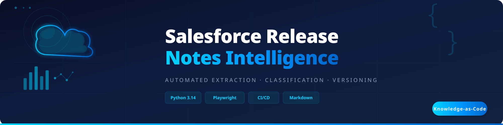
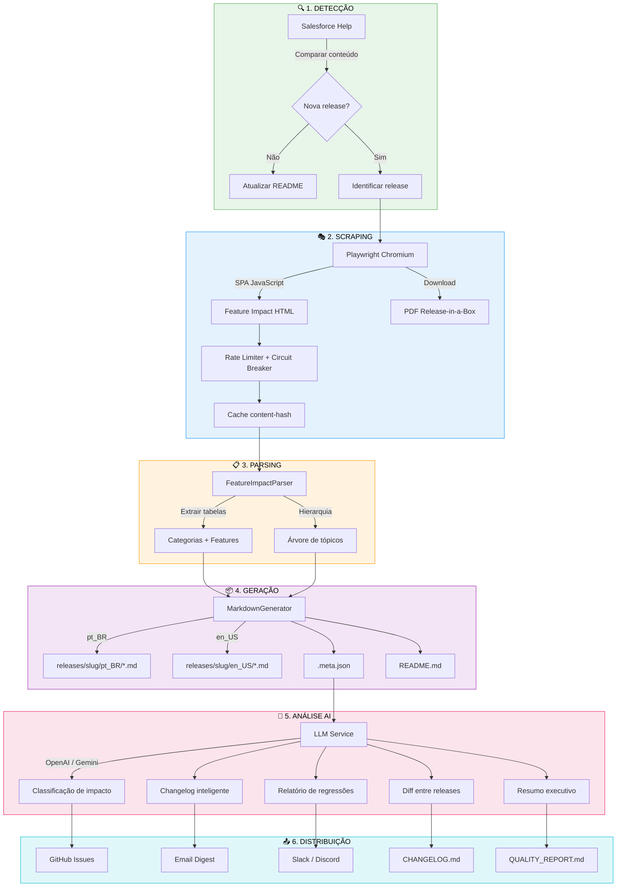
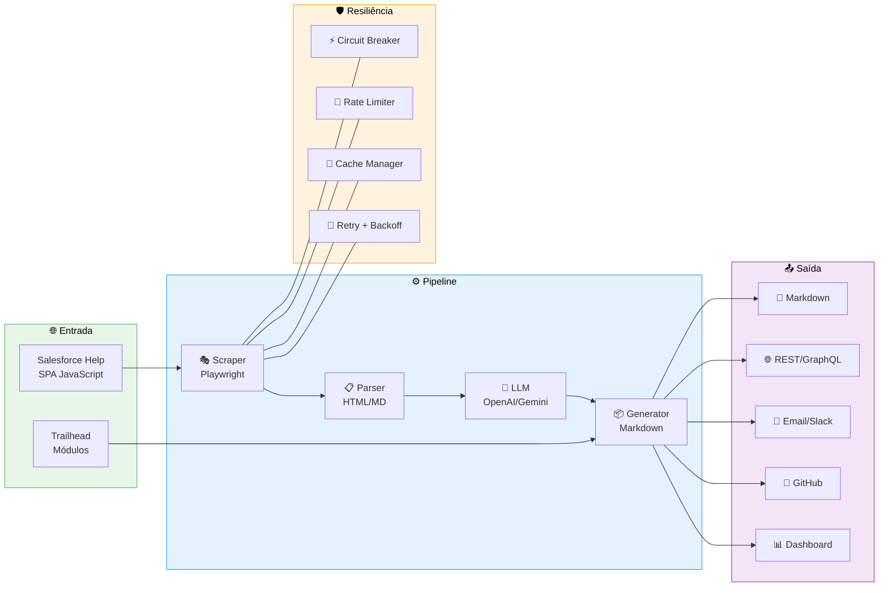
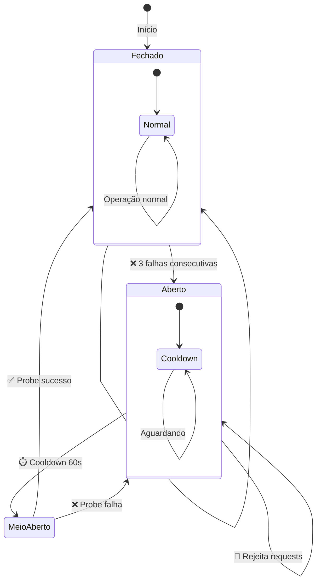
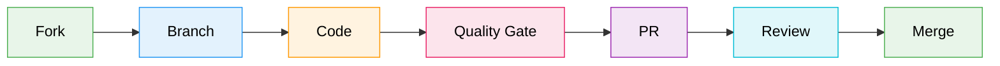

<div align="center">

# 🚀 Salesforce Release Notes Intelligence

### *Knowledge-as-Code para o ecossistema Salesforce*

[](https://github.com/Fatal1tyBarucco/Salesforce-WebDev/actions/workflows/python-quality.yml)
[](https://github.com/Fatal1tyBarucco/Salesforce-WebDev/actions/workflows/release_notes_pipeline.yml)
[](https://fatal1tybarucco.github.io/Salesforce-WebDev/)


**Pipeline automatizado** que transforma as Release Notes da Salesforce em artefatos Markdown estruturados, com análise AI, classificação de impacto e distribuição multi-canal.

[📚 Documentação](https://fatal1tybarucco.github.io/Salesforce-WebDev/) · [🐛 Reportar Bug](https://github.com/Fatal1tyBarucco/Salesforce-WebDev/issues) · [💡 Solicitar Feature](https://github.com/Fatal1tyBarucco/Salesforce-WebDev/issues)

</div>

---


## 📋 Releases Disponíveis

<div style="padding:12px;margin-bottom:20px;border:1px solid #d0d7de;border-radius:6px;background:#f6f8fa;text-align:center;"><strong>🌐 Idioma / Language:</strong> <strong>🇧🇷 Português</strong> | <a href="./README.en.md">🇺🇸 English</a></div>

### ❄️ Winter '27


### ☀️ Summer '26


<details>

<summary><h3>🌸 Spring '26</h3></summary>

> 📊 **Resumo Executivo:** A release Salesforce Spring '26 apresenta um impressionante conjunto de 1.438 novos recursos e aprimoramentos distribuídos por 21 categorias, consolidando a plataforma como referência em inovação para CRM e automação de negócios. O destaque central desta release é a evolução do Agentforce, que agora conta com o Agentforce Builder disponível ao público em geral, permitindo a criação de agentes de IA mais complexos e sofisticados. A categoria Serviço lidera em volume com 167 recursos, transformando o Service Cloud no Serviço Agentforce, com novas capacidades de central de contato, voz, messaging e gerenciamento de serviço de TI. O Aplicativo Móvel acompanha com 187 recursos, garantindo que as equipes possam operar com plena funcionalidade em dispositivos móveis. A Automação oferece 151 recursos incluindo avanços significativos no Flow Builder, com geração de fluxos por IA agora disponível ao público em geral, orquestração de fluxos aprimorada e novas capacidades de processamento em lote de prompts. Os Setores trazem o maior volume de inovações setoriais com 194 recursos, abrangendo desde automotivo e finanças até saúde e serviços públicos. O Gerenciamento de Receita apresenta 131 recursos para otimização de CPQ e billing. Em Vendas, com 85 recursos, o Sales Cloud se transforma em Agentforce Sales, introduzindo geração de leads autônoma, qualificação por IA e nutrição de leads automatizada. A plataforma também avança em Segurança, Identidade e Privacidade com 61 recursos, incluindo novas políticas de aplicativos conectados, login sem senha com chaves de acesso e aprimoramentos no Salesforce Shield. A Análise de Dados com 54 recursos e o Data 360 com 53 recursos expandem as capacidades de insights e gestão de dados. O Desenvolvimento com 97 recursos oferece novas ferramentas para desenvolvedores, incluindo tipos personalizados do Lightning para Agentforce. Com 72 recursos, o Marketing aprimora campanhas e engajamento. Experience Cloud (21 recursos), Personalização (18 recursos), Field Service (41 recursos), MuleSoft (8 recursos), OmniStudio (10 recursos), Hyperforce (5 recursos), Partner Cloud (4 recursos) e Documentação Legal (6 recursos) completam o panorama desta release abrangente. A Spring '26 representa um marco na estratégia da Salesforce de integrar IA generativa e agentes autônomos em todas as camadas da plataforma, capacitando organizações de todos os tamanhos a automatizar processos, aumentar a produtividade e oferecer experiências personalizadas em escala.


<details>
<summary><b>📄 Documentação legal (6 recursos)</b></summary>


> A categoria Documentação Legal da release Spring '26 contém 6 recursos dedicados a atualizações de termos, políticas e conformidade legal da plataforma Salesforce. Estes recursos garantem que as organizações estejam alinhadas com as mais recentes exigências regulatórias e mudanças contratuais, incluindo atualizações de termos de serviço, políticas de privacidade e documentação de conformidade. É essencial que administradores e equipes jurídicas revisem esses recursos para manter a conformidade organizacional.

> 📄 Detalhes completos: [./releases/spring_26/pt_BR/documentacao_legal.md](./releases/spring_26/pt_BR/documentacao_legal.md)

</details>


<details>

<summary><h3>❄️ Winter '26</h3></summary>

> 📊 **Resumo Executivo:** A release Salesforce Winter '26 representa um marco significativo na evolução da plataforma, com impressionantes 1.348 recursos distribuídos em 19 categorias. O volume massivo de novidades reflete a aceleração estratégica da Salesforce em três pilares fundamentais: inteligência artificial generativa e agentes autônomos, unificação de dados em tempo real e modernização da experiência do desenvolvedor.

O destaque absoluto é o ecossistema Agentforce, que consolida a visão de agentes de IA autônomos com 39 recursos dedicados. A plataforma expande o suporte a modelos de IA — incluindo Claude Sonnet 4.5, OpenAI o3/o4-mini e Amazon Nova na Plataforma Einstein — além de introduzir Agentforce Voice para conversas por voz, Rastreamento de sessão para visibilidade do comportamento do agente e Otimização do Agentforce (beta) para análise de eficácia. A migração do Agentforce (padrão) para agentes de funcionários com fluxo simplificado sinaliza a maturidade do produto para uso empresarial em larga escala.

A categoria Setores domina com 459 recursos, demonstrando o compromisso da Salesforce com soluções verticais. Destacam-se: Life Sciences Cloud para Engajamento do Cliente (GA), Agentforce para Healthcare com correspondência inteligente de provedores, Insurance Cloud com automação de declarações, Education Cloud com metas de carreira do aluno via Agentforce, e Manufacturing Cloud com reabastecimento inteligente de inventário. O Partner Cloud, com 156 recursos, inaugura o gerenciamento completo do ciclo de vida de parceiros com Revenue Cloud, Precificação do Salesforce e Gerenciamento de uso avançado.

Vendas (154 recursos) e Desenvolvimento (101 recursos) completam o topo da escala. Em Vendas, o Agentforce SDR evolui para Nutrição de leads com suporte a Microsoft Exchange, enquanto o Flow Builder recebe automação de decisões com IA generativa e fluxos de transmissão para públicos dinâmicos. Em Desenvolvimento, o SLDS 2 chega como GA com modo escuro (beta), o LWC recebe API v65.0 com Gerenciamento de estado (beta) e Lightning Out 2.0 para experiências externas, além de ferramentas de MCP do LWC para acelerar o desenvolvimento com IA.

Análise de dados (91 recursos) impulsiona a era do Tableau Next com semânticas aprimoradas, Otimização de modelo semântico (beta) e integração profunda com Slack via Agentforce para Analytics. Marketing (87 recursos) avança com Marketing Cloud Next, gerenciamento de fidelidade expandido e promoções globais. Segurança (55 recursos) introduz Detecção de dados expandida, rastreamento de atividade do agente em tempo real e Criptografia de banco de dados GA.

A infraestrutura Hyperforce expande para mais regiões com suporte a AWS Direct Connect e Continuidade avançada entre regiões. O Data Cloud é renomeado para Data 360, consolidando a visão de dados unificados. Field Service (24 recursos) adiciona escala dinâmica e VRA de múltiplos participantes. Personalização (65 recursos) moderniza a experiência administrativa com classificação por várias colunas em listas e segmentação expandida do Data 360. A estratégia de descontinuação é clara: Chat legado, Salesforce para Outlook (dez/2027), Lightning Sync para EWS e Salesforce Functions estão sendo aposentados.

Em suma, a Winter '26 posiciona o Salesforce como uma plataforma de agentes de IA empresariais, com dados unificados via Data 360, soluções verticais profundas e uma experiência de desenvolvimento modernizada. A direção estratégica é inequívoca: cada interação de negócio será mediada por agentes inteligentes, cada decisão será informada por dados unificados e cada setor terá soluções nativas específicas.


<details>
<summary><b>📄 Documentação legal (11 recursos)</b></summary>


> Com 11 recursos, esta categoria foca em informações estruturais da release. Inclui atualizações sobre navegadores compatíveis para Lightning Experience, Salesforce Classic e CRM Analytics. Documenta como e quando os recursos ficam disponíveis, com impacto imediato para alguns e ação de administrador para outros. As mudanças na documentação visam facilitar a localização de informações sobre compatibilidade e disponibilidade de recursos.

> 📄 Detalhes completos: [./releases/winter_26/pt_BR/documentacao_legal.md](./releases/winter_26/pt_BR/documentacao_legal.md)

</details>


## 🏗️ Como Funciona

### Fluxo do Pipeline


```mermaid
flowchart TB
    subgraph DETECT["🔍 1. DETECÇÃO"]
        A[Salesforce Help] -->|Comparar conteúdo| B{Nova release?}
        B -->|Não| C[Atualizar README]
        B -->|Sim| D[Identificar release]
    end

    subgraph SCRAPE["🎭 2. SCRAPING"]
        D --> E[Playwright Chromium]
        E -->|SPA JavaScript| F[Feature Impact HTML]
        E -->|Download| G[PDF Release-in-a-Box]
        F --> H[Rate Limiter + Circuit Breaker]
        H --> I[Cache content-hash]
    end

    subgraph PARSE["📋 3. PARSING"]
        I --> J[FeatureImpactParser]
        J -->|Extrair tabelas| K[Categorias + Features]
        J -->|Hierarquia| L[Árvore de tópicos]
    end

    subgraph GENERATE["📦 4. GERAÇÃO"]
        K --> M[MarkdownGenerator]
        L --> M
        M -->|pt_BR| N[releases/slug/pt_BR/*.md]
        M -->|en_US| O[releases/slug/en_US/*.md]
        M --> P[.meta.json]
        M --> Q[README.md]
    end

    subgraph AI["🧠 5. ANÁLISE AI"]
        P --> R[LLM Service]
        R -->|OpenAI / Gemini| S[Classificação de impacto]
        R --> T[Changelog inteligente]
        R --> U[Relatório de regressões]
        R --> V[Diff entre releases]
        R --> W[Resumo executivo]
    end

    subgraph NOTIFY["📤 6. DISTRIBUIÇÃO"]
        S --> X[GitHub Issues]
        T --> Y[Email Digest]
        U --> Z[Slack / Discord]
        V --> AA[CHANGELOG.md]
        W --> AB[QUALITY_REPORT.md]
    end

    style DETECT fill:#E8F5E9,stroke:#4CAF50,color:#000
    style SCRAPE fill:#E3F2FD,stroke:#2196F3,color:#000
    style PARSE fill:#FFF3E0,stroke:#FF9800,color:#000
    style GENERATE fill:#F3E5F5,stroke:#9C27B0,color:#000
    style AI fill:#FCE4EC,stroke:#E91E63,color:#000
    style NOTIFY fill:#E0F7FA,stroke:#00BCD4,color:#000
```

### Arquitetura em Camadas


```mermaid
flowchart LR
    subgraph ENTRADA["🌐 Entrada"]
        SF[Salesforce Help<br/>SPA JavaScript]
        TH[Trailhead<br/>Módulos]
    end

    subgraph PIPELINE["⚙️ Pipeline"]
        SCRAPER[🎭 Scraper<br/>Playwright]
        PARSER[📋 Parser<br/>HTML/MD]
        LLM[🧠 LLM<br/>OpenAI/Gemini]
        GEN[📦 Generator<br/>Markdown]
    end

    subgraph RESILIENCIA["🛡️ Resiliência"]
        CB[⚡ Circuit Breaker]
        RL[🚦 Rate Limiter]
        CACHE[💾 Cache Manager]
        RETRY[🔄 Retry + Backoff]
    end

    subgraph SAIDA["📤 Saída"]
        MD[📄 Markdown]
        API[🌐 REST/GraphQL]
        NOTIF[📧 Email/Slack]
        GH[🐙 GitHub]
        DASH[📊 Dashboard]
    end

    SF --> SCRAPER
    TH --> GEN
    SCRAPER --> PARSER
    PARSER --> LLM
    LLM --> GEN

    SCRAPER --- CB
    SCRAPER --- RL
    SCRAPER --- CACHE
    SCRAPER --- RETRY

    GEN --> MD
    GEN --> API
    GEN --> NOTIF
    GEN --> GH
    GEN --> DASH

    style ENTRADA fill:#E8F5E9,stroke:#4CAF50,color:#000
    style PIPELINE fill:#E3F2FD,stroke:#2196F3,color:#000
    style RESILIENCIA fill:#FFF3E0,stroke:#FF9800,color:#000
    style SAIDA fill:#F3E5F5,stroke:#9C27B0,color:#000
```

---

## ⚡ Quick Start

### Pré-requisitos

| Requisito | Versão | Instalação |
|:----------|:-------|:-----------|
| Python | 3.13+ | [python.org](https://www.python.org/) |
| uv | Latest | `curl -LsSf https://astral.sh/uv/install.sh \| sh` |
| Playwright | Chromium | `uv run playwright install chromium` |

### Instalação

```bash
# 1. Clone o repositório
git clone https://github.com/Fatal1tyBarucco/Salesforce-WebDev.git
cd Salesforce-WebDev

# 2. Instale dependências
uv sync --extra dev

# 3. Instale o navegador Playwright
uv run playwright install chromium

# 4. Instale os hooks de pré-commit (ruff, black, mypy, pytest)
uv run pre-commit install
uv run pre-commit install --hook-type pre-push

# 5. Configure as chaves LLM (pelo menos uma)
export OPENAI_API_KEY="sk-..."    # ou
export GOOGLE_API_KEY="AIza..."   # ou
export OPENCODE_API_KEY="..."     # ou
export MIMOCODE_API_KEY="..."
```

### Execução

```bash
# Pipeline completo
uv run python src/main.py

# Release específica
uv run python src/main.py --release summer_26

# Dry run (sem escrever arquivos)
uv run python src/main.py --dry-run

# Iniciar API server
uv run python -c "from src.api import start_api_server; start_api_server()"

# Iniciar health server
uv run python -c "from src.health import start_health_server; start_health_server()"
```

---

## 🛡️ Resiliência

O pipeline foi projetado para operar de forma autônoma e resiliente:


```mermaid
stateDiagram-v2
    [*] --> Fechado: Início

    Fechado --> Fechado: ✅ Sucesso
    Fechado --> Aberto: ❌ 3 falhas consecutivas

    Aberto --> Aberto: 🚫 Rejeita requests
    Aberto --> MeioAberto: ⏱️ Cooldown 60s

    MeioAberto --> Fechado: ✅ Probe sucesso
    MeioAberto --> Aberto: ❌ Probe falha

    state Fechado {
        [*] --> Normal
        Normal --> Normal: Operação normal
    }

    state Aberto {
        [*] --> Cooldown
        Cooldown --> Cooldown: Aguardando
    }
```

| Componente | Configuração | Comportamento |
|:-----------|:-------------|:--------------|
| ⚡ **Circuit Breaker** | 3 falhas → 60s cooldown | Para após falhas consecutivas, retoma automaticamente |
| 🚦 **Rate Limiter** | Token-bucket, 2 req/s | Respeita limites do Salesforce |
| 🔄 **Retry** | 5 tentativas, backoff exponencial | `2^n` segundos + jitter aleatório |
| 💾 **Cache TTL** | 24h (metadata), 30d (content-hash) | Evita refetch de conteúdo inalterado |
| ⏱️ **Timeout** | 30s (HTTP), 60s (LLM) | Nunca fica preso indefinidamente |

---

## 🧪 Qualidade de Código

```bash
# Quality gate completa (mesma do CI)
uv run ruff check src/          # Linter
uv run black --check src/       # Formatter
uv run mypy src/                # Type checker (strict)
uv run pytest tests/ --cov=src --cov-fail-under=95  # Tests + coverage
```

| Ferramenta | Configuração | Status |
|:-----------|:-------------|:------:|
| 🐍 **Python** | 3.13, type hints completos | ✅ |
| 🔍 **Mypy** | `strict = true` | ✅ |
| ⚡ **Ruff** | `line-length = 100` | ✅ |
| 🖤 **Black** | `target-version = py313` | ✅ |
| 🧪 **Pytest** | 95%+ cobertura | ✅ |
| 📦 **uv** | Lock file determinístico | ✅ |

---

## 🤖 Automação AI

O pipeline utiliza LLM (OpenAI, Google Gemini, OpenCode, MiMoCode) para gerar conteúdo inteligente:

### Enriquecimento de Features (`feature_enricher.py`)

Cada feature das release notes recebe automaticamente:
- **Descrição profissional** com contexto de negócio
- **Classificação de impacto**: 🔴 Alto / 🟡 Médio / 🟢 Baixo
- **Audiência identificada**: Usuários / Admins / Ambos

```markdown
| Recurso | Descrição | Impacto |
| :--- | :--- | :---: |
| **Voice Feature** | Permite interação por voz com Agentforce, reduzindo ~40% do tempo em tarefas repetitivas. | 🔴 alto |
```

### Resumos Executivos (`release_summarizer.py`)

Cada release recebe um resumo completo com:
- **Visão Geral**: 3-5 frases com escopo e foco principal
- **Impacto para o Negócio**: valor concreto com exemplos reais
- **Temas Estratégicos**: AI-First, Security, Developer Experience, etc.
- **Top 5 Categorias**: com destaque e percentual
- **Notas de Migração**: considerações para administradores

### Introduções por Categoria

Cada arquivo de categoria inclui:
- Parágrafo introdutório AI sobre o tema e mudanças mais importantes
- Linha de impacto: `🔴 5 alto | 🟡 12 médio | 🟢 3 baixo`

### Cadeia de Fallback

```
OpenAI → Google Gemini → OpenCode → MiMoCode → Classificação Heurística
```

Quando nenhum LLM está disponível, o sistema usa classificação por keywords como fallback.

---

## 🌐 API

O projeto expõe uma API REST + GraphQL standalone (zero dependências externas):

### Autenticação

Quando a variável de ambiente `API_KEY` está definida, todos os endpoints (exceto `/health`, `/ready`, `/metrics`, `/openapi.json`) requerem autenticação:

```bash
# Via header X-API-Key
curl -H "X-API-Key: *** http://localhost:8081/releases

# Via Authorization Bearer
curl -H "Authorization: Bearer *** http://localhost:8081/releases
```

### REST

```bash
# Listar todas as releases
curl http://localhost:8081/releases

# Detalhes de uma release
curl http://localhost:8081/releases/summer_26

# Features de uma categoria
curl http://localhost:8081/releases/summer_26/categories/agentforce

# Comparar duas releases
curl http://localhost:8081/diff/summer_26/spring_26
```

### GraphQL

```bash
# Query flexível
curl -X POST http://localhost:8081/graphql \
  -H "Content-Type: application/json" \
  -d '{"query": "{ releases { name totalFeatures categories { name count } } }"}'
```

### Health & Metrics

```bash
# Health check
curl http://localhost:8080/health

# Readiness probe
curl http://localhost:8080/ready

# Prometheus metrics (prometheus-client quando instalado)
curl http://localhost:8080/metrics
```

---

## 📁 Estrutura do Projeto

```
Salesforce-WebDev/
│
├── 📂 src/                          # Código fonte
│   ├── main.py                      # 🎯 Orquestrador principal + DI
│   ├── orchestrator.py              # 🔄 Pipeline orchestrator
│   ├── scraper.py                   # 🎭 Playwright + Circuit Breaker
│   ├── parser.py                    # 📋 Parser HTML/Markdown
│   ├── llm_service.py               # 🧠 Multi-provider LLM + Rate Limiting
│   ├── feature_enricher.py          # 📝 Enriquecimento AI por feature
│   ├── release_summarizer.py        # 📋 Resumos executivos por release
│   ├── release_docs.py              # 📄 Geração de documentação por release
│   ├── generator.py                 # 📦 Geração Markdown
│   ├── config.py                    # ⚙️ Configuração central
│   ├── exceptions.py                # ⚠️ Hierarquia de exceções
│   ├── circuit_breaker.py           # ⚡ Circuit Breaker unificado
│   ├── cache_manager.py             # 💾 Cache TTL + content-hash
│   ├── health.py                    # 🏥 Health checks + Prometheus metrics
│   ├── api.py                       # 🌐 REST + GraphQL + Auth + OpenAPI
│   ├── events.py                    # 📡 EventBus pub/sub assíncrono
│   ├── models.py                    # 📐 Modelos Pydantic
│   ├── notifications.py             # 📧 Email/Slack/Discord
│   ├── salesforce.py                # 🔗 Trailhead integration
│   ├── feature_classifier.py        # 🏷️ Classificação via LLM
│   ├── heuristic_classifier.py      # 🏷️ Classificação heurística (fallback)
│   ├── impact_analyzer.py           # 📊 Análise de impacto
│   ├── issue_triage.py              # 🐙 Triage automático
│   ├── logger.py                    # 📝 Logging JSON + Sentry
│   ├── translator.py                # 🌍 Tradução via LLM
│   ├── dashboard.py                 # 📈 Dashboard HTML interativo
│   ├── dashboard_template.html      # 🎨 Template do dashboard
│   ├── nl_search.py                 # 🔍 Busca semântica
│   ├── i18n.py                      # 🌐 Internacionalização
│   └── automation/                  # 🤖 Pacote de automação AI
│       ├── service.py               #    Facade principal
│       ├── reporting.py             #    Relatórios AI (changelog, diff, resumos)
│       ├── comparison.py            #    Comparação entre releases
│       ├── impact.py                #    Scores de impacto + predição
│       ├── content.py               #    Deduplicação + content-hash
│       ├── export.py                #    Exportação JSON/CSV
│       ├── github_ops.py            #    GitHub Issues
│       ├── notifications.py         #    Notificações filtradas
│       ├── models.py                #    Dataclasses
│       └── badge.py                 #    Badges dinâmicos
│
├── 📂 releases/                     # 📄 Artefatos Markdown versionados
│   ├── summer_26/                   #    v2.1.0
│   ├── spring_26/                   #    v2.0.0
│   └── winter_26/                   #    v2.2.0
│
├── 📂 tests/                        # 🧪 Testes pytest (95%+ cobertura)
├── 📂 docs/                         # 📚 Documentação MkDocs
├── 📂 k8s/                          # ☸️ Manifestos Kubernetes
├── 📂 stubs/                        # 📝 Type stubs (tenacity, google-genai)
├── 📂 .github/workflows/            # 🔄 CI/CD GitHub Actions
│
├── mkdocs.yml                       # 📖 Config MkDocs
├── pyproject.toml                   # 📦 Config do projeto (Python >=3.13,<3.14)
├── uv.lock                          # 🔒 Lock file
├── Dockerfile                       # 🐳 Multi-stage build
└── .pre-commit-config.yaml          # 🪝 Pre-commit hooks
```

---

## 🤝 Contribuição


```mermaid
flowchart LR
    A[Fork] --> B[Branch]
    B --> C[Code]
    C --> D[Quality Gate]
    D --> E[PR]
    E --> F[Review]
    F --> G[Merge]

    style A fill:#E8F5E9,stroke:#4CAF50,color:#000
    style B fill:#E3F2FD,stroke:#2196F3,color:#000
    style C fill:#FFF3E0,stroke:#FF9800,color:#000
    style D fill:#FCE4EC,stroke:#E91E63,color:#000
    style E fill:#F3E5F5,stroke:#9C27B0,color:#000
    style F fill:#E0F7FA,stroke:#00BCD4,color:#000
    style G fill:#E8F5E9,stroke:#4CAF50,color:#000
```

1. **Fork** o repositório
2. Crie uma branch: `git checkout -b feature/minha-feature`
3. Instale dependências: `uv sync --extra dev`
4. Execute a quality gate completa:
   ```bash
   uv run ruff check src/ && uv run black --check src/ && uv run mypy src/ && uv run pytest --cov=src --cov-fail-under=95
   ```
5. Commit: `git commit -m 'feat: descrição da alteração'`
6. Push: `git push origin feature/minha-feature`
7. Abra um **Pull Request**

---

## 📄 Licença

Este projeto é mantido para fins educacionais e de referência técnica.

---

<div align="center">

**Feito com ☕ e código Python**

[⬆ Voltar ao topo](#-salesforce-release-notes-intelligence)

</div>
