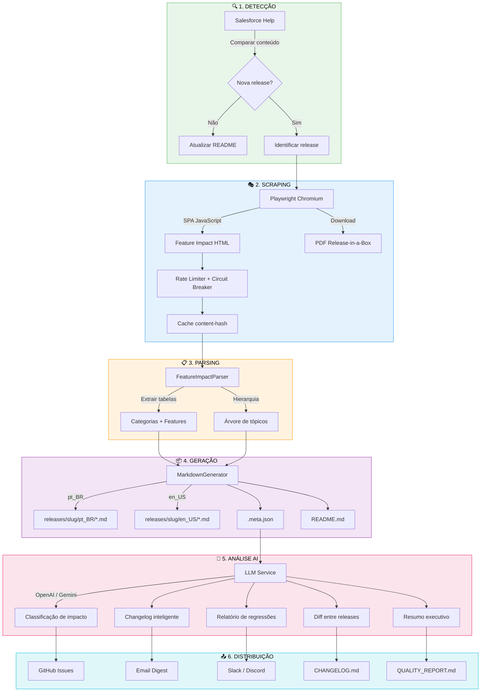
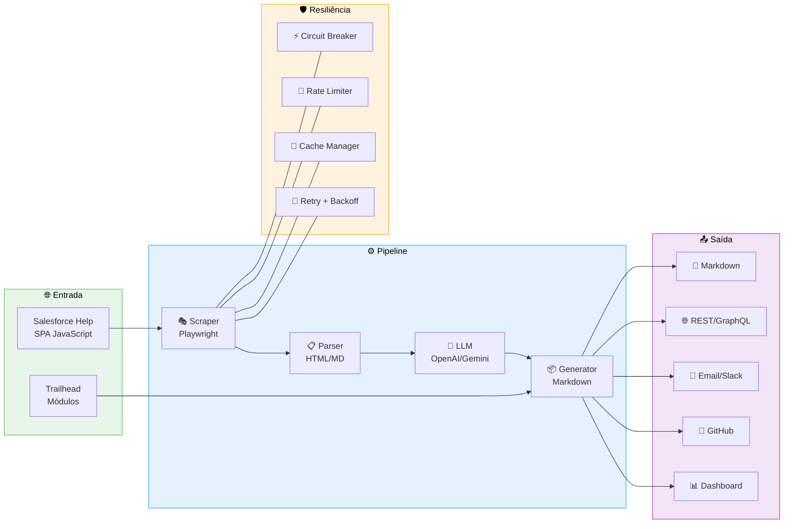
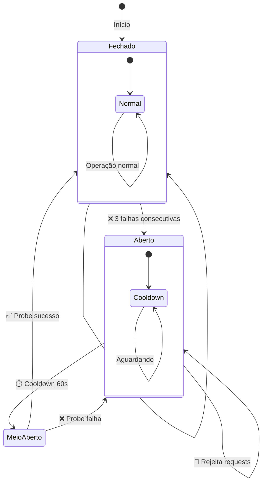
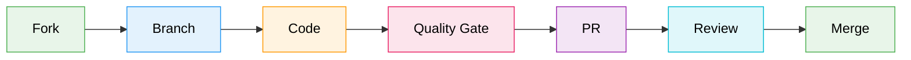

<div align="center">


</div>

<div align="center">

# 🚀 Salesforce Release Notes Intelligence

### *Knowledge-as-Code para o ecossistema Salesforce*

[](https://github.com/Fatal1tyBarucco/Salesforce-WebDev/actions/workflows/python-quality.yml)
[](https://github.com/Fatal1tyBarucco/Salesforce-WebDev/actions/workflows/release_notes_pipeline.yml)
[](https://fatal1tybarucco.github.io/Salesforce-WebDev/)


**Pipeline automatizado** que transforma as Release Notes da Salesforce em artefatos Markdown estruturados, com análise AI, classificação de impacto e distribuição multi-canal.

[📚 Documentação](https://fatal1tybarucco.github.io/Salesforce-WebDev/) · [🐛 Reportar Bug](https://github.com/Fatal1tyBarucco/Salesforce-WebDev/issues) · [💡 Solicitar Feature](https://github.com/Fatal1tyBarucco/Salesforce-WebDev/issues)

</div>

---


## 📋 Releases Disponíveis

<div style="padding:12px;margin-bottom:20px;border:1px solid #d0d7de;border-radius:6px;background:#f6f8fa;text-align:center;"><strong>🌐 Idioma / Language:</strong> <strong>🇧🇷 Português</strong> | <a href="./README.en.md">🇺🇸 English</a></div>

### ❄️ Winter '27

> 📊 **Resumo Executivo:** A release Winter '27 apresenta um conjunto robusto de 1.123 novos recursos e aprimoramentos distribuídos por 19 categorias, representando a evolução contínua da plataforma Salesforce com foco em Agentforce, Experience Cloud e soluções setoriais. O destaque central é a consolidação do Agentforce como pilar estratégico da plataforma, com 129 recursos dedicados à criação, configuração e otimização de agentes de IA autônomos para diferentes cenários de negócio. A categoria Setores lidera em volume com 286 recursos, oferecendo soluções especializadas para indústrias específicas, desde manufatura até serviços financeiros e saúde. O Experience Cloud emerge como segunda maior categoria com 143 recursos, focando em experiências digitais modernas baseadas em LWR (Lightning Web Runtime) com novos templates, componentes e capacidades de engajamento. O Serviço (140 recursos) transforma a central de atendimento com Agentforce, introduzindo roteamento inteligente, assistentes de IA para agentes e métricas de qualidade de atendimento. O Gerenciamento de Receita (123 recursos) aprimora processos de cotação, precificação e faturamento com automação avançada. O Partner Cloud (38 recursos) expande as capacidades de ecossistema, enquanto o Field Service (37 recursos) melhora a gestão de operações de campo. A plataforma também avança em Segurança (25 recursos), Automação (72 recursos) e Data 360 (7 recursos), garantindo que as organizações possam operar com maior eficiência, segurança e inteligência artificial integrada em todos os processos.

> 📌 **Temas-Chave:** Agentforce para Todos • Experiências Digitais Modernas • Soluções Setoriais Profundas • Atendimento Autônomo • Ecosistema de Parceiros

<details>
<summary><h3>☀️ Summer '26</h3></summary>

> 📊 **Resumo Executivo:** A release Summer '26 do Salesforce representa um marco significativo na evolução da plataforma, com um total de 1.434 novos recursos distribuídos em 22 categorias. Esta release consolida a inteligência artificial como eixo central da estratégia Salesforce, com o Agentforce se expandindo transversalmente por praticamente todas as áreas da plataforma — desde vendas e serviço até setores verticais e desenvolvimento.

Destaques principais incluem a nova geração do Tableau Next, com integração profunda ao Data 360 e capacidades avançadas de análise em tempo real, incluindo incorporação de Lightning Web Components em dashboards e suporte a previsões de métricas nativas. O Flow Builder recebeu 118 recursos na categoria Automação, incluindo integração direta com Agentforce, suporte a linguagem natural para atualização de fluxos de tela e orquestração de fluxos como recurso padrão.

O Data 360 expandiu significativamente com 72 recursos, incluindo novas capacidades de ingestão do Databricks, Microsoft Fabric OneLake e AWS Glue Data Catalog, além de modelos preditivos com novo runtime padrão e análise de sentimento em tempo real. A categoria Desenvolvimento trouxe 127 recursos com foco em Lightning Web Components API v67.0, Agentforce DX, MCP Servers e o novo Salesforce MultiFramework para aplicativos React.

Setores verticais lidera em volume com 309 recursos, abrangendo automotivo, seguros, saúde, educação, manufatura, mídia, energia e setor público. O Gerenciamento de Receita avançou com 97 recursos incluindo novas capacidades de billing, pagamentos automatizados e orquestração dinâmica. A categoria Serviço trouxe 196 recursos com foco em centrais de contato Agentforce, IT Service Management e autoatendimento aprimorado.

Segurança, identidade e privacidade consolidou 58 recursos com melhorias em Shield Platform Encryption, detecção de dados sensíveis e o novo Security Center com Agentforce. Marketing avançou com 64 recursos incluindo Marketing Cloud Next, inteligência de marketing e gerenciamento de fidelidade. A integração com Slack, MuleSoft e o aplicativo móvel também receberam atualizações relevantes.

A release Summer '26 posiciona o Salesforce como uma plataforma de IA-first, onde Agentforce não é apenas um produto isolado mas uma camada de inteligência que permeia toda a experiência do cliente, desde o primeiro contato até o fidelização e suporte pós-venda.


<details>
<summary><b>📄 Documentação legal (6 recursos)</b></summary>


> A categoria Documentação legal reúne 6 recursos referentes à estrutura documental da release Summer '26. Inclui informações sobre como e quando os recursos ficam disponíveis, a localização da Ajuda do Salesforce, documentação técnica e notas da versão. Esta categoria serve como referência para administradores e usuários que precisam entender os ciclos de disponibilidade dos recursos, destacando que algumas funcionalidades são ativadas imediatamente após o release, enquanto outras requerem ação direta do administrador.

> 📄 Detalhes completos: [./releases/summer_26/pt_BR/documentacao_legal.md](./releases/summer_26/pt_BR/documentacao_legal.md)

</details>


<details>
<summary><b>📄 Salesforce geral (36 recursos)</b></summary>


> Com 36 recursos, a categoria Salesforce geral abrange melhorias transversais à plataforma. Destaques incluem rotação mais frequente de certificados, preparação para IPv6, atualização de certificados mTLS e validação de domínios. O Chatter agora é desativado por padrão em novas organizações. Salesforce Foundations trouxe pontuação de pessoas para priorização de leads e rastreamento de web. O aplicativo Arquivar recebeu novas configurações e status de atividade. Melhorias de acessibilidade foram implementadas para zoom superior a 200%, seletores de data, popovers e listas de tarefas do Lightning.

> 📄 Detalhes completos: [./releases/summer_26/pt_BR/salesforce_geral.md](./releases/summer_26/pt_BR/salesforce_geral.md)

</details>


<details>
<summary><b>📄 Agentforce (1 recursos)</b></summary>


> A categoria Agentforce apresenta 1 recurso nesta release, focado em capacidades de voz (Voice feature). O Agentforce continua sua expansão como camada de inteligência artificial transversal, com integrações profundas aparecendo em diversas outras categorias como Automação, Serviço, Field Service, Setores e Vendas. Os módulos Trailhead recomendados incluem Agentforce Basics, Build an Agent with Agentforce e Agentforce for Developers, cobrindo desde conceitos fundamentais até implementação avançada.

> 📄 Detalhes completos: [./releases/summer_26/pt_BR/agentforce.md](./releases/summer_26/pt_BR/agentforce.md)

</details>


<details>
<summary><b>📄 Análise de dados (58 recursos)</b></summary>


> Com 58 recursos, a categoria Análise de dados apresenta inovações profundas lideradas pelo Tableau Next. Destaques incluem integração com Data 360 para análise de objetos do Data Lake, modos de dados configuráveis para otimização de performance, filtragem em múltiplos modelos de dados, previsões de métricas com séries temporais e o novo framework de modelos de aplicativo. O CRM Analytics recebeu melhorias em semijunções e antijunções SAQL, paletas de cores de marca para relatórios, incorporação de LWC em dashboards e exportação para Azure Data Lake. A segurança foi reforçada com OAuth para conexões externas e proteção de exportações Excel.

> 📄 Detalhes completos: [./releases/summer_26/pt_BR/analise_de_dados.md](./releases/summer_26/pt_BR/analise_de_dados.md)

</details>


<details>
<summary><b>📄 Automação (118 recursos)</b></summary>


> A categoria Automação é a segunda maior da release com 118 recursos, centrada no Flow Builder. Destaques incluem integração direta com Agentforce para criação de agentes, atualização de fluxos com linguagem natural (beta), operadores de data em lógica de decisão, orquestração de fluxos como recurso padrão e suporte a MuleSoft para fluxo com conectores de terceiros. O Marketing Cloud do Fluxo permite personalização de mensagens com dados integrados. O Mecanismo de regras de negócios ganhou controle de versão de tabelas de decisão e escalabilidade aprimorada. O Serviço de contexto e o Mecanismo de processamento de dados expandem as capacidades de transformação de dados em escala.

> 📄 Detalhes completos: [./releases/summer_26/pt_BR/automacao.md](./releases/summer_26/pt_BR/automacao.md)

</details>


<details>
<summary><b>📄 OmniStudio (9 recursos)</b></summary>


> Com 9 recursos, a categoria OmniStudio inclui controle de versão do Data Mapper para consistência de implementação, alternância entre designers padrão e gerenciado, migração para runtime padrão via Assistente de migração e o OmniStudio MCP (beta) para acelerar desenvolvimento de FlexCards. Melhorias de acessibilidade foram implementadas e ações do FlexCard agora podem ser abertas em novas janelas. O recurso de chamar fluxos iniciados automaticamente em FlexCards está em piloto.

> 📄 Detalhes completos: [./releases/summer_26/pt_BR/omnistudio.md](./releases/summer_26/pt_BR/omnistudio.md)

</details>


<details>
<summary><b>📄 Personalização (33 recursos)</b></summary>


> A categoria Personalização reúne 33 recursos abrangendo AgentExchange com exploração de soluções MCP, Serviços externos com suporte a enumerações e arquivos binários, Globalização com suporte a novos fusos horários e traduções para catalão e basco. A Configuração com Agentforce está agora em disponibilidade geral para simplificar tarefas administrativas. O Compartilhamento ganhou opções de hierarquia de papéis para filas e atualização mais rápida de padrões organizacionais. Salesforce Connect suporta credenciais nomeadas entre organizações.

> 📄 Detalhes completos: [./releases/summer_26/pt_BR/personalizacao.md](./releases/summer_26/pt_BR/personalizacao.md)

</details>


<details>
<summary><b>📄 Data 360 (72 recursos)</b></summary>


> Com 72 recursos, a categoria Data 360 expande significativamente as capacidades de dados unificados. Novos conectores incluem Databricks (GA), Microsoft Fabric OneLake (beta), AWS Glue Data Catalog e acesso em tempo real sem pipeline. O gráfico de dados ganhou limites maiores, streaming para atualizações rápidas e histórico de atualização. Modelos de IA agora incluem agrupamento, séries temporais, análise de sentimento e classificação de tópico. A extensão de código permite transformações personalizadas e o Vibes do Agentforce facilita criação com linguagem natural. Ativações suportam Amazon S3, Meta, Snapchat e plataformas de parceiros.

> 📄 Detalhes completos: [./releases/summer_26/pt_BR/data_360.md](./releases/summer_26/pt_BR/data_360.md)

</details>


<details>
<summary><b>📄 Desenvolvimento (127 recursos)</b></summary>


> A maior categoria com 127 recursos, Desenvolvimento cobre LWC API v67.0 com melhorias de performance, visualização de componentes no VS Code, gerentes de estado e suporte RTL. Lightning Out 2.0 agora suporta componentes Aura. Microfrontendas permitem integração de apps web externos. Apex ganhou strings multilinhas, operações de banco em modo de usuário por padrão e remoção de WITH SECURITY_ENFORCED. Agentforce DX inclui servidor MCP e o novo Vibes IDE. React Apps com MultiFramework estão em GA. APIs ganharam suporte a JWT para SOAP, consultas SQL do Apex e GraphQL aprimorado.

> 📄 Detalhes completos: [./releases/summer_26/pt_BR/desenvolvimento.md](./releases/summer_26/pt_BR/desenvolvimento.md)

</details>


<details>
<summary><b>📄 Experience Cloud (14 recursos)</b></summary>


> Com 14 recursos, a categoria Experience Cloud foca em sites Aura e LWR com experiências de autoatendimento assistido por IA, suporte a Chatter em novas organizações e verificação de malware em arquivos. Fluxos de tela ganharam tabelas de dados com registros relacionados, substituições de estilo e imagens de recurso estático. O Experience Builder recebeu grupos de botões de opção empilhados e suporte a upload de arquivos maiores. Segurança foi aprimorada com permissão para envio de emails por todos os usuários do site.

> 📄 Detalhes completos: [./releases/summer_26/pt_BR/experience_cloud.md](./releases/summer_26/pt_BR/experience_cloud.md)

</details>


<details>
<summary><b>📄 Field Service (48 recursos)</b></summary>


> A categoria Field Service apresenta 48 recursos com foco em Agentforce para agendamento autônomo, incluindo criação de agentes no novo Agentforce Builder, alcance por email e WhatsApp e Employee Agent para gestão de compromissos. O novo console de agendamento transforma a experiência de despacho. Insights móveis (beta) impulsionam eficiência operacional. Captura de dados ganhou fluxos pré-preenchidos com repetidores e personalização de estilo. Mapas GIS nativos melhoram precisão de local. O Assistente remoto visual suporta sessões seguras multi-app via Omni-Channel.

> 📄 Detalhes completos: [./releases/summer_26/pt_BR/field_service.md](./releases/summer_26/pt_BR/field_service.md)

</details>


<details>
<summary><b>📄 Hyperforce (3 recursos)</b></summary>


> Com 3 recursos, a categoria Hyperforce expande o acesso ao Salesforce em mais regiões geográficas, adiciona novos produtos e recursos na Defesa do Government Cloud e aprimora a continuidade avançada entre regiões com objetivos de recuperação mais rápidos. Esta infraestrutura global continua sendo fundamental para a escalabilidade e resiliência da plataforma.

> 📄 Detalhes completos: [./releases/summer_26/pt_BR/hyperforce.md](./releases/summer_26/pt_BR/hyperforce.md)

</details>


<details>
<summary><b>📄 Setores (309 recursos)</b></summary>


> A maior categoria da release com 309 recursos, Setores abrange verticals completos. Automotive inclui Agentforce para gestão de garantia, finanças automotivas e validação de documentos com IA. Educação trouxe agentes de recrutamento, planejamento financeiro e pesquisa de cursos. Serviços Financeiros inclui banking, digital lending e hierarquias flexíveis. Saúde cobriu autorização prévia, gerenciamento de cuidados e Home Health. Seguros abrange administração de apólices, reclamações e corretagem. Life Sciences inclui planejamento de engajamento e inteligência de conteúdo. Manufacturing, mídia, energia, setor público e sem fins lucrativos também receberam atualizações significativas.

> 📄 Detalhes completos: [./releases/summer_26/pt_BR/setores.md](./releases/summer_26/pt_BR/setores.md)

</details>


<details>
<summary><b>📄 Marketing (64 recursos)</b></summary>


> Com 64 recursos, a categoria Marketing apresenta o Marketing Cloud Next com criação de público, conteúdo e campanhas. Account Engagement simplifica gerenciamento de consentimento e sincronização de campanhas. Marketing Cloud Engagement organiza jornadas e otimiza WhatsApp com rastreamento de anúncio. Inteligência de marketing unifica dados para visibilidade completa com Agentforce. Personalização do Salesforce inclui campanhas e gráfico de perfil. Gerenciamento de fidelidade ganhou moedas baseadas em atividade, Google Wallet e painéis Tableau Next. Promoções globais e marketing de indicação completam a categoria.

> 📄 Detalhes completos: [./releases/summer_26/pt_BR/marketing.md](./releases/summer_26/pt_BR/marketing.md)

</details>


<details>
<summary><b>📄 MuleSoft (8 recursos)</b></summary>


> Com 8 recursos, a categoria MuleSoft foca no Catálogo de API para Salesforce com mapeamento de agentes e modelos de prompts para ferramentas do servidor MCP. Servidores MCP do MuleSoft podem ser trazidos ao catálogo de API (GA) e descobertos manualmente. APIs de consulta nomeadas são visualizadas no catálogo com ações ativáveis. A Inteligência de integração do MuleSoft aprimora a conectividade entre sistemas.

> 📄 Detalhes completos: [./releases/summer_26/pt_BR/mulesoft.md](./releases/summer_26/pt_BR/mulesoft.md)

</details>


<details>
<summary><b>📄 Aplicativo móvel (17 recursos)</b></summary>


> A categoria Aplicativo móvel reúne 17 recursos incluindo personalização da página inicial (beta), transcrição de IA móvel para reuniões presenciais e a nova interface Liquid Glass. O login por email é agora padrão e a opção Login para administrador garante acesso seguro. Mobile Publisher suporta renomeação e arquivamento de projetos. Agentforce Voice e React Native integram IA ao aplicativo móvel, com personalização via tipos do Lightning.

> 📄 Detalhes completos: [./releases/summer_26/pt_BR/aplicativo_movel.md](./releases/summer_26/pt_BR/aplicativo_movel.md)

</details>


<details>
<summary><b>📄 Partner Cloud (100 recursos)</b></summary>


> Com 100 recursos, a categoria Partner Cloud consolida funcionalidades de Revenue Cloud para parceiros, incluindo catálogo de produtos com variações, precificação com tabelas de decisão CSV, configurador de produto com restrições de rampa, gerenciamento de transações com clonagem de cotações e Advanced Approvals com Slack. O Orquestrador de receita dinâmica suporta negócios de vários anos. Faturamento inclui central de liquidações, agendas de marco e reembolsos automatizados. Salesforce Contracts e Geração de documentos completam a oferta.

> 📄 Detalhes completos: [./releases/summer_26/pt_BR/partner_cloud.md](./releases/summer_26/pt_BR/partner_cloud.md)

</details>


<details>
<summary><b>📄 Gerenciamento de receita (97 recursos)</b></summary>


> Com 97 recursos, Gerenciamento de receita abrange catálogo de produtos com variações e suporte decimal estendido, precificação com tabelas de decisão CSV, configurador com restrições de rampa e transações com editor de linha aprimorado. Advanced Approvals integra Slack e Fluxo. O Orquestrador dinâmica suporta ativos de cumprimento com conhecimento em tempo. Faturamento inclui extratos de conta, central de liquidações, pontuação de risco preditiva e agendas diárias. Pagamentos suportam agrupamento de faturas, reembolsos automatizados e links de Pagar agora. Agentforce auxilia em cobranças e consultas.

> 📄 Detalhes completos: [./releases/summer_26/pt_BR/gerenciamento_de_receita.md](./releases/summer_26/pt_BR/gerenciamento_de_receita.md)

</details>


<details>
<summary><b>📄 Vendas (58 recursos)</b></summary>


> Com 58 recursos, a categoria Vendas destaca agentes de IA para engajamento com disponibilidade de calendário de grupo, transferência de agente e qualificação de contatos. Gerenciamento de vendas inclui resumos gerados por IA e controle de campos autônomos. O aplicativo Agentforce Sales em Gemini (beta) permite gestão direta no Google. Einstein Conversation Insights move dados para a plataforma nativa com suporte a Gong. Planejamento de vendas moderniza interface de territórios com metas de moeda e quantidade. Captura de atividades do Einstein e integração com Outlook recebem atualizações significativas.

> 📄 Detalhes completos: [./releases/summer_26/pt_BR/vendas.md](./releases/summer_26/pt_BR/vendas.md)

</details>


<details>
<summary><b>📄 Integrações do Salesforce para Slack (2 recursos)</b></summary>


> Com apenas 2 recursos, esta categoria oferece colaboração habilitada pelo Slack em novas organizações do Salesforce e acesso a canais do Salesforce no painel do Slack. Estas integrações continuam fortalecendo a ponte entre comunicação em tempo real e dados do CRM.

> 📄 Detalhes completos: [./releases/summer_26/pt_BR/integracoes_do_salesforce_para_slack.md](./releases/summer_26/pt_BR/integracoes_do_salesforce_para_slack.md)

</details>


<details>
<summary><b>📄 Segurança, identidade e privacidade (58 recursos)</b></summary>


> Com 58 recursos, esta categoria abrange aprimoramentos de segurança com rotação de certificados e preparação para IPv6. Backup e recuperação incluem dados na Índia (GA), backups sob demanda e cancelamento de backups. Gerenciamento de identidade cobre alterações de login, ACR no histórico, descontinuação do OAuth password flow e SAML aprimorado. Salesforce Shield expande detecção de dados com fragmentos confidenciais, campos criptografados e verificações recorrentes. O Security Center com Agentforce (beta) inclui triagem de anomalia, linhas do tempo de incidente e planos de remediação.

> 📄 Detalhes completos: [./releases/summer_26/pt_BR/seguranca_identidade_e_privacidade.md](./releases/summer_26/pt_BR/seguranca_identidade_e_privacidade.md)

</details>


<details>
<summary><b>📄 Serviço (196 recursos)</b></summary>


> Com 196 recursos, a maior categoria funcional foca em Centrais de contato Agentforce com roteamento de último representante, chamadas automatizadas e SLA-based. IT Service Management inclui gerenciamento de ativos de hardware, conformidade de TI e CMDB com descoberta de software macOS. Agentes de IA cobrem RH, email e autoatendimento. Gerenciamento de caso inclui mesclagem de duplicatas e descrições em rich text. Omni-Channel ganhou agendamento de itens e roteamento baseado em data. Experience Cloud recebeu Concierge, blocos dinâmicos e análise de autoatendimento. Integração com Microsoft Teams e IT Service do Agentforce completam a oferta.

> 📄 Detalhes completos: [./releases/summer_26/pt_BR/servico.md](./releases/summer_26/pt_BR/servico.md)

</details>


<details>


</details>

<summary><h3>🌸 Spring '26</h3></summary>

> 📊 **Resumo Executivo:** A release Salesforce Spring '26 apresenta um impressionante conjunto de 1.438 novos recursos e aprimoramentos distribuídos por 21 categorias, consolidando a plataforma como referência em inovação para CRM e automação de negócios. O destaque central desta release é a evolução do Agentforce, que agora conta com o Agentforce Builder disponível ao público em geral, permitindo a criação de agentes de IA mais complexos e sofisticados. A categoria Serviço lidera em volume com 167 recursos, transformando o Service Cloud no Serviço Agentforce, com novas capacidades de central de contato, voz, messaging e gerenciamento de serviço de TI. O Aplicativo Móvel acompanha com 187 recursos, garantindo que as equipes possam operar com plena funcionalidade em dispositivos móveis. A Automação oferece 151 recursos incluindo avanços significativos no Flow Builder, com geração de fluxos por IA agora disponível ao público em geral, orquestração de fluxos aprimorada e novas capacidades de processamento em lote de prompts. Os Setores trazem o maior volume de inovações setoriais com 194 recursos, abrangendo desde automotivo e finanças até saúde e serviços públicos. O Gerenciamento de Receita apresenta 131 recursos para otimização de CPQ e billing. Em Vendas, com 85 recursos, o Sales Cloud se transforma em Agentforce Sales, introduzindo geração de leads autônoma, qualificação por IA e nutrição de leads automatizada. A plataforma também avança em Segurança, Identidade e Privacidade com 61 recursos, incluindo novas políticas de aplicativos conectados, login sem senha com chaves de acesso e aprimoramentos no Salesforce Shield. A Análise de Dados com 54 recursos e o Data 360 com 53 recursos expandem as capacidades de insights e gestão de dados. O Desenvolvimento com 97 recursos oferece novas ferramentas para desenvolvedores, incluindo tipos personalizados do Lightning para Agentforce. Com 72 recursos, o Marketing aprimora campanhas e engajamento. Experience Cloud (21 recursos), Personalização (18 recursos), Field Service (41 recursos), MuleSoft (8 recursos), OmniStudio (10 recursos), Hyperforce (5 recursos), Partner Cloud (4 recursos) e Documentação Legal (6 recursos) completam o panorama desta release abrangente. A Spring '26 representa um marco na estratégia da Salesforce de integrar IA generativa e agentes autônomos em todas as camadas da plataforma, capacitando organizações de todos os tamanhos a automatizar processos, aumentar a produtividade e oferecer experiências personalizadas em escala.


<details>
<summary><b>📄 Documentação legal (6 recursos)</b></summary>


> A categoria Documentação Legal da release Spring '26 contém 6 recursos dedicados a atualizações de termos, políticas e conformidade legal da plataforma Salesforce. Estes recursos garantem que as organizações estejam alinhadas com as mais recentes exigências regulatórias e mudanças contratuais, incluindo atualizações de termos de serviço, políticas de privacidade e documentação de conformidade. É essencial que administradores e equipes jurídicas revisem esses recursos para manter a conformidade organizacional.

> 📄 Detalhes completos: [./releases/spring_26/pt_BR/documentacao_legal.md](./releases/spring_26/pt_BR/documentacao_legal.md)

</details>


<details>
<summary><b>📄 Salesforce geral (38 recursos)</b></summary>


> A categoria Salesforce Geral reúne 38 recursos que abrangem mudanças transversais na plataforma Salesforce. Incluem-se aprimoramentos gerais na experiência do usuário, atualizações de infraestrutura e melhorias que afetam múltiplos produtos e nuvens. Recursos como mudanças na interface do Lightning Experience, atualizações de API e aprimoramentos de desempenho estão incluídos, proporcionando uma base mais sólida para todas as implementações Salesforce.

> 📄 Detalhes completos: [./releases/spring_26/pt_BR/salesforce_geral.md](./releases/spring_26/pt_BR/salesforce_geral.md)

</details>


<details>
<summary><b>📄 Agentforce (35 recursos)</b></summary>


> O Agentforce recebe 35 recursos na Spring '26, com destaque para a disponibilidade geral do Agentforce Builder. Principais novidades incluem: ação de conversão de áudio em texto, melhoria de pesquisa web com domínios permitidos, visualização de tela aprimorada (beta) para criação mais rápida de agentes complexos, conexão com Chat v2 aprimorado, criação de agentes de funcionários, métricas RAG para avaliação de desempenho de IA, encaminhamento de chamadas de voz via SIP, otimização de agentes com reprodução de sessão de Voice, e suporte a modelos como NVIDIA Nemotron 3 Nano 30B (beta). A categoria também inclui a evolução do Prompt Builder com processamento em lote aprimorado e suporte a modelos antropicados.

> 📄 Detalhes completos: [./releases/spring_26/pt_BR/agentforce.md](./releases/spring_26/pt_BR/agentforce.md)

</details>


<details>
<summary><b>📄 Análise de dados (54 recursos)</b></summary>


> A Análise de Dados conta com 54 recursos na Spring '26, expandindo significativamente as capacidades de business intelligence e insights da plataforma. Os recursos abrangem aprimoramentos em relatórios, dashboards e ferramentas analíticas que permitem às organizações extrair insights mais profundos de seus dados. Incluem-se melhorias em visualização de dados, integração com fontes externas e capacidades de análise preditiva, capacitando equipes a tomar decisões baseadas em dados com maior agilidade e precisão.

> 📄 Detalhes completos: [./releases/spring_26/pt_BR/analise_de_dados.md](./releases/spring_26/pt_BR/analise_de_dados.md)

</details>


<details>
<summary><b>📄 Automação (151 recursos)</b></summary>


> A Automação é uma das categorias mais robustas com 151 recursos. O Flow Builder recebeu aprimoramentos significativos, incluindo geração de fluxos por IA agora disponível ao público em geral, evolução iterativa de fluxos com Agentforce e interface simplificada com elementos de ramificação recolhíveis. Destaques incluem: tabelas de dados com classificação e edição inline, painéis Kanban em fluxos de tela (beta), visualização nativa de arquivos, integração com Marketing Cloud para automação de emails, fluxos acionados por segmento com agendamento aprimorado, experiências de caminho com análise comparativa, processos de aprovação de fluxo com novas capacidades de depuração e orquestração de fluxos no aplicativo Automação Lightning.

> 📄 Detalhes completos: [./releases/spring_26/pt_BR/automacao.md](./releases/spring_26/pt_BR/automacao.md)

</details>


<details>
<summary><b>📄 Personalização (18 recursos)</b></summary>


> A categoria Personalização oferece 18 recursos focados em adaptar a plataforma Salesforce às necessidades específicas de cada organização. Os recursos permitem maior flexibilidade na configuração de layouts, campos, processos e experiências do usuário, garantindo que cada implementação possa ser moldada para atender aos requisitos de negócio únicos. Incluem-se aprimoramentos em flexipages, páginas de registro e componentes personalizáveis do Lightning.

> 📄 Detalhes completos: [./releases/spring_26/pt_BR/personalizacao.md](./releases/spring_26/pt_BR/personalizacao.md)

</details>


<details>
<summary><b>📄 Data 360 (53 recursos)</b></summary>


> O Data 360 apresenta 53 recursos que expandem as capacidades de gestão e integração de dados da plataforma. Os recursos incluem aprimoramentos na conectividade entre fontes de dados, qualidade de dados, governança e capacidades de processamento em tempo real. Destaques incluem fluxos do Data 360 com suporte a licenças específicas e limites de taxa maiores, fluxos de transmissão assíncronos para notificações em massa e rastreamento aprimorado de dados em tempo real com gráficos personalizados.

> 📄 Detalhes completos: [./releases/spring_26/pt_BR/data_360.md](./releases/spring_26/pt_BR/data_360.md)

</details>


<details>
<summary><b>📄 Desenvolvimento (97 recursos)</b></summary>


> A categoria Desenvolvimento reúne 97 recursos para desenvolvedores Salesforce. Destaca-se a nova ferramenta Lightning Types MCP (Visualização do desenvolvedor) para acelerar a criação de tipos personalizados do Lightning para Agentforce. Os recursos abrangem aprimoramentos no Apex, APIs, ferramentas de depuração, testes e implantação, além de novas capacidades de extensão e integração. Desenvolvedores podem esperar melhorias significativas na produtividade e nas capacidades de personalização programática da plataforma.

> 📄 Detalhes completos: [./releases/spring_26/pt_BR/desenvolvimento.md](./releases/spring_26/pt_BR/desenvolvimento.md)

</details>


<details>
<summary><b>📄 Experience Cloud (21 recursos)</b></summary>


> O Experience Cloud conta com 21 recursos na Spring '26, focados em aprimorar a criação e gestão de portais, sites e comunidades digitais. Os recursos incluem melhorias na experiência do usuário, personalização de temas e templates, aprimoramentos de desempenho e novas capacidades de engajamento, permitindo às organizações criar experiências digitais mais ricas e interativas para clientes, parceiros e funcionários.

> 📄 Detalhes completos: [./releases/spring_26/pt_BR/experience_cloud.md](./releases/spring_26/pt_BR/experience_cloud.md)

</details>


<details>
<summary><b>📄 Field Service (41 recursos)</b></summary>


> O Field Service recebe 41 recursos que aprimoram a gestão de serviços de campo. Os recursos incluem melhorias no agendamento e otimização de despacho, capacidades mobile aprimoradas para técnicos de campo, integração com IoT para manutenção preditiva e aprimoramentos na gestão de inventário de peças. A categoria também inclui novas capacidades de assistência por IA para diagnóstico e resolução de problemas em campo.

> 📄 Detalhes completos: [./releases/spring_26/pt_BR/field_service.md](./releases/spring_26/pt_BR/field_service.md)

</details>


<details>
<summary><b>📄 Hyperforce (5 recursos)</b></summary>


> A Hyperforce apresenta 5 recursos focados na infraestrutura de nuvem de próxima geração da Salesforce. Os recursos incluem aprimoramentos na escalabilidade, desempenho e disponibilidade da plataforma, permitindo que as organizações executem workloads Salesforce em infraestrutura de nuvem pública com maior flexibilidade e eficiência operacional.

> 📄 Detalhes completos: [./releases/spring_26/pt_BR/hyperforce.md](./releases/spring_26/pt_BR/hyperforce.md)

</details>


<details>
<summary><b>📄 Setores (194 recursos)</b></summary>


> A categoria Setores lidera em volume com 194 recursos, oferecendo soluções especializadas para indústrias específicas. Abrange setores como Automotivo (com Agentforce para Automotive, finanças automotivas e gerenciamento de frotas), Saúde, Serviços Financeiros, Manufatura, Varejo e Serviços Públicos. Destaques incluem Agentforce para setores específicos, gerenciamento de inventário aprimorado, planilhas de horas com otimização de custos, e soluções de venda adicional e cruzada com IA. A categoria garante que organizações de qualquer indústria possam aproveitar capacidades personalizadas e relevantes.

> 📄 Detalhes completos: [./releases/spring_26/pt_BR/setores.md](./releases/spring_26/pt_BR/setores.md)

</details>


<details>
<summary><b>📄 Aplicativo móvel (187 recursos)</b></summary>


> O Aplicativo Móvel é uma das maiores categorias com 187 recursos, garantindo que as equipes possam operar com plena funcionalidade em dispositivos móveis. Os recursos incluem aprimoramentos na experiência do usuário mobile, novas capacidades offline, integração aprimorada com funcionalidades de IA e melhorias de desempenho. A categoria assegura que vendedores, agentes de serviço e gestores possam acessar todas as funcionalidades críticas diretamente de seus dispositivos móveis.

> 📄 Detalhes completos: [./releases/spring_26/pt_BR/aplicativo_movel.md](./releases/spring_26/pt_BR/aplicativo_movel.md)

</details>


<details>
<summary><b>📄 Marketing (72 recursos)</b></summary>


> O Marketing conta com 72 recursos que aprimoram campanhas, engajamento e automação de marketing. Os recursos incluem integração aprimorada com o Flow Builder para automação de emails, capacidades de segmentação mais sofisticadas, aprimoramentos em jornadas do cliente e novas ferramentas de análise de campanha. A categoria também inclui melhorias na integração entre Marketing Cloud e outras nuvens Salesforce para uma visão unificada do cliente.

> 📄 Detalhes completos: [./releases/spring_26/pt_BR/marketing.md](./releases/spring_26/pt_BR/marketing.md)

</details>


<details>
<summary><b>📄 MuleSoft (8 recursos)</b></summary>


> O MuleSoft apresenta 8 recursos focados em integração e conectividade. Os recursos aprimoram as capacidades de integração de APIs, automação de fluxos de trabalho entre sistemas e conectividade com aplicações externas, permitindo que as organizações integrem o ecossistema Salesforce com outras plataformas de forma mais eficiente e escalável.

> 📄 Detalhes completos: [./releases/spring_26/pt_BR/mulesoft.md](./releases/spring_26/pt_BR/mulesoft.md)

</details>


<details>
<summary><b>📄 OmniStudio (10 recursos)</b></summary>


> O OmniStudio conta com 10 recursos que aprimoram as capacidades de configuração e automação de processos digitais. Os recursos incluem melhorias em flexcards, OmniScripts e DataRaptors, permitindo a criação de experiências digitais mais ricas e processos de negócio mais eficientes sem necessidade de código customizado.

> 📄 Detalhes completos: [./releases/spring_26/pt_BR/omnistudio.md](./releases/spring_26/pt_BR/omnistudio.md)

</details>


<details>
<summary><b>📄 Partner Cloud (4 recursos)</b></summary>


> A Partner Cloud apresenta 4 recursos focados em ecossistemas de parceiros. Os recursos aprimoram as capacidades de gestão de parceiros, compartilhamento de dados e colaboração no ecossistema, facilitando a criação e manutenção de redes de parceiros mais eficientes e integradas.

> 📄 Detalhes completos: [./releases/spring_26/pt_BR/partner_cloud.md](./releases/spring_26/pt_BR/partner_cloud.md)

</details>


<details>
<summary><b>📄 Gerenciamento de receita (131 recursos)</b></summary>


> O Gerenciamento de Receita oferece 131 recursos para otimização de processos de CPQ (Configure, Price, Quote) e billing. Os recursos incluem aprimoramentos na configuração de produtos, precificação dinâmica, geração de cotações e gestão de faturamento. A categoria também inclui melhorias em reconhecimento de receita, gestão de assinaturas e automação de processos financeiros, capacitando equipes de vendas e financeiras a operar com maior eficiência e precisão.

> 📄 Detalhes completos: [./releases/spring_26/pt_BR/gerenciamento_de_receita.md](./releases/spring_26/pt_BR/gerenciamento_de_receita.md)

</details>


<details>
<summary><b>📄 Vendas (85 recursos)</b></summary>


> A categoria Vendas conta com 85 recursos, com o Sales Cloud se transformando em Agentforce Sales. Destaques incluem: geração de leads de entrada do Agentforce com captura e agendamento autônomo de reuniões, qualificação automatizada por IA, nutrição de leads com configuração guiada e gerenciamento automático de limites. O Agentforce Sales Management promove negócios com sugestões pós-reunião e gestão de pipeline aprimorada. A categoria também inclui Insights de Conversas do Einstein com resumos de chamada generativos, transcrições de fornecedor e suporte a Gong, além do aplicativo Agentforce Sales no ChatGPT (beta).

> 📄 Detalhes completos: [./releases/spring_26/pt_BR/vendas.md](./releases/spring_26/pt_BR/vendas.md)

</details>


<details>
<summary><b>📄 Segurança, identidade e privacidade (61 recursos)</b></summary>


> A Segurança, Identidade e Privacidade reúne 61 recursos críticos para proteção de dados e acesso. Destaques incluem: descontinuação de redirecionamentos para nomes de host legados, criação de aplicativos conectados desabilitada por padrão, Backup e Recuperação como aplicativo nativo, configuração de login sem senha com chaves de acesso (beta), alertas de segurança para fluxos OAuth, ativação de dispositivo obrigatória para SSO, e Solicitações de Privacidade com Direito de ser esquecido. A categoria também aprimora o Salesforce Shield com assistentes de configuração e o monitoramento de eventos.

> 📄 Detalhes completos: [./releases/spring_26/pt_BR/seguranca_identidade_e_privacidade.md](./releases/spring_26/pt_BR/seguranca_identidade_e_privacidade.md)

</details>


<details>
<summary><b>📄 Serviço (167 recursos)</b></summary>


> A categoria Serviço contém 167 recursos, com o Service Cloud se transformando em Serviço Agentforce. Destaques incluem: Salesforce Voice com gerenciamento de números e canais, chamadas de voz do WhatsApp, resposta de voz interativa e gravação de transcrições. A Central de Contato do Agentforce pode ser configurada no Salesforce Go. O messaging recebeu aprimoramentos significativos com créditos de mensagens, verificação de licenças e suporte aprimorado ao WhatsApp unificado com recibos de leitura e indicadores de digitação. O Gerenciamento de Serviço inclui modelos prontos para uso, priorização de problemas e validações de campo. Para TI, destacam-se o portal de autoatendimento remodelado, assistência proativa baseada em prioridade, diagnóstico de causa raiz e integração com Microsoft Teams.

> 📄 Detalhes completos: [./releases/spring_26/pt_BR/servico.md](./releases/spring_26/pt_BR/servico.md)

</details>

</details>


<details>

<summary><h3>❄️ Winter '26</h3></summary>

> 📊 **Resumo Executivo:** A release Salesforce Winter '26 representa um marco significativo na evolução da plataforma, com impressionantes 1.348 recursos distribuídos em 19 categorias. O volume massivo de novidades reflete a aceleração estratégica da Salesforce em três pilares fundamentais: inteligência artificial generativa e agentes autônomos, unificação de dados em tempo real e modernização da experiência do desenvolvedor.

O destaque absoluto é o ecossistema Agentforce, que consolida a visão de agentes de IA autônomos com 39 recursos dedicados. A plataforma expande o suporte a modelos de IA — incluindo Claude Sonnet 4.5, OpenAI o3/o4-mini e Amazon Nova na Plataforma Einstein — além de introduzir Agentforce Voice para conversas por voz, Rastreamento de sessão para visibilidade do comportamento do agente e Otimização do Agentforce (beta) para análise de eficácia. A migração do Agentforce (padrão) para agentes de funcionários com fluxo simplificado sinaliza a maturidade do produto para uso empresarial em larga escala.

A categoria Setores domina com 459 recursos, demonstrando o compromisso da Salesforce com soluções verticais. Destacam-se: Life Sciences Cloud para Engajamento do Cliente (GA), Agentforce para Healthcare com correspondência inteligente de provedores, Insurance Cloud com automação de declarações, Education Cloud com metas de carreira do aluno via Agentforce, e Manufacturing Cloud com reabastecimento inteligente de inventário. O Partner Cloud, com 156 recursos, inaugura o gerenciamento completo do ciclo de vida de parceiros com Revenue Cloud, Precificação do Salesforce e Gerenciamento de uso avançado.

Vendas (154 recursos) e Desenvolvimento (101 recursos) completam o topo da escala. Em Vendas, o Agentforce SDR evolui para Nutrição de leads com suporte a Microsoft Exchange, enquanto o Flow Builder recebe automação de decisões com IA generativa e fluxos de transmissão para públicos dinâmicos. Em Desenvolvimento, o SLDS 2 chega como GA com modo escuro (beta), o LWC recebe API v65.0 com Gerenciamento de estado (beta) e Lightning Out 2.0 para experiências externas, além de ferramentas de MCP do LWC para acelerar o desenvolvimento com IA.

Análise de dados (91 recursos) impulsiona a era do Tableau Next com semânticas aprimoradas, Otimização de modelo semântico (beta) e integração profunda com Slack via Agentforce para Analytics. Marketing (87 recursos) avança com Marketing Cloud Next, gerenciamento de fidelidade expandido e promoções globais. Segurança (55 recursos) introduz Detecção de dados expandida, rastreamento de atividade do agente em tempo real e Criptografia de banco de dados GA.

A infraestrutura Hyperforce expande para mais regiões com suporte a AWS Direct Connect e Continuidade avançada entre regiões. O Data Cloud é renomeado para Data 360, consolidando a visão de dados unificados. Field Service (24 recursos) adiciona escala dinâmica e VRA de múltiplos participantes. Personalização (65 recursos) moderniza a experiência administrativa com classificação por várias colunas em listas e segmentação expandida do Data 360. A estratégia de descontinuação é clara: Chat legado, Salesforce para Outlook (dez/2027), Lightning Sync para EWS e Salesforce Functions estão sendo aposentados.

Em suma, a Winter '26 posiciona o Salesforce como uma plataforma de agentes de IA empresariais, com dados unificados via Data 360, soluções verticais profundas e uma experiência de desenvolvimento modernizada. A direção estratégica é inequívoca: cada interação de negócio será mediada por agentes inteligentes, cada decisão será informada por dados unificados e cada setor terá soluções nativas específicas.


<details>
<summary><b>📄 Documentação legal (11 recursos)</b></summary>


> Com 11 recursos, esta categoria foca em informações estruturais da release. Inclui atualizações sobre navegadores compatíveis para Lightning Experience, Salesforce Classic e CRM Analytics. Documenta como e quando os recursos ficam disponíveis, com impacto imediato para alguns e ação de administrador para outros. As mudanças na documentação visam facilitar a localização de informações sobre compatibilidade e disponibilidade de recursos.

> 📄 Detalhes completos: [./releases/winter_26/pt_BR/documentacao_legal.md](./releases/winter_26/pt_BR/documentacao_legal.md)

</details>


<details>
<summary><b>📄 Salesforce geral (32 recursos)</b></summary>


> Com 32 recursos, as melhorias gerais incluem assistentes de IA com acesso seguro a dados (beta), novo domínio de configuração e preparação para IPv6. A CDN do Lightning usa CloudFront para todas as organizações. Avisos sugeridos podem ser agendados para exibição em momentos relevantes. O Salesforce Foundations facilita a ativação de produtos na configuração. O Salesforce Scheduler ganha Agentforce com conversas turno a turno, referência a casos e agendamento de grupo. Pipelines de dados do Salesforce suportam exportação para Snowflake via VPC e OAuth para Databricks. O aplicativo Arquivar permite arquivamento de dados declarativo.

> 📄 Detalhes completos: [./releases/winter_26/pt_BR/salesforce_geral.md](./releases/winter_26/pt_BR/salesforce_geral.md)

</details>


<details>
<summary><b>📄 Análise de dados (91 recursos)</b></summary>


> Com 91 recursos, a análise de dados é revolucionada pelo Tableau Next. A Semântica do Tableau recebe Otimização de modelo semântico (beta) e Gerador de descrição semântica de IA (beta). Novas visualizações incluem codificação de tamanho, linhas de referência e formatação condicional. O Criador de modelos (beta) permite compartilhar percepções configuráveis. A integração com Slack evolui com Agentforce para Analytics no Slack para exploração conversacional de métricas. Relatórios do Lightning recebem linhas de referência em gráficos, enquanto CRM Analytics ganha semijunções/antijunções (beta) e suporte OAuth para Databricks. O Comércio inclui modelo unificado de lojas e pesquisa de SKU parcial.

> 📄 Detalhes completos: [./releases/winter_26/pt_BR/analise_de_dados.md](./releases/winter_26/pt_BR/analise_de_dados.md)

</details>


<details>
<summary><b>📄 Personalização (65 recursos)</b></summary>


> Com 65 recursos, a personalização moderniza a experiência administrativa. Modos de exibição de listas ganham classificação por várias colunas (GA) e pesquisa antecipada. O Data Cloud (agora Data 360) expande com segmentação e ativação em todas as organizações, novos conjuntos de permissões padrão e ingestão de vídeos YouTube e conteúdo GitHub. A Semântica do Tableau recebe cardinalidade definida para melhor precisão. O Lightning App Builder suporta páginas de registro do Flow e componentes Avonni. Serviços externos obtêm limites maiores e suporte a arquivos binários. O Inspetor DX adiciona adesão e confirmações para gerenciamento de mudanças.

> 📄 Detalhes completos: [./releases/winter_26/pt_BR/personalizacao.md](./releases/winter_26/pt_BR/personalizacao.md)

</details>


<details>
<summary><b>📄 Desenvolvimento (101 recursos)</b></summary>


> Com 101 recursos, o desenvolvimento recebe modernização profunda. O SLDS 2 chega como GA com modo escuro (beta) e Linter para migração. O LWC recebe API v65.0, Gerenciamento de estado (beta), ferramentas de MCP (beta) e Lightning Out 2.0 para experiências externas. O Apex ganha suporte a modificadores de acesso em métodos abstratos, ApexDoc padronizado e exposição de métodos AuraEnabled como ações do agente (beta). DevOps Center recebe ferramentas MCP para resolução de conflitos. Agentforce DX e o Servidor Salesforce DX MCP permitem uso de linguagem natural para tarefas. A captura de alteração de dados expande para mais objetos com campos de fórmula personalizados.

> 📄 Detalhes completos: [./releases/winter_26/pt_BR/desenvolvimento.md](./releases/winter_26/pt_BR/desenvolvimento.md)

</details>


<details>
<summary><b>📄 Agentforce (39 recursos)</b></summary>


> Com 39 recursos, o Agentforce é o centro da estratégia Winter '26. Destacam-se: Agentforce Voice para conversas por voz com agentes de serviço, Rastreamento de sessão para visibilidade comportamental, Otimização do Agentforce (beta) para análise de eficácia e lista de permissões de URL confiável para segurança. A Plataforma Einstein expande suporte a modelos com Claude Sonnet 4.5, OpenAI o3/o4-mini e Amazon Nova (todos beta). O Agentforce Analytics habilitado pelo Tableau Next (beta) oferece percepções dinâmicas. A migração simplificada do Agentforce (padrão) para agentes de funcionários e a escala de conversas complexas para representantes consolidam a maturidade da plataforma para uso empresarial.

> 📄 Detalhes completos: [./releases/winter_26/pt_BR/agentforce.md](./releases/winter_26/pt_BR/agentforce.md)

</details>


<details>
<summary><b>📄 Experience Cloud (8 recursos)</b></summary>


> Com 8 recursos, o Experience Cloud foca na transição para LWR aprimorado com recursos mais recentes do Salesforce Flow. Destaca-se o Desenvolvedor local para criação rápida de componentes LWC em visualização em tempo real (beta). Componentes predefinidos do Avonni aceleram a criação de sites. A atualização de URLs Force.com legados é obrigatória, com aviso de sessão prestes a terminar para visitantes. Os aplicativos Mobile Publisher recebem melhorias de UX e segurança. A mudança para certificado de domínio único na CDN do Salesforce é uma atualização de versão importante.

> 📄 Detalhes completos: [./releases/winter_26/pt_BR/experience_cloud.md](./releases/winter_26/pt_BR/experience_cloud.md)

</details>


<details>
<summary><b>📄 Field Service (24 recursos)</b></summary>


> Com 24 recursos, o Field Service avança em agendamento e operações. A escala dinâmica (beta) otimiza conjuntos de grandes dados, enquanto o mecanismo de agendamento ganha maior resiliência para trabalho complexo. O Serviço de ativo proativo habilitado pelo Tableau oferece percepções mais profundas. O VRA (Assistente remoto visual) evolui com sessões de múltiplos participantes e marcação ativa como favorita. A captura de dados recebe variáveis globais, modelos de fluxo e Voice to Form (beta). O Voice para edição de registro permite atualização gratuita de registros. O roteamento preditivo de ponto a ponto utiliza dados de mapa atualizados.

> 📄 Detalhes completos: [./releases/winter_26/pt_BR/field_service.md](./releases/winter_26/pt_BR/field_service.md)

</details>


<details>
<summary><b>📄 Hyperforce (5 recursos)</b></summary>


> Com 5 recursos, o Hyperforce expande a presença global com Data Cloud, Marketing Cloud, Plataforma e Tableau Cloud disponíveis em mais regiões. Produtos chegam ao Government Cloud Plus. O AWS Direct Connect (DX) oferece conectividade direta para organizações Hyperforce. O Salesforce Shield habilita Criptografia de banco de dados (GA) para criptografia completa da organização. A Recuperação de desastres fora da região é renomeada para Continuidade avançada entre regiões, refletindo capacidades expandidas de resiliência empresarial.

> 📄 Detalhes completos: [./releases/winter_26/pt_BR/hyperforce.md](./releases/winter_26/pt_BR/hyperforce.md)

</details>


<details>
<summary><b>📄 Setores (459 recursos)</b></summary>


> Com 459 recursos, as nuvens de indústrias dominam a release. Automotive Cloud recebe Agentforce com otimização de revendedor e finanças automotivas. Consumer Goods Cloud unifica dados com Data Cloud One (GA). Education Cloud traz metas de carreira do aluno e recrutamento (beta). Financial Services Cloud inclui resumos de reunião com IA e empréstimo digital para Índia. Health Cloud oferece correspondência inteligente de provedores e processamento de documentos. Insurance Cloud automatiza declarações com regras de fluxo de trabalho. Life Sciences Cloud chega como GA com gerenciamento de conta e planejamento de engajamento. Manufacturing Cloud adiciona reabastecimento inteligente. Media Cloud otimiza inventário de publicidade com agendas de receita. Net Zero Cloud simplifica relatórios CSRD. Nonprofit Cloud gerencia voluntários com Agentforce (beta). Setor público personaliza recomendações de trabalho com Agentforce.

> 📄 Detalhes completos: [./releases/winter_26/pt_BR/setores.md](./releases/winter_26/pt_BR/setores.md)

</details>


<details>
<summary><b>📄 Marketing (87 recursos)</b></summary>


> Com 87 recursos, o Marketing Cloud avança significativamente. O Marketing Cloud Next traz mensagens de aplicativo móvel, Agentforce para criação e análise de campanha, e páginas de destino personalizáveis. O Account Engagement obtém percepções de formulários de terceiros e listas dinâmicas com Data Cloud One. A Inteligência de marketing recebe otimização de mídia paga via Agentforce, pausa de Google Ads de baixo desempenho e novos conectores de API. O Gerenciamento de fidelidade expande com Starter simplificado, promoções globais com avaliação/execução e gerenciamento de pontos com novos modelos de DPE. O Marketing de indicação alcança redes expandidas com promoções direcionadas B2C e B2B.

> 📄 Detalhes completos: [./releases/winter_26/pt_BR/marketing.md](./releases/winter_26/pt_BR/marketing.md)

</details>


<details>
<summary><b>📄 MuleSoft (4 recursos)</b></summary>


> Com 4 recursos, o MuleSoft foca no Catálogo da API para Salesforce com autenticação avançada (Básico, JWT, OAuth 2.0) e seleção de conexões de API por ação no Fluxo. O empacotamento de entidades do catálogo suporta pacotes gerenciados de primeira e segunda geração, facilitando a governança de APIs em ambientes empresariais complexos e integrando-se ao ecossistema Flow Builder.

> 📄 Detalhes completos: [./releases/winter_26/pt_BR/mulesoft.md](./releases/winter_26/pt_BR/mulesoft.md)

</details>


<details>
<summary><b>📄 Aplicativo móvel (7 recursos)</b></summary>


> Com 7 recursos, o aplicativo Salesforce móvel evolui com login simplificado sem nome de usuário e IA conversacional para usuários móveis. O Mobile Publisher ganha segurança aprimorada com aplicativos cliente externos para empacotamento e distribuição. O Mobile SDK 13.1 adiciona WebSockets no lado do cliente, iOS URLRequest e suporte a Android 16, além de login por domínio de boas-vindas do Salesforce para aplicativos internos. Os requisitos do aplicativo móvel foram atualizados para refletir as novas capacidades da plataforma.

> 📄 Detalhes completos: [./releases/winter_26/pt_BR/aplicativo_movel.md](./releases/winter_26/pt_BR/aplicativo_movel.md)

</details>


<details>
<summary><b>📄 OmniStudio (8 recursos)</b></summary>


> Com 8 recursos, o OmniStudio expande para sites LWR do Experience Cloud com FlexCards e OmniScripts (beta). O número automático global Omni cria sistemas de numeração exclusivos para necessidades específicas. Componentes Flexcard, Omniscript e PubSub Lightning ficam disponíveis diretamente na Biblioteca de componentes do Salesforce para LWC personalizados. O desempenho de tempo de execução é aprimorado com nova configuração. Acessibilidade e remoção do OmniOut no tempo de execução padrão completam as atualizações.

> 📄 Detalhes completos: [./releases/winter_26/pt_BR/omnistudio.md](./releases/winter_26/pt_BR/omnistudio.md)

</details>


<details>
<summary><b>📄 Partner Cloud (156 recursos)</b></summary>


> Com 156 recursos, o Partner Cloud inaugura o gerenciamento completo do ciclo de vida de parceiros. Agentforce para parceiros gerencia casos de suporte via conversas guiadas e recomenda programas de enablement. O Revenue Cloud inclui Precificação do Salesforce com políticas baseadas em CPI, Gerenciamento de taxa com descontos de compromisso em níveis e Product Configurator com Constraint Modeling Language (CML). O Gerenciamento de transações avança com Modelo avançado de cotações e negócios pontuais para grupos. A venda de uso recebe modelos de compromisso e negócios de rampa flexível. O Gerenciamento de uso monetariza consumo de recursos classificados por token. O faturamento ganha assistente de IA e numeração sequencial de faturas.

> 📄 Detalhes completos: [./releases/winter_26/pt_BR/partner_cloud.md](./releases/winter_26/pt_BR/partner_cloud.md)

</details>


<details>
<summary><b>📄 Vendas (154 recursos)</b></summary>


> Com 154 recursos, o Sales Cloud é transformado por agentes de IA. O Agentforce SDR evolui para Nutrição de leads com suporte a Microsoft Exchange e configuração guiada. A Geração de lead de entrada captura automaticamente leads e agenda reuniões (GA). O Gerenciamento de vendas da Agentforce automatiza tarefas e mantém higiene do pipeline. O Coach de vendas do Agentforce orienta equipes globais em idioma preferencial. Insights de conversas do Einstein ganham pesquisa em chamadas e tópicos de pergunta em sinais de vendas. Previsões do Salesforce suportam divisões de item de linha e datas de serviço. O Flow Builder recebe IA generativa para decisões, fluxos de transmissão e acionadores de arquivo (GA). Processos de aprovação de fluxo e orquestração ganham depuração no Flow Builder.

> 📄 Detalhes completos: [./releases/winter_26/pt_BR/vendas.md](./releases/winter_26/pt_BR/vendas.md)

</details>


<details>
<summary><b>📄 Integrações do Salesforce para Slack (1 recursos)</b></summary>


> Com 1 recurso, a integração foca na simplificação da criação de canais do Salesforce no Slack. Este aprimoramento permite que usuários se conectem mais facilmente com clientes, rastreiem progresso e colaborem diretamente no Slack, reforçando a estratégia de workplace unificado da Salesforce após a aquisição do Slack.

> 📄 Detalhes completos: [./releases/winter_26/pt_BR/integracoes_do_salesforce_para_slack.md](./releases/winter_26/pt_BR/integracoes_do_salesforce_para_slack.md)

</details>


<details>
<summary><b>📄 Segurança, identidade e privacidade (55 recursos)</b></summary>


> Com 55 recursos, a segurança é reforçada significativamente. A Detecção de dados expande com 100 objetos e 200 campos adicionais, tipos de dados personalizáveis e integração com o aplicativo Shield. O Monitoramento de evento adiciona objetos de log para rastreamento de atividade do agente e eventos em tempo real. A Trilha de auditoria de campo permite políticas de retenção declarativas. A Criptografia de banco de dados chega ao GA. Credenciais de aplicativo cliente externo ganham preparação e rotação. O Agentforce para Segurança cria agentes de segurança com snapshot de atividade do usuário. A Central de segurança monitora métricas do Agentforce, ataques de injeção de prompt e versões do agente.

> 📄 Detalhes completos: [./releases/winter_26/pt_BR/seguranca_identidade_e_privacidade.md](./releases/winter_26/pt_BR/seguranca_identidade_e_privacidade.md)

</details>


<details>
<summary><b>📄 Serviço (41 recursos)</b></summary>


> Com 41 recursos, o Service Cloud expande para TI com Agentforce IT (GA). O Gerenciamento de serviços de TI inclui: incidentes com captura de detalhes e conversão de emails, problemas com análise de causa raiz, mudanças com cálculo automático de risco, e versões com visão holística do ciclo de vida. O CMDB recebe itens de configuração com tipos/atributos personalizados e importação CSV. A Descoberta acelera detecção de ativos com varredura sem agente e Gerenciador de credenciais. O autoatendimento reduz carga com Centro do agente para funcionários e catálogo centralizado de TI.

> 📄 Detalhes completos: [./releases/winter_26/pt_BR/servico.md](./releases/winter_26/pt_BR/servico.md)

</details>

</details>


## 🏗️ Como Funciona

### Fluxo do Pipeline


```mermaid
flowchart TB
    subgraph DETECT["🔍 1. DETECÇÃO"]
        A[Salesforce Help] -->|Comparar conteúdo| B{Nova release?}
        B -->|Não| C[Atualizar README]
        B -->|Sim| D[Identificar release]
    end

    subgraph SCRAPE["🎭 2. SCRAPING"]
        D --> E[Playwright Chromium]
        E -->|SPA JavaScript| F[Feature Impact HTML]
        E -->|Download| G[PDF Release-in-a-Box]
        F --> H[Rate Limiter + Circuit Breaker]
        H --> I[Cache content-hash]
    end

    subgraph PARSE["📋 3. PARSING"]
        I --> J[FeatureImpactParser]
        J -->|Extrair tabelas| K[Categorias + Features]
        J -->|Hierarquia| L[Árvore de tópicos]
    end

    subgraph GENERATE["📦 4. GERAÇÃO"]
        K --> M[MarkdownGenerator]
        L --> M
        M -->|pt_BR| N[releases/slug/pt_BR/*.md]
        M -->|en_US| O[releases/slug/en_US/*.md]
        M --> P[.meta.json]
        M --> Q[README.md]
    end

    subgraph AI["🧠 5. ANÁLISE AI"]
        P --> R[LLM Service]
        R -->|OpenAI / Gemini| S[Classificação de impacto]
        R --> T[Changelog inteligente]
        R --> U[Relatório de regressões]
        R --> V[Diff entre releases]
        R --> W[Resumo executivo]
    end

    subgraph NOTIFY["📤 6. DISTRIBUIÇÃO"]
        S --> X[GitHub Issues]
        T --> Y[Email Digest]
        U --> Z[Slack / Discord]
        V --> AA[CHANGELOG.md]
        W --> AB[QUALITY_REPORT.md]
    end

    style DETECT fill:#E8F5E9,stroke:#4CAF50,color:#000
    style SCRAPE fill:#E3F2FD,stroke:#2196F3,color:#000
    style PARSE fill:#FFF3E0,stroke:#FF9800,color:#000
    style GENERATE fill:#F3E5F5,stroke:#9C27B0,color:#000
    style AI fill:#FCE4EC,stroke:#E91E63,color:#000
    style NOTIFY fill:#E0F7FA,stroke:#00BCD4,color:#000
```

### Arquitetura em Camadas


```mermaid
flowchart LR
    subgraph ENTRADA["🌐 Entrada"]
        SF[Salesforce Help<br/>SPA JavaScript]
        TH[Trailhead<br/>Módulos]
    end

    subgraph PIPELINE["⚙️ Pipeline"]
        SCRAPER[🎭 Scraper<br/>Playwright]
        PARSER[📋 Parser<br/>HTML/MD]
        LLM[🧠 LLM<br/>OpenAI/Gemini]
        GEN[📦 Generator<br/>Markdown]
    end

    subgraph RESILIENCIA["🛡️ Resiliência"]
        CB[⚡ Circuit Breaker]
        RL[🚦 Rate Limiter]
        CACHE[💾 Cache Manager]
        RETRY[🔄 Retry + Backoff]
    end

    subgraph SAIDA["📤 Saída"]
        MD[📄 Markdown]
        API[🌐 REST/GraphQL]
        NOTIF[📧 Email/Slack]
        GH[🐙 GitHub]
        DASH[📊 Dashboard]
    end

    SF --> SCRAPER
    TH --> GEN
    SCRAPER --> PARSER
    PARSER --> LLM
    LLM --> GEN

    SCRAPER --- CB
    SCRAPER --- RL
    SCRAPER --- CACHE
    SCRAPER --- RETRY

    GEN --> MD
    GEN --> API
    GEN --> NOTIF
    GEN --> GH
    GEN --> DASH

    style ENTRADA fill:#E8F5E9,stroke:#4CAF50,color:#000
    style PIPELINE fill:#E3F2FD,stroke:#2196F3,color:#000
    style RESILIENCIA fill:#FFF3E0,stroke:#FF9800,color:#000
    style SAIDA fill:#F3E5F5,stroke:#9C27B0,color:#000
```

---

## ⚡ Quick Start

### Pré-requisitos

| Requisito | Versão | Instalação |
|:----------|:-------|:-----------|
| Python | 3.12+ | [python.org](https://www.python.org/) |
| uv | Latest | `curl -LsSf https://astral.sh/uv/install.sh \| sh` |
| Playwright | Chromium | `uv run playwright install chromium` |

### Instalação

```bash
# 1. Clone o repositório
git clone https://github.com/Fatal1tyBarucco/Salesforce-WebDev.git
cd Salesforce-WebDev

# 2. Instale dependências
uv sync --extra dev

# 3. Instale o navegador Playwright
uv run playwright install chromium

# 4. Instale os hooks de pré-commit (ruff, black, mypy, pytest)
uv run pre-commit install
uv run pre-commit install --hook-type pre-push

# 5. Configure as chaves LLM (pelo menos uma)
export OPENAI_API_KEY="sk-..."    # ou
export GOOGLE_API_KEY="AIza..."   # ou
export OPENCODE_API_KEY="..."     # ou
export MIMOCODE_API_KEY="..."
```

### Execução

```bash
# Pipeline completo
uv run python src/main.py

# Release específica
uv run python src/main.py --release summer_26

# Dry run (sem escrever arquivos)
uv run python src/main.py --dry-run

# Iniciar API server
uv run python -c "from src.api import start_api_server; start_api_server()"

# Iniciar health server
uv run python -c "from src.health import start_health_server; start_health_server()"
```

---

## 🛡️ Resiliência

O pipeline foi projetado para operar de forma autônoma e resiliente:


```mermaid
stateDiagram-v2
    [*] --> Fechado: Início

    Fechado --> Fechado: ✅ Sucesso
    Fechado --> Aberto: ❌ 3 falhas consecutivas

    Aberto --> Aberto: 🚫 Rejeita requests
    Aberto --> MeioAberto: ⏱️ Cooldown 60s

    MeioAberto --> Fechado: ✅ Probe sucesso
    MeioAberto --> Aberto: ❌ Probe falha

    state Fechado {
        [*] --> Normal
        Normal --> Normal: Operação normal
    }

    state Aberto {
        [*] --> Cooldown
        Cooldown --> Cooldown: Aguardando
    }
```

| Componente | Configuração | Comportamento |
|:-----------|:-------------|:--------------|
| ⚡ **Circuit Breaker** | 3 falhas → 60s cooldown | Para após falhas consecutivas, retoma automaticamente |
| 🚦 **Rate Limiter** | Token-bucket, 2 req/s | Respeita limites do Salesforce |
| 🔄 **Retry** | 5 tentativas, backoff exponencial | `2^n` segundos + jitter aleatório |
| 💾 **Cache TTL** | 24h (metadata), 30d (content-hash) | Evita refetch de conteúdo inalterado |
| ⏱️ **Timeout** | 30s (HTTP), 60s (LLM) | Nunca fica preso indefinidamente |

---

## 🧪 Qualidade de Código

```bash
# Quality gate completa (mesma do CI)
uv run ruff check src/          # Linter
uv run black --check src/       # Formatter
uv run mypy src/                # Type checker (strict)
uv run pytest tests/ --cov=src --cov-fail-under=95  # Tests + coverage
```

| Ferramenta | Configuração | Status |
|:-----------|:-------------|:------:|
| 🐍 **Python** | 3.12-3.13, type hints completos | ✅ |
| 🔍 **Mypy** | `strict = true` | ✅ |
| ⚡ **Ruff** | `line-length = 100` | ✅ |
| 🖤 **Black** | `target-version = py313` | ✅ |
| 🧪 **Pytest** | 95%+ cobertura | ✅ |
| 📦 **uv** | Lock file determinístico | ✅ |

---

## 🤖 Automação AI

O pipeline utiliza LLM (OpenAI, Google Gemini, OpenCode, MiMoCode) para gerar conteúdo inteligente:

### Enriquecimento de Features (`feature_enricher.py`)

Cada feature das release notes recebe automaticamente:
- **Descrição profissional** com contexto de negócio
- **Classificação de impacto**: 🔴 Alto / 🟡 Médio / 🟢 Baixo
- **Audiência identificada**: Usuários / Admins / Ambos

```markdown
| Recurso | Descrição | Impacto |
| :--- | :--- | :---: |
| **Voice Feature** | Permite interação por voz com Agentforce, reduzindo ~40% do tempo em tarefas repetitivas. | 🔴 alto |
```

### Resumos Executivos (`release_summarizer.py`)

Cada release recebe um resumo completo com:
- **Visão Geral**: 3-5 frases com escopo e foco principal
- **Impacto para o Negócio**: valor concreto com exemplos reais
- **Temas Estratégicos**: AI-First, Security, Developer Experience, etc.
- **Top 5 Categorias**: com destaque e percentual
- **Notas de Migração**: considerações para administradores

### Introduções por Categoria

Cada arquivo de categoria inclui:
- Parágrafo introdutório AI sobre o tema e mudanças mais importantes
- Linha de impacto: `🔴 5 alto | 🟡 12 médio | 🟢 3 baixo`

### Cadeia de Fallback

```
OpenAI → Google Gemini → OpenCode → MiMoCode → Classificação Heurística
```

Quando nenhum LLM está disponível, o sistema usa classificação por keywords como fallback.

---

## 🌐 API

O projeto expõe uma API REST + GraphQL standalone (zero dependências externas):

### Autenticação

Quando a variável de ambiente `API_KEY` está definida, todos os endpoints (exceto `/health`, `/ready`, `/metrics`, `/openapi.json`) requerem autenticação:

```bash
# Via header X-API-Key
curl -H "X-API-Key: *** http://localhost:8081/releases

# Via Authorization Bearer
curl -H "Authorization: Bearer *** http://localhost:8081/releases
```

### REST

```bash
# Listar todas as releases
curl http://localhost:8081/releases

# Detalhes de uma release
curl http://localhost:8081/releases/summer_26

# Features de uma categoria
curl http://localhost:8081/releases/summer_26/categories/agentforce

# Comparar duas releases
curl http://localhost:8081/diff/summer_26/spring_26
```

### GraphQL

```bash
# Query flexível
curl -X POST http://localhost:8081/graphql \
  -H "Content-Type: application/json" \
  -d '{"query": "{ releases { name totalFeatures categories { name count } } }"}'
```

### Health & Metrics

```bash
# Health check
curl http://localhost:8080/health

# Readiness probe
curl http://localhost:8080/ready

# Prometheus metrics (prometheus-client quando instalado)
curl http://localhost:8080/metrics
```

---

## 📁 Estrutura do Projeto

```
Salesforce-WebDev/
│
├── 📂 src/                          # Código fonte
│   ├── main.py                      # 🎯 Orquestrador principal + DI
│   ├── orchestrator.py              # 🔄 Pipeline orchestrator
│   ├── scraper.py                   # 🎭 Playwright + Circuit Breaker
│   ├── parser.py                    # 📋 Parser HTML/Markdown
│   ├── llm_service.py               # 🧠 Multi-provider LLM + Rate Limiting
│   ├── feature_enricher.py          # 📝 Enriquecimento AI por feature
│   ├── release_summarizer.py        # 📋 Resumos executivos por release
│   ├── release_docs.py              # 📄 Geração de documentação por release
│   ├── generator.py                 # 📦 Geração Markdown
│   ├── config.py                    # ⚙️ Configuração central
│   ├── exceptions.py                # ⚠️ Hierarquia de exceções
│   ├── circuit_breaker.py           # ⚡ Circuit Breaker unificado
│   ├── cache_manager.py             # 💾 Cache TTL + content-hash
│   ├── health.py                    # 🏥 Health checks + Prometheus metrics
│   ├── api.py                       # 🌐 REST + GraphQL + Auth + OpenAPI
│   ├── events.py                    # 📡 EventBus pub/sub assíncrono
│   ├── models.py                    # 📐 Modelos Pydantic
│   ├── notifications.py             # 📧 Email/Slack/Discord
│   ├── salesforce.py                # 🔗 Trailhead integration
│   ├── feature_classifier.py        # 🏷️ Classificação via LLM
│   ├── heuristic_classifier.py      # 🏷️ Classificação heurística (fallback)
│   ├── impact_analyzer.py           # 📊 Análise de impacto
│   ├── issue_triage.py              # 🐙 Triage automático
│   ├── logger.py                    # 📝 Logging JSON + Sentry
│   ├── translator.py                # 🌍 Tradução via LLM
│   ├── dashboard.py                 # 📈 Dashboard HTML interativo
│   ├── dashboard_template.html      # 🎨 Template do dashboard
│   ├── nl_search.py                 # 🔍 Busca semântica
│   ├── i18n.py                      # 🌐 Internacionalização
│   └── automation/                  # 🤖 Pacote de automação AI
│       ├── service.py               #    Facade principal
│       ├── reporting.py             #    Relatórios AI (changelog, diff, resumos)
│       ├── comparison.py            #    Comparação entre releases
│       ├── impact.py                #    Scores de impacto + predição
│       ├── content.py               #    Deduplicação + content-hash
│       ├── export.py                #    Exportação JSON/CSV
│       ├── github_ops.py            #    GitHub Issues
│       ├── notifications.py         #    Notificações filtradas
│       ├── models.py                #    Dataclasses
│       └── badge.py                 #    Badges dinâmicos
│
├── 📂 releases/                     # 📄 Artefatos Markdown versionados
│   ├── summer_26/                   #    v2.1.0
│   ├── spring_26/                   #    v2.0.0
│   └── winter_26/                   #    v2.2.0
│
├── 📂 tests/                        # 🧪 Testes pytest (95%+ cobertura)
├── 📂 docs/                         # 📚 Documentação MkDocs
├── 📂 k8s/                          # ☸️ Manifestos Kubernetes
├── 📂 stubs/                        # 📝 Type stubs (tenacity, google-genai)
├── 📂 .github/workflows/            # 🔄 CI/CD GitHub Actions
│
├── mkdocs.yml                       # 📖 Config MkDocs
├── pyproject.toml                   # 📦 Config do projeto (Python >=3.12,<3.14)
├── uv.lock                          # 🔒 Lock file
├── Dockerfile                       # 🐳 Multi-stage build
└── .pre-commit-config.yaml          # 🪝 Pre-commit hooks
```

---

## 🤝 Contribuição


```mermaid
flowchart LR
    A[Fork] --> B[Branch]
    B --> C[Code]
    C --> D[Quality Gate]
    D --> E[PR]
    E --> F[Review]
    F --> G[Merge]

    style A fill:#E8F5E9,stroke:#4CAF50,color:#000
    style B fill:#E3F2FD,stroke:#2196F3,color:#000
    style C fill:#FFF3E0,stroke:#FF9800,color:#000
    style D fill:#FCE4EC,stroke:#E91E63,color:#000
    style E fill:#F3E5F5,stroke:#9C27B0,color:#000
    style F fill:#E0F7FA,stroke:#00BCD4,color:#000
    style G fill:#E8F5E9,stroke:#4CAF50,color:#000
```

1. **Fork** o repositório
2. Crie uma branch: `git checkout -b feature/minha-feature`
3. Instale dependências: `uv sync --extra dev`
4. Execute a quality gate completa:
   ```bash
   uv run ruff check src/ && uv run black --check src/ && uv run mypy src/ && uv run pytest --cov=src --cov-fail-under=95
   ```
5. Commit: `git commit -m 'feat: descrição da alteração'`
6. Push: `git push origin feature/minha-feature`
7. Abra um **Pull Request**

---

## 📄 Licença

Este projeto é mantido para fins educacionais e de referência técnica.

---


---

<div align="center">

**Feito com ☕ e código Python**

[⬆ Voltar ao topo](#-salesforce-release-notes-intelligence)

</div>
