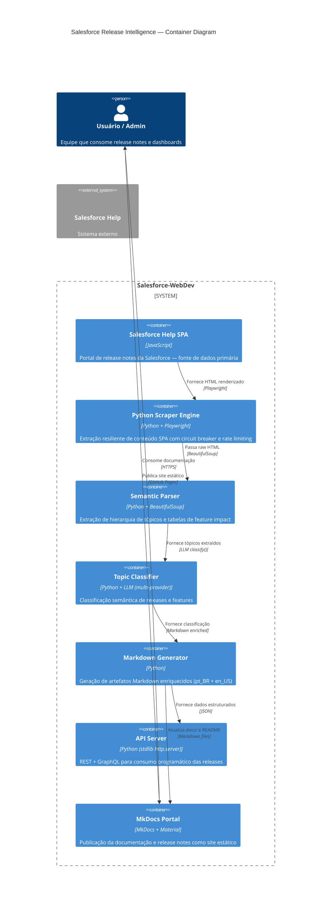
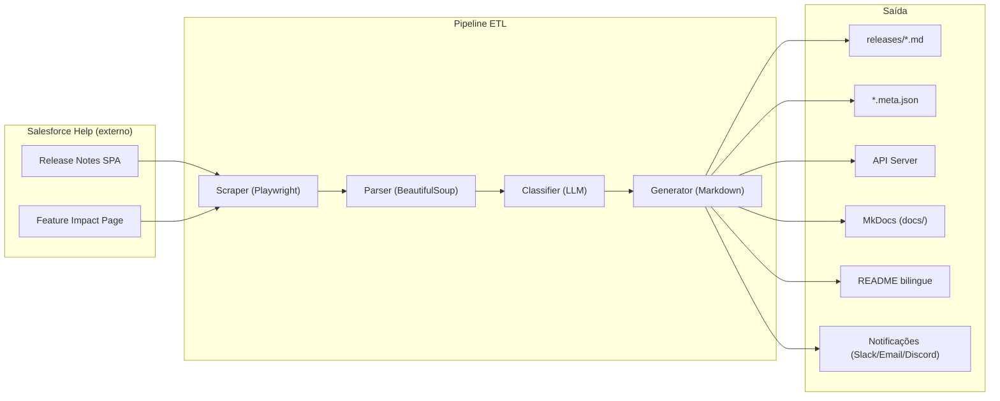

# C4 Container Diagram

Diagrama de containers do Salesforce Release Intelligence, seguindo a notação C4 Level 2.

## Diagrama

## Containers

| Container | Linguagem / Tech | Responsabilidade | Observabilidade |
|-----------|-----------------|------------------|-----------------|
| **GitHub Actions** | YAML | Orquestração do pipeline: extração, reconciliação documental, deploy | Logs do Actions, Step Summary |
| **Python Scraper Engine** | Python + Playwright | Extração de conteúdo da Salesforce Help SPA com circuit breaker e rate limiting | Logs com correlation_id, métricas de retry |
| **Semantic Parser** | Python + BeautifulSoup | Extração de árvore de tópicos e tabelas de feature impact | Snapshot tests, parser validation |
| **Topic Classifier** | Python + LLM (Gemini → OpenCode → OpenRouter) | Classificação semântica de releases e features por impacto | Logs de chamada LLM, fallback tracking |
| **Markdown Generator** | Python | Geração de Markdown enriquecido (pt_BR + en_US) com resumos AI | Geração de .meta.json, badges |
| **API Server** | Python (stdlib http.server) | REST + GraphQL para consumo das releases processadas | Health endpoints, Prometheus metrics |
| **MkDocs Portal** | MkDocs + Material | Publicação do site de documentação e release notes | Build status, link checker |

## Data Flow

## Padrões de Resiliência por Container

| Container | Pattern | Implementação |
|-----------|---------|---------------|
| Scraper | Circuit Breaker + Rate Limiter | `src/circuit_breaker.py`, `src/limiters/rate_limiter.py` |
| Classifier | Fallback por provider | `src/llm_service.py` — Gemini → OpenCode → OpenRouter |
| Parser | Multi-selector fallback | `src/parser.py` — tries `.toc-container`, `ul.tree`, `[role="tree"]` |
| Generator | Cache de resumos | `src/cache_manager.py` — TTL + content-hash |
| API Server | Health checks | `src/health.py` — `/health`, `/ready`, `/metrics` |
| MkDocs | Build validation | `mkdocs build --strict` + link checker no CI |
