# ADR-004 — Auto-Healing CI/CD Agent

## Status

**Accepted** — Agosto 2026

## Context

O pipeline de documentação e releases opera em um ambiente dinâmico onde múltiplas fontes de drift podem ocorrer:

- Código-fonte alterado sem atualização da documentação correspondente
- Salesforce alterando sua estrutura de DOM, invalidando selectors
- Workflows de GitHub Actions falhando por dependências desatualizadas
- Link quebrado ou snippet Markdown inválido introduzido acidentalmente

Antes deste ADR, não existia um mecanismo sistemático para detectar e, quando possível, corrigir esses drifts automaticamente — a responsabilidade recaía inteiramente em revisores humanos.

## Decision

Implementar um **Auto-Healing CI/CD Agent** que:

1. **Detecta** drift deterministicamente (diff de blobs, validação de links, sintaxe Markdown)
2. **Interpreta** findings semanticamente via LLM (usando a cadeia de providers já existente no `LLMService`)
3. **Recomenda** ou **executa** correções dentro de uma allowlistrestrita de arquivos (`docs/**`, `README.md`, `README.en.md`, `mkdocs.yml`)
4. **Registra** todas as ações para revisão humana via GitHub Step Summary e, quando relevante, via comentário de PR

### Princípios

1. **Código > Documentação.** Nunca modificar `src/**` para adequá-lo à documentação. A correção flui no sentido: código → documento.
2. **Deterministic first, LLM second.** O agente só consulta o LLM para interpretação semântica de findings já identificados deterministicamente.
3. **Allowlist explícita.** O agente só pode escrever em arquivos documentais. Qualquer tentativa de escrever em `src/`, `tests/`, `.github/workflows/` (exceto o workflow de sync em si) ou secrets é bloqueada.
4. **Safe failure.** Se nenhum provider LLM estiver disponível, o agente registra os findings para revisão manual e não faz commits.
5. **Anti-loop.** Commits gerados pelo agente usam prefixo `docs(sync):` e o workflow de sync tem guard que encerra execução ao detectar commit do próprio bot.

### Arquitetura

```mermaid
flowchart LR
    REPO["Estado do Repositório"] --> INVENTORY["Inventário de Blobs"]
    PREV["Manifesto Anterior"] --> DIFF["Diff Determinístico"]
    INVENTORY --> DIFF
    DIFF --> FINDINGS["Findings: added/changed/removed/orphan/broken-link"]
    FINDINGS --> LLM["LLM Reconciliation\n(Gemini → OpenCode → OpenRouter)"]
    LLM --> RECOMMENDATIONS["Recommendations"]
    RECOMMENDATIONS --> ALLOWLIST_CHECK["Allowlist Check\n(docs/, README, mkdocs.yml)"]
    ALLOWLIST_CHECK -->|dentro da allowlist| APPLY["Aplicar mudanças"]
    ALLOWLIST_CHECK -->|fora da allowlist| LOG_ONLY["Log only — revisão humana"]
    APPLY --> COMMIT["Commit docs(sync): ..."]
    LOG_ONLY --> SUMMARY["GitHub Step Summary"]
    COMMIT --> SUMMARY
```

### Fluxo de Execução

1. **Inventory** — Snapshot do estado atual do repositório (`path → blob_sha`)
2. **Diff** — Compara com manifesto anterior; detecta created/modified/deleted/orphaned
3. **Validation** — Link checker + markdown lint + mkdocs build --strict
4. **LLM Reconciliation** — Para cada finding acionável, o LLM sugere conteúdo de atualização
5. **Apply** — Escreve apenas dentro da allowlist
6. **Commit** — `docs(sync): reconcile documentation — <timestamp>`
7. **Summary** — Grava no GitHub Step Summary: qué foi mudado, qué foi bloqueado, recomendações para revisão humana

## Consequences

### Positive

- Drift documental detectado e corrigido automaticamente a cada push e a cada 6 horas
- Revisores humanos focam em decisões semânticas, não em atualização manual de metadata
- Redução de documentação órfã e links quebrados no site publicado

### Negative / Risks

- O LLM pode gerar recommendations incorrectas; o allowlist limita o dano, mas revision humana ainda é recomendada para mudanças significativas
- Navigação para novos documentos criados pelo agente pode exigir ajuste manual do nav do MkDocs (limitação registrada no Step Summary)
- Custo de LLM: controlado por `DOC_SYNC_MAX_FINDINGS` e execução apenas sobre findings acionáveis

## Related

- ADR-002 — GitHub Actions (padrões de workflow e pinning de actions)
- ADR-005 — Continuous Documentation Reconciliation Pipeline (este workflow é o mecanismo de execução do ADR-005)
