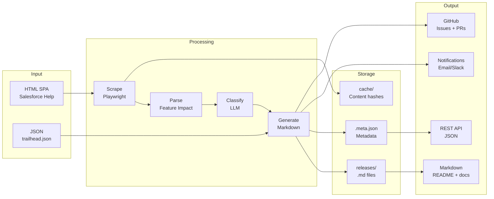
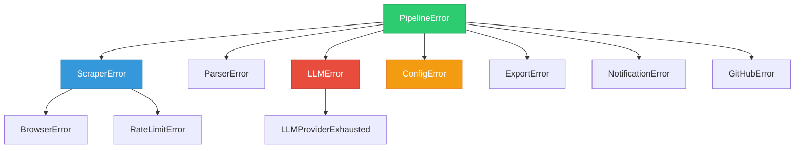
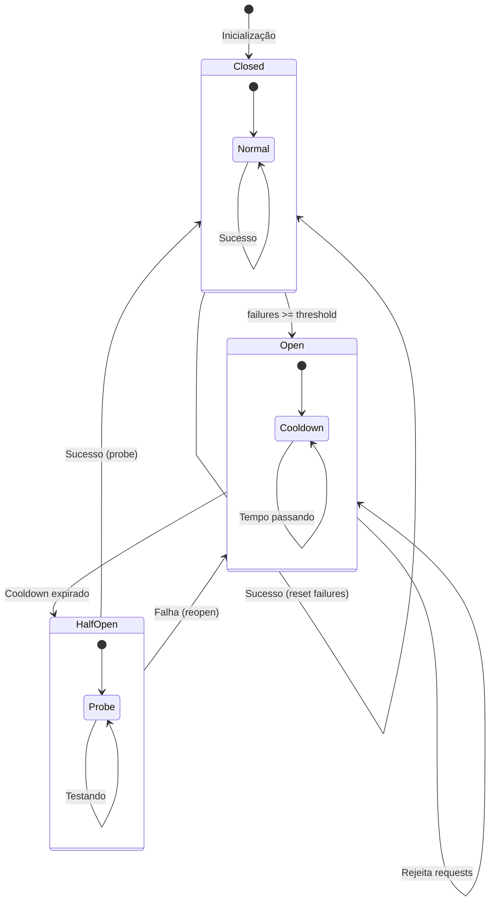
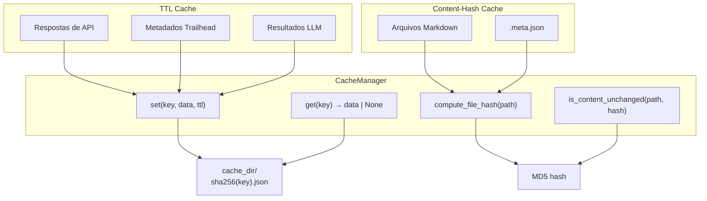

# Architecture Overview

Visão arquitetural completa do Salesforce Release Intelligence.

## Princípios de Design

1. **Resiliência** — Circuit breaker, retry com backoff, timeouts definidos
2. **Separação de Responsabilidades** — Camadas claras: scraping → parsing → lógica → saída
3. **Dependency Injection** — `PipelineConfig` para testabilidade
4. **Exceções Específicas** — Hierarquia `PipelineError` para rastreabilidade
5. **Cache Inteligente** — TTL para dados temporários, content-hash para arquivos

## Diagrama de Componentes

```mermaid
graph TB
    subgraph "Entry Points"
        CLI["CLI<br/>python src/main.py"]
        API_EP["API Server<br/>start_api_server()"]
        HEALTH_EP["Health Server<br/>start_health_server()"]
    end

    subgraph "Orchestration"
        MAIN["main.py<br/>run_pipeline(PipelineConfig)"]
        CONFIG["PipelineConfig<br/>DI Container"]
    end

    subgraph "Scraping Layer"
        SCRAPER["scraper.py<br/>SalesforceReleaseScraper"]
        CB1["CircuitBreaker"]
        RL["RateLimiter"]
        PW["Playwright<br/>Chromium headless"]
    end

    subgraph "Parsing Layer"
        NAV_PARSER["ReleaseNotesParser<br/>Árvore de navegação"]
        IMPACT_PARSER["FeatureImpactParser<br/>Tabelas de impacto"]
    end

    subgraph "LLM Layer"
        LLM["llm_service.py<br/>LLMService"]
        CB2["CircuitBreaker<br/>(por provider)"]
        OPENAI["OpenAI API"]
        GEMINI["Google Gemini"]
    end

    subgraph "Automation Layer"
        AI_SVC["AIAutomationService"]
        REPORTING["reporting.py<br/>Changelog, Diff, Quality"]
        IMPACT["impact.py<br/>Impact scores, Prediction"]
        CONTENT["content.py<br/>Deduplicação"]
        TRIAGE["issue_triage.py<br/>Triage automático"]
        CLASSIFIER["feature_classifier.py<br/>Classificação"]
    end

    subgraph "Integration Layer"
        SF["salesforce.py<br/>Trailhead mapping"]
        WF["workflow.py<br/>Git + GitHub CLI"]
        GH_OPS["github_ops.py<br/>Issues"]
    end

    subgraph "Output Layer"
        GEN["generator.py<br/>Markdown"]
        NOTIF["notifications.py<br/>Email/Slack/Discord"]
        DASH["dashboard.py<br/>HTML interativo"]
        ANALYTICS["analytics.py<br/>Estatísticas"]
    end

    subgraph "Infrastructure"
        CACHE["CacheManager<br/>TTL + content-hash"]
        HEALTH["HealthState<br/>Métricas + status"]
        LOGGER["logger.py<br/>JSON estruturado"]
        EXCEP["exceptions.py<br/>Hierarquia"]
    end

    CLI --> MAIN
    MAIN --> CONFIG
    MAIN --> SCRAPER
    MAIN --> GEN
    MAIN --> AI_SVC
    MAIN --> HEALTH

    SCRAPER --> CB1
    SCRAPER --> RL
    SCRAPER --> PW
    SCRAPER --> CACHE

    NAV_PARSER --> CONFIG
    IMPACT_PARSER --> CONFIG

    LLM --> CB2
    LLM --> OPENAI
    LLM --> GEMINI

    AI_SVC --> LLM
    AI_SVC --> REPORTING
    AI_SVC --> IMPACT
    AI_SVC --> CONTENT
    AI_SVC --> TRIAGE
    AI_SVC --> CLASSIFIER

    GEN --> CONFIG
    GEN --> SF
    NOTIF --> CONFIG
    WF --> GH_OPS

    SCRAPER --> EXCEP
    LLM --> EXCEP
    NOTIF --> EXCEP
    GH_OPS --> EXCEP

    style CB1 fill:#f39c12,stroke:#e67e22
    style CB2 fill:#f39c12,stroke:#e67e22
    style CACHE fill:#3498db,stroke:#2980b9,color:#fff
    style EXCEP fill:#e74c3c,stroke:#c0392b,color:#fff
    style HEALTH fill:#2ecc71,stroke:#27ae60,color:#fff
```

## Fluxo de Dados

## Hierarquia de Exceções

## Circuit Breaker State Machine

## Cache Strategy

## Decisões Arquiteturais

| Decisão | Alternativa | Escolhido | Motivo |
|---------|------------|-----------|--------|
| Scraping | requests + BeautifulSoup | **Playwright** | SPA requer JS rendering |
| LLM | OpenAI apenas | **Multi-provider** | Fallback automático |
| Cache | Redis | **File-based** | Zero dependências externas |
| Circuit Breaker | Biblioteca externa | **Implementação própria** | Controle total, sem dependência |
| Exceções | Exception genérico | **Hierarquia customizada** | Rastreabilidade |
| DI | Framework (dependency-injector) | **Dataclass simples** | Sem dependência extra |
| API | FastAPI/Flask | **stdlib http.server** | Zero dependências |
| Logging | print/logging básico | **JSON estruturado** | Machine-readable |
