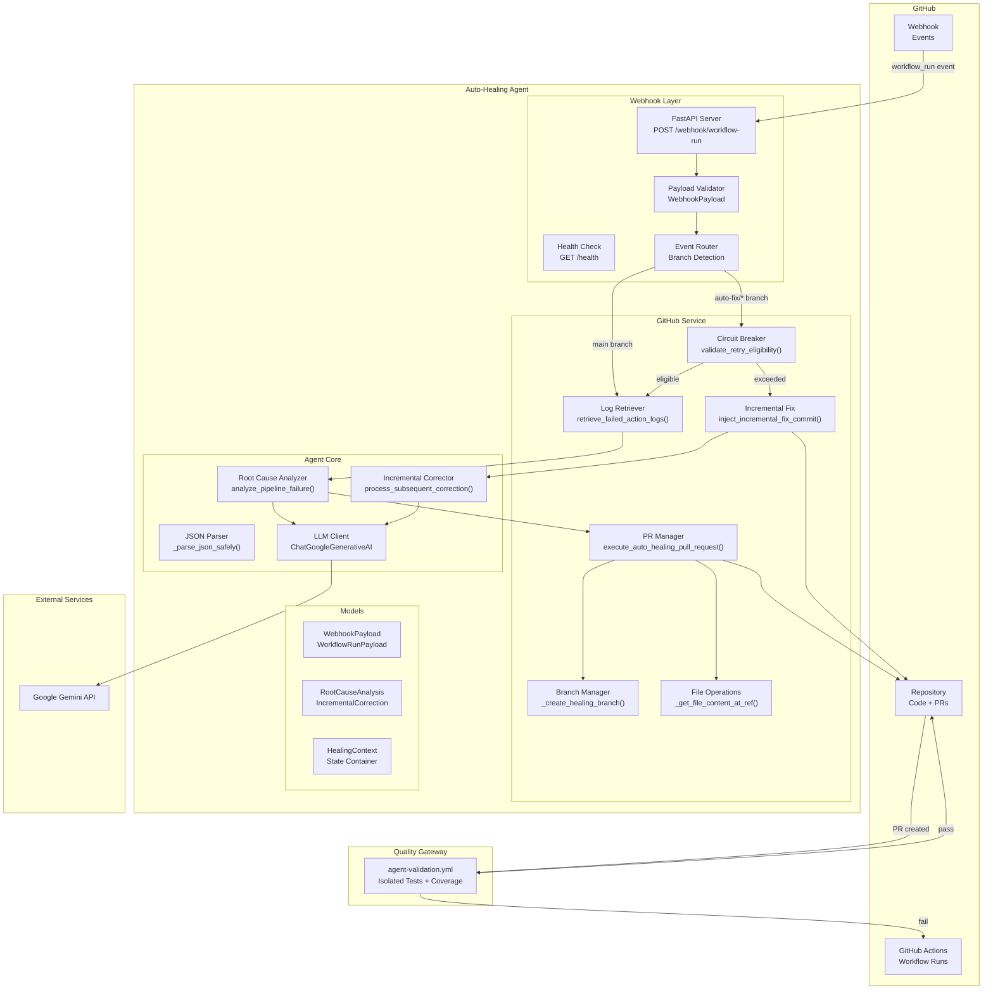
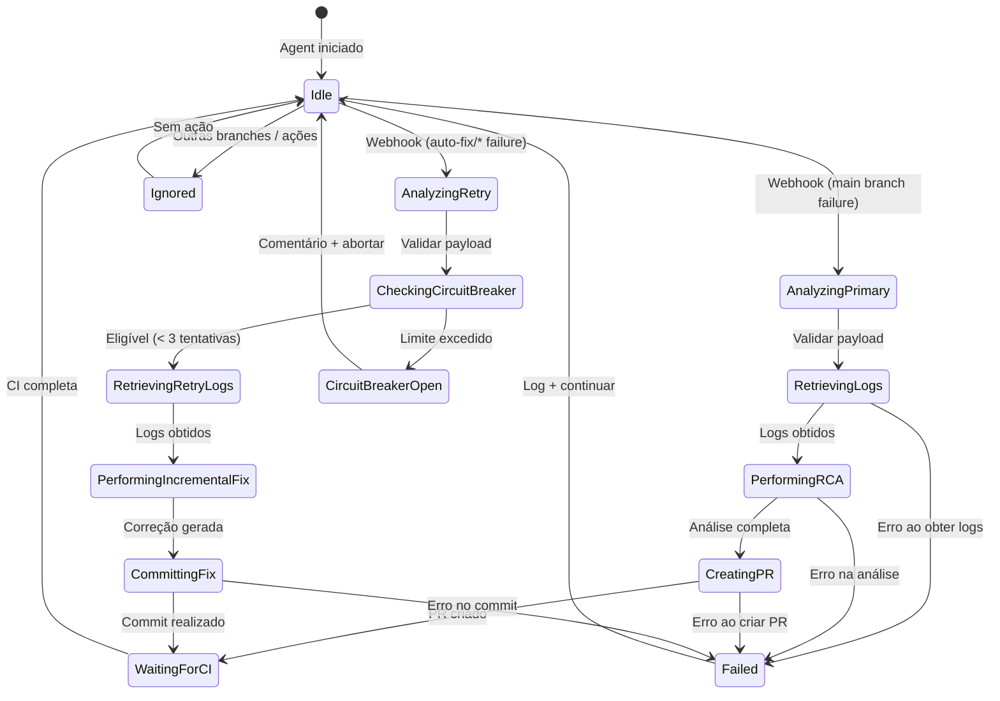
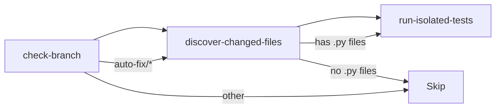

# Arquitetura do Auto-Healing Agent

## Visão Detalhada

O Auto-Healing Agent segue uma arquitetura orientada a eventos (Event-Driven) com uma máquina de estados para controlar o fluxo de correção.

## Diagrama de Componentes (C4 Level 2)



## Máquina de Estados

O fluxo de auto-healing segue uma máquina de estados bem definida:



## Camada de Webhook (`webhook.py`)

### Endpoints

| Método | Rota | Descrição |
|--------|------|-----------|
| `GET` | `/health` | Health check com status dos serviços |
| `POST` | `/webhook/workflow-run` | Recebe eventos do GitHub |

### Validação de Payload

```python
class WebhookPayload(BaseModel):
    action: str                    # Deve ser "completed"
    workflow_run: WorkflowRunPayload | None

class WorkflowRunPayload(BaseModel):
    id: int                        # ID único do workflow run
    name: str                      # Nome do workflow
    head_branch: str               # Branch que falhou
    head_sha: str                  # Commit SHA
    conclusion: str | None         # Deve ser "failure"
    html_url: str                  # URL no GitHub
    repository: dict[str, Any]     # Metadados do repositório
```

### Roteamento

```python
if head_branch.startswith("auto-fix/"):
    # Fluxo de retentativa (Circuit Breaker)
    return await _handle_auto_fix_branch_failure(workflow_run)

if head_branch == PRIMARY_BRANCH:
    # Fluxo primário (nova correção)
    return await _handle_primary_branch_failure(workflow_run)

# Ignorar outras branches
return JSONResponse({"outcome": "skipped"})
```

## Camada GitHub (`github_service.py`)

### Métodos Principais

#### `retrieve_failed_action_logs()`

Baixa e descompacta os logs de uma execução falha:

```python
def retrieve_failed_action_logs(
    self,
    repository_full_name: str,    # "owner/repo"
    workflow_run_id: int,         # ID do workflow run
) -> str | None:
    # 1. Acessar repositório
    # 2. Obter workflow run
    # 3. Baixar logs (ZIP)
    # 4. Extrair e concatenar arquivos de log
    # 5. Retornar texto para análise
```

#### `execute_auto_healing_pull_request()`

Cria um PR com a correção:

```python
def execute_auto_healing_pull_request(
    self,
    context: HealingContext,       # Estado da sessão
    file_path: str,                # Arquivo a corrigir
    corrected_code: str,           # Código corrigido
    commit_message: str,           # Mensagem do commit
    pull_request_title: str,       # Título do PR
    pull_request_body: str,        # Corpo do PR
) -> PullRequest | None:
    # 1. Criar branch "auto-fix/<run_id>"
    # 2. Obter SHA do arquivo no commit falho
    # 3. Atualizar arquivo com código corrigido
    # 4. Abrir Pull Request
```

#### `validate_retry_eligibility()`

Implementa o Circuit Breaker:

```python
def validate_retry_eligibility(
    self,
    repository_full_name: str,
    pull_request_number: int,
) -> bool:
    # 1. Contar commits do agente no PR
    # 2. Se >= 3: adicionar comentário + retornar False
    # 3. Se < 3: retornar True
```

#### `inject_incremental_fix_commit()`

Commita uma correção incremental:

```python
def inject_incremental_fix_commit(
    self,
    repository_full_name: str,
    pull_request_number: int,
    file_path: str,
    corrected_code: str,
    analysis_of_previous_failure: str,
    changes_description: str,
    attempt_number: int,
) -> bool:
    # 1. Obter arquivo atual no PR
    # 2. Atualizar com novo código
    # 3. Adicionar comentário documentando a correção
```

### Tratamento de Erros

Todas as chamadas à API do GitHub são envolvidas em `try/except`:

```python
try:
    repository = self._github_client.get_repo(repository_full_name)
    return repository
except GithubException as error:
    logger.error("Failed to access repository '%s': %s", repository_full_name, error)
    return None
```

## Camada Cognitiva (`agent_core.py`)

### System Prompts

#### Root Cause Analysis

O prompt força saída JSON estrita:

```
You MUST respond with a valid JSON object in exactly this structure:
{
    "root_cause_summary": "One paragraph summarizing the root cause",
    "affected_file_path": "relative/path/to/file.py",
    "corrected_code": "full corrected file content here",
    "explanation": "Technical explanation of what was changed and why"
}

CRITICAL RULES:
- Respond ONLY with the JSON object. No markdown fences, no preamble.
- The corrected_code must be the COMPLETE file, not a diff or snippet.
```

#### Incremental Fix

```
You MUST respond with a valid JSON object in exactly this structure:
{
    "corrected_code": "full corrected file content here",
    "analysis_of_previous_failure": "Why the previous correction failed the tests",
    "changes_description": "What was changed in this iteration"
}
```

### Parser JSON Seguro

O parser implementa múltiplas estratégias de fallback:

```python
def _parse_json_safely(raw_output: str) -> dict[str, Any] | None:
    # Estratégia 1: Parse direto
    # Estratégia 2: Encontrar bloco { ... } com regex
    # Estratégia 3: Limpar fences markdown (```json ... ```)
```

### Sanitização de Markdown

```python
def _sanitize_llm_json_output(raw_output: str) -> str:
    # Remove ```json ... ```
    # Remove ``` ... ```
    # Strip whitespace
```

## Camada de Modelos (`models.py`)

### Enums

```python
class WorkflowConclusion(str, Enum):
    SUCCESS = "success"
    FAILURE = "failure"
    CANCELLED = "cancelled"
    # ...

class HealingOutcome(str, Enum):
    PULL_REQUEST_CREATED = "pull_request_created"
    INCREMENTAL_FIX_COMMITTED = "incremental_fix_committed"
    CIRCUIT_BREAKER_OPEN = "circuit_breaker_open"
    ANALYSIS_FAILED = "analysis_failed"
    SKIPPED = "skipped"
```

### Schemas Pydantic

```python
class RootCauseAnalysis(BaseModel):
    root_cause_summary: str
    affected_file_path: str
    corrected_code: str
    explanation: str

class IncrementalCorrection(BaseModel):
    corrected_code: str
    analysis_of_previous_failure: str
    changes_description: str
```

### Estado Interno

```python
@dataclass
class HealingContext:
    repository_full_name: str = ""
    base_branch: str = "main"
    failed_commit_sha: str = ""
    failed_workflow_run_id: int = 0
    healing_branch_name: str = ""
    pull_request_number: int = 0
    attempt_count: int = 0
    max_attempts: int = 3
```

## Pipeline de Validação (`agent-validation.yml`)

### Gatilho

```yaml
on:
  pull_request:
    branches: [main]
    types: [opened, synchronize, reopened]
```

### Concorrência

```yaml
concurrency:
  group: agent-validation-${{ github.event.pull_request.number }}
  cancel-in-progress: true
```

### Jobs



#### 1. check-branch

Verifica se a branch tem prefixo `auto-fix/`:

```bash
if [[ "${BRANCH}" == auto-fix/* ]]; then
    echo "is_auto_fix=true" >> "$GITHUB_OUTPUT"
fi
```

#### 2. discover-changed-files

Usa `tj-actions/changed-files` para encontrar `.py` alterados:

```yaml
- uses: tj-actions/changed-files@v46
  with:
    files: "**/*.py"
    files_ignore: |
      tests/**
      .github/**
```

#### 3. run-isolated-tests

Mapeia fonte → teste e executa pytest:

```bash
# Mapeamento
src/service.py → tests/test_service.py
src/auto_healing/webhook.py → tests/test_auto_healing_webhook.py

# Execução
uv run pytest ${TEST_FILES} \
    --cov=src \
    --cov-fail-under=95 \
    --tb=short
```

## Decisões de Projeto

### 1. Subpacote `src/auto_healing/`

**Decisão:** Criar o agent como subpacote em `src/auto_healing/` em vez de repositório separado.

**Rationale:**
- Reutiliza infraestrutura existente (CI, linting, formatação)
- Facilita descoberta e manutenção
- Evita duplicação de dependências

### 2. Dependência Opcional

**Decisão:** As dependências do agent são um grupo opcional `healing` em pyproject.toml.

**Rationale:**
- Não quebra instalações existentes
- Permite deploy seletivo
- Reduz footprint em ambientes que não precisam do agent

### 3. Exclusão do Coverage

**Decisão:** O módulo `auto_healing` está excluído da cobertura de testes.

**Rationale:**
- Requer serviços externos (GitHub API, Google AI) para testar
- Testes de integração seriam flaky
- Cobertura do módulo principal permanece em 95%

### 4. LLM com Temperatura Baixa

**Decisão:** Usar `temperature=0.1` no LLM.

**Rationale:**
- Saída mais determinística
- Menor chance de variações no JSON
- Reprodutibilidade das correções
