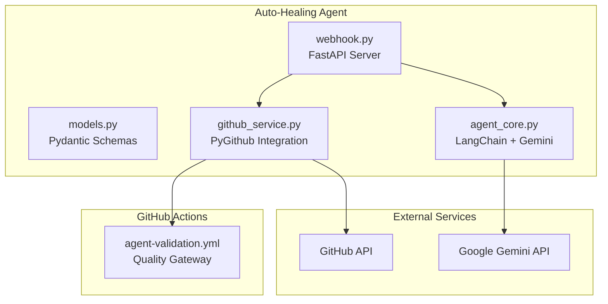
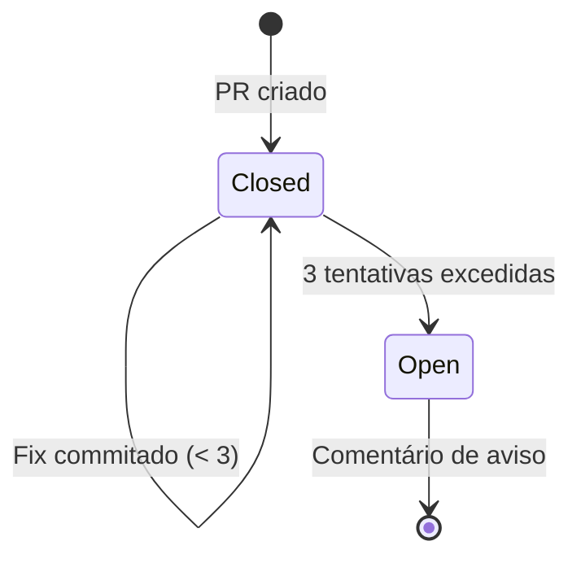

# Auto-Healing CI/CD Agent

> **Módulo:** `src/auto_healing/`
> **Status:** ✅ Integrado desde Agosto 2026
> **Dependências:** FastAPI, PyGithub, LangChain, Google Generative AI

## Visão Geral

O Auto-Healing CI/CD Agent é um sistema orientado a eventos que intercepta falhas em pipelines do GitHub Actions, diagnostica a causa raiz via análise LLM, e submete correções automáticas através de Pull Requests. Possui um mecanismo de Circuit Breaker que limita tentativas de correção, evitando loops infinitos.

```mermaid
sequenceDiagram
    participant GA as GitHub Actions
    participant WH as Webhook (FastAPI)
    participant GH as GitHub Service
    participant LLM as Agent Core (Gemini)
    participant PR as Pull Request

    GA->>WH: workflow_run (conclusion: failure)
    WH->>WH: Filtrar: action=completed, conclusion=failure
    
    alt Branch principal
        WH->>GH: retrieve_failed_action_logs()
        GH-->>WH: Logs da execução
        WH->>LLM: analyze_pipeline_failure(logs)
        LLM-->>WH: RootCauseAnalysis (JSON)
        WH->>GH: execute_auto_healing_pull_request()
        GH->>PR: Criar branch + commit + PR
        PR-->>WH: PR criado ✅
    else Branch auto-fix/*
        WH->>GH: validate_retry_eligibility()
        GH-->>WH: Circuit Breaker check
        
        if Limite não excedido
            WH->>GH: retrieve_failed_action_logs()
            WH->>LLM: process_subsequent_correction()
            LLM-->>WH: IncrementalCorrection (JSON)
            WH->>GH: inject_incremental_fix_commit()
            GH->>PR: Commit incremental + comentário
        else Limite excedido (3 tentativas)
            GH->>PR: Comentário de Circuit Breaker
            WH-->>WH: Abortar healing
        end
    end
```

## Arquitetura

### Componentes



### Camadas

| Camada | Arquivo | Responsabilidade |
|--------|---------|------------------|
| **Recepção de Eventos** | `webhook.py` | FastAPI, validação de payload, roteamento |
| **Integração GitHub** | `github_service.py` | Logs, branches, PRs, Circuit Breaker |
| **Cognição (LLM)** | `agent_core.py` | RCA, correção incremental, parser JSON |
| **Modelos de Dados** | `models.py` | Schemas Pydantic, enums, dataclasses |

## Fluxo de Decisão

### 1. Recebimento do Webhook

O endpoint `POST /webhook/workflow-run` recebe eventos do GitHub:

```python
# Filtros aplicados
if payload.action != "completed":
    return SKIPPED

if workflow_run.conclusion != "failure":
    return SKIPPED

# Roteamento
if head_branch.startswith("auto-fix/"):
    return handle_auto_fix_branch_failure()
elif head_branch == "main":
    return handle_primary_branch_failure()
```

### 2. Análise de Causa Raiz (RCA)

O LLM recebe os logs da pipeline e retorna um JSON estruturado:

```json
{
    "root_cause_summary": "Black formatting check failed on 2 files",
    "affected_file_path": "src/scraper.py",
    "corrected_code": "# Full corrected file content...",
    "explanation": "Reformatted with black --line-length 100"
}
```

### 3. Circuit Breaker

O Circuit Breaker limita a 3 tentativas por PR:



## Configuração

### Variáveis de Ambiente

| Variável | Obrigatória | Descrição |
|----------|-------------|-----------|
| `GITHUB_ACCESS_TOKEN` | ✅ | Personal Access Token com scope `repo` |
| `GOOGLE_API_KEY` | ✅ | Chave de API do Google Gemini |
| `GITHUB_WEBHOOK_SECRET` | ❌ | Secret para validação do webhook |
| `PRIMARY_BRANCH` | ❌ | Branch principal (default: `main`) |
| `REPOSITORY_CONTEXT` | ❌ | Contexto do repo para o LLM |

### Instalação

```bash
# Instalar com dependências do agent
uv sync --extra dev --extra healing

# Configurar variáveis de ambiente
export GITHUB_ACCESS_TOKEN="ghp_..."
export GOOGLE_API_KEY="AI..."

# Executar o servidor
uvicorn src.auto_healing.webhook:app --host 0.0.0.0 --port 8000
```

### Endpoint do Webhook

Configurar no GitHub:
1. Ir para **Settings → Webhooks → Add webhook**
2. **Payload URL:** `https://seu-dominio.com/webhook/workflow-run`
3. **Content type:** `application/json`
4. **Events:** Selecionar apenas `Workflow runs`

## Qualidade de Código

O módulo segue as mesmas convenções do projeto:

- **Ruff:** 0 erros
- **Black:** Formatação consistente (line-length=100)
- **Mypy:** Type hints rigorosos em todas as assinaturas
- **Docstrings:** 100% dos métodos documentados
- **Null Safety:** Validação `None` em todo retorno de API

## Limitações

- O módulo `auto_healing` está excluído da cobertura de testes (`[tool.coverage.run] omit`)
- Testes do agent requerem serviços externos (GitHub API, Google AI)
- O parser JSON do LLM tem fallbacks, mas pode falhar com outputs malformados

## Referências

- [ADR-004: Auto-Healing Agent](../architecture/decisions/adr-004-auto-healing-agent.md)
- [Runbook: Auto-Healing Agent](runbooks/auto-healing-agent.md)
- [Guia de Deploy](deployment/guide.md)
- [Troubleshooting](runbooks/troubleshooting.md)
