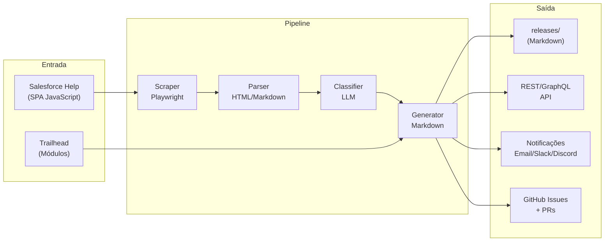
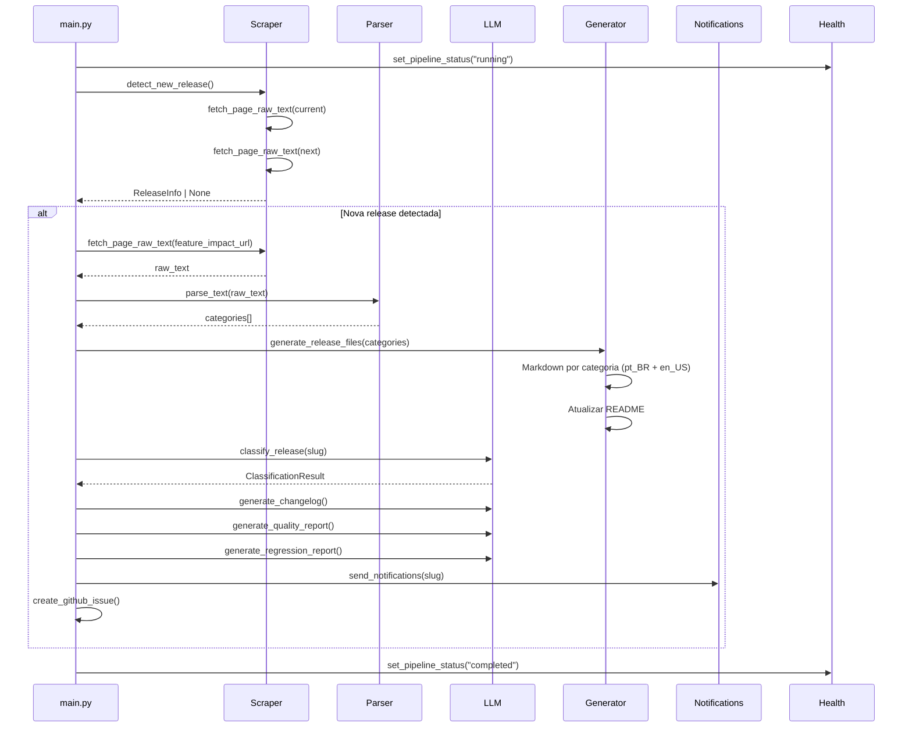
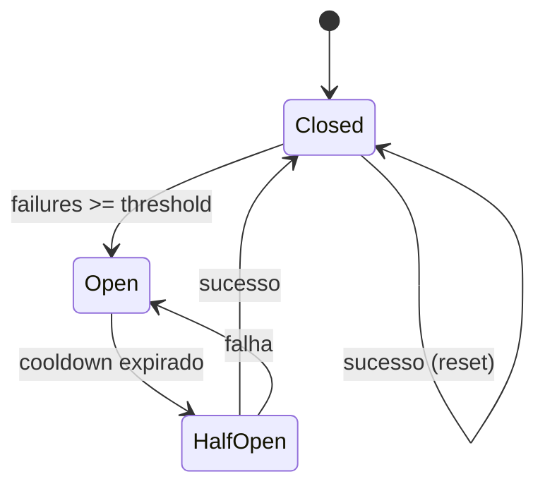
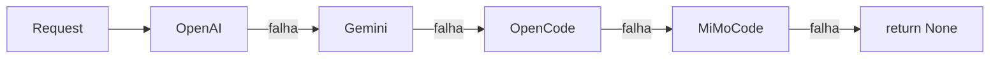

# Salesforce Release Intelligence

Pipeline automatizado para extração, classificação, análise e versionamento das Release Notes da Salesforce como artefatos Markdown estruturados.

## O Que Este Repositório Faz



## Arquitetura em Camadas

| Camada | Módulos | Responsabilidade |
|--------|---------|------------------|
| **Orquestração** | `main.py`, `orchestrator.py` | Pipeline principal, DI, detecção de novas releases |
| **Scraping** | `scraper.py` | Playwright headless, circuit breaker, rate limiter |
| **Parsing** | `parser.py` | Árvore de navegação, tabelas de feature impact |
| **LLM** | `llm_service.py` | Multi-provider (OpenAI/Gemini/OpenCode/MiMoCode), retry, fallback, rate limiting |
| **Enriquecimento AI** | `feature_enricher.py`, `release_summarizer.py` | Descrições por feature, resumos executivos, impacto por categoria |
| **Automação** | `automation/` | Relatórios AI, triage, impacto, deduplicação, exportação |
| **Integração** | `salesforce.py`, `workflow.py` | Trailhead, GitHub CLI, PRs |
| **Saída** | `generator.py`, `release_docs.py`, `notifications.py` | Markdown enriquecido, Email, Slack, Discord |
| **API** | `api.py` | REST + GraphQL + Autenticação + OpenAPI |
| **Infra** | `cache_manager.py`, `circuit_breaker.py`, `events.py`, `health.py` | Cache, resiliência, event bus, Prometheus metrics |

## Quick Start

```bash
# 1. Instalar dependências
uv sync --extra dev

# 2. Instalar navegador Playwright
uv run playwright install chromium

# 3. Executar pipeline
uv run python src/main.py

# 4. Executar testes
uv run pytest

# 5. Verificar cobertura
uv run pytest --cov=src --cov-fail-under=95
```

## Variáveis de Ambiente

| Variável | Obrigatória | Descrição |
|----------|-------------|-----------|
| `OPENAI_API_KEY` | Não* | Chave da API OpenAI para relatórios AI |
| `GOOGLE_API_KEY` | Não* | Chave do Google Gemini (fallback) |
| `OPENCODE_API_KEY` | Não* | Chave OpenCode (compatível OpenAI) |
| `MIMOCODE_API_KEY` | Não* | Chave MiMoCode (compatível OpenAI) |

*Pelo menos uma chave LLM é necessária para funcionalidades de IA (classificação, resumos, triage).

## Fluxo de Execução do Pipeline



## Módulos Principais

### Pipeline (`main.py`)

Orquestrador central. Responsável por:

- **`detect_new_release()`** — Compara conteúdo da release atual vs próxima para detectar novidades
- **`_process_single_release()`** — Fetch, parse, geração de arquivos Markdown
- **`_generate_ai_reports_async()`** — Gera relatórios AI concorrentemente (changelog, quality, regression, diff)
- **`_enrich_meta_with_classification()`** — Adiciona classificação de features ao `.meta.json`
- **`run_pipeline(config: PipelineConfig)`** — Orquestrador principal com DI

```python
# Uso com injeção de dependências
config = PipelineConfig(dry_run=True, release_filter="summer_26")
await run_pipeline(config)
```

### Scraper (`scraper.py`)

Scraping resiliente do Salesforce Help (SPA JavaScript):

- **Playwright headless** — Renderiza JavaScript completo
- **Circuit Breaker** — Para após N falhas consecutivas, retoma após cooldown
- **Rate Limiter** — Token-bucket para respeitar limites de requisição
- **Retry com backoff** — Até 5 tentativas com delay exponencial + jitter
- **Cache** — Evita re-fetch de conteúdo inalterado



### LLM Service (`llm_service.py`)

Serviço LLM multi-provider com fallback automático:

- **Providers**: OpenAI → Google Gemini → OpenCode → MiMoCode
- **Circuit Breaker** por provider (independente)
- **Retry com tenacity** — 3 tentativas, backoff exponencial
- **Timeout** — 30s (cliente) / 60s (operação)



### Parser (`parser.py`)

Parsing de duas fontes:

1. **Árvore de navegação** — Extrai hierarquia de tópicos do portal Salesforce Help
2. **Feature Impact** — Parseia tabelas de impacto de features por categoria

### Automação (`automation/`)

Pacote de automação AI com 11 módulos:

| Módulo | Função |
|--------|--------|
| `service.py` | `AIAutomationService` — Facade para todas as operações AI |
| `reporting.py` | Changelog, regression, diff, quality reports |
| `comparison.py` | Comparação entre releases, detecção de regressões |
| `impact.py` | Análise de impacto por categoria, predição |
| `content.py` | Deduplicação por content-hash |
| `export.py` | Exportação JSON/CSV |
| `github_ops.py` | Criação de GitHub Issues |
| `notifications.py` | Notificações filtradas por perfil |
| `models.py` | Dataclasses (11 modelos) |
| `badge.py` | Badges dinâmicos |

### API REST/GraphQL (`api.py`)

Servidor HTTP standalone (stdlib):

| Endpoint | Método | Descrição |
|----------|--------|-----------|
| `/releases` | GET | Lista todas as releases |
| `/releases/{slug}` | GET | Detalhes de uma release |
| `/releases/{slug}/categories/{name}` | GET | Features de uma categoria |
| `/diff/{current}/{previous}` | GET | Comparação entre releases |
| `/graphql` | POST | Query GraphQL flexível |
| `/openapi.json` | GET | Especificação OpenAPI 3.0 |

### Notificações (`notifications.py`)

Dispara notificações para múltiplos canais:

- **Email** — SMTP com TLS (timeout 30s)
- **Slack** — Webhook com blocos formatados
- **Discord** — Webhook com embeds

### Health (`health.py`)

Monitoramento via HTTP:

| Endpoint | Descrição |
|----------|-----------|
| `/health` | Status geral + uptime + métricas |
| `/ready` | Readiness probe |
| `/metrics` | Métricas Prometheus (texto plano) |

### Cache Manager (`cache_manager.py`)

Cache unificado com duas estratégias:

- **TTL** — Expiração por tempo (respostas de API, metadados)
- **Content-hash** — Invalidação por mudança de conteúdo (arquivos Markdown)

### Circuit Breaker (`circuit_breaker.py`)

Pattern reutilizável para chamadas externas:

- Estados: CLOSED → OPEN → HALF-OPEN
- Configurável: threshold (falhas) + cooldown (segundos)
- Usado por: Scraper, LLM Service

## Estrutura de Diretórios

```
Salesforce-WebDev/
├── src/
│   ├── main.py              # Orquestrador principal
│   ├── scraper.py           # Playwright + Circuit Breaker
│   ├── parser.py            # Parser HTML/Markdown
│   ├── llm_service.py       # Multi-provider LLM
│   ├── generator.py         # Geração Markdown
│   ├── translator.py        # Tradução via LLM
│   ├── salesforce.py        # Integração Trailhead
│   ├── notifications.py     # Email/Slack/Discord
│   ├── api.py               # REST + GraphQL
│   ├── dashboard.py         # Dashboard HTML interativo
│   ├── analytics.py         # Análise estatística
│   ├── health.py            # Health checks
│   ├── config.py            # Configuração central
│   ├── exceptions.py        # Hierarquia de exceções
│   ├── circuit_breaker.py   # Circuit Breaker unificado
│   ├── cache_manager.py     # Cache TTL + content-hash
│   ├── logger.py            # Logging estruturado JSON
│   ├── feature_classifier.py# Classificação via LLM
│   ├── impact_analyzer.py   # Análise de impacto
│   ├── issue_triage.py      # Triage automático
│   ├── nl_search.py         # Busca semântica
│   ├── release_summarizer.py# Resumos executivos
│   ├── workflow.py          # Git + GitHub CLI
│   ├── i18n.py              # Internacionalização
│   └── automation/          # Pacote de automação AI
│       ├── service.py
│       ├── reporting.py
│       ├── comparison.py
│       ├── impact.py
│       ├── content.py
│       ├── export.py
│       ├── github_ops.py
│       ├── notifications.py
│       ├── models.py
│       └── badge.py
├── releases/                # Artefatos Markdown por release
├── tests/                   # Testes pytest (>95% cobertura)
├── docs/                    # Documentação MkDocs
├── mkdocs.yml               # Configuração MkDocs
└── pyproject.toml           # Configuração do projeto
```

## Qualidade de Código

| Ferramenta | Configuração | Status |
|------------|-------------|--------|
| **Ruff** | line-length=100 | ✅ Pass |
| **Black** | target-version=py313 | ✅ Pass |
| **Mypy** | strict=true | ✅ Pass |
| **Pytest** | --cov-fail-under=95 | ✅ 95%+ |

## Documentação

- [Refatoração — Status](refatoracao.md) — Progresso da refatoração
- [Arquitetura](architecture/overview.md) — Visão arquitetural detalhada
- [Decisões (ADRs)](architecture/decisions/) — Decisões de design documentadas
- [Manutenção](maintenance/) — Guias de desenvolvimento local e troubleshooting
- [Observabilidade](observability/) — Logging e health checks
- [Runbooks](runbooks/) — Procedimentos de resposta a falhas
- [Roadmap](roadmap/) — Planejamento v1 → v3
