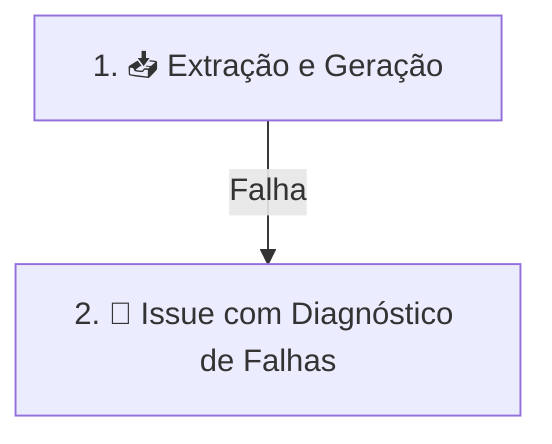

# Operações de Workflow (GitHub Actions)

Este documento detalha o funcionamento, estrutura de jobs, triggers, gerenciamento de logs e tratamento de falhas do workflow principal de integração e entrega contínua do projeto.

---

## Workflow Principal: `release_notes_pipeline.yml`

O workflow **🚀 Salesforce Release Notes Pipeline** atua como o orquestrador central para extração, validação, geração de artefatos e publicação das Release Notes da Salesforce.

### Agendamento e Disparo (Triggers)

* **Cron Schedule**: Toda segunda-feira às 08:00 UTC (`0 8 * * 1`).
* **Workflow Dispatch (Manual)**:
  * `release_slug`: Slug da release específica (ex: `summer_26`). Se vazio, processa todas as releases ativas.
  * `dry_run`: Opção `true`/`false` para simular a execução sem persistir alterações no repositório.

### Concorrência e Variáveis de Ambiente

* **Concurrency Group**: `pipeline-${{ github.event_name }}` (com `cancel-in-progress: false`).
* **Python**: Versão `3.13` gerenciada via `uv`.
* **Ambiente**: Node.js 24 forçado via `FORCE_JAVASCRIPT_ACTIONS_TO_NODE24: "true"`.
* **Timeout**: O job de extração possui `timeout-minutes: 240`.

---

## Estrutura de Jobs

O pipeline é composto por dois jobs sequenciais e condicionais:

> **Nota**: Lint, typecheck e testes são tratados pelo workflow separado **Python Quality** (`python-quality.yml`), que roda em todo push e PR.

### 1. 📥 Extração e Geração de Artefatos (`extract`)
Executa a raspagem, parsing com IA, geração de marcações e publicação dos artefatos.

* **Passos principais**:
  1. Instalação de navegadores Playwright (Chromium) e dependências com `uv sync --frozen`.
  2. Configuração do bot `github-actions[bot]`.
  3. Execução do pipeline principal: `python -m src.main` (output gravado em `extraction.log`).
  4. Validação dos caches de resumo (`.summary_cache.json`) contra os metadados de `.meta.json` (output em `cache_validation.log`).
  5. Execução de testes automatizados nos artefatos gerados (`artifact_tests.log`).
  6. Commit e push automático das alterações (`commit_push.log`).
  7. Criação de GitHub Release com notas detalhadas (`release_creation.log`).
  8. **Upload de Logs**: Envia os logs de execução como o artefato `extract-logs` (retenção de 7 dias).
  9. Geração do sumário de execução (`$GITHUB_STEP_SUMMARY`).

### 2. 📝 Issue com Diagnóstico de Falhas (`create-issue`)
Executado automaticamente em caso de falha no job `extract` (`needs.extract.result == 'failure'`).

* **Passos principais**:
  1. Download do artefato de log `extract-logs` para `/tmp/pipeline_logs/`.
  2. Execução do script `.github/scripts/build_failure_issue.py` para construir um diagnóstico didático com plano de ação.
  3. Abertura ou atualização de uma GitHub Issue contendo os detalhes da falha para rápida resolução.

---

## Gerenciamento de Logs e Artefatos

Todos os passos do pipeline registram suas saídas no diretório `/tmp/pipeline_logs/` utilizando `tee` e `set -o pipefail`:

| Artefato | Arquivos de Log Incluídos | Retenção |
| :--- | :--- | :--- |
| `extract-logs` | `extraction.log`, `cache_validation.log`, `artifact_tests.log`, `commit_push.log`, `release_creation.log` | 7 dias |

---

## Segredos de Ambiente Requeridos

* `GOOGLE_API_KEY`: Chave de API do Google Gemini para classificação de tópicos e sumarização.
* `OPENROUTER_API_KEY`: Chave alternativa para LLMs via OpenRouter.
* `OPENCODE_API_KEY`: Chave para provedor OpenCode.
* `GITHUB_TOKEN`: Token com permissões de escrita para commit, criação de releases e abertura de issues.
