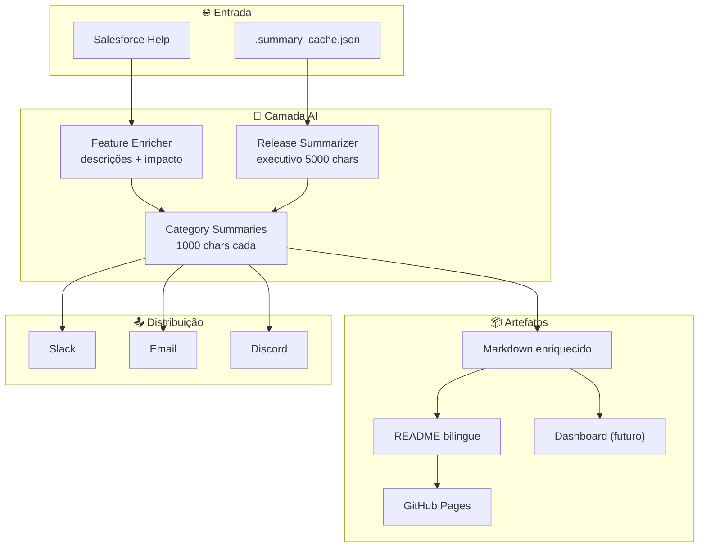

# Roadmap V4

> **Período:** Julho 2026 → Em andamento
> **Foco:** Inteligência Artificial, experiência do usuário e integração com o ecossistema Salesforce

## Visão Geral

O V4 representa a maturação do pipeline de um extrator de dados para uma **plataforma de inteligência sobre releases Salesforce**. A adição de AI em todas as camadas — desde o enriquecimento de cada feature até resumos executivos completos — transforma o repositório de uma fonte bruta de dados em um recurso analítico pronto para consumo por equipes de negócio e técnica.

---

## ✅ Features Entregues

### 1. Enriquecimento AI por Feature

Cada feature das release notes recebe automaticamente, via LLM:

- **Descrição profissional** com contexto de negócio e exemplos de uso
- **Classificação de impacto**: 🔴 Alto / 🟡 Médio / 🟢 Baixo
- **Audiência identificada**: Usuários / Admins / Ambos
- **Tabela enriquecida** no Markdown com colunas de descrição e impacto

**Status:** ✅ Completo — `feature_enricher.py`, `release_docs.py`

### 2. Resumos Executivos por Release (AI)

Cada release recebe um resumo completo gerado por LLM:

- **Escala e alcance**: total de features, categorias, destaques
- **Impacto para o negócio**: valor concreto com exemplos reais
- **Temas estratégicos**: AI-First, Security, Developer Experience, etc.
- **Notas de migração**: considerações para administradores
- **Até 5.000 caracteres** por resumo (vs. 200 caracteres anteriormente)

**Status:** ✅ Completo — `release_summarizer.py`

### 3. Resumos por Categoria (AI)

Cada categoria dentro de uma release recebe seu próprio resumo:

- **Features mais impactantes** da categoria
- **Tendências e direcionamento** estratégico
- **Relevância para o negócio**
- **Até 1.000 caracteres** por categoria

**Status:** ✅ Completo — `release_summarizer.py`, cache em `.summary_cache.json`

### 4. Cache de Resumos com Sub-Agentes

Sistema de cache que evita re-chamadas ao LLM:

- Resumos gerados por sub-agentes dedicados (1 por release)
- Cache persistido em `.summary_cache.json` por release
- `ReleaseSummarizer` verifica cache antes de chamar API
- Invalidação manual por exclusão do arquivo de cache

**Status:** ✅ Completo

### 5. README Bilingue Reorganizado

Reestruturação dos READMEs pt_BR e en_US:

- **Seção de Releases no topo** (logo abaixo do banner)
- Resumos AI completos visíveis imediatamente
- Categorias com `
` expandível e resumo AI
- Toggle de idioma (pt_BR ↔ en_US)
- Automação preserva posição ao regenerar

**Status:** ✅ Completo — `release_docs.py`

### 6. GitHub Pages Sincronizado

Documentação online atualizada automaticamente:

- Workflow reage a mudanças em `releases/**`, `README.md`, `mkdocs.yml`
- `docs/index.md` com seção de releases no topo
- Seção "Internos" adicionada ao nav (4 arquivos)
- Rebuild automático a cada push relevante

**Status:** ✅ Completo — `documentation-build.yml`

---

## 🔄 Em Progresso

### 7. Contagens Consistentes

Alinhamento entre `.meta.json`, arquivos `.md` e resumos AI:

- Meta.json reflete conteúdo real das tabelas Markdown
- Resumos AI usam contagens do meta.json (não contam independentemente)
- Script de correção (`fix_meta.py`) disponível para reajuste

**Status:** ✅ Completo — pipeline de correção aplicado

---

## 📋 Próximos Passos

### 8. Dashboard Interativo com Resumos AI

Estender o dashboard HTML existente para incluir:

- Cards com resumos executivos por release
- Drill-down por categoria com resumos AI
- Busca semântica nos resumos (não apenas em features)
- Comparação visual de themes estratégicos entre releases
- Exportação dos resumos em PDF

**Prioridade:** Alta — alto valor para stakeholders não-técnicos

### 9. Comparação Semântica entre Releases (AI)

Análise inteligente de diferenças entre releases consecutivas:

- Features que surgiram vs. desapareceram
- Mudanças de foco estratégico (ex: "Spring '26 era Data, Summer '26 é AI")
- Tendências de longo prazo por categoria
- Alertas automáticos para breaking changes

**Prioridade:** Alta — diferencial competitivo do projeto

### 10. Alertas Proativos

Notificações inteligentes quando features críticas surgem:

- Filtro por perfil de interesse (admin, dev, business)
- Classificação automática de urgência via LLM
- Integração com Slack, Discord e Email
- Digest semanal com destaques da release

**Prioridade:** Média — depende de base de usuários

### 11. Integração com Salesforce Metadata API

Validação de impacto real nos orgs dos clientes:

- Verificar quais features estão habilitadas no org
- Comparar configuração atual com novidades da release
- Gerar relatório de gap (o que está disponível vs. o que está habilitado)
- Sugestões de migração automáticas

**Prioridade:** Média — requer credenciais de org

### 12. Webhook para Atualização Automática

Pipeline reativo em vez de periódico:

- Webhook do Salesforce Help notifica mudanças
- Pipeline executa增量 (apenas conteúdo novo)
- Docs site atualiza em tempo real
- Notificações imediatas para features de alto impacto

**Prioridade:** Baixa — Salesforce não oferece webhook nativo

---

## Arquitetura das Novas Features

---

## Status Geral

| Feature | Status | Data |
| :--- | :---: | :--- |
| Enriquecimento AI por feature | ✅ | Jul 2026 |
| Resumos executivos (5000 chars) | ✅ | Jul 2026 |
| Resumos por categoria (1000 chars) | ✅ | Jul 2026 |
| Cache com sub-agentes | ✅ | Jul 2026 |
| README bilingue reorganizado | ✅ | Jul 2026 |
| GitHub Pages sincronizado | ✅ | Jul 2026 |
| Contagens consistentes | ✅ | Jul 2026 |
| Dashboard com resumos AI | 📋 Planejado | — |
| Comparação semântica | 📋 Planejado | — |
| Alertas proativos | 📋 Planejado | — |
| Metadata API integration | 📋 Planejado | — |
| Webhook auto-update | 📋 Planejado | — |
