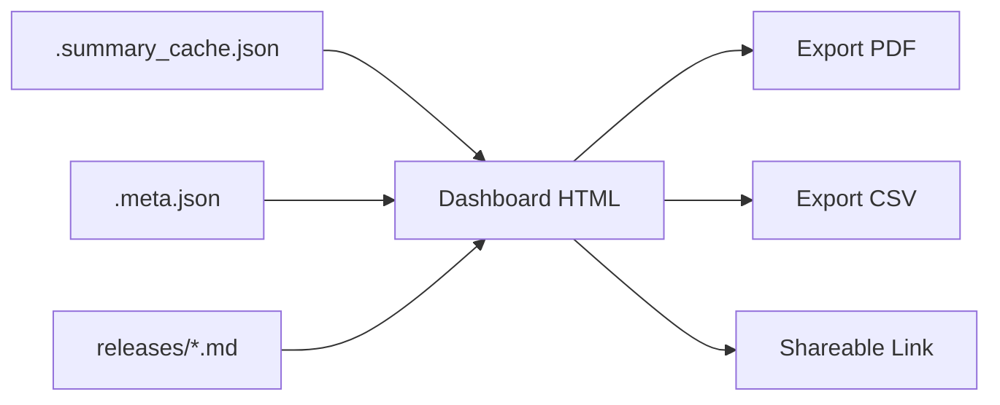
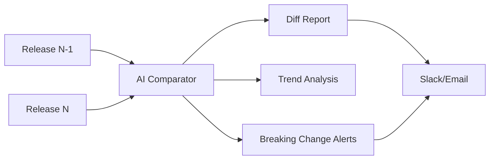
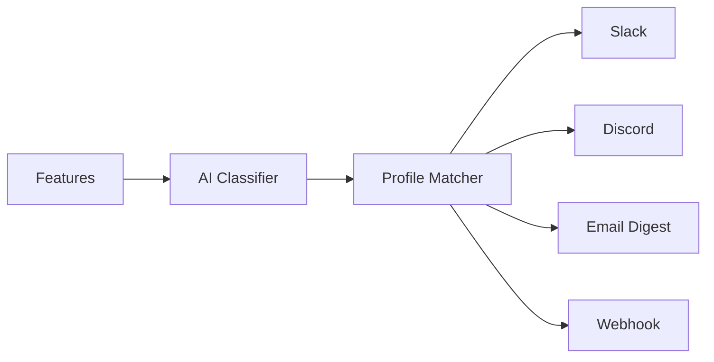
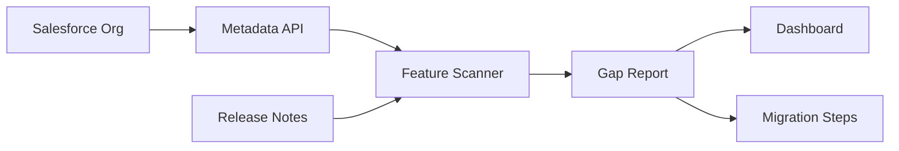
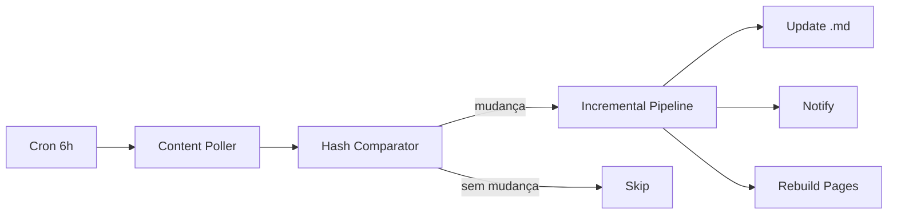
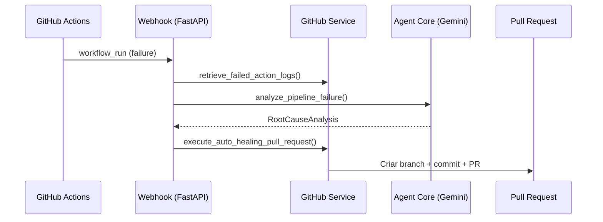
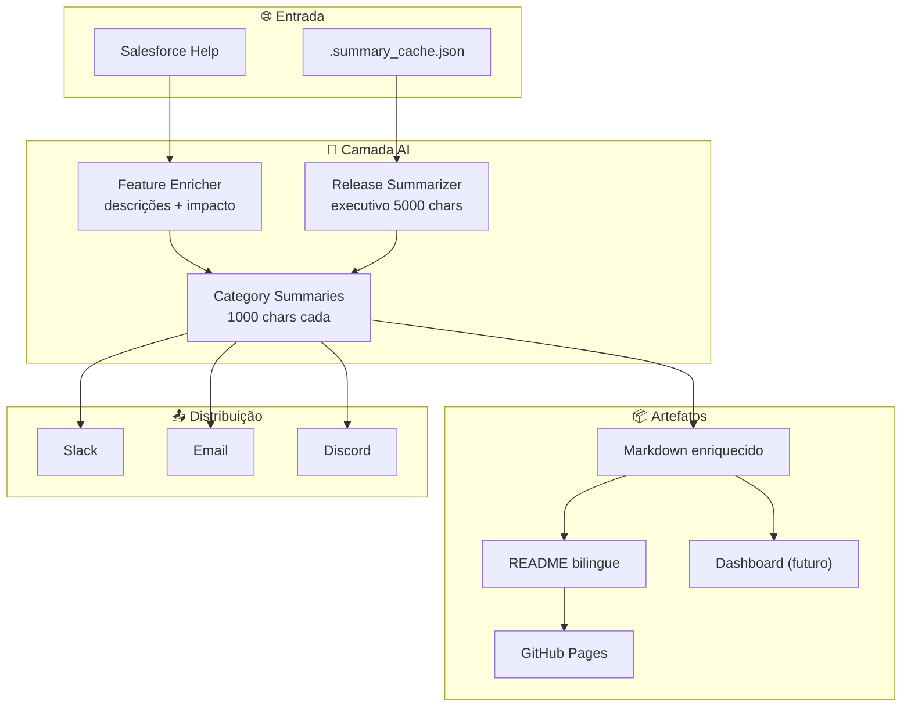

# Roadmap V4

> **Período:** Julho 2026 → Em andamento
> **Foco:** Inteligência Artificial, experiência do usuário e integração com o ecossistema Salesforce

## Visão Geral

O V4 representa a maturação do pipeline de um extrator de dados para uma **plataforma de inteligência sobre releases Salesforce**. A adição de AI em todas as camadas - desde o enriquecimento de cada feature até resumos executivos completos - transforma o repositório de uma fonte bruta de dados em um recurso analítico pronto para consumo por equipes de negócio e técnica.

---

## ✅ Features Entregues

### 1. Enriquecimento AI por Feature

Cada feature das release notes recebe automaticamente, via LLM:

- **Descrição profissional** com contexto de negócio e exemplos de uso
- **Classificação de impacto**: 🔴 Alto / 🟡 Médio / 🟢 Baixo
- **Audiência identificada**: Usuários / Admins / Ambos
- **Tabela enriquecida** no Markdown com colunas de descrição e impacto

**Status:** ✅ Completo - `feature_enricher.py`, `release_docs.py`

### 2. Resumos Executivos por Release (AI)

Cada release recebe um resumo completo gerado por LLM:

- **Escala e alcance**: total de features, categorias, destaques
- **Impacto para o negócio**: valor concreto com exemplos reais
- **Temas estratégicos**: AI-First, Security, Developer Experience, etc.
- **Notas de migração**: considerações para administradores
- **Até 5.000 caracteres** por resumo (vs. 200 caracteres anteriormente)

**Status:** ✅ Completo - `release_summarizer.py`

### 3. Resumos por Categoria (AI)

Cada categoria dentro de uma release recebe seu próprio resumo:

- **Features mais impactantes** da categoria
- **Tendências e direcionamento** estratégico
- **Relevância para o negócio**
- **Até 1.000 caracteres** por categoria

**Status:** ✅ Completo - `release_summarizer.py`, cache em `.summary_cache.json`

### 4. Cache de Resumos com Sub-Agentes

Sistema de cache que evita re-chamadas ao LLM:

- Resumos gerados por sub-agentes dedicados (1 por release)
- Cache persistido em `.summary_cache.json` por release
- `ReleaseSummarizer` verifica cache antes de chamar API
- Invalidação manual por exclusão do arquivo de cache

**Status:** ✅ Completo

### 5. README Bilingue Reorganizado

Reestruturação dos READMEs pt_BR e en_US:

- **Seção de Releases no topo** (logo abaixo do banner)
- Resumos AI completos visíveis imediatamente
- Categorias com `
` expandível e resumo AI
- Toggle de idioma (pt_BR ↔ en_US)
- Automação preserva posição ao regenerar

**Status:** ✅ Completo - `release_docs.py`

### 6. GitHub Pages Sincronizado

Documentação online atualizada automaticamente:

- Workflow reage a mudanças em `releases/**`, `README.md`, `mkdocs.yml`
- `docs/index.md` com seção de releases no topo
- Seção "Internos" adicionada ao nav (4 arquivos)
- Rebuild automático a cada push relevante

**Status:** ✅ Completo - `documentation-build.yml`

---

## 🔄 Em Progresso

### 7. Contagens Consistentes

Alinhamento entre `.meta.json`, arquivos `.md` e resumos AI:

- Meta.json reflete conteúdo real das tabelas Markdown
- Resumos AI usam contagens do meta.json (não contam independentemente)
- Script de correção (`fix_meta.py`) disponível para reajuste

**Status:** ✅ Completo - pipeline de correção aplicado

---

## 📋 Próximos Passos

### 8. Dashboard Interativo com Resumos AI

Estender o dashboard HTML existente (`dashboard.py`) para incluir resumos AI como conteúdo principal.

#### 8.1 Cards de Resumo Executivo
- Card principal por release com resumo executivo (até 5000 chars)
- Indicador de confiança do resumo (cor de fundo: verde/amarelo/vermelho)
- Badges de temas estratégicos (AI-First, Security, DX, etc.)
- Comparação rápida: release atual vs. anterior (features +/-)

#### 8.2 Drill-down por Categoria
- Expandir cada card para ver categorias com resumos AI
- Indicador de impacto por categoria (alto/médio/baixo)
- Tabela de features com descrições enriquecidas
- Filtro por impacto: mostrar apenas features de alto impacto

#### 8.3 Busca Semântica nos Resumos
- Campo de busca que pesquisa nos resumos AI (não apenas em feature names)
- Ex: "quais features de IA existem na Summer '26?"
- Usa embeddings ou busca por keywords expandidas
- Resultados destacam o trecho relevante do resumo

#### 8.4 Comparação Visual de Themes
- Gráfico de radar: themes estratégicos por release
- Ex: AI-First (Spring: 60%, Summer: 80%)
- Timeline de evolução: como os themes mudam release a release
- Identificação de trends emergentes

#### 8.5 Exportação
- Exportar resumos em PDF (formato executivo)
- Exportar dados em CSV/JSON
- Gerar link compartilhável para um resumo específico

**Arquitetura:**

**Dependências:** `dashboard.py`, `dashboard_template.html`, `release_summarizer.py`

**Estimativa:** 3-5 dias de desenvolvimento

**Prioridade:** Alta - alto valor para stakeholders não-técnicos

---

### 9. Comparação Semântica entre Releases (AI)

Análise inteligente de diferenças entre releases consecutivas, indo além do diff textual.

#### 9.1 Detecção de Features Novas vs. Removidas
- Comparar tabelas de features entre releases consecutivas
- Identificar features que surgiram (novas) vs. desapareceram (depreciadas)
- Classificar cada feature nova por impacto (Alto/Médio/Baixo)
- Gerar relatório: "15 features novas, 3 deprecadas, 8 modificadas"

#### 9.2 Análise de Mudança Estratégica
- LLM compara os resumos executivos de 2 releases
- Identifica mudanças de foco: "Spring '26 → Summer '26: shift de Data para AI"
- Extrai themes dominantes de cada release
- Gera narrativa: "A Salesforce está migrando de CRM para plataforma de agentes autônomos"

#### 9.3 Tendências de Longo Prazo
- Analisar evolução de categorias ao longo de múltiplas releases
- Gráfico de crescimento por categoria (features/release)
- Identificar categorias em ascensão vs. declínio
- Predição: "Agentforce cresce 40% a cada release"

#### 9.4 Alertas de Breaking Changes
- LLM analisa features depreciadas e mudanças de comportamento
- Classifica risco: Crítico / Alto / Médio / Baixo
- Gera checklist de ação para administradores
- Notifica automaticamente via Slack/Email para riscos críticos

#### 9.5 Relatório de Diferenças AI
- Documento Markdown gerado automaticamente
- Seções: Visão Geral, Features Novas, Deprecadas, Breaking Changes, Tendências
- Até 3000 caracteres por relatório
- Bilingue (pt_BR + en_US)

**Arquitetura:**

**Dependências:** `release_summarizer.py`, `automation/comparison.py`, `automation/reporting.py`

**Estimativa:** 5-7 dias de desenvolvimento

**Prioridade:** Alta - diferencial competitivo do projeto

---

### 10. Alertas Proativos

Notificações inteligentes quando features críticas surgem, filtradas por perfil de interesse.

#### 10.1 Perfis de Interesse
- Definir perfis: Admin, Developer, Business User, Architect
- Cada perfil mapeia categorias de interesse
- Ex: Admin → Segurança, Automação, Personalização
- Ex: Developer → Desenvolvimento, API, Data 360
- Configuração via arquivo YAML ou interface web

#### 10.2 Classificação de Urgência
- LLM classifica cada feature por urgência para cada perfil
- Níveis: 🔴 Crítico (ação imediata), 🟡 Importante (próximo sprint), 🟢 Informativo
- Considera: breaking changes, deprecations, novas capacidades, melhorias
- Cache de classificação por feature+perfil

#### 10.3 Canais de Notificação
- **Slack**: webhook com blocos formatados, botão "Ver detalhes"
- **Discord**: embed com cor por urgência
- **Email**: digest HTML com resumo executivo + features de alto impacto
- **Webhook genérico**: POST JSON para integração com qualquer sistema

#### 10.4 Digest Semanal
- Resumo semanal das features mais relevantes por perfil
- Inclui: top 5 features, resumo executivo da release, link para docs
- Enviado toda segunda-feira às 9h (configurável)
- Supressão inteligente: não envia se nada relevante mudou

#### 10.5 Controle de Frequência
- Opções: imediato, diário, semanal, apenas alto impacto
- Unsubscribe por perfil (não unsubscribe global)
- Rate limiting: máximo 1 notificação por release por perfil

**Arquitetura:**

**Dependências:** `smart_notifications.py`, `feature_classifier.py`, `llm_service.py`

**Estimativa:** 4-6 dias de desenvolvimento

**Prioridade:** Média - depende de base de usuários

---

### 11. Integração com Salesforce Metadata API

Validação de impacto real nos orgs dos clientes, conectando o repositório a ambientes Salesforce.

#### 11.1 Conexão com Org
- Autenticação via OAuth 2.0 (Web Server Flow)
- Suporte a sandbox e produção
- Armazenamento seguro de tokens (keyring ou variáveis de ambiente)
- Múltiplos orgs simultâneos (dev, staging, prod)

#### 11.2 Scan de Features Habilitadas
- Consultar Metadata API para verificar configuração do org
- Mapear features da release → configurações do org
- Ex: "MFA está habilitado?", "My Domain está ativo?", "API version atual?"
- Gerar relatório: "15 de 22 features da Summer '26 já estão disponíveis no seu org"

#### 11.3 Relatório de Gap
- Comparar features disponíveis vs. habilitadas
- Priorizar por impacto: features de alto impacto não habilitadas primeiro
- Gerar checklist de ação para admins
- Estimativa de esforço: baixo/médio/alto por feature

#### 11.4 Sugestões de Migração
- Para features que requerem ação: gerar passos detalhados
- Incluir: link para documentação, pré-requisitos, riscos
- Ex: "Para habilitar Agentforce Voice: 1) Verificar licença, 2) Configurar permset, 3) Ativar no Setup"
- Validação pós-migração: verificar se a feature está funcionando

#### 11.5 Dashboard de Maturidade
- Score de maturidade do org (0-100)
- Baseado em: features habilitadas vs. disponíveis
- Comparação com média do setor (se disponível)
- Evolução ao longo das releases

**Arquitetura:**

**Dependências:** `salesforce.py` (novo módulo Metadata API), credenciais de org

**Estimativa:** 7-10 dias de desenvolvimento

**Prioridade:** Média - requer credenciais de org de clientes

---

### 12. Webhook para Atualização Automática

Pipeline reativo em vez de periódico, atualizando docs e notificando em tempo real.

#### 12.1 Monitoramento de Mudanças
- Polling inteligente do Salesforce Help (a cada 6h)
- Comparação de conteúdo via content-hash (já implementado)
- Detecção incremental: apenas seções alteradas são re-processadas
- Rate limiting: máximo 4 requests/dia ao Salesforce Help

#### 12.2 Pipeline Incremental
- Quando mudança detectada: processar apenas features novas/alteradas
- Atualizar .meta.json incrementalmente (não sobrescrever)
- Regenerar apenas categorias afetadas (não todas)
- Cache de resumos: invalidar apenas categorias alteradas

#### 12.3 Atualização Automática do Docs
- GitHub Pages rebuild automático após atualização incremental
- Badge de "última atualização: há X horas" no README
- Histórico de mudanças: log de cada atualização incremental

#### 12.4 Notificações Imediatas
- Para features de alto impacto detectadas: notificação imediata
- Slack/Email com: nome da feature, impacto, link para detalhes
- Supressão: não notificar se a feature já foi notificada anteriormente

#### 12.5 Limitações e Workarounds
- Salesforce não oferece webhook nativo para release notes
- Workaround: polling + content-hash (já implementado)
- Alternativa futura: RSS feed do Salesforce Help (se disponível)
- Considerar: Salesforce Trailhead API para detecção de novos módulos

**Arquitetura:**

**Dependências:** `cache_manager.py`, `scraper.py`, `release_docs.py`, GitHub Actions

**Estimativa:** 3-5 dias de desenvolvimento

**Prioridade:** Baixa - Salesforce não oferece webhook nativo; polling já funciona

---

### 13. Auto-Healing CI/CD Agent

Sistema orientado a eventos que intercepta falhas na pipeline de CI/CD, diagnostica a causa raiz via LLM, e submete correções automáticas via Pull Requests.

#### 13.1 Interceptação de Eventos
- Webhook FastAPI para receber eventos `workflow_run` do GitHub Actions
- Filtros: `action == "completed"` e `conclusion == "failure"`
- Roteamento: branch principal vs. branches `auto-fix/*`

#### 13.2 Diagnóstico via LLM
- Análise de Causa Raiz (RCA) usando Google Gemini
- Parser JSON seguro com sanitização de markdown
- Saída estruturada: causa, arquivo afetado, código corrigido, explicação

#### 13.3 Correção Automática
- Criação de branch `auto-fix/<run_id>`
- Commit do código corrigido via API do GitHub
- Abertura de Pull Request com documentação completa

#### 13.4 Circuit Breaker
- Máximo de 3 tentativas de correção por PR
- Contagem de commits com prefixo `[auto-heal]`
- Comentário de aviso quando limite é excedido
- Correções incrementais baseadas em falhas de teste

#### 13.5 Quality Gateway
- Pipeline `agent-validation.yml` para PRs `auto-fix/*`
- Descoberta dinâmica de arquivos `.py` alterados
- Mapeamento fonte → teste automático
- Threshold de cobertura: 95%

**Arquitetura:**

**Dependências:** Nenhuma (auto-healing removido do projeto)

**Status:** Removido do projeto

**Documentação:** Esta funcionalidade foi removida do projeto.

---

## Arquitetura das Novas Features

---

## Status Geral

| Feature | Status | Data | Estimativa |
| :--- | :---: | :--- | :---: |
| Enriquecimento AI por feature | ✅ | Jul 2026 | — |
| Resumos executivos (5000 chars) | ✅ | Jul 2026 | — |
| Resumos por categoria (1000 chars) | ✅ | Jul 2026 | — |
| Cache com sub-agentes | ✅ | Jul 2026 | — |
| README bilingue reorganizado | ✅ | Jul 2026 | — |
| GitHub Pages sincronizado | ✅ | Jul 2026 | — |
| Contagens consistentes | ✅ | Jul 2026 | — |
| Dashboard com resumos AI | 📋 Planejado | — | 3-5 dias |
| Comparação semântica | 📋 Planejado | — | 5-7 dias |
| Alertas proativos | 📋 Planejado | — | 4-6 dias |
| Metadata API integration | 📋 Planejado | — | 7-10 dias |
| Webhook auto-update | 📋 Planejado | — | 3-5 dias |
| Auto-Healing CI/CD Agent | ✅ | Ago 2026 | — |
| **Total planejado** | | | **22-33 dias** |
